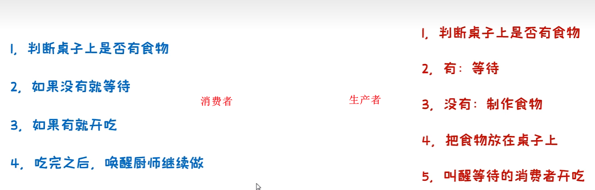
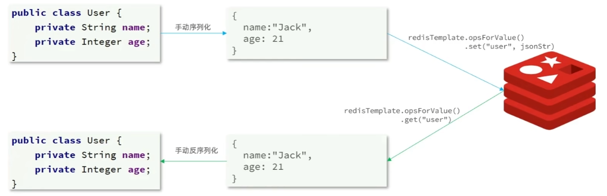
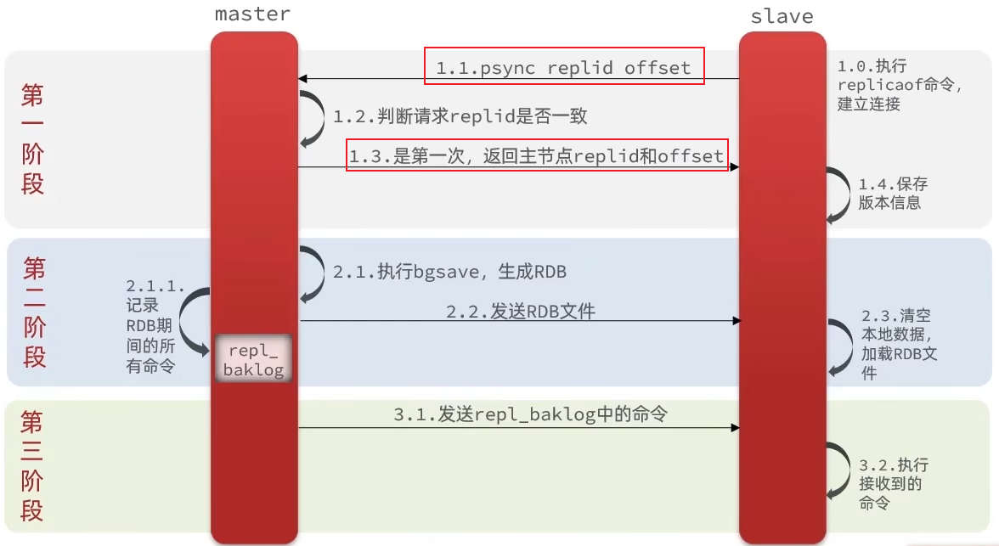

# Java多线程

## 1.多线程基本概念

### 1.1.什么是多线程

**进程**：进程是程序的基本执行实体。（每一个执行的软件都算是一个进程）

**线程**：线程是操作系统能够进行运算调度的最小单位，它包含在进程之中，是**进程中的实际运作单位。**

> 简单理解：应用软件中互相独立，可以同时运行的功能。

多线程的应用场景：

* 软件中的耗时操作。（拷贝、迁移大文件；加载大量的资源文件）
* 所有的聊天软件。
* 所有的后台服务器。

**总结**：有了多线程，就可以让程序同时做多件事情，提高效率。

### 1.2.并发和并行

**并发**：在同一时刻，有多个指令在单个CPU上**交替**执行。

**并行**：在同一时刻，有多个指令在多个CPU上**同时**执行。（多个CPU指2核4线程、4核8线程、8核16线程等可同时执行多个线程的CPU）

## 2.多线程的实现方式

### 2.1.继承Thread类的方式

**启动步骤**

> 1. 自己定义一个类继承Thread
> 2. 重写run方法
> 3. 创建子类的对象，并启动线程

**代码实现**

```java
class MyThread extends Thread{
    @Override
    public void run() {
        for (int i = 0; i < 5; i++) {
            System.out.println(getName()+"---------------HelloWord");//getName()获取当前线程的名字
        }
    }
}
public class ThreadDemo {
    public static void main(String[] args) {
        MyThread thread1 = new MyThread();
        MyThread thread2 = new MyThread();
        thread1.setName("线程1");//设置线程名
        thread2.setName("线程2");
        thread1.start();//调用启动线程的方法
        thread2.start();
    }
}
```

输出：各个线程的打印操作交替执行

### 2.2.实现Runnable接口的方式

**启动步骤**

> 1. 自己定义一个类实现Runnable接口。
> 2. 重写里面的run方法。
> 3. 创建自己的类的对象。
> 4. 创建一个Thread类的对象，并开启线程。

**代码实现**

```java
class MyThread implements Runnable{
    @Override
    public void run() {
        //获取到当前线程的对象
        Thread t = Thread.currentThread();
        for (int i = 0; i < 10; i++) {
            //Runnable中没有getName方法 不可直接调用
            System.out.println(t.getName()+"HelloWorld");
        }
    }
}
public class ThreadDemo {
    public static void main(String[] args) {
        //创建实现Runnable接口的对象:表示多线程要执行的任务
        MyThread thread = new MyThread();
        //创建线程对象
        Thread t1 = new Thread(thread);
        Thread t2 = new Thread(thread);
        t1.setName("线程1");
        t2.setName("线程2");
        //开启线程
        t1.start();
        t2.start();
    }
}
```

### 2.3.利用Callable接口和Future接口的方式

以上两种实现方式中`run`方法没有返回值，如需要获得线程运行的结果，使用目前的两种实现方式。

**启动步骤**

> 1. 创建一个类实现Callable接口
> 2. 重写call（有返回值，表示多线程运行的结果）
> 3. （在测试类中）创建实现Callable接口的对象（表示多线程要执行的任务）
> 4. 创建Future（实现类FutureTask）的对象（作用：管理多线程运行的结果）
> 5. 创建Thread类的对象，并启动（表示线程）

**代码实现**

```java
//泛型是线程运行后返回值的类型
class MyCallable implements Callable<Integer> {
    @Override
    public Integer call() throws Exception {
        int sum = 0;
        for (int i = 0; i < 20; i++) {
            sum += i;
        }
        return sum;
    }
}
public class ThreadDemo {
    public static void main(String[] args) throws ExecutionException, InterruptedException {
        //创建Callable实现类对象，表示多线程要执行的任务
        MyCallable mc = new MyCallable();
        //创建FutureTask的对象，作用是管理多线程运行的结果
        FutureTask<Integer> futureTask = new FutureTask<Integer>(mc);
        //创建线程的对象
        Thread t1 = new Thread(futureTask);
        //启动线程
        t1.start();
        //获取多线程运行的结果
        Integer result = futureTask.get();
        System.out.println(result);
    }
}
```

### 2.4.三种实现方式对比


## 3.多线程中的常用成员方法


```java
String getName();
void setName(String name);
/*
	细节：
		1.如果没有给线程设置名字，线程也有默认的名字，格式：Thread-X(X表示序号，从0开始)
		2.如果需要为线程设置名字，可以使用set方法，也可以使用构造方法设置。
*/
```

```java
static Thread currentThread();//获取当前线程的对象
/*
	细节：
		当JVM虚拟机启动之后，会自动启动多条线程
		其中有一条线程叫main线程，作用是调用main方法，并执行里面的代码
		之前写的所有代码，其实都是运行在main线程中
*/
static void sleep(long time);//让线程休眠指定的时间，单位为毫秒
/*
	细节：
		1.哪条线程执行到这个方法，哪条线程就会在这里停留对应的时间
		2.时间到了之后，线程会自动醒来，继续执行下面的其他代码
*/
```

线程调度方式分为**抢占式调度**和**非抢占式调度**，Java采用的是抢占式调度（随机性），随机性主要体现在设置线程的优先级，使用以下两个相关方法：

```java
setPriority(int newPriority);//设置线程优先级，优先级越高，抢占概率越大
final int getPriority();//获取线程优先级
```

```java
final void setDaemon(boolean on);//设置为守护线程
/*
	细节：
		当其他的非守护线程执行完毕后，守护线程会陆续结束(即使任务未执行完也会结束)。
*/
```

## 4.线程的生命周期


##  5.线程安全的问题

**需求**：某电影院目前正在上映国产大片，共有100张票，而它有3个窗口，请设计一个程序模拟该电影院买票。

**代码实现**

```java
class MyThread extends Thread{
    static int ticket = 0;
    @Override
    public void run() {
        while(true){
            if(ticket<100){
                try {
                    Thread.sleep(10);
                } catch (InterruptedException e) {
                    e.printStackTrace();
                }
                ticket++;
                System.out.println(getName()+" 正在卖第 "+ticket+" 张票");
            }else {
                break;
            }
        }
    }
}
public class ThreadDemo {
    public static void main(String[] args) throws ExecutionException, InterruptedException {
        //创建线程对象
        MyThread t1 = new MyThread();
        MyThread t2 = new MyThread();
        MyThread t3 = new MyThread();
        t1.setName("窗口1");
        t2.setName("窗口2");
        t3.setName("窗口3");
        //开启线程
        t1.start();
        t2.start();
        t3.start();
    }
}
```

**运行结果**（部分结果）


**分析**

* 相同的票出现了多次

  > 当线程1执行到`ticket++;`，假设此时的ticket值为2，失去执行权，并被线程2抢到并依次执行`ticket++;` 此时ticket值为3，并打印输出为3，然后失去执行权并由线程1重获执行权继续执行打印操作，输出也为3。

* 出现了超出范围的票

  > 假设ticket当前值为20（最后一张票），线程1通过票数判断（`if(ticket<20)`）后在sleep语句中失去执行权，线程2获得执行权后也进入票数判断（`if(ticket<20)`）中，两个窗口各自卖出一张票，此时卖出的票超出剩余的票数。

### 5.1.同步代码块

**为了解决以上线程安全问题，引入同步代码块**，当某线程进入该代码块后，其他线程就算拥有CPU执行权，也不能再进入，直到没有线程在同步代码块当中。即**当有线程进入代码块之后，锁将自动关闭，当有线程出代码块之后，锁将自动打开**

```java
public class MyThread extends Thread{
    static int ticket = 0;
    @Override
    public void run() {
        while(true){
            //锁对象，一定要是唯一的
            synchronized (MyThread.class){
                if(ticket<20){
                    try {
                        Thread.sleep(10);
                    } catch (InterruptedException e) {
                        e.printStackTrace();
                    }
                    ticket++;
                    System.out.println(getName()+" 正在卖第 "+ticket+" 张票");
                }else {
                    break;
                }
            }
        }
    }
}
```

### 5.2.同步方法

将方法里面的代码全部锁起来，就是把synchronized关键字加到方法上。

**格式**

```java
修饰符 synchronized 返回值类型 方法名(方法参数){...}
```

**特点**

* 同步方法是锁住方法里面所有的代码
* 锁对象不能自己指定
  * 当前方法是**非静态**的：`this`，指当前方法的调用者
  * 当前方法是**静态**的：`XXX.class`，当前类的字节码文件对象

### 5.3.Lock锁

我们使用同步代码块（或同步方法）时，并不能直接看到在哪里加上了锁，在哪里释放了锁，为了更清晰的表达如何加锁和释放锁，JDK5以后提供了一个新的锁对象Lock。Lock实现提供比使用synchronized可以获得更广泛的锁定操作。

```java
//手动上锁、手动释放锁
void lock();//上锁
void unlock();//释放锁
```

Lock是接口，不能直接实例化，实例化需要使用ReentrantLock。

**使用格式**

```java
ReentrantLock lock = new ReentrantLock();
lock.lock();
try {
    // 临界区代码
} finally {//无论如何都会执行，确保每一个线程都能被锁释放
    lock.unlock(); // 确保锁释放
}
```

**代码实现**

```java
public class MyThread extends Thread{
    static int ticket = 0;
    //锁对象，一定要是唯一的
    static Lock lock = new ReentrantLock();
    @Override
    public void run() {
        while(true){
            lock.lock();
            try {
                if(ticket==100){
                    break;
                }else {
                    sleep(10);
                    ticket++;
                    System.out.println(getName()+" 正在卖第 "+ticket+" 张票!!!");
                }
            } catch (InterruptedException e) {
                throw new RuntimeException(e);
            }finally {
                lock.unlock();
            }
        }
    }
}
```

### 5.4.死锁

**什么是死锁：**死锁（Deadlock）是指多个线程在互相等待对方释放资源，导致所有线程都无法继续执行的状态。

**死锁的四个必要条件**

> 1. **互斥条件**：某个资源在同一时间只能由一个线程持有。
> 2. **持有并等待**：一个线程持有了某些资源，同时在等待其他线程释放它所需的资源。
> 3. **不可剥夺**：线程已经获得的资源在使用完之前，不能被其他线程强制剥夺。
> 4. **循环等待**：存在一个线程集合，其中每个线程都在等待下一个线程所持有的资源，形成环状依赖。

当这四个条件同时成立时，就可能发生死锁。

**代码实现**

```java
public class MyThread extends Thread{
    static Object objA = new Object();
    static Object objB = new Object();
    @Override
    public void run() {
        while(true){
            if("线程A".equals(getName())){
                synchronized (objA){
                    System.out.println("线程A拿到了A锁，准备拿B锁");
                    synchronized (objB){
                        System.out.println("线程A拿到了B锁，顺利执行完一轮");
                    }
                }
            }else if("线程B".equals(getName())){
                synchronized (objB){
                    System.out.println("线程B拿到了B锁，准备拿A锁");
                    synchronized (objA){
                        System.out.println("线程B拿到了A锁，顺利执行完一轮");
                    }
                }
            }
        }
    }
}
```

**解决死锁**：避免两个锁进行嵌套

## 6.等待唤醒机制

### 6.1.生产者和消费者方式

生产者消费者模式是一个十分经典的多线程协作的模式。

**等待唤醒机制**



**常见方法**

```java
void wait();//当前线程等待，直到被其他线程唤醒
void notify();//随机唤醒单个线程
void notifyAll();//唤醒所有线程
```

**代码实现**

**需求**：完成生产者和消费者（等待唤醒机制）的代码，**实现线程轮流交替执行的效果**。（仅一个消费者和一个生产者情况下）

**桌子（中间控制）**

```java
public class Desk extends Thread{
    /*
    * 作用：控制生产者和消费者的执行
    * */
    public static int foodFlag = 0;//表示桌上是否有面条
    public static int count = 10;//吃货能吃的总数
    public static final Object lock = new Object();//锁对象
}
```

**生产者**

```java
public class Cook extends Thread{
    @Override
    public void run() {
        while(true){
            synchronized (Desk.lock){
                if(Desk.count==0){//吃货已经吃不下
                    break;
                }else{
                    //判断桌子上是否有面条
                    //如果有 则等待
                    if(Desk.foodFlag==1){
                        try {
                            Desk.lock.wait();
                        } catch (InterruptedException e) {
                            e.printStackTrace();
                        }
                    }else {
                        //如果没有 则制作面条
                        //修改桌子状态
                        System.out.println("厨师正在制作面条!!!");
                        Desk.foodFlag = 1;
                        //叫醒等待的消费者开吃
                        Desk.lock.notifyAll();
                    }
                }
            }
        }
    }
}
```

**消费者**

```java
public class Foodie extends Thread{
    @Override
    public void run() {
        while(true){
            synchronized (Desk.lock){
                if(Desk.count == 0){//判断自己是否还能消费
                    break;
                }else {
                    //先判断桌子上是否有面条，没有则等待；有 则count--，并且重置桌子状态
                    if(Desk.foodFlag == 0){
                        try {
                            /*
                            * 让当前线程跟锁进行绑定，此时 使用唤醒线程时，则可以唤醒指定的线程
                            * */
                            Desk.lock.wait();//
                        } catch (InterruptedException e) {
                            e.printStackTrace();
                        }
                    }else{
                        Desk.count--;
                        System.out.println("吃货正在吃面条，还能再吃"+Desk.count+"碗！！！");
                        //修改桌子状态
                        Desk.foodFlag = 0;
                        //吃完之后唤醒厨师继续做
                        Desk.lock.notifyAll();
                    }
                }
            }
        }
    }
}
```

**主方法调用**

```java
public class ThreadDemo {
    public static void main(String[] args) {
        //创建线程对象
        Cook c = new Cook();
        Foodie f = new Foodie();
        //给线程设置名字
        c.setName("厨师");
        f.setName("吃货");

        c.start();
        f.start();
    }
}
```

### 6.2.阻塞队列方式


**阻塞队列的继承结构**

```java
//涉及以下4个 接口
Iterable;
Collection;
Queue;
BlockingQueue;
//使用以下 实现类
ArrayBlockingQueue;//底层是数组，有界
LinckedBlockingQueue;//底层是链表，无界；但不是真正的无界，最大为int的最大值。
```

**生产者**

```java
public class Cook extends Thread{
    ArrayBlockingQueue<String> queue;

    public Cook(ArrayBlockingQueue<String> queue){
        this.queue = queue;
    }
    @Override
    public void run() {
        while(true){
            //不断的把面条放到阻塞队列当中
            try {
                queue.put("面条");//put()方法内部已有锁
                System.out.println("厨师放了一碗面条");
            } catch (InterruptedException e) {
                e.printStackTrace();
            }
        }
    }
}
```

**消费者**

```java
public class Foodie extends Thread{
    ArrayBlockingQueue<String> queue;

    public Foodie(ArrayBlockingQueue<String> queue){
        this.queue = queue;
    }

    @Override
    public void run() {
        while(true){
            //不断的从阻塞队列中获取面条
            try {
                String food = queue.take();//take()方法内部已有锁
                System.out.println(food);
            } catch (InterruptedException e) {
                e.printStackTrace();
            }
        }
    }
}
```

**主函数**

```java
public class ThreadDemo {
    public static void main(String[] args) {
        /**
         * 需求：利用阻塞队列完成生产者和消费者（等待唤醒机制）的代码实现
         * 细节：
         *      生产者和消费者必须使用同一个阻塞队列
         */
        //1.创建阻塞队列的对象 并指定队列长度为1
        ArrayBlockingQueue<String> queue = new ArrayBlockingQueue<>(1);
        //2.创建线程的对象，并把阻塞队列传递过去
        Cook cook = new Cook(queue);
        Foodie foodie = new Foodie(queue);
        //3.开启线程
        cook.start();
        foodie.start();
    }
}
```

## 7.多线程的6种状态


**注意**：Java多线程中没有**运行时状态**，一旦线程抢夺到CPU执行权后，线程就会交给操作系统，Java虚拟机就不再管理。

**线程状态**

```java
/*
新建状态(NEW)--------------->创建线程对象
就绪状态(RUNNABLE)---------->start方法
阻塞状态(BLOCKED)----------->无法获取锁对象
等待状态(WAITING)----------->wait方法
计时状态(TIMED_WAITING)----->sleep方法
结束状态(TERMINATED)-------->全部代码运行完毕
*/
```

## 8.线程池

### 8.1.主要核心原理

1. 创建一个池子，池子是空的。
2. 提交任务时，池子会创建新的线程对象，任务执行完毕，线程归还给池子，下次再提交任务时，不需要创建新的线程，直接复用已有的线程即可。
3. 但是如果提交任务时，池子中没有空闲线程，也无法创建新的线程，任务就会排队等待。

### 8.2.线程池代码实现

1. 创建线程池
2. 提交任务
3. 所有的任务全部执行完毕，关闭线程池

`Executors`:线程池的工具类通过调用方法返回不同类型的线程池对象

```java
public static ExecutorService newCachedThreadPool();//创建一个没有上限的线程池，实际上限是int类型的最大值
public static ExecutorService newFixedThreadPool(int nThreads);//创建有上限的线程池
```

**代码实现**

```java
public class MyRunnable implements Runnable{
    @Override
    public void run() {
        for (int i = 0; i < 20; i++) {
            System.out.println(Thread.currentThread().getName());
        }
    }
}
```

```java
public class ThreadDemo {
    public static void main(String[] args) {
        //1.创建线程池对象
        ExecutorService pool = Executors.newCachedThreadPool();
        ExecutorService pool2 = Executors.newFixedThreadPool(3);
        //2.提交任务
        pool.submit(new MyRunnable());
        pool.submit(new MyRunnable());
        pool.submit(new MyRunnable());
        //3.销毁线程池
        pool.shutdown();
    }
}
```

### 8.2.自定义线程池

**以饭店的运作为例**


**细节**：当设置 核心线程数为 3，临时线程数为 3，队伍长度为 3

> * 当提交的任务数为6个，则1,2,3任务分配核心线程，4,5,6任务排队等待。
> * 当提交的任务数为8个，则1,2,3任务分配核心线程，4,5,6排队等待，7,8分配临时线程。
> * 当提交的任务数为10个，则1,2,3任务分配核心线程，4,5,6排队等待，7,8,9分配临时线程，此时需要丢弃（拒绝）一个任务。

**任务拒绝策略**


**代码实现**

```java
public class ThreadDemo {
    public static void main(String[] args) {
        /**
         * ThreadPoolExecutor threadPoolExecutor = new ThreadPoolExecutor();
         *
         *  参数一：核心线程数量  不能小于0
         *  参数二：最大线程数量  不能小于等于0，最大数量>=核心线程数量
         *  参数三：空闲线程最大存活时间  不能小于0
         *  参数四：时间单位    用TimeUnit指定
         *  参数五：任务队列    不能为null ArrayBlockingQueue()/LinkedBlockingQueue()
         *  参数六：创建线程工厂  不能为null
         *  参数七：任务的拒绝策略 不能为null
         */
        ThreadPoolExecutor threadPoolExecutor = new ThreadPoolExecutor(
                3,
                6,
                60,
                TimeUnit.SECONDS,
                new ArrayBlockingQueue<>(3),
                Executors.defaultThreadFactory(),
                new ThreadPoolExecutor.AbortPolicy()
        );
    }
}
```

**不断的提交任务，会有以下三个临界点：**

> * 当核心线程满时，再提交任务就会排队。
> * 当核心线程满，队伍满时，会创建临时线程。
> * 当核心线程满，队伍满，临时线程满时，会触发任务拒绝策略。

# RabbitMQ

##  1.业务调用问题

### 1.1.同步调用

以支付服务为例：


___

**同步调用的优势是什么？**

* 时效性强，等待到结果后才返回

**同步调用的问题是什么？**

* 拓展性差
* 性能下降
* 级联失败问题（一个服务宕机，串联的所有服务都会跟着宕机）

### 1.2.异步调用

支付服务不在同步调用业务关联度低的服务，而是发送消息通知到Broker（消息代理）。


____

**异步调用的优势是什么？**

* 耦合度低，拓展性强
* 异步调用，无需等待，性能好
* 故障隔离，下游服务故障不会影响上游业务
* 缓存消息，流量削峰填谷（可以根据自己的处理速度来取消息，不会受到流量的影响）

**异步调用的问题是什么？**

* 不能立即得到调用结果，失效性差
* 不确定下游业务执行是否成功
* 业务安全依赖于Broker的可靠性

### 1.3.什么情况下使用同步调用

经过上面的分析，有同学可能会有这样的疑问：既然同步调用有这么多问题，为什么我们还要用同步调用呢，什么情况下使用同步调用呢？

**一般来说，使用同步调用的场景都有一个特点：下一步操作依赖于上一步操作的结果**

以上面的支付业务为例，交易服务、通知服务、积分服务都依赖于支付服务的结果

当支付服务成功扣减用户余额并成功更新支付状态之后，交易服务、通知服务、积分服务就可以开始执行相应的操作了

*然而，通知服务不依赖于交易服务，积分服务也不依赖于通知服务*

在成功扣减用户余额并成功更新支付状态之后，支付业务就已经完成了

所以说，**支付服务完成了之后，只需要通知交易服务、通知服务、积分服务执行相应的操作，而不需要等待交易服务、通知服务、积分服务都完成之后再返回结果。**

## 2.MQ技术对比


### 3.通过Docker安装RabbitMQ

**RabbitMQ**是基于 Erlang 语言开发的开源消息通信中间件（官网：[RabbitMQ](https://www.rabbitmq.com/)）

我们基于 `docker` 安装 RabbitMQ

#### 3.1.下载RabbitMQ镜像

```shell
docker pull rabbitmq
```

检查RabbitMQ镜像是否下载成功

```shell
docker images
```

#### 3.2.启动RabbitMQ

执行创建RabbitMQ容器之前先创建`hmall`网络

```shell
docker network create hmall
```

根据提前下载好的RabbitMQ镜像，创建对应的容器

```shell
docker run \
 -e RABBITMQ_DEFAULT_USER=scarzyy \
 -e RABBITMQ_DEFAULT_PASS=449554 \
 -v rabbitmq-plugins:/plugins \
 --name rabbitmq \
 --hostname rabbitmq \
 -p 15672:15672 \
 -p 5672:5672 \
 --network hmall\
 -d \
 rabbitmq:latest
```

* `docker run`: 基本的Docker命令，用于启动一个新的容器实例

* `-e RABBITMQ_DEFAULT_USER=scarzyy`: 设置RabbitMQ服务的默认用户名为scarzyy

* `-e RABBITMQ_DEFAULT_PASS=449554`: 设置RabbitMQ服务的默认密码为449554

* `-v rabbitmq-plugins:/plugins`: 将一个名为`rabbitmq-plugins`的卷映射到容器的`/plugins`目录，用于存放RabbitMQ的插件。这里的`rabbitmq-plugins`是一个卷的名称，而不是宿主机的路径

* `--name rabbitmq`: 指定容器的名称为`rabbitmq`

* `--hostname rabbitmq`: 设置容器的主机名为`rabbitmq`

* `-p 15672:15672`: 将宿主机的端口15672映射到容器的端口15672，这是RabbitMQ管理界面的默认端口

* `-p 5672:5672`: 将宿主机的端口5672映射到容器的端口5672，这是RabbitMQ用于AMQP协议通信的默认端口
* `--network`：添加该容器到自定义网络中，可以实现容器间通过容器名进行访问

* `-d`: 在后台运行容器（守护进程）

* `rabbitmq:latest`: 使用最新的RabbitMQ官方镜像来创建容器

___

可以看到在安装命令中有两个映射的端口：

* `15672`：RabbitMQ提供的管理控制台的端口
* `5672`：RabbitMQ的消息发送处理接口

___

> **注**：4.0版本后RabbitMQ默认不开启可视化界面，需要进行以下设置

```shell
# 1.进入RabbitMQ容器中
docker exec -it rabbitmq bash
# 2.启用 RabbitMQ 管理插件
rabbitmq-plugins enable rabbitmq_management
# 3.退出容器
exit
# 4.重启容器
docker restart <容器名称或ID>
```

访问：`192.168.59.120:15672`进入web可视化管理界面

## 3.RabbitMQ整体框架和核心概念

**RabbitMQ的核心概念**

* `Publisher`：消息发送者
* `Consumer`：消息的消费者
* `Queue`：消息队列，存储消息
* `Exchange`：交换机，负责路由消息
* `VirtualHost`：虚拟主机，用于数据隔离，每个虚拟主机有自己的交换机和消息队列

**消费者**与**队列**（Queue）进行绑定，**消息发送者**不是直接将消息发送到**队列**中，而是先发到**交换机**，**交换机**负责将消息路由给绑定的**队列**，可以路由给一个队列也可以路由给所有队列


## 4.RabbitMQ快速入门

> ***注意事项：交换机只能路由和转发消息，不能存储消息***

___

需求：在RabbitMQ的控制台完成下列操作

* 新建队列`hello.queue1`和`hello.queue2`
* 向默认的`amp.fanout`交换机发送一条消息
* 查看消息是否到达`hello.queue1`和`hello.queue2`
* 总结规律

___

### 4.1.新建队列

创建两个队列，分别为`hello.queue1`和`hello.queue2`


### 4.2.绑定队列与交换机

将上面创建的两个队列都绑定在`amq.fanout`交换机中


### 4.3.发送消息

我们在`amq.fanout`交换机中发送一条消息，消息的内容为`hello world`。


___

在队列中查看接收交换机发送的信息。

`Queues and Streams` ---> `hello.queue1` ---> `Get Message(s)` 。


### 4.4.可能遇到的情况

如果你发现

1. 交换机的 overview 页面没有折线图
2. Queues 页面也没有与消息相关的信息
3. 点击`channels`后出现`Stats in management UI are disabled on this node`信息

需要先修改Docker中`RabbitMQ`容器的配置

___

```shell
# 1.进入容器内部
docker exec -it rabbitmq bash
# 2.修改rabbitmq容器配置
cd /etc/rabbitmq/conf.d/
echo management_agent.disable_metrics_collector = false > management_agent.disable_metrics_collector.conf
# 3.退出容器，并重启
exit
docker restart rabbitmq
```

## 5.数据隔离

需求：在RabbitMQ的控制台完成下列操作

* 新建一个用户`hmall`
* 为`hmall`用户创建一个`virtual host`
* 测试不同`virtual host`之间的数据隔离现象

___

### 5.1.新建用户

新建一个名为`hmall`的用户，密码为`449554`，且角色指定为`admin`（超级管理员）


用新用户（超级管理员标签）的账号登录管理台，虽然能看到所有 `Virtual Host` 的信息，但是无法对任意一个 `Virtual Host` 进行操作。

### 5.2.为新用户创建Virtual Host

用新用户的账号登录管理台，创建一个名为 `/hmall` 的 `Virtual Host`


> ***常规开发中，一个项目可以创建一个用户并同时创建虚拟主机Virtual Host***

## 6.Java客户端

将来我们开发业务功能的时候，肯定不会在控制台收发消息，而是应该基于编程的方式。由于`RabbitMQ`采用了`AMQP`协议，因此它具备跨语言的特性。任何语言只要遵循`AMQP`协议收发消息，都可以与`RabbitMQ`交互。并且`RabbitMQ`官方也提供了各种不同语言的客户端

但是，`RabbitMQ`官方提供的Java客户端编码相对复杂，一般生产环境下我们更多会结合`Spring`来使用。而Spring的官方刚好基于`RabbitMQ`提供了这样一套消息收发的模板工具：`SpringAMQP`。并且还基于`SpringBoot`对其实现了自动装配，使用起来非常方便。


SpringAMQP提供了三个功能：

- 自动声明队列、交换机及其绑定关系
- 基于注解的监听器模式，异步接收消息
- 封装了`RabbitTemplate`工具，用于发送消息

____

> ***项目地址：`F:\SpringBoot_project\mq-demo`***
>
> 项目中包含consumer和publisher两个子模块。

### 6.1.快速入门

需求：

* 利用控制台创建队列`simple.queue`
* 在`publisher`服务中，利用`SpringAMQP`直接向`simple.queue`发送消息
* 在`consumer`服务中，利用`SpringAMQP`编写消费者，监听`simple.queue`队列

___

#### 6.1.1.引入SpringAMQP依赖

在父工程中引入spring-amqp依赖，这样publisher和consumer服务都可以使用

```xml
<!--AMQP依赖，包含RabbitMQ-->
<dependency>
    <groupId>org.springframework.boot</groupId>
    <artifactId>spring-boot-starter-amqp</artifactId>
</dependency>
```

#### 6.1.2.配置RabbitMQ服务端

在每个微服务（即consumer模块和publisher模块）中引入MQ服务端信息，这样微服务才能连接到RabbitMQ

```yaml
spring:
  rabbitmq:
    host: 192.168.59.120 # 虚拟机IP
    port: 5672 # 端口
    virtual-host: /hmall # rabbitmq的虚拟主机
    username: hmall # 用户名
    password: 449554 # 密码
```

#### 6.1.3.发送消息

`SpringAMQP`提供了`RabbitTemplate`工具类，方便我们发送消息

```java
@Autowired
private RabbitTemplate rabbitTemplate;

@Test
public void testSimpleQueue() {
    // 队列名称
    String queueName = "simple.queue";
    // 消息
    String message = "hello, spring amqp!";
    // 发送消息
    rabbitTemplate.convertAndSend(queueName, message);
}
```

#### 6.1.4.接收消息

`SpringAMQP`提供声明式的消息监听，我们只需要通过**注解**`@RabbitListener`在方法上声明要监听的队列名称，将来`SpringAMQP`就会把消息传递给当前方法

```java
package com.itheima.consumer.listener;

import org.springframework.amqp.rabbit.annotation.RabbitListener;
import org.springframework.stereotype.Component;

@Component
public class SpringRabbitListener {
     // 利用RabbitListener来声明要监听的队列信息
    // 将来一旦监听的队列中有了消息，就会推送给当前服务，调用当前方法，处理消息。
    // 可以看到方法体中接收的就是消息体的内容
    @RabbitListener(queues = "simple.queue")
    //方法中参数msg的数据类型取决于发送者声明的数据类型
    public void listenSimpleQueueMessage(String msg) throws InterruptedException {
        System.out.println("spring 消费者接收到消息：【" + msg + "】");
    }
}
```

### 6.2.Work Queues模型

Work queues，任务模型。简单来说就是**让多个消费者绑定到一个队列，共同消费队列中的消息。**

>  ***虽然有多个消费者绑定同一个队列，但是队列中的某一条消息只会被一个消费者消费***


___

**案例**：模拟Work Queues，实现一个队列绑定多个消费者

基本思路

1. 在`RabbitMQ`的控制台创建一个队列，名为`work.queue`
2. 在`publisher`服务中定义测试方法，在1秒内产生50条消息，发送到`work.queue`
3. 在`consumer`服务中定义两个消息监听者，都监听`work.queue`队列
4. 消费者1每秒处理50条消息，消费者2每秒处理5条消息

____

在 `publisher`服务的 `SpringAmqpTest`测试类中添加以下方法，该方法可以在 1 秒内产生 50 条消息

```java
@SpringBootTest
public class SpringAmqpTest {

    @Autowired
    private RabbitTemplate rabbitTemplate;

    @Test
    public void testWorkQueue() throws InterruptedException {
        String queueName = "work.queue";
        for (int i = 1; i <= 50; i++) {
            // 消息
            String message = "hello, worker,message_"+i;
            // 发送消息
            rabbitTemplate.convertAndSend(queueName, message);
        }
    }
}
```

在 `consumer` 服务的 `MqListener` 类中添加以下方法，监听 `work.queue` 队列

```java
@Component
public class MqListener {
    
    @RabbitListener(queues = "work.queue")
    public void listenWorkQueue1(String msg){
        System.out.println("消费者1 接收到 work.queue 的消息......【" + msg + "】");
    }

    @RabbitListener(queues = "work.queue")
    public void listenWorkQueue2(String msg){
        System.err.println("消费者2 接收到 work.queue 的消息......【" + msg + "】");
    }
}

```

消费者接受消息时出现轮询的现象


> ***当消费者处理能力不一致时，处理能力快的消费者也只能处理同样数量的消息***

#### 6.2.1.消费者消息推送机制

默认情况下，`RabbitMQ`会将消息依次轮询投递给绑定在队列上的每一个消费者*（每个消费者获得的消息数量一样）*。但这并没有考虑到消费者是否已经处理完消息，可能出现消息堆积。

因此，我们需要修改`application.yml`，设置`preFetch`值为1，确保同一时刻最多投递给消费者1条消息。相当于告诉消费者要一条一条地从队列中取出消息，***只有处理完一条消息才能取出下一条***

```yaml
spring:
  rabbitmq:
    listener:
      simple:
        prefetch: 1 # 每次只能获取1条消息，处理完成才能获取下一条消息
```

#### 6.2.2.总结

**Work模型的使用**

* 多个消费者绑定到一个队列，可以加快消息处理速度
* 同一条消息只会被一个消费者处理
* 通过设置`prefetch`来控制消费者预取的消息数量，处理完一条再处理下一条，实现能者多劳。

> ***如何处理消息堆积问题：使用Work模型，在一个队列中多绑定几个消费者可以加快消息处理速度***

### 6.3.交换机

真正生产环境都会经过exchange来发送消息，而不是直接发送到队列，交换机的**类型**有四种：

* `Fanout`：广播，将消息交给所有绑定到交换机的队列。我们最早在控制台使用的正是Fanout交换机
* `Direct`：定向/订阅，基于`RoutingKey`（路由key）发送给订阅了消息的队列
* `Topic`：话题/通配符订阅，与`Direct`类似，只不过`RoutingKey`可以使用通配符
* `Headers`：头匹配，基于MQ的消息头匹配，用的较少。

> ***若不使用交换机，则队列中的一条消息只能由一个服务处理后消失***

#### 6.3.1.Fanout交换机

`Fanout` 交换机会将接收到的消息**广播**到每一个跟其绑定的 `queue` ，所以也叫广播模式。


> ***多个队列的原因是有多个微服务, 多个消费者的原因是加速业务处理***

___

**案例**：利用`SpringAMQP`演示`FanoutExchange`的使用

实现思路：

1. 在 `RabbitMQ` 控制台中，声明队列 `fanout.queue1` 和 `fanout.queue2`
2. 在 `RabbitMQ` 控制台中，声明交换机 `hmall.fanout`，将两个队列与其绑定
3. 在 `consumer` 服务中，编写两个消费者方法，分别监听 `fanout.queue1` 和 `fanout.queue2` 队列
4. 在 `publisher` 服务中编写测试方法，向 `hmall.fanout` 交换机发送消息

___

>  *1、2步骤参考RabbitMQ快速入门章节*

`consumer`服务中编写两个消费方法分别监听

```java
@Component
public class MqListener {
    @RabbitListener(queues = "fanout.queue1")
    public void listenFanoutQueue1(String msg){
        System.out.println("消费者1 接收到 fanout.queue1 的消息......【" + msg + "】");
    }

    @RabbitListener(queues = "fanout.queue2")
    public void listenFanoutQueue2(String msg){
        System.out.println("消费者2 接收到 fanout.queue2 的消息......【" + msg + "】");
    }
}
```

`publisher`服务中编写测试方法，向`hmall.fanout`交换机发送消息

```java
@SpringBootTest
public class SpringAmqpTest {

    @Autowired
    private RabbitTemplate rabbitTemplate;

    @Test
    void testSendFanout(){
        // 交换机名称
        String exchangeName = "hmall.fanout";
        // 消息
        String msg = "Hello Everyone!";
        rabbitTemplate.convertAndSend(exchangeName,null,msg);
    }
}
```

___

* 可以有多个队列
* 每个队列都要绑定到`Exchange`（交换机）
* 生产者发送的消息，只能发送到交换机
* 交换机把消息发送给绑定过的所有队列
* 订阅队列的消费者都能拿到消息

#### 6.3.2.Direct交换机

`Direct Exchange`会将接收到的消息根据规则路由到指定的Queue，因此称为定向路由。

* 每一`Queue`都会与`Exchange`设置一个`BindingKey`
* 发布者发送消息时，指定消息的`RoutingKey`
* `Exchange`将消息路由到`BindingKey`与消息`RoutingKey`一致的队列


> ***当Direct交换机绑定的队列的`bindingKey`相同时，功能与Fanout交换机相同***

___

**案例**：利用`SpringAMQP`演示`DirectExchange`的使用

实现思路：

1. 在 `RabbitMQ` 控制台中，声明队列 `direct.queue1` 和 `direct.queue2`
2. 在 `RabbitMQ` 控制台中，声明交换机 `hmall.direct` ，将上面创建的两个队列与其绑定
3. 在 `consumer` 服务中，编写两个消费者方法，分别监听 `direct.queue1` 和 `direct.queue2`
4. 在 `publisher` 服务中编写测试方法，利用不同的 `RoutingKey` 向 `hmall.direct` 交换机发送消息

___

为 `direct.queue1`队列 和 `direct.queue2` 队列分别指定 `bindingKey`


___

在 `consumer` 服务的 `RabbitMQListener` 类中添加以下方法，分别监听 `direct.queue1` 和 `direct.queue2` 队列

```java
@Component
public class MqListener {
    @RabbitListener(queues = "direct.queue1")
    public void listenDirectQueue1(String msg){
        System.out.println("消费者1 接收到 direct.queue1 的消息......【" + msg + "】");
    }

    @RabbitListener(queues = "direct.queue2")
    public void listenDirectQueue2(String msg){
        System.out.println("消费者2 接收到 direct.queue2 的消息......【" + msg + "】");
    }
}
```

在`publisher`服务中发送消息到`hmall.direct`交换机

```java
@Test
void testSendDirect() {
    String exchangeName = "hmall.direct";
    
    String blueMessage = "蓝色通知，警报解除，哥斯拉放的是气球";
    rabbitTemplate.convertAndSend(exchangeName, "blue", blueMessage);//发送到direct.queue1中

    String redMessage = "红色警报，由于日本排放核污水，惊现哥斯拉!";
    rabbitTemplate.convertAndSend(exchangeName, "red", redMessage);//发送到direct.queue1和direct.queue2中

    String yellowMessage = "黄色通知，哥斯拉来了，快跑！";
    rabbitTemplate.convertAndSend(exchangeName, "yellow", yellowMessage);//发送到direct.queue2中
}
```

> ***注意，当新建队列不设定`routingKey`直接与Direct交换机进行绑定时，生产者发送消息只有指定`routingKey==""`时新建队列才能收到消息。***

#### 6.3.3.Topic交换机

`TopicExchange`与`DirectExchange`类似，区别在于`routingKey`可以是多个单词的列表，并且以`.`分割

> ***如果使用topic交换机，那么在队列与交换机绑定的时候`RoutingKey`可以使用通配符***
>
> * `#`：代指0个或多个单词
> * `*`：代指1个单词


> 1. ***opic 交换机能实现的功能 Direct 交换机也能实现，不过用 Topic 交换机实现起来更加方便***
> 2. ***如果某条消息的 topic 符合多个 queue 的 `bindingKey` ，该条消息会发送给符合条件的所有 queue ，实现类似于 Fanout 交换机的效果***

___

**案例**：利用SpringAMQP演示TopicExchange的使用

实现思路：

1. 在 `RabbitMQ` 控制台中，声明队列 `topic.queue1` 和 `topic.queue2`
2. 在 `RabbitMQ` 控制台中，声明交换机 `hmall.topic` ，将两个队列与其绑定
3. 在 `consumer` 服务中编写两个消费者方法，分别监听 `topic.queue1` 和 `topic.queue2`
4. 在 `publisher` 服务中编写测试方法，利用不同的 `routingKey` 向 `hmall.topic` 发送消息

___

为 `topic.queue1` 和 `topic.queue2` 队列分别指定 `bindingKey`


___

在 `consumer` 服务的 `RabbitMQListener` 类中添加以下方法，分别监听 `topic.queue1` 和 `topic.queue2` 队列

```java
@Component
public class MqListener {
    @RabbitListener(queues = "topic.queue1")
    public void listenTopicQueue1(String msg){
        System.out.println("消费者1 接收到 topic.queue1 的消息......【" + msg + "】");
    }

    @RabbitListener(queues = "topic.queue2")
    public void listenTopicQueue2(String msg){
        System.out.println("消费者2 接收到 topic.queue2 的消息......【" + msg + "】");
    }
}
```

在 `publisher` 服务的 `SpringAmqp` 测试类中添加以下方法，向 `hmall.direct`交换机发送消息

```java
@Test
void testSendTopic(){
    String exchangeName = "hmall.topic";
    String weatherMessage = "今天天气挺不错，我的心情的挺好的";
    rabbitTemplate.convertAndSend(exchangeName, "china.weather", weatherMessage);//topic.queue1收到

    String newsMessage = "蓝色通知，警报解除，哥斯拉放的是气球";
    rabbitTemplate.convertAndSend(exchangeName, "china.news", newsMessage);//topic.queue1和topic.queue2队列都能收到
}
```

### 6.4.声明队列和交换机

在之前我们都是基于`RabbitMQ`控制台来创建队列、交换机。但是在实际开发时，队列和交换机是程序员定义的，将来项目上线，又要交给运维去创建。那么程序员就需要把程序中运行的所有队列和交换机都写下来，交给运维。在这个过程中是很容易出现错误的。

因此，**推荐的做法是由程序启动时检查队列和交换机是否存在，如果不存在自动创建。**

以下介绍两种在 `SpringBoot` 项目中声明队列和交换机的方式

___

#### 6.4.1.编程式声明

`SpingAMQP`提供了几个类，用来声明队列、交换机及其绑定关系

* `Queue`：用于声明队列，可以用工厂类 `QueueBuilder` 构建
* `Exchange`：用于声明交换机，可以用工厂类 `ExchangeBuilder` 构建
* `Binding`：用于声明队列和交换机的绑定关系，可以用工厂类 `BindingBuilder` 构建


例如，声明一个Fanout类型的交换机，并且创建队列与其绑定

```java
@Configuration
public class FanoutConfiguration {
        /**
         * 声明交换机
         * @return Fanout类型交换机
         */
        @Bean
        public FanoutExchange fanoutExchange2(){
            //创建方式一：
            // ExchangeBuilder.fanoutExchange("hmall.fanout2").build();
            //创建方式二：
            return new FanoutExchange("hmall.fanout2");
        }

        /**
         * 声明第1个队列
         */
        @Bean
        public Queue fanoutQueue3(){
            //创建方式一：
            //QueueBuilder.durable("fanout.queue3").build();
            //创建方式二：
            return new Queue("fanout.queue3");
        }

        /**
         * 绑定队列和交换机
         * 这里的形参名需要和上面的方法名一样，是为了利用 Spring 的自动 Bean 名称匹配机制，实现依赖注入
         */
        @Bean
        public Binding bindingQueue1(Queue fanoutQueue3, FanoutExchange fanoutExchange2){
            //方式一：直接调用Bean方法名，效果一样
            //return BindingBuilder.bind(fanoutQueue3()).to(fanoutExchange2());
            //方式二：
            return BindingBuilder.bind(fanoutQueue3).to(fanoutExchange2);
        }

        /**
         * 声明第2个队列
         */
        @Bean
        public Queue fanoutQueue4(){
            return new Queue("fanout.queue4");
        }

        /**
         * 绑定队列和交换机
         */
        @Bean
        public Binding bindingQueue2(Queue fanoutQueue4, FanoutExchange fanoutExchange) {
            return BindingBuilder.bind(fanoutQueue4).to(fanoutExchange);
        }
}
```

> ***队列和交换机的声明一般在消费者服务上***

___

**与需要指定routingKey的交换机绑定(如:direct交换机、topic交换机)示例如下**

```java
// with()中传入参数routingKey
@Bean
public Binding bindingQueue1WithBlue(Queue directQueue1, DirectExchange directExchange){
    return BindingBuilder.bind(directQueue1).to(directExchange).with("blue");
}
```

**编程式声明有一个缺点，当队列和交换机之间绑定的 `routingKey` 有很多个时，编码将会变得十分麻烦**，即同一个队列的n个`routingKey`绑定到1个交换机上就需要编写n个上述绑定方法。

#### 6.4.2.注解式声明(推荐)

`SpringAMQP`还提供了基于`@RabbitListener`注解来声明队列和交换机的方式

```java
@RabbitListener(bindings = @QueueBinding(
        value = @Queue(name = "direct.queue1"),
        exchange = @Exchange(name = "hmall.direct",type = ExchangeTypes.DIRECT),
        key = {"red","blue"}
))
public void listenDirectQueue3(String msg){
    System.out.println("消费者1接收到Direct消息:【"+msg+"】");
}
```

___

例如，我们同样声明Direct模式的交换机和队列

```java
@Component
public class MqListener {
    @RabbitListener(bindings = @QueueBinding(
            value = @Queue(name = "direct.queue1",durable = "true"),
            exchange = @Exchange(name = "hmall.direct",type = ExchangeTypes.DIRECT),
            key = {"red","blue"}
    ))
    public void listenDirectQueue1(String msg){
        System.out.println("消费者1 接收到 direct.queue1 的消息......【" + msg + "】");
    }

    @RabbitListener(bindings = @QueueBinding(
            value = @Queue(name = "direct.queue2"),
            exchange = @Exchange(name = "hmall.direct",type = ExchangeTypes.DIRECT),
            key = {"red","yellow"}
    ))
    public void listenDirectQueue2(String msg){
        System.out.println("消费者2 接收到 direct.queue2 的消息......【" + msg + "】");
    }
}
```

___

**注意**:

> 如果交换机或队列不存在 `Spring AMQP`会自动创建它们： 
>
> * 如果交换机（Exchange）不存在，`Spring AMQP`会根据注解中的配置（如名称和类型）自动创建交换机。 
>
> * 如果队列（Queue）不存在，`Spring AMQP`会根据注解中的配置（如名称）自动创建队列。 
>
> * 如果绑定关系（Binding）不存在，`Spring AMQP`会根据注解中的配置（如路由键）自动建立绑定关系。 
>
> 如果交换机或队列已经存在不会更改已存在的交换机或队列： 
>
> * 如果交换机或队列已经存在，并且它们的配置（如名称、类型等）与注解中的配置一致，`Spring AMQP`不会对它们进行任何更改。 
> * 如果交换机或队列的配置与注解中的配置不一致（例如，交换机类型不同或队列的持久性设置不同），`RabbitMQ`会抛出错误，导致声明失败。

### 6.5.消息转换器

需求：测试利用`SpringAMQP`发送对象类型的消息

1. 声明一个队列，名为object.queue
2. 编写单元测试，向队列中直接发送一条消息，消息类型为Map
3. 在控制台查看消息，总结发现的问题

___

在 publisher 服务的 SpringAmqpTests 测试类中新增 testSendObject 方法

```java
@Test
void testSendObject() {
    Map<String, Object> msg = new HashMap<>(2);
    hashMap.put("name", "Jack");
    hashMap.put("age", 21);
    rabbitTemplate.convertAndSend("object.queue", msg);
}
```

成功发送消息后，在`RabbitMQ`控制台中可以看到


可以发现，**消息的内容类型**为 `application/x-java-serialized-object`，并且消息的**内容也变成一堆乱码**

我们本来是想发送一个简单的仅含有姓名和年龄两个字段的简短信息，但是消息却变成了一堆乱码，不仅可读性大大下降，而且占用的空间也大大地增加了，这显然不是我们想要的效果

#### 6.5.1.默认的消息转换器

`Spring` 处理对象类型的消息是由 `org.springframework.amap.support.converter.MessageConverter` 接口来处理的，该接口默认实现是 `SimpleMessageConverter`

`SimpleMessageConverter` 类是基于 JDK 提供的 `ObjectOutputStream` 来类完成序列化的，这种**序列化方式存在以下问题**:

* 使用 JDK 序列化有安全风险（如果序列化后的消息被恶意篡改，在反序列化的过程中可能会执行一些高危的代码）
* 经过 JDK 序列化的消息占用空间很大
* 经过 JDK 序列化的消息可读性很差

#### 6.5.2.自定义消息转换器

一般建议采用 JSON 序列化代替默认的 JDK 序列化

要使用 JSON 序列化，需要先引入 jackson 依赖（在项目的父工程中引入）

> ***注意，如果项目中引入了`spring-boot-starter-web`依赖，则无需再次引入`Jackson`依赖。***

```xml
<dependency>
    <groupId>com.fasterxml.jackson.dataformat</groupId>
    <artifactId>jackson-dataformat-xml</artifactId>
</dependency>
```

接着，分别在`consumer`服务和`publisher`服务的启动类中配置`MessageConvert`

```java
@Bean
public MessageConverter jacksonMessageConvert(){
    return new Jackson2JsonMessageConverter();
}
```

从新发送消息后，在`consumer`服务中接收消息（**用什么类型发，就用什么类型接收**）

```java
@Component
public class MqListener {
    @RabbitListener(queues = "object.queue")
    public void listenObjectQueue(Map<String,Object> msg){
        System.out.println("消费者 接收到 object.queue 的消息......【" + msg + "】");
    }
}
```

启动 consumer 服务的启动类之后，在控制台中可以看到被转换成 `JSON` 格式的消息

在控制台中会看到报错信息，因为之前有一条用 JDK 序列化的消息，现在改用了 `jackson` 序列化，序列化和反序列化用的序列化器不一样，肯定会报错

报错后，消息就没了，**出现了消息丢失的现象**

## 7.RabbitMQ高级篇

### 7.1.消息丢失的情况

消息丢失的情况主要有以下三种：

1. 生产者向消费者代理传递消息的过程中，消息丢失
2. 消息代理（`RabbitMQ`）把消息弄丢了
3. 消费者把消息弄丢了

> ***以上情况的出现都将可能会导致数据库中数据不一致的情况***


那怎么保证消息的可靠性呢，我们可以从消息丢失的情况入手——从生产者、消息代理（ `RabbitMQ` ）、消费者三个方面来保证消息的可靠性

### 7.2.生产者的可靠性

#### 7.2.1.生产者重连

有时候由于网络波动，可能会出现客户端连接MQ失败的情况。通过添加以下配置我们可以开启连接失败后的重连机制

```yaml
spring:
  rabbitmq:
    connection-timeout: 1s # 连接超时时间
    template:
      retry:
        enabled: true # 开启连接超时重试机制
        initial-interval: 1000ms # 连接失败后的初始等待时间
        multiplier: 1 # 连接失败后的等待时长倍数，下次等待时长 = (initial-interval) * multiplier
        max-attempts: 3 # 最大重试次数
```

___

> **注意事项**
>
> * 当网络不稳定的时候，利用重试机制可以有效提高消息发送的成功率，但 `SpringAMOP` 提供的重试机制是阻塞式的重试，也就是说多次重试等待的过程中，线程会被阻塞，影响业务性能。
> * 如果对于业务性能有要求，建议禁用重试机制。如果一定要使用，请合理配置等待时长（比如 200 ms）和重试次数，也
>   可以考虑使用异步线程来执行发送消息的代码。

#### 7.2.2.生产者确认

**一般情况下，只要生产者与`MQ`之间的网络连接通畅，基本不会出现发送消息丢失的情况，因此大多数情况下我们无需考虑这种问题。**

`RabbitMQ` 提供了 `Publisher Confirm` 和 `Publisher Return` 两种确认机制。开启确认机制后，如果 `MQ` 成功收到消息后，会返回确认消息给生产者，返回的结果有以下几种情况：

* 消息投递到了`MQ`，但是路由失败。此时会通过`Publisher Return`返回路由异常原因，然后返回`ACK`，告知投递成功。
* 临时消息（no durable）投递到了`MQ`，并且入队成功，返回`ACK`，告知投递成功。
* 持久消息（durable）投递到了`MQ`，并且入队完成持久化（*写入到磁盘中*），返回`ACK`，告知投递成功。
* 其它情况都会返回`NACK`，告知投递失败。

___

> ***return和confirm机制是可以同时开启的：***
>
> * `confirm`机制：确认消息是否到达 `Exchange`。
> * `return`机制：确认消息是否从`Exchange`路由到`Queue`。
>
> 若同时开启，路由失败（队列不存在或者交换机配置错误）时`return`机制返回异常信息以及消息，confirm机制则返回`ack`（不是`nack`）。两个机制不会互相影响。`ack`和`nack`都是由`confirm`机制返回的。


#### 7.3.3.生产者确认代码实现

在publisher这个微服务的application.yml中添加配置

```yaml
spring:
	rabbitmq:
        publisher-returns: true # 开启publisher return机制
        publisher-confirm-type: correlated # 开启publisher confirm机制，并设置confirm类型
```

配置说明：

* 这里`publisher-confirm-type`有三种模式可以选择：
  * `none`：关闭confirm机制
  * `simple`：同步阻塞等待MQ的回执消息
  * `correlated`：MQ异步回调方式返回回执消息

> `publisher-returns`返回路由失败的消息，且一般是人为造成的错误，因此一般不会开启`return`机制

开启`publisher return`机制时需要编写配置类`RabbitMQConfig`，且**每个`RabbitTemplate`只能配置一个`ReturnCallback`，因此我们可以在配置类中统一设置**

```java
@Slf4j
@Configuration
public class CommonConfig implements ApplicationContextAware {

    @Override
    public void setApplicationContext(ApplicationContext applicationContext) throws BeansException {
        //获取RabbitTemplate
        RabbitTemplate rabbitTemplate = applicationContext.getBean(RabbitTemplate.class);
        // 配置回调
        rabbitTemplate.setReturnsCallback((returnedMessage) -> {
            System.out.println("收到消息的return callback, " +
                    "exchange = " + returnedMessage.getExchange() + ", " +
                    "routingKey = " + returnedMessage.getRoutingKey() + ", " +
                    "replyCode = " + returnedMessage.getReplyCode() + ", " +
                    "replyText = " + returnedMessage.getReplyText() + ", " +
                    "message = " + returnedMessage.getMessage());
        });
    }
}
```

---

由于每个消息发送时的处理逻辑不一定相同，因此`ConfirmCallback`需要在每次发消息时定义。具体来说，是在调用`RabbitTemplate`中的`convertAndSend`方法时，多传递一个参数`CorrelationData`。

这里的`CorrelationData`中包含两个核心的东西：

* `id`：消息的唯一标示，`MQ`对不同的消息的回执以此做判断，避免混淆。
* `SettableListenableFuture`：回执结果的`Future`对象。

将来`MQ`的回执就会通过这个`Future`来返回，我们可以提前给`CorrelationData`中的`Future`添加回调函数来处理消息回执。

```java
@Test
void testPublisherConfirm() {
    // 1.创建CorrelationData，无参构造器默认使用UUID绑定发送的消息
    CorrelationData cd = new CorrelationData();
    // 2.给Future添加ConfirmCallback
    cd.getFuture().addCallback(new ListenableFutureCallback<CorrelationData.Confirm>() {
        @Override
        public void onFailure(Throwable ex) {//Spring内部处理失败，与MQ无关，一般不会发生
            // 2.1.Future发生异常时的处理逻辑，基本不会触发
            log.error("send message fail", ex);
        }
        @Override
        public void onSuccess(CorrelationData.Confirm result) {//MQ的回调成功
            // 2.2.Future接收到回执的处理逻辑，参数中的result就是回执内容
            if(result.isAck()){ // result.isAck()，boolean类型，true代表ack回执，false 代表 nack回执
                log.debug("发送消息成功，收到 ack!");
            }else{ // result.getReason()，String类型，返回nack时的异常描述
                log.error("发送消息失败，收到 nack, reason : {}", result.getReason());
            }
        }
    });
    // 3.发送消息(Exchange,routingKey,Message,CorrelationData)
	rabbitTemplate.convertAndSend("hmall.direct","red","Hello Confirm",cd);
}
```

___

> **注意**
>
> 开启生产者确认比较消耗`MQ`性能，一般不建议开启。而且大家思考一下触发确认的几种情况：
>
> - 路由失败：一般是因为`RoutingKey`错误导致，往往是编程导致
> - 交换机名称错误：同样是编程错误导致
> - `MQ`内部故障：这种需要处理，但概率往往较低。**因此只有对消息可靠性要求非常高的业务才需要开启**，而且仅仅需要开启`ConfirmCallback`处理`nack`就可以了。

### 7.3.MQ的可靠性

消息到达`MQ`以后，如果MQ不能及时保存，也会导致消息丢失，所以MQ的可靠性也非常重要。

#### 7.3.1.数据持久化

在默认情况下，`RabbitMQ`会将接收到的信息保存在内存中以降低消息收发的延迟。这样会导致两个问题：

* 一旦`MQ`宕机，内存中的消息会丢失
* 内存空间有限，当消费者故障或者处理过慢时，会导致消息积压，引发`MQ`阻塞

怎么理解 `MQ` 阻塞呢，当队列的空间被消息占满了之后，RabbitMQ 会先把老旧的信息存到磁盘，为新消息腾出空间，在这个过程中，整个 MQ 是被阻塞的，也就是说，***在 MQ 完成这一系列工作之前，无法处理已有的消息和接收新的消息***。


___

`RabbitMQ`实现数据持久化包括3个方面

* 交换机持久化：在控制台`Exchange`页面，添加交换机时可以配置交换机的`Durability`参数，设置`Durable`就是持久化模式，`Transient`就是临时模式。（*Spring中默认配置是持久化的*）
* 队列持久化：与交换机持久化同理。（*Spring中默认配置是持久化的*）
* 消息持久化：在控制台发送消息的时候，可以添加很多参数，而消息的持久化是要配置一个`properties`：`Delivery mode = 2`（*Spring中默认配置是持久化的*）

____

>  **注意**
>
> 队列持久化，就是单纯能保留队列的壳子，想保存信息，**必须消息持久化**；
>
> 如果交换机未设置为持久化，在 `RabbitMQ` 重启后，**该交换机及其绑定关系将丢失**，所有依赖该交换机的消息传递逻辑将无法正常工作。

___

**说明**：在开启持久化机制以后，如果同时还开启了生产者确认，那么`MQ`会在消息持久化以后才发送`ACK`回执，进一步确保消息的可靠性。

不过出于性能考虑，为了减少`IO`次数，发送到`MQ`的消息并不是逐条持久化到数据库的，而是每隔一段时间批量持久化。一般间隔在100毫秒左右，这就会导致`ACK`有一定的延迟，因此建议生产者确认全部采用异步方式。

#### 7.3.2.Lazy Queue

`RabbitMQ`将信息保存在内存中以降低消息收发的延迟，某些特殊情况下会出现消息积压，一旦出现消息堆积问题，`RabbitMQ`的内存占用就会越来越高，直到触发内存预警上限。此时`RabbitMQ`会将内存消息刷到磁盘上，这个行为称为`PageOut`。`PageOut`会耗费一段时间，并且会阻塞队列进程。因此**在这个过程中`RabbitMQ`不会再处理新的消息，生产者的所有请求都会被阻塞。**

为解决这个问题，从 `RabbitMQ` 的 3.6.0 版本开始，增加了`Lazy Queue`的概念，也就是**惰性队列**，惰性队列的特征如下：

* 接收到消息后直接存入磁盘而非内存（内存中只保留最近的消息，默认2048条 )
* 消费者要处理消息时才会从磁盘中读取并加载到内存（也就是**懒加载**）
  * 动态监测消费者处理消息的速度，如果处理的比较慢，那么每次只需要从磁盘加载就可以。如果处理的的快，超过了磁盘加载的速度，那么就提前缓存部分消息到内存中。(最多2048条)
* 支持数百万条的消息存储

**在 3.12 版本后，所有队列都是 `Lazy Queue` 模式，无法更改**。

___

在 `RabbitMQ` 控制台中：

要创建一个惰性队列，只需要在声明队列时，在属性`Arguments`属性中指定`x-queue-mode`属性为`lazy`即可

___

在代码实现中：

编程式创建

```java
@Bean
public Queue lazeQueue() {
    return QueueBuilder.durable("lazy.queue1")
            .lazy()
            .build();
}
```

注解式创建

```java
@RabbitListener(queuesToDeclare = @Queue(
        name = "lazy.queue2",
        durable = "true",
        arguments = @Argument(
                name = "x-queue-mode",
                value = "lazy"
        )
))//只声明了消费者监听的队列，该队列绑定了默认的交换机
public void listenLazeQueue(String message) {
    System.out.println("消费者收到了 laze.queue2的消息: " + message);
}
```

___

### 7.4.消费者的可靠性

当`RabbitMQ`向消费者投递消息以后，需要知道消费者的处理状态如何。因为消息投递给消费者并不代表就一定被正确消费了，可能出现的故障有很多，比如：

- 消息投递的过程中出现了网络故障
- 消费者接收到消息后突然宕机
- 消费者接收到消息后，因处理不当导致异常
- ...

一旦发生上述情况，消息也会丢失。因此，`RabbitMQ`必须知道消费者的处理状态，一旦消息处理失败才能重新投递消息。

#### 7.4.1.消费者确认机制

为了确认消费者是否成功处理消息，`RabbitMQ`提供了**消费者确认机制**（**Consumer Acknowledgement**）。即：当消费者处理消息结束后，应该向`RabbitMQ`发送一个回执，告知`RabbitMQ`自己消息处理状态。回执有三种可选值：

- `ack`：成功处理消息，`RabbitMQ`从队列中删除该消息
- `nack`：消息处理失败，`RabbitMQ`需要再次投递消息
- `reject`：消息处理失败并拒绝该消息，`RabbitMQ`从队列中删除该消息


___

> ***一般`reject`方式用的较少，除非是消息格式有问题（如消息转换异常`MessageConversionException()`），那就是开发问题了。因此大多数情况下我们需要将消息处理的代码通过`try catch`机制捕获，消息处理成功时返回`ack`，处理失败时返回`nack`。***

___

由于消息回执的处理代码比较统一，因此`SpringAMQP`帮我们实现了消息确认。并允许我们通过配置文件设置`ACK`处理方式，有三种模式：

- **`none`**：不处理。即消息投递给消费者后立刻`ack`，消息会立刻从`MQ`删除。非常不安全，不建议使用
- **`manual`**：手动模式。需要自己在业务代码中调用`api`，发送`ack`或`reject`，存在业务入侵，但更灵活
- **`auto`**：自动模式。`SpringAMQP`利用`AOP`对我们的消息处理逻辑做了环绕增强，当业务正常执行时则自动返回`ack`.  当业务出现异常时，根据异常判断返回不同结果：
  - 如果是**业务异常**，会自动返回`nack`，并重复发送消息；
  - 如果是**消息处理或校验异常**，自动返回`reject`；

通过添加以下配置可以修改`SpringAMQP`的`ACK`处理方式：

```yaml
spring:
  rabbitmq:
    listener:
      simple:
        acknowledge-mode: auto # 自动模式，默认方式
```

#### 7.4.2.消费者失败处理

当消费者出现异常后，消息会不断`requeue`（重新入队）到队列，再重新发送给消费者，然后再次异常，再次`requeue`，无线循环，导致`MQ`的消息处于飙升，带来不必要的压力。

我们可以利用`Spring`的`retry`机制，在消费者出现异常时**利用本地重试**（*Spring会在消费者内部进行多次重试*），而不是无限制的`requeue`到`MQ`队列。

修改`consumer`服务的`application.yml`文件

```yaml
spring:
  rabbitmq:
    listener: # 发送者重试配置为template
      simple:
        retry:
          enabled: true # 开启消费者失败重试
          initial-interval: 1000ms # 初识的失败等待时长为1秒
          multiplier: 1 # 失败的等待时长倍数，下次等待时长 = multiplier * last-interval
          max-attempts: 3 # 最大重试次数
          stateless: true # true无状态；false有状态。如果业务中包含事务，这里改为false
```

重启`consumer`服务，重复之前的测试。可以发现：

- 消费者在失败后消息没有重新回到`MQ`无限重新投递，而是在本地重试了3次
- 本地重试3次以后，抛出了`AmqpRejectAndDontRequeueException`异常。查看`RabbitMQ`控制台，发现消息被删除了，说明最后`SpringAMQP`返回的是`reject`

___

**结论：**

- 开启本地重试时，消息处理过程中抛出异常，不会`requeue`到队列也不会直接`reject`，而是**在消费者本地重试**
- 重试达到最大次数后，`Spring`会返回`reject`，**消息会被丢弃**
- 接替原本`auto`模式下的运行规则（*业务异常返回`nack`并重复`requeue`，消息转换异常`reject`等.....*）

#### 7.4.3.失败消息处理策略

在之前的测试中，消费者本地重试次数达到最大后，消息会被丢弃。这在某些对于消息可靠性要求较高的业务场景下显然不太合适。

**因此`Spring`允许我们自定义重试次数耗尽后的消息处理策略**，这个策略是由`MessageRecovery`接口来定义的，它有3个不同实现：

-  `RejectAndDontRequeueRecoverer`：重试耗尽后，直接`reject`，丢弃消息。**默认就是这种方式** 
-  `ImmediateRequeueMessageRecoverer`：重试耗尽后，返回`nack`，消息重新入队 
-  `RepublishMessageRecoverer`：重试耗尽后，将失败消息投递到指定的交换机


比较优雅的一种处理方案是`RepublishMessageRecoverer`，失败后将消息投递到一个指定的，专门存放异常消息的队列，后续由人工集中处理。

___

接下来演示将失败处理策略改为`RepublishMessageRecovery`

1. 首先，定义接收失败消息的交换机`error.direct`、队列`error.queue`及绑定关系
2. 然后定义`RepublishMessageRecovery`

完整代码

```java
@Configuration
//设置该配置的生效条件：消费者开启本地重试
@ConditionalOnProperty(prefix = "spring.rabbitmq.listener.simple.retry", name = "enabled", havingValue = "true")
public class ErrorConfiguration {
	//定义交换机和队列并进行绑定
    @Bean
    public DirectExchange errorExchange(){
        return new DirectExchange("error.direct");
    }

    @Bean
    public Queue errorQueue(){
        return new Queue("error.queue");
    }

    @Bean
    public Binding errorBinding(DirectExchange errorExchange, Queue errorQueue){
        return BindingBuilder.bind(errorQueue).to(errorExchange).with("error");
    }

    //定义一个RepublishMessageRecoverer，关联队列和交换机
    @Bean
    public MessageRecoverer republishMessageRecoverer(RabbitTemplate rabbitTemplate){
        return new RepublishMessageRecoverer(rabbitTemplate, "error.direct", "error");
    }
}
```

> ***对`@ConditionalOnProperty()`注解的详细解释***
>
> - **`@ConditionalOnProperty`**: 注解本身，表示“根据配置属性条件生效”。
> - **`prefix = "spring.rabbitmq.listener.simple.retry"`**: 指定配置属性的前缀。
> - **`name = "enabled"`**: 指定具体的属性名。和前缀组合起来就是完整的属性路径：`spring.rabbitmq.listener.simple.retry.enabled`。
> - **`havingValue = "true"`**: 要求上面那个属性的值必须等于 `"true"`（字符串形式的true）。

___

**总结**：这段配置是一个**全局异常消息处理方案**。它**将所有业务的最终失败消息集中管理**，并**附带了的诊断信息**，极大地提升了消息系统故障排查的效率和可靠性。

___

**消费者如何保证消息一定被消费？**

* 开启消费者确认机制为`auto`，由`Spring`确认消息处理成功后返回`ack`，异常时返回`nack`
* 开启消费者本地失败重试机制，并设置`MessageRecoverer`，多次重试失败后将消息投递到异常交换机，由人工处理

#### 7.4.4.业务幂等性

**幂等**是一个数学概念，用函数表达式来描述是这样的：`f(x) = f(f(x))`，例如求绝对值函数。

在程序开发中，则是指同一个业务，执行一次或多次对业务状态的影响是一致的。例如：

- 根据id删除数据
- 查询数据
- 新增数据（*执行一次或多次新增主键相同的数据，产生的结果是一样的*）

但数据的更新往往**不是幂等**的，如果重复执行可能造成不一样的后果。比如：

- 取消订单，恢复库存的业务。如果多次恢复就会出现库存重复增加的情况
- 退款业务。重复退款对商家而言会有经济损失。

___

举例：

1. 假如用户刚刚支付完成，并且投递消息到交易服务，交易服务更改订单为**已支付**状态。
2. 由于某种原因，例如网络故障导致`MQ`没有得到确认，隔了一段时间后**重新投递**给交易服务。
3. 但是，在新投递的消息被消费之前，用户选择了退款，将订单状态改为了**已退款**状态。
4. 退款完成后，新投递的消息才被消费，那么订单状态会被再次改为**已支付**。业务异常。

___

因此，我们必须想办法保证消息处理的幂等性。这里给出两种方案：

- 唯一消息ID
- 业务状态判断

##### 7.4.4.1.唯一消息ID

方案一，是给每个消息都设置一个**唯一id**，利用id区分是否是重复消息：

1. 每一条消息都生成一个唯一的id，与消息一起投递给消费者；
2. 消费者接收到消息后处理自己业务，业务处理成功后将消息ID保存到数据库；
3. 如果下次又收到相同的消息，去数据库查询判断是否存在，存在则为重复消费放弃处理。

可以在指定`MessageConvert`的具体类型时（*6.5消息转换器章节中*），同时为`MessageConvert`设置自动创建一个`messageId`，在消费者和生产者启动类中：

```java
@Bean
public MessageConverter jacksonMessageConvert(){
    // 1.定义消息转换器
    Jackson2JsonMessageConverter messageConverter = new Jackson2JsonMessageConverter();
    // 2.配置自动创建消息id，用于识别不同消息，也可以在业务中基于ID判断是否是重复消费
    messageConverter.setCreateMessageIds(true);
    return messageConverter;
}
```

于是，控制台消息队列中的消息出现以下属性


使用编程代码获取消息id和消息内容

```java
@RabbitListener(queues = "simple.queue")
public void listenErrorQueue(Message message){
    log.info("接收到的消息id:{}",message.getMessageProperties().getMessageId());
    log.info("接收到的消息内容:{}",new String(message.getBody()));//不使用String()转换将输出一串数字
}
```

**但是该方案对业务具有一定侵入性，并且需要频繁访问数据库，降低性能；且需要改造原有的数据库。**

##### 7.4.4.2.业务判断

方案二，是结合业务逻辑，基于业务本身做判断。以我们的业务为例：我们要在支付后修改订单状态为已支付，应该在修改订单状态前先查询订单状态，判断状态是否是未支付。**只有未付款状态订单才需要修改，其它状态**（*已付款未发货、已发货未确认、确认收货交易成功、交易取消订单关闭......*）**不做处理。**


以支付修改订单的业务为例

```java
/*
	订单状态：1.未付款 2.已付款，未发货 3.已发货，未确认 4.确认收货，交易成功 5.交易取消 6.交易结束，已评价
*/
@Override
public void markOrderPaySuccess(Long orderId) {
    // 1.查询订单
    Order old = getById(orderId);
    // 2.判断订单状态
    if (old == null || old.getStatus() != 1) {
        // 订单不存在或者订单状态不是1，放弃处理
        return;
    }
    // 3.尝试更新订单
    Order order = new Order();
    order.setId(orderId);
    order.setStatus(2);
    order.setPayTime(LocalDateTime.now());
    updateById(order);
}
```

上述代码逻辑上符合了幂等判断的需求，但是由于判断和更新是两步动作，因此在极小概率下**可能存在线程安全问题。**将上述操作进行合并处理

```java
@Override
public void markOrderPaySuccess(Long orderId) {
    // UPDATE `order` SET status = ? , pay_time = ? WHERE id = ? AND status = 1
    lambdaUpdate()
            .set(Order::getStatus, 2)
            .set(Order::getPayTime, LocalDateTime.now())
            .eq(Order::getId, orderId)
            .eq(Order::getStatus, 1)
            .update();
}
```

等同于`SQL`语句：

```sql
UPDATE `order` SET status = ? , pay_time = ? WHERE id = ? AND status = 1
```

我们在where条件中除了判断`id`以外，还加上了`status`必须为1的条件。如果条件不符（说明订单已支付），则`SQL`匹配不到数据，根本不会执行。（**乐观锁**）

#### 7.4.5.兜底方案

万一真的`MQ`通知失败该怎么办呢？

既然`MQ`通知不一定发送到交易服务，那么交易服务就必须自己**主动去查询**支付状态。这样即便支付服务的`MQ`通知失败，我们依然能通过主动查询来保证订单状态的一致。


图中黄色线圈起来的部分就是`MQ`通知失败后的兜底处理方案，由交易服务自己主动去查询支付状态。

**我们应该在什么时候主动查询支付状态呢？**

> 这个时间是无法确定的，因此，通常我们采取的措施就是利用**定时任务**定期查询，例如每隔20秒就查询一次，并判断支付状态。如果发现订单已经支付，则立刻更新订单状态为已支付即可。

___

**综上，支付服务与交易服务之间的订单状态一致性是如何保证的？**

- 首先，支付服务会正在用户支付成功以后利用`MQ`消息通知交易服务，完成订单状态同步。
- 其次，为了保证`MQ`消息的可靠性，我们采用了生产者确认机制、消费者确认、消费者失败重试等策略，确保消息投递的可靠性。同时也开启了`MQ`的持久化，避免因`MQ`服务宕机导致消息丢失。
- 最后，我们还在交易服务设置了定时任务，定期查询订单支付状态。这样即便`MQ`通知失败，还可以利用定时任务作为兜底方案，确保订单支付状态的最终一致性。

### 7.5.延迟消息

**场景**：在电商的支付业务中，如电影院购票、高铁购票等，通常会在用户下单时立刻扣减商品库存来进行锁定资源，但这种往往存在一个问题，用户下单后一直不付款，就会一直占用资源，导致其他客户无法正常交易，因此，电商中通常的做法就是：**对于超过一定时间未支付的订单，应该立刻取消订单并释放占用的库存**。


像这种在一段时间以后才执行的任务，我们称之为**延迟任务**，而要实现延迟任务，最简单的方案就是利用MQ的延迟消息了。

___

**延迟消息**：生产者发送消息时指定一个时间，消费者不会立刻收到消息，而是在指定时间之后才收到消息。

**延迟任务**：设置在一定时间之后才执行的任务。

`RabbitMQ`中实现延迟消息方案有两种：

* 死信交换机+TTL
* 延迟消息插件

#### 7.5.1.死信交换机

当一个队列中的消息满足下列情况之一时，可以成为**死信（dead letter）**：

- 消费者使用`basic.reject`或 `basic.nack`声明消费失败，并且消息的`requeue`参数设置为`false`
- 消息是一个过期消息（达到了队列或消息本身设置的过期时间），超时无人消费
- 要投递的队列消息堆积满了，最早的消息可能成为死信。（解释：*当队列填满，最早的消息为了给新消息腾位置可能会被发布到指定的死信交换机上*）

> ***死信队列（`DLQ`）和死信交换机（`DLE`）中的”死信“其实指的就是无法被正常处理或传递的消息***

___

如果一个队列中的消息已经成为死信，并且这个**队列**通过`dead-letter-exchange`属性指定了一个交换机，那么**队列中的死信就会投递到这个交换机中**。这个交换机称为**死信交换机**（Dead Letter Exchange）。而此时假如有队列与死信交换机绑定，则最终死信就会被投递到这个队列中。

在**生产者**中设置一条消息的过期时间`TTL=30s`并发送到`simple.queue`队列中，由于没有消费者进行消费，则消息一直卡在队列中直到有效期（30s）结束，自动投递到死信交换机（`dlx.direct`），再路由到死信队列（`dlx.queue`）中，最终投递到**消费者**。最终实现一个延迟消息（30s）的功能：


其中，生产者在发送消息时需要指定`routingKey`与死信交换机`dlx.direct`的`routingKey`一致，即使`simple.direct`交换机替换成不需要`routingKey`的`fanout`类型交换机。因为当消息变为死信并投递到死信交换机时，会沿用之前的`routingKey`，这样`dlx.direct`才能正确路由消息。换句话说，**`simple.queue`的`routingKey`需要和`dlx.queue`队列绑定的`routingKey`相同**。

___

创建没有消费者的交换机和队列，并进行绑定，指定`routingKey="hi"`

```java
@Configuration
public class NormalConfiguration {
    @Bean
    public DirectExchange normalExchange(){
        return new DirectExchange("simple.direct");
    }

    @Bean
    public Queue normalQueue(){
        return QueueBuilder
                .durable("simple.queue")
                .deadLetterExchange("dlx.direct")
                .build();
    }

    @Bean
    public Binding normalExchangeBinding(DirectExchange normalExchange, Queue normalQueue){
        return BindingBuilder.bind(normalQueue).to(normalExchange).with("hi");
    }
}

```

创建死信交换机

```java
@RabbitListener(bindings = @QueueBinding(
        value = @Queue(name = "simple.queue", durable = "true"),
        exchange = @Exchange(name = "dlx.direct",durable = "true",type = ExchangeTypes.DIRECT),
        key = {"hi"}
))
public void listenDlxQueue(String message){ 
    log.info("消费者见听到dlx.queue的消息{}",message);
}
```

发送延迟消息，指定延迟时间为10s

```java
@Test
void testSendTTLMessage2(){
    rabbitTemplate.convertAndSend("simple.direct", "hi", "hello,dead letter!", new MessagePostProcessor() {
        @Override
        public Message postProcessMessage(Message message) throws AmqpException {
            message.getMessageProperties().setExpiration("10000");
            return message;
        }
    });
    log.info("消息发送成功!!!!");
}
```

> **注意**：这里的`routingKey`必须一致。死信在转移到死信队列时，他的`routingKey`也会保存下来。**但是如果配置了`x-dead-letter-routing-key`这 个参数的话，`routingKey`就会被替换为配置的这个值。**另外，死信在转移到死信队列的过程中，是没有经过消息发送者确认的，所以并不能保证消息的安全性。也就是`simple.queue ---> dlx.direct`的这段路径是 `RabbitMQ` 内部行为，不支持 `confirm`，不触发 `producer` 回调，不自动 `retry`.

##### 7.5.1.1.总结

**注意**：

`RabbitMQ`的消息过期是基于追溯方式来实现的，也就是说当一个消息的`TTL`到期以后不一定会被移除或投递到死信交换机，而是在消息恰好处于队首时才会被处理。

当队列中消息堆积很多的时候，过期消息可能不会被按时处理，因此你设置的`TTL`时间不一定准确。

#### 7.5.2.延迟消息插件

`RabbitMQ`的官方推出了一个插件，原生支持延迟消息功能，该插件的原理是设计了一种支持延迟消息功能的交换机，当消息投递到**交换机后可以暂存一定时间**（*取决于设置延迟时间的参数*），到期后再投递到队列。

[插件下载地址](https://github.com/rabbitmq/rabbitmq-delayed-message-exchange/releases)

___

##### 7.5.2.1.插件安装

**`DelayExchange`插件的安装**

因为我们是基于Docker安装，所以需要先查看`RabbitMQ`的插件目录对应的数据卷。

```shell
docker volume inspect rabbitmq-plugins # rabbitmq-plugins是创建容器时为插件数据卷创建的别名
```

结果显示，插件目录被挂载到宿主机路径`/var/lib/docker/volumes/rabbitmq-plugins/_data`，我们将插件上传到该目录中即可

```shell
[
    {
        "CreatedAt": "2025-08-14T19:49:40+08:00",
        "Driver": "local",
        "Labels": null,
        "Mountpoint": "/var/lib/docker/volumes/rabbitmq-plugins/_data",
        "Name": "rabbitmq-plugins",
        "Options": null,
        "Scope": "local"
    }
]
```

接下来执行命令，安装插件

```shell
docker exec -it rabbitmq rabbitmq-plugins enable rabbitmq_delayed_message_exchange
# 在名为rabbitmq容器中rabbitmq-plugins数据卷下，启用rabbitmq_delayed_message_exchange插件，使其支持延迟消息功能。
```

执行结果

```shell
Enabling plugins on node rabbit@rabbitmq:
rabbitmq_delayed_message_exchange
The following plugins have been configured:
  rabbitmq_delayed_message_exchange
  rabbitmq_management
  rabbitmq_management_agent
  rabbitmq_prometheus
  rabbitmq_web_dispatch
Applying plugin configuration to rabbit@rabbitmq...
The following plugins have been enabled:
  rabbitmq_delayed_message_exchange

started 1 plugins.
```

##### 7.5.2.2.插件的使用

使用注解方式

```java
@RabbitListener(bindings = @QueueBinding(
        value = @Queue(name = "delay.queue",durable = "true"),
        exchange = @Exchange(name = "delay.direct",delayed = "true"),
        key = {"delay"}
))
public void listenDelayMessage(String msg){
    log.info("接收到延迟消息：{}",msg);
}
```

使用编程式

```java
@Configuration
public class DelayExchangeConfig {

    @Bean
    public DirectExchange delayExchange(){
        return ExchangeBuilder
                .directExchange("delay.direct") // 指定交换机类型和名称
                .delayed() // 设置delay的属性为true
                .durable(true) // 持久化
                .build();
    }

    @Bean
    public Queue delayedQueue(){
        return new Queue("delay.queue");
    }
    
    @Bean
    public Binding delayQueueBinding(){
        return BindingBuilder.bind(delayedQueue()).to(delayExchange()).with("delay");
    }
}
```

___

发送消息

```java
@Test
void testSendDelayMessage(){
    // 1.创建消息
    String message = "hello, delayed message";
    // 2.发送消息，利用消息后置处理器添加消息头
    rabbitTemplate.convertAndSend("delay.direct", "delay", message, new MessagePostProcessor() {
        @Override
        public Message postProcessMessage(Message message) throws AmqpException {
            // 添加延迟消息属性
            message.getMessageProperties().setDelay(5000);
            return message;
        }
    });
    log.info("消息发送成功!");
}
```

##### 7.5.2.3.总结

**注意**，延迟消息插件内部会维护一个本地数据库表，同时使用`Elang Timers`功能实现计时。如果消息的延迟时间设置较长，可能会导致堆积的延迟消息非常多，会带来较大的CPU开销，同时延迟消息的时间会存在误差。

因此，**不建议设置延迟时间过长的延迟消息**。

#### 7.5.3.取消超时订单

设置30分钟后检测订单支付状态实现起来非常简单，但是存在两个问题：

* 如果并发较高，30分钟可能堆积消息过多，对`MQ`压力很大。
* 大多数订单在下单后1分钟内就会支付，但消息需要在`MQ`中等待30分钟，浪费资源。

> **将每个订单的延迟消息时间进行分段发送，第一次10s，第二次10s ... （总共30min）中途检测到已支付状态信息则停止发送延迟消息。**此外，延迟消息到达后，检测交易服务中的数据库为未支付状态并不能直接认为是未支付，可能是支付服务的消息对列还未通知到交易服务，此时可以在每段延迟消息到达时主动向支付服务发起支付状态查询。


业务代码思路

 

> ***”查询支付状态“中，先查询本地（交易服务），结果是未支付，再查询远端（支付服务）。***

# Redis

Redis安装版本6.2.6，在Linux CentOS7中，默认安装路径在`/usr/local/bin/`下  


该目录已经默认配置到环境变量，因此可以在任意目录下运行这些命令。其中：

> `redis-cli`：是redis提供的命令行客户端
>
> `redis-server`：是redis的服务器端启动脚本
>
> `redis-sentinel`：是redis的哨兵启动脚本

## 1.启动

redis的启动方式有很多种，如：

> * 默认启动
> * 指定配置启动
> * 开机自启

### 1.2.默认启动

安装完成后，在任意目录输入redis-server命令即可启动Redis

```shell
redis-server
```

这种启动属于**前台启动**，会阻塞整个会话窗口，窗口关闭则Redis停止运行，**不推荐使用**。

### 1.3.指定配置启动

如果要让Redis以后台的方式启动，则必须修改Redis配置文件，在解压的Redis安装包下`/usr/local/src/redis-6.2.6`，名字叫`redis.conf`。先对配置文件进行备份：

```properties
cp redis.conf redis.conf.bck
```

然后修改`redis.conf`文件中的一些配置：

```properties
# 监听的地址，默认是127.0.0.1，会导致只能在本地访问，修改为0.0.0.0则可以在任意IP访问，生产环境不要设置为0.0.0.0
bind 0.0.0.0
# 守护进程，修改为yes后即可后台运行
daemonize yes
# 密码，设置后访问Redis必须输入密码
requirepass 449554
```

Redis的其它常见配置：

```properties
# 监听的端口
port 6379
# 工作目录，默认是当前目录。也就是运行redis-server时的命令，日志、持久等文件会保存这个目录
dir .
# 数据库数量，设置为1，代表只使用1个库，默认有16个库，编号0-15
databases 1
# 设置redis能够使用的最大内存
maxmemory 512mb
# 日志文件，默认为空，不记录日志，可以指定日志文件名
logfile "redis.log"
```

**启动Redis**：

```properties
# 进入Redis安装目录 并启动Redis
cd /usr/local/src/redis-6.2.6
redis-server redis.conf
# 查看是否成功启动Redis
ps -ef | grep redis
# 关闭Redis
kill -9 线程号
```

**停止服务**：

```properties
# 利用redis-cli来执行shutdown命令，即可停止Redis服务
# 因为之前配置密码，因此需要通过 -u 来指定密码
redis-cli -u 449554 shutdown
```

### 1.4.开机自启

可以通过配置来实现开机自启。

首先，新建一个系统服务文件：

```shell
vim /etc/systemd/system/redis.service
```

内容：略

使用该命令加载系统服务文件：

```shell
systemctl daemon-reload
```

现在，可以使用下面这组命令来操作redis的：

```properties
# 启动
systemctl start redis
# 停止
systemctl stop redis
# 重启
systemctl restart redis
# 查看状态
systemctl status redis
# 让redis实现开机自启
systemctl enable redis
```

## 2.Redis客户端(访问redis)

安装完Redis可以实现数据的CRUD，这里需要用到Redis客户端，包括：

* 命令行客户端
* 图形化桌面客户端
* 编程客户端

### 2.1.命令行客户端

Redis安装完成自带命令行客户端：`redis-cli`，使用方式：

```properties
redis-cli [options] [commonds]
```

其中，常见的option有：

> * `-h 127.0.0.1`：指定要连接的redis节点的IP地址，默认为127.0.0.1
> * `-p 6379`：指定要连接的redis节点的端口，默认是6379
> * `-a 449554`：指定redis的访问密码

其中`commonds`就是`redis`的操作命令

不指定`commonds`时，会进入**`redis-cli`的交互控制台**

### 2.2.图形化桌面客户端

使用window下的软件`RESP`连接redis服务器进行数据库操作

## 3.Redis命令

### 3.1.Redis数据结构

Redis是一个key-value的数据库，**key一般是String类型**，value的类型多种多样：

> 

### 3.2.Redis通用命令

通过`help [command]` 可以查看一个命令的具体用法：`help keys`

**通用指令是指部分数据类型都可以使用的指令，常见的有：**

> * KEYS：查看符合模板的所有key，模糊查询效率低，不建议在生产环境设备（主节点）上使用
> * DEL：删除一个指定的key（可批量删除，用`空格`隔开要删除的key）
> * EXISTS：判断key是否存在
> * EXPIRE：给一个key设置有效期（key已经存在的情况下），有效期到期时该key会被自动删除。语法：`EXPIRE key seconds`单位是秒
> * TTL：查看一个key的剩余有效期（-1表示永久有效，-2表示已到期）

### 3.2.String类型

String类型也就是字符串类型，是Redis中最简单的存储类型。其value是字符串，根据字符串的格式不同，又可以分为3类：

> * String：普通字符串
> * int：整数类型，可以做自增、自减操作
> * float：浮点类型，可以做自增、自减操作

不管是哪种格式，底层都是字节数组形式存储，只不过是编码方式不同。字符串类型的最大空间不能超过512m

**String的常见命令有：**

> * SET：添加或者修改已经存在的一个String类型的键值对
> * GET：根据key获取String类型的value
> * MSET：批量添加多个String类型的键值对
> * MGET：根据多个key获取多个String类型的value
> * INCR：让一个整型的key（对应的value）自增1
> * INCRBY：让一个整型的key（对应的value）自增并指定步长，例如：incrby num 2让num值自增2
> * INCRBYFLOAT：让一个浮点类型的数字自增并指定步长
> * SETNX：添加一个String类型的键值对，前提是这个key不存在，否则不执行
> * SETEX：添加一个String类型的键值对，并且指定有效期，语法：`SETEX key seconds value`，单位秒

### 3.3.Key的层级格式

**思考**：Redis没有类似MySQL中的Table的概念，我们该如何区分不同类型的key？（如：需要存储用户、商品信息到Redis，有一个用户id是1，有一个商品id恰好也是1）

Redis的key允许有多个单词形成层级结构，多个单词之间用`:`隔开，格式可以类似如下：

```properties
项目名:业务名:类型:id
```

这个格式并非固定，也可以根据项目的需求来删除或者添加词条。

例如：有一个项目名称为heima，有user和product两种不同类型的数据，我们可以这样定义key：

* user相关的key：`heima:user:1`
* product相关的key：`heima:product:1`

如果value是一个Java对象，例如User对象，则可以将对象序列化为JSON字符串后存储：


**插入JSON字符串代码实现**

```properties
set heima:user:1 '{"id":1, "name":"Jack", "age":21}'
set heima:product:1 '{"id":1, "name":"小米11", "price":4999}'
```

**可视化结果展示**


### 3.4.Hash类型

**Hash类型**，也叫散列，其value是一个无序字典，**类似于Java中的HashMap结构**。Redis本身是`key:value`类型，但是Hash类型的value内部是又是一个Hash表`key:value`结构

**String结构**是将对象序列化为**JSON字符串**后存储（参考key层级格式的JSON字符串），当需要修改对象某个字段时很不方便。

**Hash结构**可以将对象中的每个字段独立存储，可以针对单个字段做CRUD：


**Hash的常见命令有**：

> * HSET key field value：添加或者修改Hash类型key的field的值
> * HGET key field：获取一个Hash类型key的field的值
> * HMSET：批量添加多个Hash类型key的field的值
> * HMGET：批量获取多个Hash类型key的field的值
> * HGETALL：获取一个Hash类型的key中的所有的filed和value
> * HKEYS：获取一个Hash类型的key中的所有的field
> * HVALS：获取一个Hash类型的key中的所有的value
> * HINCRBY:让一个Hash类型key的字段值自增并指定步长
> * HSETNX：添加一个Hash类型的key的field值，前提是这个field不存在，否则不执行

### 3.5.List类型

Redis中的List类型与Java中的**LinkedList类似**，**可以看做是一个双向链表结构**。既可以支持正向检索，也可以支持反向检索。

特征与LinkedList类似：

* 有序
* 元素可以重复
* 插入和删除快
* 查询速度一般

常用来存储一个有序数据，例如：朋友圈点赞，评论列表等

**List常见命令有**：

> * LPUSH key element ...：向列表左侧插入一个或多个元素
> * LPOP key：移除并返回列表左侧的第一个元素，没有则返回nil
> * RPUSH key element ... ：向列表右侧插入一个或多个元素
> * RPOP key：移除并返回列表右侧的第一个元素
> * LRANGE key star end：返回一段角标范围内的所有元素
> * BLPOP和BRPOP：与LPOP和RPOP类似，只不过在没有元素时等待指定时间，而不是直接返回nil

### 3.6.Set类型

Redis的Set结构与Java中的**HashSet类似**，**可以看做是一个value为null的HashMap**。因为也是一个hash表，因此具备与HashSet类似的**特征**：

* 无序
* 元素不可重复
* 查找快
* 支持交集、并集、差集等功能

**Set的常见命令有**：

> * SADD key member ... ：向set中添加一个或多个元素
> * SREM key member ... : 移除set中的指定元素
> * SCARD key： 返回set中元素的个数
> * SISMEMBER key member：判断一个元素是否存在于set中
> * SMEMBERS：获取set中的所有元素
> * SINTER key1 key2 ... ：求key1与key2的交集
> * SDIFF key1 key2 ...：求key1与key2的差集（key1中有，key2中没有的元素）
> * SUNION key1 key2 ...：求key1与key2的并集

### 3.7.SortedSet类型

Redis的SortedSet是一个**可排序的set集合**，在功能上与Java中的**TreeSet有些类似**，但底层数据结构却差别很大。SortedSet中的每一个元素都带有一个score属性，**即向SortedSet中存储元素时要带上一个score值**，可以基于score属性对元素排序，底层的实现是一个跳表（SkipList）加 hash表。

SortedSet具备下列**特性**：

* 可排序
* 元素不重复
* 查询速度快

因为SortedSet的可排序特性，经常被用来实现排行榜这样的功能。

**SortedSet的常见命令有：**

> * ZADD key score member：添加一个或多个元素到sorted set ，如果已经存在则更新其score值
> * ZREM key member：删除sorted set中的一个指定元素
> * ZSCORE key member : 获取sorted set中的指定元素的score值
> * ZRANK key member：获取sorted set 中的指定元素的排名
> * ZCARD key：获取sorted set中的元素个数
> * ZCOUNT key min max：统计score值在给定范围内的所有元素的个数
> * ZINCRBY key increment member：让sorted set中的指定元素自增，步长为指定的increment值
> * ZRANGE key min max：按照score排序后，获取指定排名范围内的元素
> * ZRANGEBYSCORE key min max：按照score排序后，获取指定score范围内的元素
> * ZDIFF、ZINTER、ZUNION：求差集、交集、并集

**注意**：所有的排名默认都是升序，如果要降序则在命令的Z后面添加REV即可

## 4.Redis的Java客户端

* Jedis：以Redis命令作为方法名称，学习成本低，简单实用。但是Jedis实例是线程不安全的，多线程环境下需要基于连接池来使用
* Lettuce：Lettuce是基于Netty实现的，支持同步、异步和响应式编程方式，并且是线程安全的。支持Redis的哨兵模式、集群模式和管道模式。
* Redisson：Redisson是一个基于Redis实现的分布式、可伸缩的Java数据结构集合。包含了诸如Map、Queue、Lock、Semaphore、AtomicLong等强大功能。

### 4.1.Jedis

#### 4.1.1.Jedis快速入门

[Jedis官网](https://github.com/redis/jedis)

**1. 创建Maven项目**

**2. 引入依赖**

```xml
<!--Jedis依赖-->
<dependency>
  <groupId>redis.clients</groupId>
  <artifactId>jedis</artifactId>
  <version>5.2.0</version>
</dependency>
<!--单元测试依赖-->
<dependency>
  <groupId>org.junit.jupiter</groupId>
  <artifactId>junit-jupiter</artifactId>
  <version>5.7.0</version>
  <scope>test</scope>
</dependency>
```

**3. 建立连接**

**4. 测试**

```java
private Jedis jedis;
public class JedisTest{
    // 3. 建立连接
    @BeforeEach // 单元测试中的语法 提前new出对象
    void setUp() {
        // 1.建立连接
        // jedis = new Jedis("192.168.59.120", 6379);
        jedis = JedisConnectionFactory.getJedis();
        // 2.设置密码
        jedis.auth("449554");
        // 3.选择库
        jedis.select(0);
    }

    // 4. 测试
    @Test
    void testString() {
        // 存入数据
        String result = jedis.set("name", "虎哥");
        System.out.println("result = " + result);
        // 获取数据
        String name = jedis.get("name");
        System.out.println("name = " + name);
    }
    @Test
    void testHash() {
        // 插入hash数据
        jedis.hset("user:1", "name", "Jack");
        jedis.hset("user:1", "age", "21");

        // 获取
        Map<String, String> map = jedis.hgetAll("user:1");
        System.out.println(map);
    }

    // 5. 释放资源
    @AfterEach
    void tearDown() {
        if (jedis != null) {
            jedis.close();
        }
    }
}
```

#### 4.1.2.Jedis连接池

Jedis本身是线程不安全的，并且频繁的创建和销毁连接会有性能损失，因此推荐使用Jedis连接池代替Jedis的直连方式。

**创建Jedis连接池工具类**

```java
public class JedisConnectionFactory {
    private static final JedisPool jedisPool;

    static{
        // 配置连接池
        JedisPoolConfig poolConfig = new JedisPoolConfig();
        poolConfig.setMaxTotal(8);//最大连接数：连接池最多能创建的连接数
        poolConfig.setMaxIdle(8);//最大空闲连接
        poolConfig.setMinIdle(0);//最小空闲连接
        poolConfig.setMaxWaitMillis(1000);//连接池没有空闲连接时等待的时长，默认为-1表示一直等待
        // 创建连接池对象
        jedisPool = new JedisPool(poolConfig,
                "192.168.59.120",
                6379,
                1000,
                "449554");
    }

    // 每次调用该方法就可以获取一个jedis对象
    public static Jedis getJedis(){
        return jedisPool.getResource();
    }
}
```

**调用连接池并进行测试**

```java
public class JedisTest {
    private Jedis jedis;

    @BeforeEach
    public void setUp(){
//        jedis = new Jedis("192.168.59.120",6379);
//        jedis.auth("449554");
        // 使用Jedis连接池获取Jedis对象
        jedis = JedisConnectionFactory.getJedis();
        jedis.select(0);
    }
    @Test
    void testHash(){
        jedis.hset("user:1","name","jack");
        jedis.hset("user:1","age","21");
        Map<String, String> all = jedis.hgetAll("user:1");
        System.out.println(all);
    }
    @AfterEach
    public void tearDown(){
        if(jedis != null){
            jedis.close();// 此时调用close方法不再是关闭连接 而是归还连接到连接池
        }
    }
}
```

### 4.2.SpringDataRedis

SpringData是Spring中数据操作的模块，**包含对各种数据库的集成**，其中对Redis的集成模块就叫做SpringDataRedis，[官网地址](https://spring.io/projects/spring-data-redis)

* 提供了对不同Redis客户端的整合（Lettuce和Jedis）
* 提供了RedisTemplate统一API来操作Redis
* 支持Redis的发布订阅模型
* 支持Redis哨兵和Redis集群
* 支持基于Lettuce的响应式编程
* 支持基于JDK、JSON、字符串、Spring对象的数据序列化及反序列化
* 支持基于Redis的JDKCollection实现

#### 4.2.1.SpringDataRedis快速入门

SpringDataRedis中提供了**RedisTemplate工具类**，其中封装了各种对Redis的操作。并且将不同数据类型的操作API封装到了不同的类型中：


使用springboot3.2.11项目进行实践

**引入依赖**

```xml
<!--Redis依赖-->
<dependency>
    <groupId>org.springframework.boot</groupId>
    <artifactId>spring-boot-starter-data-redis</artifactId>
</dependency>
<!--连接池依赖-->
<dependency>
    <groupId>org.apache.commons</groupId>
    <artifactId>commons-pool2</artifactId>
</dependency>
```

**在yml文件中配置Redis信息**

```yaml
spring:
    redis:
      host: 192.168.59.120
      port: 6379
      password: 449554
      lettuce:
        pool:
          max-active: 8 # 最大连接
          max-idle: 8 # 最大空闲连接
          min-idle: 0 # 最小空闲连接
          max-wait: 1000ms  # 等待时长
```

**注入RedisTemplate并测试**

```java
@SpringBootTest
class SpringDataRedisDemoApplicationTests {
    @Autowired
    private RedisTemplate redisTemplate;
    @Test
    void TestString() {
//        写入一条String数据
        redisTemplate.opsForValue().set("name","周某");
//        获取String数据
        Object name = redisTemplate.opsForValue().get("name");
        System.out.println("name:"+name);
    }
}
```

#### 4.2.2.RedisSerializer序列化

RedisTemplate可以接受任意Object作为值写入Redis，只不过**写入之前会把Object序列化为字节形式，默认是采用JDK序列化。**得到的结果是：（缺点：可读性差，内存占用较大）


**方法**：配置RedisTemplate对象，自定义RedisTemplate的序列化方式，并返回

```java
@Configuration
public class RedisConfig {
    @Bean
    public RedisTemplate<String,Object> redisTemplate(RedisConnectionFactory connectionFactory){
        // 创建RedisTemplate对象
        RedisTemplate<String, Object> template = new RedisTemplate<>();
        // 设置连接工厂
        template.setConnectionFactory(connectionFactory);
        // 创建JSON序列化工具
        GenericJackson2JsonRedisSerializer jsonRedisSerializer = new GenericJackson2JsonRedisSerializer();
        // 设置key的序列化
        template.setKeySerializer(RedisSerializer.string());
        template.setHashKeySerializer(RedisSerializer.string());
        // 设置value的序列化
        template.setValueSerializer(jsonRedisSerializer);
        template.setHashValueSerializer(jsonRedisSerializer);
        // 返回
        return template;
    }
}
```

这里采用了JSON序列化来代替默认的JDK序列化方式。最终结果如图：


整体可读性有了很大提升，**并且能将Java对象自动的序列化为JSON字符串，并且查询时能自动把JSON反序列化为Java对象**。不过，其中记录了序列化时对应的class名称，目的是为了查询时实现自动反序列化。**这会带来额外的内存开销**。

#### 4.2.3.StringRedisTemplate

为了节省内存空间，我们可以**不使用JSON序列化器来处理value**，而是**统一使用String序列化器，要求只能存储String类型的key和value。当需要存储Java对象时，手动完成对象的序列化和反序列化。**



**因为存入和读取时的序列化及反序列化都是我们自己实现的，SpringDataRedis就不会将class信息写入Redis了。**

这种用法比较普遍，因此SpringDataRedis就提供了RedisTemplate的子类：**StringRedisTemplate**，**它的key和value的序列化方式默认就是String方式。**

省去了我们自定义RedisTemplate的序列化方式的步骤，而是直接使用**StringRedisTemplate**：（存取对象时才需要用到手动序列化、反序列化）！！！

```java
@SpringBootTest
class SpringDataRedisDemoApplicationTests {
    @Autowired
    private StringRedisTemplate stringRedisTemplate;
    
    private static final ObjectMapper mapper = new ObjectMapper();
    
    @Test
    void testString() throws JsonProcessingException {
        //创建对象
        User user = new User("周毅", 21);
        //手动序列化
        String json = mapper.writeValueAsString(user);
        //写入数据
        stringRedisTemplate.opsForValue().set("user:200",json);
        //获取数据
        String jsonUser = stringRedisTemplate.opsForValue().get("user:200");
        //手动序列化
        User user1 = mapper.readValue(jsonUser, User.class);
        System.out.println("user1 = " + user1);
    }
}
```

**存储结果展示**


#### 4.2.4.HashKey在Java中的调用

```java
@SpringBootTest
class SpringDataRedisDemoApplicationTests {
    @Autowired
    private StringRedisTemplate stringRedisTemplate;

    @Test
    void testHash(){
        //存储Hash类型
        stringRedisTemplate.opsForHash().put("user:400","name","虎哥");
        stringRedisTemplate.opsForHash().put("user:400","age","21");
        //获取Hash类型数据
        Map<Object, Object> entries = stringRedisTemplate.opsForHash().entries("user:400");
        System.out.println("entries = "+entries);//entries = {name=虎哥, age=21}
    }
}
```

## 5.Redis项目实战

项目地址：F:\SpringBoot_project\hm-dianping

[Windows下操作Nginx](https://blog.csdn.net/weixin_47872719/article/details/120419261)

### 5.1.短信登录(基于session)

#### 5.1.1.实现逻辑

**基于session实现登录**


#### 5.1.2.相关功能代码

**发送手机验证码**

```java
public Result sendCode(String phone, HttpSession session) {
    // 1.校验手机号
    if(RegexUtils.isPhoneInvalid(phone)){
        // 2.如果不符合，返回错误信息
        return Result.fail("手机号格式错误!");
    }
    // 3.如果符合，生成验证码
    String code = RandomUtil.randomNumbers(6);
    // 4.保存验证码到session
    session.setAttribute("code",code);
    // 5.发送验证码(使用日志输出的形式进行模拟)
    log.debug("发送短信验证码成功，验证码：{}",code);
    return Result.ok();
}
```

**实现登录功能**

```java
public Result login(LoginFormDTO loginForm,HttpSession session) {
    // 1.校验手机号
    if(RegexUtils.isPhoneInvalid(loginForm.getPhone())){
        // 如果不符合，返回前端信息提醒
        return Result.fail("手机号格式错误!");
    }
    // 2.校验验证码
    Object cacheCode = session.getAttribute("code");
    String code = loginForm.getCode();
    if(cacheCode==null || !cacheCode.toString().equals(code)){
        // 3.不一致，报错
        return Result.fail("验证码错误");
    }
    // 4.一致，根据手机号查询用户
    User user = query().eq("phone", loginForm.getPhone()).one();
    // 5.判断用户是否存在
    if(user==null){
        // 6.不存在，创建用户并保存
        user = createUserWithPhone(loginForm.getPhone());
    }
    // 7.保存用户信息到session
    session.setAttribute("user", BeanUtil.copyProperties(user, UserDTO.class));
    return Result.ok();
}
```

**注意**：该方法有缺陷，即当用户提交接收验证码的手机号与填写验证码时的手机号不一致时，系统也会自动帮其注册。需要前端设置禁止修改或者后端在发送验证码步骤时候提前保存手机号并在创建到数据库时进行手机号验证。

#### 5.1.3.集群的session共享问题

**session共享问题**：多台Tomcat并不共享session存储空间，当请求切换到不同Tomcat服务时导致数据丢失问题。


session的替代方案应该满足：

* 数据共享
* 内存存储
* key、value结构

**使用Redis代替session**

### 5.2.短信登录(基于Redis)

**基于Redis实现共享session登录**

#### 5.2.1.实现逻辑

实现逻辑与基于session的方式基本相似，其差别：

* 发送短信验证码时，将**手机号作为key**，**验证码**使用String类型的**value保存**
* 用户提交注册/登录表单时，根据手机查询Redis中的键值对
* 用户存在/保存用户数据到数据库成功后，**以随机token作为key存储用户数据，并将token返回给客户端**
* 客户端**每次请求都将携带token从Redis中获取用户信息**


#### 5.2.2.相关功能代码

**发送验证码**

```java
public Result sendCode(String phone, HttpSession session) {
    // 1.校验手机号
    if(RegexUtils.isPhoneInvalid(phone)){
        // 2.如果不符合，返回错误信息
        return Result.fail("手机号格式错误!");
    }
    // 3.如果符合，生成验证码
    String code = RandomUtil.randomNumbers(6);
    // 4.保存验证码到redis,并设置2分钟的存活周期
    stringRedisTemplate.opsForValue().set("login:code:" +phone,code,LOGIN_CODE_TTL, TimeUnit.MINUTES);
    // 5.发送验证码
    log.debug("发送短信验证码成功，验证码：{}",code);
    return Result.ok();
}
```

**登录校验**

```java
public Result login(LoginFormDTO loginForm,HttpSession session) {
    String phone = loginForm.getPhone();
    // 1.校验手机号
    if(RegexUtils.isPhoneInvalid(loginForm.getPhone())){
        // 如果不符合，返回错误信息
        return Result.fail("手机号格式错误!");
    }
    // 2.从Redis获取验证码并校验
    String cacheCode = stringRedisTemplate.opsForValue().get(LOGIN_CODE_KEY+phone);
    String code = loginForm.getCode();
    if(cacheCode==null || !cacheCode.equals(code)){
        // 3.不一致，报错
        return Result.fail("验证码错误");
    }
    // 4.一致，根据手机号向数据库查询用户信息
    User user = query().eq("phone", loginForm.getPhone()).one();
    // 5.判断用户是否存在
    if(user==null){
        // 6.不存在，创建用户并保存到数据库
        user = createUserWithPhone(loginForm.getPhone());
    }
    // 7.保存用户信息到session
    // 7.1 随机生成token，作为登录令牌
    String token = UUID.randomUUID().toString(true);
    // 7.2 将user--->userDTO--->Hashmap存储								(难点)
    UserDTO userDTO = BeanUtil.copyProperties(user, UserDTO.class);
    Map<String, Object> userMap = BeanUtil.beanToMap(userDTO,new HashMap<>(),
            CopyOptions.create()    //自定义转化方式
                    .setIgnoreNullValue(true)	//忽略值为空
                    .setFieldValueEditor((fieldName,fieldValue)->fieldValue.toString())//将userDTO对象里面属性的数据类型全部转为String
     );
    // 7.3 存储 此处不选择put原因:会与服务器做多次交互
    String tokenKey = "login:token:"+token;
    stringRedisTemplate.opsForHash().putAll(tokenKey,userMap);
    // 7.4 设置token有效期
    stringRedisTemplate.expire(tokenKey,36,TimeUnit.MINUTES);
    // 8. 返回token
    return Result.ok(token);
}
```

**拦截器设置token有效期更新时间**

```java
//拦截器之前执行的函数
public boolean preHandle(HttpServletRequest request, HttpServletResponse response, Object handler) throws Exception {
    // 1.获取请求头中的token
    String token = request.getHeader("authorization");
    if(StrUtil.isBlank(token)){
        response.setStatus(401);
        return false;
    }
    // 2.基于token获取Redis中的用户
    String key = RedisConstants.LOGIN_USER_KEY + token;
    Map<Object, Object> userMap = stringRedisTemplate.opsForHash().entries(key);
    // 3.判断用户是否存在(登录信息是否过期、防止伪造token)
    if(userMap.isEmpty()){
        response.setStatus(401);
        return false;
    }
    // 5.将查询到的Hash数据转为UserDTO对象
    UserDTO userDTO = BeanUtil.fillBeanWithMap(userMap, new UserDTO(), false);
    // 6.保存用户信息到ThreadLocal
    UserHolder.saveUser(userDTO);
    // 7.刷新token有效期
    stringRedisTemplate.expire(key, RedisConstants.LOGIN_USER_TTL, TimeUnit.MINUTES);
    // 8.放行
    return true;
}
```

#### 5.2.3.登录拦截器的优化

目前设计**缺陷**：当用户已登录并设置其token周期，用户访问不通过拦截器的路径，如：首页等页面，则用户的token得不到及时的刷新，导致用户在登录半小时后自动退出登录。

**优化**：在原有拦截器之前再设计一个拦截器，专门用于刷新token的作用


第一个拦截器，**主要用于token刷新**

```java
public class RefreshTokenInterceptor implements HandlerInterceptor {
    private StringRedisTemplate stringRedisTemplate;
    public RefreshTokenInterceptor(StringRedisTemplate stringRedisTemplate){
        this.stringRedisTemplate = stringRedisTemplate;
    }
    @Override
    public boolean preHandle(HttpServletRequest request, HttpServletResponse response, Object handler) throws Exception {
        // 1.获取请求头中的token
        String token = request.getHeader("authorization");
        if(StrUtil.isBlank(token)){
            return true;
        }
        // 2.基于token获取Redis中的用户
        String key = RedisConstants.LOGIN_USER_KEY + token;
        Map<Object, Object> userMap = stringRedisTemplate.opsForHash().entries(key);
        // 3.判断用户是否存在(登录信息是否过期、防止伪造token)
        if(userMap.isEmpty()){
            return true;
        }
        // 5.将查询到的Hash数据转为UserDTO对象
        UserDTO userDTO = BeanUtil.fillBeanWithMap(userMap, new UserDTO(), false);
        // 6.保存用户信息到ThreadLocal
        UserHolder.saveUser(userDTO);
        // 7.刷新token有效期
        stringRedisTemplate.expire(key, RedisConstants.LOGIN_USER_TTL, TimeUnit.MINUTES);
        // 8.放行
        return true;
    }

    /**
     * 该方法在整个请求完成之后，也就是DispatcherServlet渲染了视图执行
     * 这个方法的主要作用是用于清理资源
     * @throws Exception
     */
    @Override
    public void afterCompletion(HttpServletRequest request, HttpServletResponse response, Object handler, Exception ex) throws Exception {
        //移除用户
        UserHolder.removeUser();
    }
}
```

第二个拦截器，**主要用于权限拦截**

```java
public class LoginInterceptor implements HandlerInterceptor {
    @Override
    public boolean preHandle(HttpServletRequest request, HttpServletResponse response, Object handler) throws Exception {
        // 判断是否需要拦截(ThreadLocal中是否有用户)
        if(UserHolder.getUser()==null){
            response.setStatus(401);
            return false;
        }
        return true;
    }
}
```

**两个拦截器注册**

```java
public class MvcConfig implements WebMvcConfigurer {
    @Resource
    private StringRedisTemplate stringRedisTemplate;
    @Override
    public void addInterceptors(InterceptorRegistry registry) {
        //登录拦截器
        registry.addInterceptor(new LoginInterceptor())
                .excludePathPatterns(
                        "/shop/**",
                        "/voucher/**",
                        "/shop-type/**",
                        "/upload/**",
                        "/blog/hot",
                        "/user/code",
                        "/user/login"
                ).order(1);
        //登录刷新拦截器:使用order函数设置拦截器执行顺序，越大执行越靠后
        registry.addInterceptor(new RefreshTokenInterceptor(stringRedisTemplate)).addPathPatterns("/**").order(0);
    }
}
```

### 5.3.商品查询缓存

**缓存**就是数据交换的缓冲区（cache），是存贮数据的临时地方，**一般读写性能较高**。

**缓存作用**

> * 降低后端负载
> * 提高读写效率，降低响应时间

**缓存的成本**

> * 数据一致性成本
> * 代码维护成本
> * 运维成本

#### 5.3.1.实现业务流程


#### 5.3.2.代码实现

```java
@Service
public class ShopServiceImpl extends ServiceImpl<ShopMapper, Shop> implements IShopService {
    @Resource
    private StringRedisTemplate stringRedisTemplate;
    @Override
    public Result queryById(Long id) {
        String key = RedisConstants.CACHE_SHOP_KEY +id;
        //1.从Redis查询商铺缓存
        String shopJson = stringRedisTemplate.opsForValue().get("cache:shop:" + id);
        //2.判断是否存在
        if (StrUtil.isNotBlank(shopJson)) {
            //3.存在，直接返回
            Shop shop = JSONUtil.toBean(shopJson, Shop.class);//反序列化为Shop对象
            return Result.ok(shop);
        }
        //4.不存在，根据id查询数据库
        Shop shop = getById(id);
        //5.不存在，返回错误
        if (shop==null) {
            return Result.fail("店铺不存在!!!");
        }
        //6.存在，写入Redis，并且返回查询结果
        stringRedisTemplate.opsForValue().set(key,JSONUtil.toJsonStr(shop));
        return Result.ok(shop);
    }
}
```

#### 5.3.3.缓存更新策略


**业务场景**

* 低一致性需求：使用内存淘汰机制。例如店铺类型的查询缓存（数据发生改变的概率较低）。
* 高一致性需求：主动更新，并以超时剔除作为兜底方案。例如店铺详情查询的缓存。

------

**主动更新策略**

* **Cache Aside Pattern**：由缓存调用者，在更新数据库的同时更新缓存。**（主要使用策略）**
* **Read/Write Through Pattern**：缓存和数据库整合成一个服务，由服务来维护一致性。调用者调用该服务，无需关心缓存一致性问题。
* **Write Behind Caching Pattern**写回操作：调用者只操作缓存（缓存中是新数据，数据库中是旧数据），由其他线程异步的将缓存数据持久化到数据库，保证最终一致。

------

**操作缓存和数据库时有三个问题需要考虑？**

> 1. 删除缓存还是更新缓存？**删除缓存**
>    * 更新缓存：每次更新数据库都要更新缓存，无效写操作较多
>    * 删除缓存：更新数据库时让缓存失效，查询时再更新缓存
> 2. 如何保证缓存与数据库的操作的同时成功或失败（原子性）？
>    * 单体系统：将缓存与数据库操作放在一个事务
>    * 分布式系统：利用TCC等分布式事务方案
> 3. 先操作缓存还是先操作数据库？**先操作数据库，再删除缓存**

**补充：读操作**

* 缓存命中则直接返回
* 缓存未命中则查询数据库，并写入缓存，**设定超时时间**

#### 5.3.4.给缓存添加超时剔除和主动更新策略

**修改`ShopController`中的业务逻辑，满足下面的需求：**

* 根据id查询店铺时，如果缓存未命中，则查询数据库，将数据库结果写入缓存，并设置超时时间
* 根据id修改店铺时，先修改数据库，再删除缓存

**代码实现**

*功能一*

```java
public Result queryById(Long id) {
        String key = RedisConstants.CACHE_SHOP_KEY +id;
        //1.从Redis查询商铺缓存
        String shopJson = stringRedisTemplate.opsForValue().get("cache:shop:" + id);
        //2.判断是否存在Redis中
        if (StrUtil.isNotBlank(shopJson)) {
            //3.存在，直接返回
            Shop shop = JSONUtil.toBean(shopJson, Shop.class);//反序列化为Shop对象
            return Result.ok(shop);
        }
        //4.不存在，根据id查询数据库
        Shop shop = getById(id);
        //5.数据库不存在，返回错误
        if (shop==null) {
            return Result.fail("店铺不存在!!!");
        }
        //6.存在，写入Redis并设置超时时间
       stringRedisTemplate.opsForValue().set(key,JSONUtil.toJsonStr(shop),RedisConstants.CACHE_SHOP_TTL, TimeUnit.MINUTES);
    	//返回查询结果
        return Result.ok(shop);
}
```

*功能二*

```java
public Result update(Shop shop) {
        Long id = shop.getId();
        if(id == null){
            return Result.fail("店铺id不能为空");
        }
        //1.更新数据库
        updateById(shop);
        //2.删除缓存
        stringRedisTemplate.delete(RedisConstants.CACHE_SHOP_KEY + id);
        return Result.ok();
}
```

#### 5.3.5.缓存穿透

**缓存穿透**是指客户端请求的数据在缓存中和数据库中都不存在，这样缓存永远不会生效，这些请求都会打到数据库。

------

**常见的解决方案有两种**：

> * **缓存空对象**：将数据库中不存在的请求数据，保存到Redis为null
>   * 优点：实现简单，维护方便
>   * 缺点：
>     * 额外的内存消耗*（保存到Redis时，可以设置TTL来解决）*
>     * 可能造成短期不一致*（设置合适的TTL或者数据插入数据库时主动对Redis进行更新）*
> * **布隆过滤**：在Redis的请求前添加一个过滤器，客户端请求先请求布隆过滤器，数据存在则正常执行请求，数据不存在，则过滤器拒绝请求。
>   * 优点：内存占用较少，没有多余key
>   * 缺点：
>     * 实现复杂
>     * 存在误判可能

**两种解决方案的示例图**（左边为缓存空对象，右边为布隆过滤）


------

**缓存穿透案例**：使用*缓存空对象*的解决方案

**实现逻辑**


**代码实现**

```java
public Result queryById(Long id) {
        String key = RedisConstants.CACHE_SHOP_KEY + id;
        //1.从Redis查询商铺缓存
        String shopJson = stringRedisTemplate.opsForValue().get("cache:shop:" + id);
        //2.判断是否存在
        if (StrUtil.isNotBlank(shopJson)) {
            //3.存在，直接返回
            Shop shop = JSONUtil.toBean(shopJson, Shop.class);//反序列化为Shop对象
            return Result.ok(shop);
        }
        //判断命中的是否是空值
        if(shopJson != null){
            //不是空值，则只能是空字符串，返回错误信息
            return Result.fail("店铺不存在!!!");
        }
        //4.不存在，根据id查询数据库
        Shop shop = getById(id);
        //5.不存在，返回错误
        if (shop==null) {
            //将空值写入Redis
           stringRedisTemplate.opsForValue().set(key,"",RedisConstants.CACHE_NULL_TTL,TimeUnit.MINUTES);
            //返回错误信息
            return Result.fail("店铺不存在!!!");
        }
        //6.存在，写入Redis，并且返回查询结果
       stringRedisTemplate.opsForValue().set(key,JSONUtil.toJsonStr(shop),RedisConstants.CACHE_SHOP_TTL, TimeUnit.MINUTES);
        return Result.ok(shop);
}
```

------

**缓存穿透的解决方案有哪些？**

* 缓存null值
* 布隆过滤
* 增强id的复杂度，避免被猜测id规律
* 做好数据的基础格式校验
* 加强用户权限校验
* 做好热点参数的限流

#### 5.3.6.缓存雪崩

**缓存雪崩**是指在同一时段大量的缓存key同时失效（TTL到期）或者Redis服务宕机，导致大量请求到达数据库，带来巨大压力。

**缓存雪崩示例图**：左边大量缓存同时过期，右边Redis服务器宕机


------

**解决方案**

> * 给不同的key的TTL添加随机值
> * 利用Redis集群提高服务的可用性
> * 给缓存业务添加降级限流策略（如：拒绝服务）
> * 给业务添加多级缓存（如：在反向代理服务器Nginx中作缓存，未命中再找Redis等在多个层面建立缓存）

#### 5.3.7.缓存击穿

**缓存击穿问题**也叫热点key问题，就是一个被**高并发访问**并且**缓存重建业务较复杂**的key突然失效了，无数的请求访问会在瞬间给数据库带来巨大的冲击。


**常见的解决方案**

> * 互斥锁
>
>   
>
>   只会有一个线程（拿到互斥锁的）来完成缓存数据的重建，其他线程只能进行等待、重试，造成性能较差。
>
>   * 优点：没有额外的内存消耗；保证一致性；实现简单
>   * 缺点：线程需要等待，性能受影响；可能有死锁风险
>
> * 逻辑过期：逻辑过期是指在Redis存储时永不过期，往往是在做活动时设置，活动结束时再将其移除。
>
>   
>
>   查询到旧数据也返回，并开启新线程对旧数据进行更新。
>
>   * 优点：线程无需等待，性能较好
>   * 缺点：不保证一致性；有额外内存消耗；实现复杂

**案例1：基于互斥锁方式解决缓存击穿问题**

**需求**：修改根据id查询商铺的业务，基于互斥锁方式来解决缓存击穿问题。


案例中使用`SETNX`作为锁，`SETNX` 是 Redis 提供的一种**原子操作**，全称是 “SET if Not eXists”，用于在指定的键不存在时设置键值，并返回操作结果。它是实现**分布式锁**和**幂等性控制**的核心工具之一。

**SETNX的特性**

> * 原子性：`SETNX` 是 Redis 的原子操作，多个客户端并发访问时，只会有一个操作成功。
> * 幂等性：如果键已存在，则后续的 `SETNX` 调用不会影响当前值。
> * 轻量级锁：`SETNX` 常用于实现分布式锁，通过确保某个键唯一存在来锁定资源。

**代码实现**

```java
public Shop queryWithMutex(Long id){
    String key = RedisConstants.CACHE_SHOP_KEY + id;
    //1.从Redis查询商铺缓存
    String shopJson = stringRedisTemplate.opsForValue().get("cache:shop:" + id);
    //2.判断是否存在
    if (StrUtil.isNotBlank(shopJson)) {
        //3.存在，直接返回
        return JSONUtil.toBean(shopJson, Shop.class);//反序列化为Shop对象
    }
    //判断命中的是否是空值
    if(shopJson != null){
        //不是空值，则只能是空字符串，返回错误信息
        return null;
    }
    //4.实现缓存重建
    //4.1.获取互斥锁
    String lockKey = "lock:shop:"+id;
    Shop shop = null;
    try {
        boolean isLock = tryLock(lockKey);
        //4.2.判断是否获取成功
        if(!isLock){
            //4.3.失败，则休眠并重试
            Thread.sleep(50);
            //使用递归的方式来循环查询缓存的数据是否重建完成
            return queryWithMutex(id);
        }
        //4.4.成功，再次检测Redis缓存是否存在，如果存在则无需重建
        //4.4.1.从Redis查询商铺缓存
        shopJson = stringRedisTemplate.opsForValue().get("cache:shop:" + id);
        //4.4.2.判断是否存在
        if (StrUtil.isNotBlank(shopJson)) {
            //4.4.3.存在，直接返回，无需重建
            return JSONUtil.toBean(shopJson, Shop.class);//反序列化为Shop对象
        }
        //判断命中的是否是空值
        if(shopJson != null){
            //不是空值，则只能是空字符串，返回错误信息
            return null;
        }
        //根据id查询数据库
        shop = getById(id);
        //5.不存在，返回错误
        if (shop==null) {
            //将空值写入Redis
            stringRedisTemplate.opsForValue().set(key,"",RedisConstants.CACHE_NULL_TTL,TimeUnit.MINUTES);
            //返回错误信息
            return null;
        }
        //6.存在，写入Redis，并且返回查询结果
        stringRedisTemplate.opsForValue().set(key,JSONUtil.toJsonStr(shop),RedisConstants.CACHE_SHOP_TTL, TimeUnit.MINUTES);
    }catch (InterruptedException e){
        throw new RuntimeException(e);
    }finally {
        //7.释放互斥锁
        unLock(lockKey);
    }
    //8.返回查询到的数据
    return shop;
}
```

____

**案例2：基于逻辑过期方式解决缓存击穿问题**

**需求：修改根据id查询商铺的业务，基于逻辑过期方式来解决缓存击穿问题**。适用于某个热点活动时，提前将数据写入缓存中，所以活动数据一般可以在缓存中查到，因为数据都是热点key，已经预热在Redis中，查询不到则返回为空。

注意：为什么不用考虑缓存穿透的情况，因为所有的数据都放入到Redis中预热了，一旦缓存查询出是null的，说明数据库没这个数据。


___

**代码实现**

```java
    //创建线程池，用于缓存重建
    private static final ExecutorService CACHE_REBUILD_EXECUTOR = Executors.newFixedThreadPool(10);

    private Shop queryWithLogicalExpire(Long id){
        String key = CACHE_SHOP_KEY + id;
        //1.从Redis查询商铺缓存
        String shopJson = stringRedisTemplate.opsForValue().get(key);
        //2.判断是否存在
        if(StrUtil.isBlank(shopJson)){
            //3.不存在，返回空
            return null;
        }
        //4.命中，需要先把json反序列化为对象
        RedisData redisData = JSONUtil.toBean(shopJson, RedisData.class);
        Shop shop = JSONUtil.toBean((JSONObject) redisData.getData(), Shop.class);
        LocalDateTime expireTime = redisData.getExpireTime();
        //5.判断是否过期
        if(expireTime.isAfter(LocalDateTime.now())){
            //5.1.未过期，直接返回店铺信息
            return shop;
        }
        //5.2.已过期，需要缓存重建
        //6.缓存重建
        //6.1.获取互斥锁
        String lockKey = LOCK_SHOP_KEY + id;
        boolean isLock = tryLock(lockKey);
        //6.2.判断是否获取锁成功
        if(isLock){
            //6.3.成功，开启独立线程，实现缓存重建
            //此处获取锁成功后需要再次检测缓存是否过期，如果没有则无需重建
            shopJson = stringRedisTemplate.opsForValue().get(key);
            redisData = JSONUtil.toBean(shopJson, RedisData.class);
            expireTime = redisData.getExpireTime();
            if(expireTime.isAfter(LocalDateTime.now())){
                //未过期，则表示已经进行重建，直接返回店铺信息
                shop = JSONUtil.toBean((JSONObject) redisData.getData(), Shop.class);
                return shop;
            }
            CACHE_REBUILD_EXECUTOR.submit(()->{
                try {
                    //重建缓存
                    this.saveShop2Redis(id,30L);
                } catch (Exception e) {
                    throw new RuntimeException(e);
                } finally {
                    //释放锁
                    unLock(lockKey);
                }
            });
        }
        //6.4.返回过期的商铺信息
        return shop;
    }
    /**
     * 缓存重建函数
     * id:商铺的id
     * expireSeconds:表示逻辑过期时间
     */
    public void saveShop2Redis(Long id,Long expireSeconds){
        //1.查询店铺数据
        Shop shop = getById(id);
        //2.封装逻辑过期时间
        RedisData redisData = new RedisData();
        redisData.setData(shop);
        redisData.setExpireTime(LocalDateTime.now().plusSeconds(expireSeconds));
        //3.写入Redis
        stringRedisTemplate.opsForValue().set(CACHE_SHOP_KEY+id,JSONUtil.toJsonStr(redisData));
    }
```

#### 5.3.8.缓存工具封装

### 5.4.优惠券秒杀

#### 5.4.1.全局ID生成器

全局ID生成器，是一种在分布式系统下用来生成全局（当前业务内）唯一ID的工具，一般满足下列特性：

* 唯一性
* 高可用：稳定性强，出现宕机的情况少
* 高性能：保证生成的速度足够快
* 递增性：不要求按序递增，但需要体现整体的逐渐变大的特性，有利于数据库创建索引，提高数据插入速度
* 安全性：规律性不能太明显等

**为了增加ID的安全性，我们可以不直接使用Redis自增的数值，而是拼接一些其他信息**，ID的组成部分：

> * 符号位：1bit，永远为0
> * 时间戳：31bit，以秒为单位，可以使用69年
> * 序列号：32bit，秒内的计数器，支持每秒产生2^32个不同ID


___

**代码实现**

```java
@Component
public class RedisIdWorker {
    //开始的时间戳
    private static final long BEGIN_TIMESTAMP = 1740182400L;
    //序列号的位数
    private static final int COUNT_BITS = 32;
    private StringRedisTemplate stringRedisTemplate;

    public RedisIdWorker(StringRedisTemplate stringRedisTemplate){
        this.stringRedisTemplate = stringRedisTemplate;
    }
    /**
     * @param keyPrefix:业务的前缀，区分不同的业务
     * @return
     */
    public long nextId(String keyPrefix){
        //1.生成时间戳
        LocalDateTime now = LocalDateTime.now();
        long nowSecond = now.toEpochSecond(ZoneOffset.UTC);
        long timestamp = nowSecond - BEGIN_TIMESTAMP;
        //2.生成序列号 说明：Redis单个key自增值有上限，使用日期来实现不同的key增长
        //2.1.获取当前日期，精确到天
        String date = now.format(DateTimeFormatter.ofPattern("yyyy:MM:dd"));
        //2.2.自增长 increment()方法用于对Redis中某个键的值进行自增操作，返回自增后的值
        Long count = stringRedisTemplate.opsForValue().increment("icr:" + keyPrefix + ":" + date);
        //3.拼接并返回 左移序列号的位数，再进行或运算，拼接序列号
        return timestamp << COUNT_BITS | count;
    }

    /**
     * 生成开始的时间戳
     * @param args
     */
    public static void main(String[] args) {
        LocalDateTime time = LocalDateTime.of(2025, 2, 22, 0, 0, 0);
        long second = time.toEpochSecond(ZoneOffset.UTC);
        System.out.println("second:"+second);//1740182400L
    }
}
```

**全局唯一ID自增策略**：

> * UUID
> * Redis自增
> * snowflake算法（雪花算法）

#### 5.4.2.实现秒杀下单

**下单时需要判断两点**：

> * 秒杀是否开始或结束，如果尚未开始或已经结束则无法下单
> * 库存是否充足，不足则无法下单


___

**代码实现**

```java
@Service
//使用MybatisPlus访问数据库
public class VoucherOrderServiceImpl extends ServiceImpl<VoucherOrderMapper, VoucherOrder> implements IVoucherOrderService {
    @Resource
    private ISeckillVoucherService seckillVoucherService;
    @Resource
    private RedisIdWorker redisIdWorker;//全局唯一ID生成器
    
    @Override
    @Transactional  //同时操作两个表，需要添加事务
    public Result seckillVoucher(Long voucherId) {
        //1.查询优惠券
        SeckillVoucher voucher = seckillVoucherService.getById(voucherId);
        //2.判断秒杀是否开始
        if(voucher.getBeginTime().isAfter(LocalDateTime.now())){
            //尚未开始
            return Result.fail("秒杀尚未开始!");
        }
        //3.判断秒杀是否结束
        if(voucher.getEndTime().isBefore(LocalDateTime.now())){
            //已经结束
            return Result.fail("秒杀已经结束!");
        }
        //4.判断库存是否充足
        if(voucher.getStock()<1){
            //库存不足
            return Result.fail("库存不足!");
        }
        //5.扣减库存
        boolean success = seckillVoucherService.update().setSql("stock = stock - 1").eq("voucher_id", voucherId).update();
        if(!success){
            //扣减失败
            return Result.fail("库存不足!");
        }
        //6.创建订单
        VoucherOrder voucherOrder = new VoucherOrder();
        //6.1.订单id 使用全局ID生成器生成
        long orderId = redisIdWorker.nextId("order");
        voucherOrder.setId(orderId);
        //6.2.用户id
        Long userId = UserHolder.getUser().getId();
        voucherOrder.setUserId(userId);
        //6.3.代金券id
        voucherOrder.setVoucherId(voucherId);
        save(voucherOrder);
        //7.返回订单id
        return Result.ok(orderId);
    }
}
```

#### 5.4.3.库存超卖问题

按照以上代码执行，**优惠券会出现库存为-9的情况**，出现库存超卖问题。原因分析：


**在线程1的查询库存操作之后，库存扣减之前有多个线程执行了查询库存操作，就会产生库存超卖问题**

____

超卖问题是典型的多线程安全问题，针对这一问题的**常见解决方案是加锁**：

* **悲观锁**：认为线程安全问题一定会发生，因此在操作数据之前先获取锁，确保线程串行执行。
  * 例如：Synchronized、Lock都属于悲观锁。
  * 优点：简单粗暴
  * 缺点：性能一般
* **乐观锁**：认为线程安全问题不一定会发生，因此不加锁，只是在更新数据时去判断有没有其它线程对数据做了修改。
  * 如果没有修改则认为是安全的，自己才更新数据。
  * 如果已经被其它线程修改说明发生了安全问题，此时可以重试或异常。
  * 优点：性能好
  * 缺点：存在成功率低的问题

___

**乐观锁**的关键是判断之前查阅得到的数据是否有被修改过，常见的方式有两种：

* **版本号法**：在数据库表单中**添加一个version字段**专门用于记录数据版本。

  

  

* **CAS法**（Compare And Set  比较和设置）：**用数据本身**是否有变化来判断线程是否安全。

  

  * **缺点**：可能会出现请求量大于库存，但库存还有剩余的现象，即成功率太低。

  * **改进**：修改数据本身变化的限制条件，即`stock=1`改成`stock>0`，代码实现：

    ```java
    @Service
    public class VoucherOrderServiceImpl extends ServiceImpl<VoucherOrderMapper, VoucherOrder> implements IVoucherOrderService {
        @Resource
        private ISeckillVoucherService seckillVoucherService;
        @Resource
        private RedisIdWorker redisIdWorker;
        @Override
        @Transactional
        public Result seckillVoucher(Long voucherId) {
            //1.查询优惠券
            SeckillVoucher voucher = seckillVoucherService.getById(voucherId);
            //2.判断秒杀是否开始
            if(voucher.getBeginTime().isAfter(LocalDateTime.now())){
                //尚未开始
                return Result.fail("秒杀尚未开始!");
            }
            //3.判断秒杀是否结束
            if(voucher.getEndTime().isBefore(LocalDateTime.now())){
                //已经结束
                return Result.fail("秒杀已经结束!");
            }
            //4.判断库存是否充足
            if(voucher.getStock()<1){
                return Result.fail("库存不足!");
            }
            //5.扣减库存
            boolean success = seckillVoucherService.update()
                    .setSql("stock = stock - 1") //set stock = stock - 1
                    .eq("voucher_id", voucherId)
                    .gt("stock",0) //where id = ? and stock > 0
                    .update();
            if(!success){
                //扣减失败
                return Result.fail("库存不足!");
            }
            //6.创建订单
            VoucherOrder voucherOrder = new VoucherOrder();
            //6.1.订单id 使用全局ID生成器生成
            long orderId = redisIdWorker.nextId("order");
            voucherOrder.setId(orderId);
            //6.2.用户id
            Long userId = UserHolder.getUser().getId();
            voucherOrder.setUserId(userId);
            //6.3.代金券id
            voucherOrder.setVoucherId(voucherId);
            save(voucherOrder);
            //7.返回订单id
            return Result.ok(orderId);
        }
    }
    ```

#### 5.4.4.一人一单

**需求**：修改秒杀业务，要求同一个优惠券，一个用户只能下一单。


___

**代码实现**

```java
@Service
public class VoucherOrderServiceImpl extends ServiceImpl<VoucherOrderMapper, VoucherOrder> implements IVoucherOrderService {
    @Resource
    private ISeckillVoucherService seckillVoucherService;
    @Resource
    private RedisIdWorker redisIdWorker;
    @Override
    public Result seckillVoucher(Long voucherId) {
        //1.查询优惠券
        SeckillVoucher voucher = seckillVoucherService.getById(voucherId);
        //2.判断秒杀是否开始
        if(voucher.getBeginTime().isAfter(LocalDateTime.now())){
            //尚未开始
            return Result.fail("秒杀尚未开始!");
        }
        //3.判断秒杀是否结束
        if(voucher.getEndTime().isBefore(LocalDateTime.now())){
            //已经结束
            return Result.fail("秒杀已经结束!");
        }
        //4.判断库存是否充足
        if(voucher.getStock()<1){
            return Result.fail("库存不足!");
        }
        Long userId = UserHolder.getUser().getId();
        //此处使用用户id作为锁结构，只对同一用户加锁
        //intern()方法，如果创建的字符串对象在常量池中有，那么就不会在堆中创建新的String对象，保证锁的唯一性
        synchronized (userId.toString().intern()) {
            //直接调用函数即this.createVoucherOrder(voucherId)不是代理对象调用，导致事务失效，需要获取代理对象（事务），使用proxy来调用函数
            IVoucherOrderService proxy = (IVoucherOrderService) AopContext.currentProxy();
            return proxy.createVoucherOrder(voucherId);
        }
    }
    @Transactional
    public Result createVoucherOrder(Long voucherId){
        //5.一人一单
        Long userId = UserHolder.getUser().getId();
        //5.1.查询订单
        int count = query().eq("user_id", userId).eq("voucher_id", voucherId).count();
        //5.2.判断是否存在
        if(count > 0){
            //用户已经购买过
            return Result.fail("单个用户限购一次!");
        }
        //6.扣减库存
        boolean success = seckillVoucherService.update()
                .setSql("stock = stock - 1") //set stock = stock - 1
                .eq("voucher_id", voucherId)
                .gt("stock",0) //where id = ? and stock > 0
                .update();
        if(!success){
            //扣减失败
            return Result.fail("库存不足!");
        }
        //7.创建订单
        VoucherOrder voucherOrder = new VoucherOrder();
        //7.1.订单id 使用全局ID生成器生成
        long orderId = redisIdWorker.nextId("order");
        voucherOrder.setId(orderId);
        //7.2.用户id

        voucherOrder.setUserId(userId);
        //7.3.代金券id
        voucherOrder.setVoucherId(voucherId);
        save(voucherOrder);
        //8.返回订单id
        return Result.ok(orderId);
    }
}
```

___

**获取某个类（接口）代理对象**

> * 引入依赖
>
>   ```xml
>   <dependency>
>       <groupId>org.aspectj</groupId>
>       <artifactId>aspectjweaver</artifactId>
>   </dependency>
>   ```
>
> * 在启动类中暴露代理对象
>
>   ```java
>   @EnableAspectJAutoProxy(exposeProxy = true)//暴露代理对象，默认值为False
>   @MapperScan("com.hmdp.mapper")
>   @SpringBootApplication
>   public class HmDianPingApplication {
>       public static void main(String[] args) {
>           SpringApplication.run(HmDianPingApplication.class, args);
>       }
>   }
>   ```
>
> * 获取类（接口）代理对象
>
>   ```java
>   //强转为IVoucherOrderService接口类型
>   IVoucherOrderService proxy = (IVoucherOrderService) AopContext.currentProxy();
>   ```

___

**一人一单的并发安全问题**：通过加锁可以解决在单机情况下的一人一单安全问题，但是在**集群模式下**就不行了。集群模式下有多个`JVM`，每个`JVM`有单独的**锁监视器**（下图`JVM1`和`JVM2`）。在并发情况下（两个不同的进程），每个`JVM`内部都会有一个线程获取锁并进行访存操作，导致会出现一个用户同时发起两个请求（如下图的线程1和线程3都获取到锁），这两个请求正好进入两台不同的服务器，也就是两个不同的`JVM`，就会成功的下两个订单。


**解决办法**：让多个JVM使用同一把锁/锁监视器。

### 5.5.分布式锁


**分布式锁**：满足分布式系统或集群模式下**多进程可见并且互斥的锁**。

> * **多进程可见**：多个`JVM`都能看得到，一般基于`JVM`外部即可实现，如Redis和MySQL。
> * **互斥**
> * **高可用**
> * **高并发或高性能**
> * **安全性**

___

分布式锁的核心是实现多进程之间互斥，而满足这一点的方式有很多，常见的有三种：


#### 5.5.1.基于Redis的分布式锁

实现分布式锁时需要实现的两个基本方法：

* 获取锁

  * 互斥：确保只有一个线程获取锁

    ```java
    //添加锁，利用setnx的互斥特性
    SETNX lock thread1
    //添加锁过期时间，避免服务器宕机引起的死锁
    EXPIRE lock 10
    ```

  * 避免上述获取锁过程中，执行第一个语句后被其它线程占用执行权，需要将以上两个命令进行原子操作

    ```java
    //添加锁，NX是互斥，EX是设置过期时间
    SET lock thread1 NX EX 10  
    ```
    
  * 非阻塞模式：尝试一次，成功返回true，失败返回false，不会线程等待。

  * 其中，key为业务标识，value为线程标识，避免锁的误删现象。

* 释放锁

  * 手动释放
  
    ```java
    //释放锁时，删除即可
    DEL key
    ```
  
  * 超时释放：获取锁时添加一个超时时间

___

**流程图**：


___

**代码实现**

```java
public class SimpleRedisLock{
    private String name;//业务名称
    private StringRedisTemplate stringRedisTemplate;

    public SimpleRedisLock(String name, StringRedisTemplate stringRedisTemplate) {
        this.name = name;
        this.stringRedisTemplate = stringRedisTemplate;
    }

    private static final String KEY_PREFIX = "lock";
    @Override
    public boolean tryLock(long timeoutSec) {
        //获取线程标识
        long threadId = Thread.currentThread().getId();
        //获取锁
        Boolean success = stringRedisTemplate.opsForValue()
                .setIfAbsent(KEY_PREFIX + name, threadId + "", timeoutSec, TimeUnit.SECONDS);
        return Boolean.TRUE.equals(success);//防止自动拆箱有空指针的风险
    }

    @Override
    public void unlock() {
        //释放锁
        stringRedisTemplate.delete(KEY_PREFIX + name);
    }
}
```

#### 5.5.2.分布式锁误删问题


线程1执行的业务受到阻塞，锁的DDL到期，自动删除锁，此时线程2成功获取锁，线程1的业务执行完成，释放锁，此时误释放线程2的锁，线程3进入并获得锁，此时存在同个业务线程并行执行的情况，容易产生线程安全。

**解决办法**：在释放锁时获取锁标识，并判断是否一致，如果不一致将不进行任何操作。


___

**改进Redis的分布式锁**

需求：修改之前的分布式锁实现，满足：

1. 在获取锁时存入线程标识（可以用UUID表示）
2. 在释放锁时先获取锁中的线程标识，判断是否与当前线程标识一致。
   * 如果一致则释放锁
   * 如果不一致则不释放锁

___

**代码实现**

```java
public class SimpleRedisLock implements ILock{
    private String name;//业务名称
    private StringRedisTemplate stringRedisTemplate;

    public SimpleRedisLock(String name, StringRedisTemplate stringRedisTemplate) {
        this.name = name;
        this.stringRedisTemplate = stringRedisTemplate;
    }

    private static final String KEY_PREFIX = "lock";//业务名前缀
    private static final String ID_PREFIX = UUID.randomUUID().toString(true)+"-";//线程标识前缀
    
    @Override
    public boolean tryLock(long timeoutSec) {
        //获取线程标识
        String threadId = ID_PREFIX + Thread.currentThread().getId();
        //获取锁
        Boolean success = stringRedisTemplate.opsForValue()
                .setIfAbsent(KEY_PREFIX + name, threadId, timeoutSec, TimeUnit.SECONDS);
        return Boolean.TRUE.equals(success);//防止自动拆箱有空指针的风险
    }

    @Override
    public void unlock() {
        //获取线程标识
        String threadId = ID_PREFIX + Thread.currentThread().getId();
        //获取锁中的标识
        String id = stringRedisTemplate.opsForValue().get(KEY_PREFIX + name);
        //判断标识是否一致
        if(threadId.equals(id)){
            //释放锁
            stringRedisTemplate.delete(KEY_PREFIX + name);
        }
    }
}
```

#### 5.5.3.分布式锁的原子性问题(Lua)


**解释**：当线程1执行完业务，并准备释放锁时，通过锁标识的判断后，被阻塞，且锁的DDL过期，其他线程（线程2）获取到该锁，线程1恢复后将会删除线程2获得的锁，进而也会造成分布式锁误删的问题。

**解决方法**：在**判断锁标识**和**锁释放**两个进行原子性操作。

___

**Redis的Lua脚本**：Redis提供了Lua脚本功能，在一个脚本中编写多条Redis命令，确保多条命令执行时的原子性。Lua是一种编程语言，它的基本语法可以参照：https://www.runoob.com/lua/lua-tutorial.html

Redis提供的调用函数，语法如下：

```lua
# 执行Redis命令
redis.call('命令名称','key','其它参数',...)
```

例如，需要执行set name jack，则脚本：

```lua
# 执行set name jack
redis.call('set','name','jack')
```

例如，要先执行set name jack，再执行get name，则脚本：

```lua
# 先执行set name jack
redis.call('set','name','jack')
# 再执行get name
local name = redis.call('get','name')
# 返回
return name
```

___

写好脚本以后，需要用Redis命令来调用脚本，调用脚本的常见命令如下：


例如，需要执行`redis.call('set','name','jack')`这个脚本：


如果脚本中的`key`、`value`不想写死，可以作为参数传递。`key`类型参数会放入`KEYS`数组，其它参数会放入`ARGV`数组，在脚本中可以从`KEYS`和`ARGV`数组获取这些参数：


**Lua脚本实现释放锁业务流程**，以后缀名为`lua`的文件存在于`resources`项目目录中

```lua
--这里的KETS[1]就是锁的key，这里的ARGV[1]就是当前线程标识
--获取锁中的标识，判断是否与当前线程标识一致
if (redis.call('GET',KEYS[1])==ARGV[1]) then
    -- 一致，则删除锁
    return redis.call('DEL',KEYS[1])
end
-- 不一致，则直接返回
return 0
```

___

**再次改进Redis的分布式锁**

**需求**：基于Lua脚本实现分布式锁的释放锁逻辑

**代码实现**

`RedisTemplate`调用Lua脚本API

```java
/*
	参数1：Lua脚本
	参数2：KEYS集合
	参数3：可变参数即数组，ARGV
*/
public <T> T execute(RedisScript<T> script, List<K> keys, Object... args) {
    return this.scriptExecutor.execute(script, keys, args);
}
```

*lua脚本*

```lua
--这里的KETS[1]就是锁的key，这里的ARGV[1]就是当前线程标识
--获取锁中的标识，判断是否与当前线程标识一致
if (redis.call('GET',KEYS[1])==ARGV[1]) then
    -- 一致，则删除锁
    return redis.call('DEL',KEYS[1])
end
-- 不一致，则直接返回
return 0
```

*Java代码*

```java
public class SimpleRedisLock implements ILock{
    private String name;//业务名称
    private StringRedisTemplate stringRedisTemplate;

    public SimpleRedisLock(String name, StringRedisTemplate stringRedisTemplate) {
        this.name = name;
        this.stringRedisTemplate = stringRedisTemplate;
    }

    private static final String KEY_PREFIX = "lock";
    private static final String ID_PREFIX = UUID.randomUUID().toString(true)+"-";
    private static final DefaultRedisScript<Long> UNLOCK_SCRIPT;//泛型为返回值类型
    //使用静态代码块赋值，避免重复加载，影响性能
    static{
        UNLOCK_SCRIPT = new DefaultRedisScript<>();
        //传入的参数为lua脚本文件的路径
        UNLOCK_SCRIPT.setLocation(new ClassPathResource("unlock.lua"));
        UNLOCK_SCRIPT.setResultType(Long.class);
    }
    @Override
    public boolean tryLock(long timeoutSec) {
        //获取线程标识
        String threadId = ID_PREFIX + Thread.currentThread().getId();
        //获取锁
        Boolean success = stringRedisTemplate.opsForValue()
                .setIfAbsent(KEY_PREFIX + name, threadId, timeoutSec, TimeUnit.SECONDS);
        return Boolean.TRUE.equals(success);//防止自动拆箱有空指针的风险
    }
	//释放锁
    @Override
    public void unlock() {
        stringRedisTemplate.execute(
                UNLOCK_SCRIPT,
                Collections.singletonList(KEY_PREFIX + name),
                ID_PREFIX + Thread.currentThread().getId()
        );
    }
}
```

#### 5.5.4.Redisson快速入门

**基于setnx实现的分布式锁存在下面的问题：**

> * **不可重入**：同一个线程无法多次获取同一把锁
>   * 如：方法A调用方法B，方法A中需要锁x才能执行，方法B的执行也需要同一把锁，因此如果锁不可重入，则无法再获取同一把锁执行方法B，因此会出现死锁的情况。
> * **不可重试**：获取锁只尝试一次就返回false，没有重试机制
>   * 在大部分业务中不能只尝试一次，没有重试的机制，可以添加锁的等待机制等。
> * **超时释放**：锁超时释放虽然可以避免死锁，但如果是业务执行耗时较长，也会导致锁释放，存在安全隐患
> * **主从一致性**：如果Redis提供了主从集群，主从同步存在延迟，当主宕机时，如果从还没来得及同步主中的锁数据，则会出现锁失效的情况。

___

**Redisson**是一个在Redis的基础上实现的Java驻内存数据网格。它不仅提供了一系列的分布式的Java常用对象，还提供了许多分布式服务，其中就**包含各种分布式锁的实现**。

官网：https://redisson.org

___

**Redisson入门**

1. 引入依赖

   ```xml
   <dependency>
      <groupId>org.redisson</groupId>
      <artifactId>redisson</artifactId>
      <version>3.13.6</version>
   </dependency>
   ```

2. 配置Redisson客户端

   ```java
   import org.redisson.Redisson;
   import org.redisson.api.RedissonClient;
   import org.redisson.config.Config;
   
   @Configuration
   public class RedisConfig{
       @Bean
       public RedissonClient redissonClient(){
           //配置类
           Config config = new Config();
           //添加redis地址，这里添加了单点的地址，也可以使用config.useClusterServers()添加集群地址
           config.useSingleServer().setAddress("redis://192.168.59.120:6379").setPassword("449554");
           //创建RedissonClient对象
           return Redisson.create(config);
       }
   }
   ```

3. 使用Redisson的分布式锁

   ```java
   @Resource
   private RedissonClient redissonClient;
   
   @Test
   void testRedisson() throw InterruptedException{
       //获取锁（可重入），指定锁的名称
       RLock lock = redissonClient.getLock("锁的名称");
       //尝试获取锁，参数分别是：获取锁的最大等待时间（期间会重试），锁自动释放时间，时间单位
       boolean isLock = lock.tryLock(1, 10, TimeUnit.SECONDS);
       //判断是否获取锁，并释放锁
       if(isLock){
           try{
               System.out.println("执行业务");
           }finally{
               //释放锁
               lock.unlock();
           }
       }
   }
   ```

#### 5.5.5.Redisson可重入锁原理

设置Redis存储锁的结构为Hash类型：其中，field为线程标识，value为锁计数


**关键步骤**：若方法A调用方法B需要同一把锁，则检测是否是同一线程获取到锁，若是则将锁计数加1，业务执行完释放锁时锁计数减1，当锁计数为0时则执行删除锁操作。流程图：


显然，Java语言不能实现以上操作的原子性，需要借助lua脚本。

**获取锁的lua脚本**

```lua
local key = KEYS[1]; -- 锁的key
local threadId = ARGV[1]; -- 线程唯一标识
local releasTime = ARGV[2]; -- 锁的自动释放时间
-- 判断是否存在
if(redis.call('exists', key) == 0) then
    -- 不存在，获取锁
    redis.call('hset', key, threadId, '1');
    -- 设置有效期
    redis.call('expire', key, releaseTime);
    return 1; -- 返回结果
end;
-- 锁已经存在，判断threadId是否是自己
if(redis.call('hexists', key, threadId) == 1) then
    -- 是自己的锁，重入次数+1
    redis.call('hincrby', key, threadId, '1');
    -- 设置有效期
    redis.call('expire', key, releaseTime);
    return 1; -- 返回结果
end;
return 0; -- 代码走到这里，说明获取锁的不是自己，获取锁失败
```

**释放锁的lua脚本**

```lua
local key = KEYS[1]; -- 锁的key
local threadId = ARGV[1]; -- 线程唯一标识
local releasTime = ARGV[2]; -- 锁的自动释放时间
-- 判断当前锁是否还是被自己持有
if(redis.call('HEXISTS', key, threadId) == 0) then
    return nil; -- 如果已经不是自己，则直接返回，nil类型Java中的null
end;
-- 是自己的锁，则重入次数-1
local count = redis.call('HINCRBY', key, threadId, -1);
-- 判断重入次数是否已经为0
if(count > 0) then 
    -- 大于0说明不能释放锁，重置有效期然后返回
    redis.call('EXPIRE', key, releaseTime);
    return nil;
else -- 等于0说明可以释放锁，直接删除
    redis.call('DEL', key);
    return nil;
end;
```

#### 5.5.6.Redisson的锁重试和WatchDog机制


**提示**：`ttl`为`null`，则表示获取锁成功。

___

**总结**，Redisson分布式锁原理：

* **可重入**：利用Hash结构记录线程id和重入次数。
* **可重试**：利用信号量和`PubSub`功能实现等待、唤醒、获取锁失败的重试机制。
* **超时续约**（锁的超时释放问题）：利用watchDog，每隔一段时间（`releaseTime` / 3），重置超时时间。

#### 5.5.7.Redisson分布式锁主从一致性问题

**问题分析**：如果Redis提供了主从集群，主从同步存在延迟，当主宕机时，如果从还没来得及同步主中的锁数据，则会出现锁失效的情况。问题分析图如下：


**Redisson解决方式**：取消主从节点，将所有节点都设置为独立的节点，且独立节点间没有任何关系，Java应用要获取锁**需要获取到所有独立节点的锁才算成功**。


___

#### 5.5.8.分布式锁总结

* **不可重入Redis分布式锁**：
  * 原理：利用setnx的互斥性；利用ex避免死锁；释放锁时判断线程标识
  * 缺陷：不可重入、无法重试、锁超时失效
* **可重入的Redis分布式锁**
  * 原理：利用Hash结构，记录线程标识和重入次数；利用watchDog延续锁时间；利用信号量控制锁重试等待
  * 缺陷：Redis宕机引起锁失效问题
* **Redisson的multiLock**：
  * 原理：多个独立的Redis节点，必须在所有节点都获取重入锁，才算获取锁成功
  * 缺陷：运维成本高、实现复杂

### 5.6.优惠券秒杀优化

将Tomcat服务器中的操作进行分离，将**判断部分抽离到Redis中进行**，将判断和数据库操作进行异步线程处理。Redis判断通过后，将优惠券id、用户id、订单id等信息保存到阻塞队列中，**单独开启数据库操作线程，逐个处理队列中的数据**。


使用key-value记录优惠券库存信息，使用set集合记录客户id，实现一人一单的操作


___

**案例**：改进秒杀业务，提高并发性能

需求：

* 新增秒杀优惠券的同时，将优惠券信息保存到Redis中。
* 基于lua脚本，判断秒杀库存、一人一单，决定用户是否抢购成功。
* 如果抢购成功，将优惠券id和用户id封装后存入阻塞队列。
* 开启线程任务，不断从阻塞队列中获取信息，实现异步下单功能。

**代码实现**

```java
@Service
public class VoucherOrderServiceImpl extends ServiceImpl<VoucherOrderMapper, VoucherOrder> implements IVoucherOrderService {
    @Resource
    private ISeckillVoucherService seckillVoucherService;
    @Resource
    private RedisIdWorker redisIdWorker;
    @Resource
    private StringRedisTemplate stringRedisTemplate;
    @Resource
    private RedissonClient redissonClient;
//---------------------------------------调用lua脚本-----------------------------------------------
    private static final DefaultRedisScript<Long> SECKILL_SCRIPT;//泛型为返回值类型
    //lua脚本初始化
    static{
        SECKILL_SCRIPT = new DefaultRedisScript<>();
        //传入的参数为lua脚本文件的路径
        SECKILL_SCRIPT.setLocation(new ClassPathResource("seckill.lua"));
        SECKILL_SCRIPT.setResultType(Long.class);
    }
//---------------------------------------创建阻塞队列来实现-----------------------------------------------
    /**
     * BlockingQueue:
     * 当一个线程尝试从队列中获取元素时，如果队列没有元素，则线程会被阻塞，直到队列中有元素才会被唤醒并且获取元素
     * */
    private BlockingQueue<VoucherOrder> orderTasks = new ArrayBlockingQueue<>(1024*1024);
    /**
     * 创建一个单线程的线程池，所有提交的任务会顺序执行  ---------->  用来异步处理下单操作
     * 线程空闲时不会被销毁，可重复使用（区别于手动 new Thread()）。
     * */
    private static final ExecutorService SECKILL_ORDER_EXECUTOR = Executors.newSingleThreadExecutor();

    @PostConstruct  //注解含义表示当前类初始化完成，注解的方法就开始执行  --------->  初始化提交下单任务
    private void init(){
        SECKILL_ORDER_EXECUTOR.submit(new VoucherOrderHandler());
    }
    
    //使用内部类:编写线程任务，并交给线程池执行，此处代替new Thread();进行执行
    private class VoucherOrderHandler implements Runnable{

        @Override
        public void run() {
            while(true){

                try {
                    //1.获取队列中的订单信息
                    /**
                     * take():获取和删除队列头
                     *      没有元素则等待，有元素则执行下一步
                     */
                    VoucherOrder voucherOrder = orderTasks.take();
                    //2.创建订单
                    handleVoucherOrder(voucherOrder);
                } catch (Exception e) {
                    log.error("处理订单异常", e);
                }

            }
        }
        private void handleVoucherOrder(VoucherOrder voucherOrder){
            // 1.获取用户：当前线程非主线程内，只能通过传参获取用户信息
            Long userId = voucherOrder.getUserId();
            // 2.创建锁对象
            RLock lock = redissonClient.getLock("lock:order:" + userId);
            // 3.获取锁
            boolean isLock = lock.tryLock();
            // 4.判断是否获取锁成功
            if(!isLock){
                //获取锁失败
                log.error("不允许重复下单");
                return;
            }
            try{
                proxy.createVoucherOrder(voucherOrder);
            }finally {
                //释放锁
                lock.unlock();
            }
        }
    }
    private IVoucherOrderService proxy;
//--------------------------------------------主方法----------------------------------------------------
    @Override
    public Result seckillVoucher(Long voucherId) {
        // 获取用户
        Long userId = UserHolder.getUser().getId();
        // 1.执行lua脚本:判断用户有无购买资格、库存是否充足
        Long result = stringRedisTemplate.execute(
                SECKILL_SCRIPT,
                Collections.emptyList(),
                voucherId.toString(), userId.toString()
        );
        // 2.判断结果是否为0
        int r = result.intValue();
        // 2.1.不为0，代表没有购买资格
        if(r != 0){
            return Result.fail(r == 1 ? "库存不足":"单个用户只限一单");
        }
        // 2.2.为0，有购买资格，把下单信息保存到阻塞队列
        VoucherOrder voucherOrder = new VoucherOrder();
        //2.3.订单id 使用全局ID生成器生成
        long orderId = redisIdWorker.nextId("order");
        voucherOrder.setId(orderId);
        //2.4.用户id
        voucherOrder.setUserId(userId);
        //2.5.代金券id
        voucherOrder.setVoucherId(voucherId);
        //2.6.放入阻塞队列，交给其它线程处理
        orderTasks.add(voucherOrder);
        //3.获取代理对象
        proxy = (IVoucherOrderService) AopContext.currentProxy();
        //4.返回订单id
        return Result.ok(orderId);
    }
//-----------------------------------------------------------------------------------------------------
    @Transactional
    public void createVoucherOrder(VoucherOrder voucherOrder){
        //5.一人一单
        Long userId = voucherOrder.getUserId();
        //5.1.查询订单
        int count = query().eq("user_id", userId).eq("voucher_id", voucherOrder.getVoucherId()).count();
        //5.2.判断是否存在
        if(count > 0){
            //用户已经购买过
            log.error("用户已经购买过一次");
            return;
        }
        //6.扣减库存
        boolean success = seckillVoucherService.update()
                .setSql("stock = stock - 1") //set stock = stock - 1
                .eq("voucher_id", voucherOrder.getVoucherId())
                .gt("stock",0) //where id = ? and stock > 0
                .update();
        if(!success){
            //扣减失败
            log.error("库存不足!");
            return;
        }
        //异步下单成功:保存到数据库中
        save(voucherOrder);
    }
}
```

**秒杀业务的优化思路是什么？**

* 先利用Redis完成库存余量、一人一单判断，完成抢单业务。
* 再将下单业务放入阻塞队列，利用独立线程异步下单。

**基于阻塞队列的异步秒杀存在哪些问题？**

* **内存限制问题**：使用的是JDK中的阻塞队列，本质使用的是JVM的内存，存在内存限制（1024*1024），高并发场景下可能会造成内存溢出。
* **数据安全问题**：阻塞队列基于内存保存订单信息，当服务器发生重启或宕机，则所有数据都会丢失。

#### 5.6.1.Redis消息队列

**消息队列**（Message Queue），字面意思就是存放消息的队列。最简单的消息队列模型包括3个角色：

* 消息队列：存储和管理消息，也被称为消息代理（Message Broker）
* 生产者：发送消息到消息队列。*判断秒杀时间和库存、校验一人一单、发送优惠券id和用户id到消息队列*
* 消费者：从消息队列获取消息并处理消息。*接收消息完成下单*


**Redis提供了三种不同的方式来实现消息队列**：

* list结构：基于List结构模拟消息队列
* PubSub：基本的点对点消息模型
* Stream：比较完善的消息队列模型

___

#### 5.6.2.基于List模拟消息队列

Redis的list数据结构是一个**双向链表**，很容易模拟出队列效果。

队列是入口和出口不在一边，我们可以利用：LPUSH结合RPOP、或者RPUSH结合LPOP来实现。

不过要注意的是，当队列中没有消息时，RPOP或LPOP操作会返回null，并不像JVM的阻塞队列那样会阻塞并等待消息。

因此这里**使用BRPOP或者BLPOP**来实现阻塞效果。


**基于List的消息队列有哪些优缺点？**

优点：

* 利用Redis存储，不受限于JVM内存上限
* 基于Redis持久化机制，数据安全性有保证
* 可以满足消息有序性

缺点：

* 无法避免消息丢失（当消息刚取出还未来得急处理，发生宕机的情况）
* 只支持单消费者 （消息被单个消费者取出时，消息会从队列中移除，其它消费者就不能再获取）

____

#### 5.6.3.基于PubSub消息队列

**PubSub（发布订阅）**是Redis2.0版本引入的**消息传递模型**。消费者可以订阅一个或多个channel，生产者向对应channel发送消息后，所有订阅者都能收到相关消息。

* `SUBSCRIBE channel [通道名]`：订阅一个或多个频道
* `PUBLISH channel msg`：向一个频道发送消息
* `PSUBSCRIBE pattern [通配符]`：订阅与pattern格式匹配的所有频道
  * `?`：表示单个字符
  * `*`：表示多个字符
  * `[ae]`：表示指定字符


___

**基于PubSub的消息队列有哪些优缺点？**

优点：

* 采用发布订阅模型，支持多生产、多消费

缺点：

* 不支持数据持久化（不是一种数据类型，与基于List消息队列不同）
* 无法避免消息丢失
* 消息堆积有上限，超出时数据丢失

___

#### 5.6.4.基于Stream的消息队列

Stream是Redis5.0引入的一种**新数据类型**，可以实现一个功能非常完善的消息队列。

* **发送消息的命令**：XADD

  

  最简用法，例如：

  

* **读取消息的方式之一**：XREAD

  

  XREAD阻塞方式，读取最新的消息（队列最后一条消息）：

  ```shell
  XREAD COUNT 1 BLOCK 1000 STREAMS users $
  ```

  在业务开发中，我们可以循环的调用XREAD阻塞方式来查询最新消息，从而实现持续监听队列的效果，伪代码：

  ```java
  while(true){
      //尝试读取队列中的消息，最多阻塞2秒
      Object msg = redis.execute("XREAD COUNT 1 BLOCK 2000 STREAMS users $");
      if(msg == null){
          continue;
      }
      //处理消息
      handleMessage(msg);
  }
  ```

  **注意**：
  
  * 该读取命令是**读取 命令发出之后的最新消息**，执行读取命令之前发布的消息将不会被包含在结果中。
  
  * 当我们指定起始ID为`$`时，代表读取最新的消息，如果我们处理一条消息的过程中，又有超过1条以上的消息到达队列，则下次获取时也只能获取到最新的一条，会出现**漏读消息**的问题。

___

 **STREAM类型消息队列的XREAD命令特点**：

* **消息可回溯**：消息读取完后不消失，永久的保存在队列中
* **一个消息可以被多个消费者读取**
* **可以阻塞读取**
* **有消息漏读的风险**

___

**a>>基于Stream队列-消费者组**

**消费者组**（Consumer Group）：将多个消费者划分到一个组中，监听同一队列。具备下列特点：

* **消息分流**：队列中的消费会分流给组内的不同消费者，**而不是重复消费**（读取），从而加快消息处理的速度。*当需要一个消息同时供多个消费者时，可以设置多个消费者组。*
* **消息标示**：消费者组会维护一个标示，**记录最后一个被处理的消息**（类似书签），哪怕消费者宕机重启，还会从标示之后读取消息。确保每一个消息都会被消费。
* **消息确认**：消费者获取消息后，消息处于pending状态，并存入一个**pending-list**。当处理完成后需要通过XACK来确认消息，标记消息为已处理，才会从**pending-list**移除。

___

**创建消费者组：**

```shell
XGROUP CREATE key groupName ID [MKSTREAM]
```

* **key**：队列名称
* **groupName**：消费者组名称
* **ID**：起始ID标示，表示组创建时从队列中哪个消息开始，`$`代表队列最后一个消息，`0`则代表队列中第一个消息
* **MKSTREAM**：队列不存在时自动创建队列

**其他常见命令**：

```shell
# 删除指定的消费者组
XGROUP DESTROY key groupName
# 给指定的消费者组添加消费者
XGROUP CREATECONSUMER key groupName consumername
# 删除消费者组中的指定消费者
XGROUP DELCONSUMER key groupname consumername
```

**从消费者组读取消息**

```shell
# 读取消息
XREADGROUP GROUP group consumer [COUNT count] [BLOCK milliseconds] [NOACK] STREAMS key [key ...] ID [ID ...]
# 示例
XREADGROUP GROUP g1 c1 COUNT 1 BLOCK 2000 STREAMS s1 >
# 确认消息
XACK key group ID [ID ...]
```

* **group**：消费组名称
* **consumer**：消费者名称，如果消费者不存在，会自动创建一个消费者
* **count**：本次查询的最大数量
* **BLOCK milliseconds**：当没有消息时最长等待时间
* **NOACK**：无需手动ACK，获取到消息后自动确认
* **STREAMS key**：指定队列名称
* **ID**：获取消息的起始ID
  * ">"：从下一个未消费的消息开始
  * 其它：根据指定id从**pending-list**中获取已消费但未确认的消息，例如0，是从pending-list中的第一个消息开始。

___

**消费者监听消息的基本思路**：（Java伪代码实现）

```java
while(true){
    // 尝试监听队列，使用阻塞模式，最长等待2000毫秒
    Object msg = redis.call("XREADGROUP GROUP g1 c1 COUNT 1 BLOCK 2000 STREAMS s1 >");
    if(msg == null){// null说明没有消息，继续下一次
        continue;
    }
    try{
        // 处理消息，完成后一定要ACK
        handleMessage(msg);
    }catch(Exception e){
        while(true){
            Object msg = redis.call("XREADGROUP GROUP g1 c1 COUNT 1 BLOCK 2000 STREAMS s1 0");
            if(msg == null){// null说明没有异常消息待处理，所有消息都已确认，结束循环
                break;
            }
            try{
                // 说明有异常消息(或处理消息时发生中断重新处理)，再次处理
                handleMessage(msg);
            }catch(Exception e){
                // 再次出现异常，记录日志，继续循环
                continue;
            }
        }
    }
}
```

___

**STREAM类型消息队列的XREADGROUP命令特点**：

* **消息可回溯** *（某一消费者消费完后，不同组的消费者也可以获取队列消息）*
* **可以多消费者争抢消息，加快消费速度**
* **可以阻塞读取**
* **没有消息漏读的风险**
* **有消息确认机制，保证消息至少被消费一次**

#### 5.6.5.Redis消息队列比较


## 6.分布式缓存

**单点Redis的问题**

- 数据丢失问题：Redis是内存存储，服务重启可能会丢失数据。（通过**实现Redis数据持久化**解决）
- 并发能力问题：单节点的Redis的性能虽然不错，但无法满足如618这样的高并发场景（通过**搭建主从集群，实现读写分离**解决）
- 故障恢复问题：如果Redis宕机，则服务不可用，需要一种自动的故障恢复手段（**利用Redis哨兵，实现健康检测和自动恢复**）
- 存储能力问题：Redis是基于内存存储，单节点能存储的数据量难以满足海量数据需求（**搭建分片集群，利用插槽机制实现动态扩容**）。

### 6.1.Redis持久化

Redis有两种持久化方案：

* `RDB`（Redis Database Backup file，Redis数据备份文件）持久化
* `AOF`（Append Only File，追加文件）持久化

#### 6.1.1.RDB持久化

也被叫做Redis数据快照，简单来说就是**把内存中的所有数据都记录到磁盘中**。Redis的`RDB`持久化通过定期保存数据快照至一个rdb文件中，并在启动时自动加载`RDB`文件，以恢复之前保存的数据。快照文件称为`RDB`文件，默认是保存在当前运行目录。

___

##### 6.1.1.1.执行时机

* **执行save命令时**

  ```shell
  [root@localhost ~]#redis-cli
  127.0.0.1：6379> save # 由Redis主进程来执行RDB，会阻塞所有命令ok
  127.0.0.1：6379>
  ```

  save命令会导致**主进程**执行`RDB`，这个过程中其它所有命令都会被**阻塞**。只有在数据迁移时可能用到。

* **执行bgsave命令时**

  ```shell
  127.0.0.1：6379> bgsave # 开启子进程执行RDB，避免主进程受到影响
  Background saving started
  ```

  这个命令执行后会**开启独立进程完成`RDB`**，主进程可以持续处理用户请求，不受影响。

* **停机时（关闭Redis服务）**，默认情况下

  Redis停机时会执行一次save命令，实现`RDB`持久化。

* **触发RDB条件时**

  Redis内部有触发`RDB`的机制，可以在`redis.conf`文件中找到，格式如下

  ```shell
  save "" # 禁用RDB
  save 900 1 # 900秒内，如果至少有1个key被修改，则执行bgsave
  save 300 10 # 同上
  save 60 10000 # 同上
  ```
  
  `RDB`的其它配置也可以在`redis.conf`文件中设置
  
  ```shell
  # 是否压缩 建议不开启 压缩也会消耗CPU
  rdbcompression yes
  
  # RDB文件名称
  dbfilename dump.rdb
  
  # 文件保存的路径目录
  dir ./
  ```

> ***RDB默认是开启的（服务器停机时触发），我们可以额外配置触发条件***

___

##### 6.1.1.2.bgsave命令

Linux系统中，所有的进程都没有办法直接操作物理内存，而是由操作系统给每个进程分配一个虚拟内存，主进程只能操作虚拟内存；操作系统会维护虚拟内存与物理内存的映射关系表，称作**页表**。主进程通过读写页表实现对物理内存的读写

`bgsave`开始时会fork主进程得到子进程，子进程**共享**主进程的内存数据。完成fork后读取内存数据并写入`RDB`文件替换旧`RDB`文件。

> fork的作用是复制一个与当前进程（父进程）完全相同的子进程。新进程（子进程）的所有数据（变量、环境变量、程序计数器等）的数值都和原进程（父进程）一致，但子进程是一个全新的进程。
>
> ***在fork过程中父进程是**阻塞**的，完成后才可继续处理请求***


但是子进程在写RDB文件的过程中，主进程接会收用户的请求来修改内存中的数据，此时如果主进程在修改数据，而子进程又同时在读，就会发生冲突可能会出现一些脏数据。为了避免以上情况的发生，fork采用的是copy-on-write技术：

* 当主进程执行读操作时，访问共享内存（read-only）；
* 当主进程写操作时，则会拷贝一份数据，执行写操作，后续主进程再进行读操作时，就会访问拷贝的数据（数据B副本）。

___

##### 6.1.1.3.总结

**RDB方式bgsave的基本流程？**

* fork主进程得到一个子进程，共享内存空间
* 子进程读取内存数据并写入新的`RDB`文件
* 用新`RDB`文件替换旧的`RDB`文件

**RDB会在什么时候执行，save 60 1000代表什么含义？**

* 默认是服务停止时
* 代表60秒内至少执行1000次修改则触发`RDB`

**RDB的缺点？**

- `RDB`执行间隔时间长，两次`RDB`之间写入数据有丢失的风险（服务器发生宕机）。
- fork子进程、压缩、写出`RDB`文件都比较耗时。

#### 6.1.2.AOF持久化

AOF全称为`Append Only File`（追加文件）。Redis处理的**每一个写命令**都会记录在AOF文件，可以看做是命令日志文件。当Redis服务器发生宕机时，执行一次AOF文件即可恢复。


```shell
shu@shu-HP-Z4-G4-Workstation:cat appendonly.aof 
*2 # 表示1个数组，后面有2个元素
$6 # 后面跟着一个字符串，长度为6字节
SELECT
$1
0
*3
$3
set
$4
name
$3
zyy
```

> ***SELECT 0表示切换到数据库0（Redis默认有16个数据库，编号从0到15）***

___

##### 6.1.2.1.AOF相关配置

**AOF默认是关闭的**，需要修改redis.conf配置文件来开启AOF

```shell
# 是否开启AOF功能，默认是no
appendonly yes

# AOF文件的名称
appendfilename "appendonly.aof"
```

AOF的命令记录的频率也可以通过redis.conf文件来配置

```shell
# 表示每执行一次写命令，立即记录到AOF文件
appendfsync always

# 写命令执行完先放入AOF缓冲区，然后表示每隔1秒将缓冲区数据写到AOF文件，是 默认方案
appendfsync everysec

# 写命令执行完先放入AOF缓冲区，由操作系统决定何时将缓冲区内容写回磁盘
appendfsync no
```

三种命令记录的频率比较


___

##### 6.1.2.2.AOF文件重写

因为是记录命令，AOF文件会比RDB文件大得多。而且AOF会记录对同一key的多次写操作，但只是最后一次写操作才有意义。通过**`bgrewriteaof`**命令，可以让AOF文件**执行重写功能**，**用最少的命令达到相同效果**。


如图，AOF原本有三个命令，但是`set num 123 `和` set num 666`都是对`num`的操作，第二次会覆盖第一次的值，因此第一个命令记录下来没有意义。所以重写命令后，AOF文件内容就是：`mset name jack num 666`

> ***`bgrewriteaof`命令也是异步的，会开启新的进程完成***

Redis也会在触发阈值时自动去重写AOF文件。阈值也可以在redis.conf中配置

```shell
# AOF文件比上次文件 增长超过多少百分比则触发重写
auto-aof-rewrite-percentage 100

# AOF文件体积最小多大以上才触发重写
auto-aof-rewrite-min-size 64mb
```

#### 6.1.3.RDB和AOF对比

RDB和AOF各有自己的优缺点，如果对数据安全性要求较高，**在实际开发中往往会结合两者来使用。**


### 6.2.Redis主从

单节点Redis的并发能力是有上限的，要进一步提高Redis的并发能力，就需要**搭建主从集群，实现读写分离**。


#### 6.2.1.使用Docker创建主从

为了使从节点配置文件中`slaveof redis-6.2.6 6379`项直接使用主节点名称，**即容器之间可以直接通过容器名进行通信**，单独创建网络容器来连接主从结构

```shell
# 创建名为redis-network的自定义网络
docker network create redis-network

# 查看网络详情
docker network inspect redis-network
```

将现有的主从节点连接到网络

```shell
# 将您现有的redis-6.2.6容器连接到自定义网络
docker network connect redis-network redis-6.2.6

# 验证容器网络连接
docker inspect redis-6.2.6 | grep -A 10 Networks
```

> ***三个容器之间还没有任何关系，要配置主从可以在配置文件中使用`replicaof`或者`slaveof`（Redis5.0以前）命令***

___

**创建主节点容器**

创建主节点的容器映射文件（数据文件、配置文件）

```shell
sudo mkdir -p /application/redis/{data,conf} # 在redis目录下创建data和conf两个目录
sudo chmod -R 775 /application/redis
```

编写配置文件`redis.conf`

```shell
# 开启密码验证
requirepass 449554
 
# 允许redis外地连接，需要注释掉绑定的IP
bind 0.0.0.0

#关键：允许从节点用此密码连接主节点
masterauth 449554
 
# 关闭保护模式
protected-mode no
 
# 注释掉daemonize yes，或者配置成 daemonize no。因为该配置和 docker run中的 -d 参数冲突，会导致容器一直启动失败
daemonize no
```

> ***在已有redis容器中修改配置文件，作为主节点；主节点的创建步骤在Docker2.2.4小节中***

___

**创建两个从节点容器**

同以上步骤创建容器映射文件，分别名为

```shell
/application/redis-slave1-6380/{data,conf}
/application/redis-slave2-6381/{data,conf}
```

两个从节点配置文件`redis.conf`

```shell
# 允许所有连接
bind 0.0.0.0
# 容器内部端口仍是6379
port 6379
# 核心配置：指定主节点的主机名和端口
slaveof redis-6.2.6 6379
# 连接主节点所需的密码
masterauth 449554
# 从节点自己的密码（可选，但建议设置）
requirepass 449554
# 必须为 no，在 Docker 中以前台方式运行
daemonize no
# 关闭保护模式，允许远程连接
protected-mode no
# 从节点只读（默认就是yes，显式写明更清晰）
replica-read-only yes
```

两个节点分别执行下列命令（修改相关名字和挂载路径）创建并运行2个从节点

```shell
docker run -d \
  --name redis-slave1 \
  -p 6380:6379 \ # 将容器中6379端口映射到主机6380端口上
  -v /application/redis-slave1-6380/data:/data \
  -v /application/redis-slave1-6380/conf/redis.conf:/usr/local/etc/redis/redis.conf \
  redis:6.2.6 \
  redis-server /usr/local/etc/redis/redis.conf
```

#### 6.2.2.数据同步原理

##### 6.2.2.1.全量同步

主从第一次同步是**全量同步**：

从节点发起数据同步请求，主节点判断是否是第一次同步，如果是，则返回主节点（master）的数据版本信息，随后执行`bgsave`命令生成`RDB`文件，在此期间如果有新的Redis操作向主节点发起，则主节点会将所有命令保存到`repl_baklog`，在从节点加载完`RDB`文件后，主节点再发送`repl_baklog`中的命令，后续阶段主节点一旦有更新，就会发送该命令来同步从节点


___

**master如何判断slave是不是第一次来同步数据？**

这里会用到以下两个重要的概念

* `Replication Id`：简称`replid`，是数据集的标记，**id一致则说明是同一数据集**。每一个master都有唯一的`replid`，slave则会继承master节点的`replid`
* `offset`：偏移量，随着记录在`repl_backlog`中的**数据增多而逐渐增大**。slave完成同步时也会记录当前同步的offset。如果slave的offset小于master的offset，说明slave数据落后于master，需要更新。

因此slave做数据同步，必须向master声明自己的`replication id`和`offset`，master才可以判断到底需要同步哪些数据。

> **master如何判断slave节点是不是第一次来做数据同步？**根据replication id是否一致，如果不一致则slave是第一次来做同步。

因此，slave在请求数据同步时需要同时携带`replid`和`offset`，如果是第一次请求数据同步，则master还要在版本信息阶段返回从节点`replid`和`offset`



___

**简述全量同步的流程**

- slave节点**请求增量同步**
- master节点判断`replid`，发现不一致，**拒绝增量同步**
- master将完整内存数据生成`RDB`，发送`RDB`到slave
- slave**清空本地数据**，加载master的`RDB`
- master将`RDB`期间的命令记录在`repl_backlog`，并持续将log中的命令发送给slave
- slave执行接收到的命令，保持与master之间的同步

##### 6.2.2.2.增量同步

主从第一次同步时全量同步，但如果slave重启后（正常重启或宕机重启）同步，则执行**增量同步**。


主节点会维护一个 `repl_backlog` **环形缓冲区**，并不断更新其中的命令日志和偏移量信息。从节点在断连并重新连接主节点时，会发送自己的当前偏移量给主节点。主节点会根据从节点提供的偏移量，在 `repl_backlog` 中查找对应的日志位置，将之后的新命令发送给从节点，实现数据同步。


如果slave出现网络阻塞，导致master的offset远远超过了slave的offset，此时master继续写入新数据，其offset就会覆盖旧的数据，直到将slave现在的offset也覆盖。棕色框中的红色部分，就是尚未同步，但是却已经被覆盖的数据。此时如果slave恢复，需要同步，却发现自己的offset都没有了，无法完成增量同步了，只能做**全量同步**。


> ***总结：`repl_baklog`大小有上限，写满后会覆盖最早的数据。如果slave断开连接时间过久，导致尚未备份的数据被覆盖，则无法基于log做增量同步，只会再次全量同步***


# Docker

## 1.Docker安装和配置

### 1.1.Docker介绍

Docker是一个开源的应用容器引擎，它允许开发者打包他们的应用以及应用的依赖包到一个可移植的容器中，然后发布到任何流行的Linux机器或Windows服务器上。容器是完全使用**沙箱机制**(程序受控的环境)，相互之间不会有任何接口（类似iPhone的app）而且更轻量级。

#### 1.1.1.核心概念

当我们利用docker安装应用时，docker会自动搜索并下载应用**镜像**（image)。镜像不仅包含应用本身，还包含应用运行所需要的环境，配置，系统函数库。docker会在运行镜像时创建一个隔离环境，称为**容器**。

**容器**

> * **容器是镜像创建的运行实例**，它是一个轻量级的、可执行的独立软件包，包含了运行应用程序所需的一切：代码、运行时、系统工具、系统库和设置。
> * 容器化技术使得软件可以在几乎任何地方以相同的方式运行，解决了“在我的机器上可以运行”的问题。

**镜像**

> * **镜像是构建容器的模板**，它是一个**只读**的模板，用于创建Docker容器。
> * 镜像通常是通过一个`Dockerfile`定义的，`Dockerfile`包含了**构建镜像所需的指令**。

**仓库**

> * Docker仓库用于存储和分发Docker镜像。
> * 公共的Docker Hub是最大的Docker镜像仓库，用户可以在那里找到、分享和运行高质量的Docker镜像。

因此，**Docker安装软件的过程，就是自动搜索下载镜像，然后创建并运行容器的过程**

___

#### 1.1.2.Docker的主要特点

- **可移植性**：Docker容器可以在任何支持Docker的操作系统上运行，应用部署和迁移变得非常简单。
- **隔离性**：**容器之间是相互隔离**的，一个容器的崩溃不会影响其他容器。
- **轻量级**：容器不需要像虚拟机那样启动一个完整的操作系统，因此它们可以快速启动，并且占用更少的系统资源。
- **安全性**：容器运行在自己的隔离环境中，并且可以限制对系统资源的访问，从而提供了额外的安全层。

#### 1.1.3.Docker的工作流程

1. **编写Dockerfile**：定义应用的依赖、环境变量、配置等。
2. **构建镜像**：通过Dockerfile构建应用镜像。
3. **运行容器**：从镜像启动一个或多个容器实例。
4. **管理容器**：启动、停止、监控和删除容器。
5. **共享镜像**：将构建好的镜像推送到Docker仓库，以便在其他机器上使用。

#### 1.1.4.Docker的优势和缺点

**优势**

- **快速部署和扩展**：容器可以在秒内启动，这对于需要快速扩展服务的应用场景非常有用。
- **持续集成和持续部署（CI/CD）**：Docker可以简化从开发到生产环境的部署流程。
- **微服务架构**：Docker容器非常适合**微服务架构**，因为它允许将应用分解为多个独立的服务。

**缺点**

- **相对较新**：Docker和相关技术相对较新，因此社区支持和文档可能不如一些成熟的技术完善。
- **复杂性**：虽然单个容器很简单，但在生产环境中管理大量容器可能会变得复杂。

#### 1.1.5.Docker的安装和配置

[Docker安装-语雀](https://www.yuque.com/taijuanlebaai/fh01mx/bpn59snshbmekp2m?singleDoc)

[Docker安装（微服务）-飞书](https://b11et3un53m.feishu.cn/wiki/Rfocw7ctXij2RBkShcucLZbrn2d)

**镜像和容器**

> 当我们在利用Docker安装应用时，Docker会自动搜索下载应用**镜像**（image）。镜像不仅包含应用本身，还包含应用运行所需要的环境、配置、系统函数库。Docker会在运行镜像时创建一个隔离环境，称为**容器**（container）

**镜像仓库**：存储和管理镜像的平台，Docker官方维护了一个公共仓库：[Docker Hub](https://hub.docker.com/)


#### 1.1.6.部署MySQL

**安装MySQL**

```shell
docker run -d  \
--name mysql \
-p 3306:3306 \
-e TZ=Asia/Shanghai \
-e MYSQL_ROOT_PASSWORD=root \
mysql
```

**命令解读**

* docker run：创建并运行一个容器，-d是让容器在后台运行
* --name mysql：给容器起一个名字，必须唯一
* -p `3306:3306`：设置端口映射，`宿主端口`:`容器端口`
  * 宿主端口是唯一的，每个容器之间的端口相互隔离，可以相同（每个容器内部都有一个`ip:port`，但是无法直接访问）
* -e KEY=VALUE：是设置环境变量
* mysql：指定运行的镜像的名字
  * 镜像名称一般分两部分组成：`repository:tag`
    * repository，是镜像名
    * tag，是镜像的版本
  * 在没有指定tag时，默认是latest，代表最新版本的镜像

## 2.Docker基础

### 2.1.常见命令

#### 2.2.1.命令介绍

Docker最常见的命令就是操作镜像、容器的命令，详见官方文档：https://docs.docker.com/reference/


* docker ps：查看运行中的容器信息
  * -a：查看所有容器（包括已创建未运行的）的信息

* docker build：根据`DOCKERFILE`文件创建自定义的镜像

* ```shell
  # 进入容器
  docker exec -it <容器名称或ID> bash
  # 退出容器
  exit
  # 重启容器
  docker restart <容器名称或ID>
  ```

|      命令      |              说明              |
| :------------: | :----------------------------: |
|  docker pull   |            拉取镜像            |
|  docker push   |   推送镜像到`DockerRegistry`   |
| docker images  |          查看本地镜像          |
|   docker rmi   |          删除本地镜像          |
|   docker run   | 创建并运行容器（不能重复创建） |
|  docker stop   |          停止指定容器          |
|  docker start  |          启动指定容器          |
| docker restart |          重启指定容器          |
|   docker rm    |          删除指定容器          |
|   docker ps    |            查看容器            |
|  docker logs   |        查看容器运行日志        |
|  docker exec   |            进入容器            |
|  docker save   |     保存镜像到本地压缩文件     |
|  docker load   |     加载本地压缩文件到镜像     |
| docker inspect |        查看容器详细信息        |

**补充**

默认情况下，每次重启虚拟机我们都需要手动启动Docker和Docker中的容器。通过命令可以实现开机自启：

```shell
# Docker开机自启
systemctl enable docker
# Docker容器开机自启
docker update --restart=always [容器名/容器id]
```

#### 2.2.2.命令别名

给常用docker命令起别名，方便我们访问：

```shell
# 修改/root/.bashrc文件
vi /root/.bashrc
内容如下：
# .bashrc

# User specific aliases and functions

alias rm='rm -i'
alias cp='cp -i'
alias mv='mv -i'
alias dps='docker ps --format "table {{.ID}}\t{{.Image}}\t{{.Ports}}\t{{.Status}}\t{{.Names}}"'
alias dis='docker images'

# Source global definitions
if [ -f /etc/bashrc ]; then
        . /etc/bashrc
fi
```

然后，执行命令使别名生效：

```shell
source /root/.bashrc
```

### 2.2.数据卷

**数据卷**（volume）是一个虚拟目录，是**容器内目录**与**宿主机目录**之间**映射的桥梁**。修改容器中的静态文件资源极其不方便，于是有数据卷，作用是将容器中的文件目录映射到宿主机目录中，在宿主机目录进行资源的修改会自动同步到容器中，并且容器中资源的变化也会同步到宿主机目录中。生成的数据卷在宿主机目录：`/var/lib/docker/volumes/`下


#### 2.2.1.数据卷相关命令

|         命令          |         说明         |
| :-------------------: | :------------------: |
| docker volume create  |      创建数据卷      |
|   docker volume ls    |    查看所有数据卷    |
|   docker volume rm    |    删除指定数据卷    |
| docker volume inspect | 查看某个数据卷的详情 |
|  docker volume prune  |  删除未使用的数据卷  |

**三种挂载方式**

| 方式         | 语法示例                         | 宿主机路径                                                   | 管理方式   |
| :----------- | :------------------------------- | :----------------------------------------------------------- | :--------- |
| **命名卷**   | `-v volume_name:/container_path` | Docker自动分配 (`/var/lib/docker/volumes/volume_name/_data`) | Docker管理 |
| **绑定挂载** | `-v /host/path:/container_path`  | 用户明确指定                                                 | 用户管理   |
| **匿名卷**   | `-v /container_path`             | Docker自动分配随机名称                                       | Docker管理 |

* 命名挂载中，volume_name表示对容器内的路径/container_path取别名，容器内的相关路径映射到宿主机路径由Docker自动分配完成。

#### 2.2.2.利用Nginx容器部署静态资源

需求：

* 创建Nginx容器，修改Nginx容器内的/usr/share/nginx/html目录下的index.html文件内容
* 将静态资源部署到nginx的html目录

提示：

> * 在执行docker run命令时，使用`-v 数据卷名:容器内目录`可以完成数据卷挂载（数据卷名随便取，但保证其唯一性）
> * 若容器已经进行创建，则无法再进行挂载操作
> * 当创建容器时，如果挂载了数据卷且数据卷不存在，会自动创建数据卷

**代码实现**

```shell
 docker run -d --name nginx -p 80:80 -v html:/usr/share/nginx/html nginx
```

#### 2.2.3.MySQL容器的数据挂载

需求：

* 查看MySQL容器，查看是否有数据卷挂载。（MySQL容器创建时默认生成数据卷（匿名卷）挂载，用于存储库、表等数据，不建议使用，建议自己创建目录进行挂载）
* 基于宿主机目录实现MySQL数据目录（`/var/lib/mysql`）、配置文件（`/etc/mysql/conf.d`）、初始化脚本（`/docker-entrypoint-initdb.d`）的挂载。（查阅官方镜像文档）
  * 挂载`/root/mysql/data`到容器内的数据目录
  * 挂载`/root/mysql/init`到容器内的初始化脚本目录，假设已准备SQL脚本
  * 挂载`/root/mysql/conf`到容器内的配置文件目录，假设已准备配置文件

提示：

> * 在执行docker run命令时，使用`-v 本地目录:容器内目录`可以完成本地目录挂载
> * 本地目录必须以`/`或`./`开头，如果直接以名称开头，会被识别为数据卷而非本地目录
>   * `-v mysql:/var/lib/mysql`会被识别为一个数据卷叫mysql
>   * `-v ./mysql:/var/lib/mysql`会被识别为当前目录下的mysql目录

**代码实现**

```shell
docker run -d  \
--name mysql \
-p 3306:3306 \
-e TZ=Asia/Shanghai \
-e MYSQL_ROOT_PASSWORD=root \
-v /root/mysql/data:/var/lib/mysql \
-v /root/mysql/init:/docker-entrypoint-initdb.d \
-v /root/mysql/conf:/etc/mysql/conf.d \
mysql
```

#### 2.2.4.使用docker创建Redis容器

创建目录和配置文件（用于容器内数据和配置挂载）

```shell
sudo mkdir -p /application/redis/{data,conf} # 在redis目录下创建data和conf两个目录
sudo chmod -R 775 /application/redis
```

在主机上创建配置文件

```shell
sudo vim /application/redis/conf/redis.conf
```

```shell
# 开启密码验证
requirepass 449554
 
# 允许redis外地连接，需要注释掉绑定的IP
bind 0.0.0.0

# 关闭保护模式
protected-mode no

# 注释掉daemonize yes，或者配置成 daemonize no。因为该配置和 docker run中的 -d 参数冲突，会导致容器一直启动失败
daemonize no

# 开启AOF数据持久化
appendonly yes
```

创建Redis容器并启动

```shell
docker run -d \
  --name redis-6.2.6 \
  -p 6379:6379 \
  -v /application/redis/data:/data \  # 挂载数据目录，存放持久化数据
  -v /application/redis/conf/redis.conf:/usr/local/etc/redis/redis.conf \  # 挂载配置文件
  redis:6.2.6 \
  redis-server /usr/local/etc/redis/redis.conf  # 指定容器启动时使用自定义配置文件
```

查看容器是否正常运行

```shell
docker ps
```

测试连接

```shell
docker exec -it redis-6.2.6 redis-cli -a 'your password'
127.0.0.1:6379> ping
# 应该返回 PONG
```

### 2.3.自定义镜像

镜像就是包含了**应用程序、程序运行的系统函数库、运行配置等文件**的文件包。构建镜像的过程其实就是把上述文件打包的过程。

------

**举例：部署一个Java应用的步骤**

> 1. 准备一个Linux服务器
> 2. 安装JRE并配置环境变量
> 3. 拷贝Jar包
> 4. 运行Jar包

**构建一个Java镜像的步骤**

> 1. 准备一个Linux运行环境（如：系统函数库）
> 2. 安装JRE并配置环境变量
> 3. 拷贝Jar包
> 4. 编写运行脚本 

___

> ***docker镜像会把每一步操作产生的文件分别打成压缩包，作为镜像的一部分，将所有的压缩包进行合并才形成镜像。***

#### 2.3.1.镜像结构

以上每一次操作形成的压缩包称为**层（Layer）**，如添加安装包、依赖、配置等，每一次操作都形成新的一层。分层的好处是可以共享一些基础的公共层，如基础镜像等。简化操作。


#### 2.3.2.Dockerfile

**Dockerfile**就是一个文本文件，其中包含一个个的**指令**，用指令来说明要执行什么操作来构建镜像。将来Docker可以根据Dockerfile帮我们构建镜像。常见指令如下：


可以基于Ubuntu基础镜像，利用Dockerfile描述镜像结构，也可以直接基于JDK为基础镜像，省略前面的步骤:

```dockerfile
# 基础镜像
FROM openjdk:11.0-jre-buster
# 拷贝jar包
COPY docker-demo.jar /app.jar
# 入口
ENTRYPOINT ["java","-jar","/app.jar"]
```

当编写好了Dockerfile，可以利用下面命令来构建镜像

```shell
docker build -t myImage:1.0 .
```

* `-t`：是给镜像起名，格式依然是`repository:tag`的格式，不指定tag时，默认为latest
* `.`：是指定Dockerfile所在目录，如果就在当前目录，则指定为`.`

### 2.4.容器网络互联

安装Docker时，会虚拟机中创建一张虚拟的网卡。默认情况下，所有容器都是以bridge方式连接到Docker的一个虚拟网桥上。容器之间通过网桥进行通信。


___

**注意**：如，MySQL容器的IP为`172.17.0.2`，且是由网桥进行随机分配，当MySQL容器进行重启，再此期间则IP地址`172.17.0.2`可能会被占用，导致MySQL容器的IP地址发生改变。**因此，这种使用IP地址进行连接的方式不太友好。**

___

**引入自定义网络的容器才可以通过容器名互相访问**（不需要知道对方的IP地址），Docker的网络操作命令如下：


**创建一个新的网络容器**

```shell
docker network create 网络名
```

**将容器加入到自定义的网络中**

```shell
docker network connect 网络名 容器名 
```

**容器创建时就指定自定网络，此时，创建的容器不会再加入默认的网桥**

```shell
docker run -d --name 容器名 -p 宿主机端口:映射端口 --network 网络名 镜像名
```

## 3.项目部署

真实项目部署时，像数据库等容器不会对外作端口映射，即无法在外部进行访问，只能通过容器名进行访问，则springboot项目中的配置文件只能通过容器名进行访问。

1. **部署项目时，项目所需要的MySQL容器、Redis容器、Nginx容器等都需要提前创建完成，并设置一个网络容器，将他们加入其中，使其能相互间进行通信**

2. 部署Java项目（后端）时，将其打包成jar文件，并将对应的Dockerfile文件一并上传到同一目录下，使用命令`docker build -t myImage:1.0 .`来生成镜像，启动镜像时，需要将Java项目镜像加入网络容器中，使其项目中使用的数据库和中间件等生效。

3. 部署前端项目到Nginx中，启动Nginx容器的命令为：

   ```shell
   docker run -d \
   -- name nginx \
   -p 18080:18080 \  # 客户端映射的端口号
   -p 18081:18081 \  # 后台映射的端口号
   -v /root/nginx/html:/usr/share/nginx/html \  # 文件夹挂载 虚拟机路径:容器内的路径
   -v /root/nginx/nginx.conf:/etc/nginx/nginx.conf \  # 配置文件的挂载 虚拟机路径:容器内的路径
   --network heima \  # 加入的网络容器名
   nginx
   ```

### 3.1.DockerCompose

Docker Compose通过一个单独的`docker-compose.yml`模板文件（`yaml`格式）来定义一组相关联的应用容器（一个项目相关联的所有容器），帮助我们**实现多个相互关联的Docker容器的快速部署。**

上述部署一个简单的Java项目，其中包含3个容器：MySQL、Nginx、Java项目，而稍微复杂的项目，其中还会有各种各样的其它中间件，需要部署的东西远不止3个，一一进行手动部署太过麻烦，而Docker Compose就可以帮助我们实现多个相互关联的Docker容器的快速部署。它允许用户通过一个单独的 `docker-compose.yml` 模板文件（YAML 格式）来定义一组相关联的应用容器。

___

docker-compose文件中可以定义多个相互关联的应用容器，每一个应用容器被称为一个服务（service）。由于service就是在定义某个应用的运行时参数，因此与docker run参数非常相似。

**举例说明**，用docker run部署MySQL的命令如下

```shell
docker run -d \
  --name mysql \
  -p 3306:3306 \
  -e TZ=Asia/Shanghai \
  -e MYSQL_ROOT_PASSWORD=123 \
  -v ./mysql/data:/var/lib/mysql \
  -v ./mysql/conf:/etc/mysql/conf.d \
  -v ./mysql/init:/docker-entrypoint-initdb.d \
  --network hmall
  mysql
```

如果用`docker-compose.yml`文件来定义，就是这样

```yaml
version: "3.8"

services:
  mysql:
    image: mysql
    container_name: mysql
    ports:
      - "3306:3306"
    environment:
      TZ: Asia/Shanghai
      MYSQL_ROOT_PASSWORD: 123
    volumes:
      - "./mysql/conf:/etc/mysql/conf.d"
      - "./mysql/data:/var/lib/mysql"
    networks:
      - new
networks:
  new:
    name: hmall
```

**对比如下**


**于是，一套完整的项目部署的`docker-compose`文件如下**

```yaml
version: "3.8"

services:
  mysql:
    image: mysql
    container_name: mysql
    ports:
      - "3306:3306"
    environment:
      TZ: Asia/Shanghai
      MYSQL_ROOT_PASSWORD: 123
    volumes:
      - "./mysql/conf:/etc/mysql/conf.d"
      - "./mysql/data:/var/lib/mysql"
      - "./mysql/init:/docker-entrypoint-initdb.d"
    networks:  # 网络标识
      - hm-net
  hmall:
    build:  # 根据以下所给dockerfile文件的位置，生成镜像，并运行该镜像
      context: .
      dockerfile: Dockerfile
    container_name: hmall
    ports:
      - "8080:8080"
    networks:  # 网络标识
      - hm-net
    depends_on:  # 指先生成mysql容器，再执行该服务指令
      - mysql
  nginx:
    image: nginx
    container_name: nginx
    ports:
      - "18080:18080"
      - "18081:18081"
    volumes:
      - "./nginx/nginx.conf:/etc/nginx/nginx.conf"
      - "./nginx/html:/usr/share/nginx/html"
    depends_on:
      - hmall
    networks:  # 网络标识
      - hm-net
networks:  # 声明这个网络容器
  hm-net:
    name: hmall
```

#### 3.1.1.基础命令

编写好`docker-compose.yml`文件，就可以部署项目了。

**基本语法**

```shell
docker compose [OPTIONS] [COMMAND]
```

*其中，OPTIONS和COMMAND都是可选参数，*常见的如下


* `-f`：不指定，默认当前路径
* `-p`：不指定，默认是root
