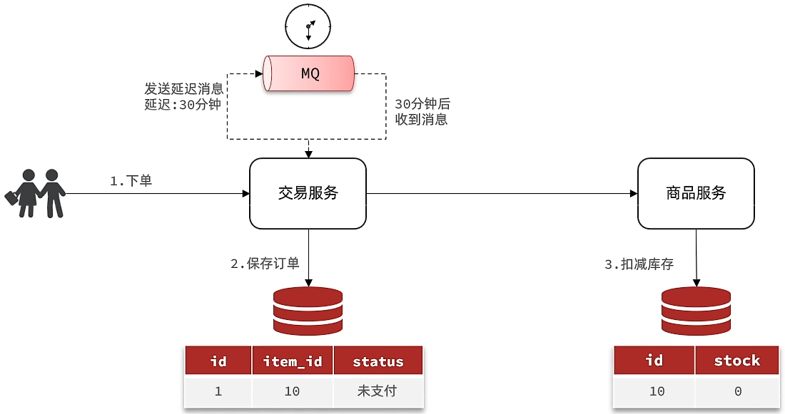
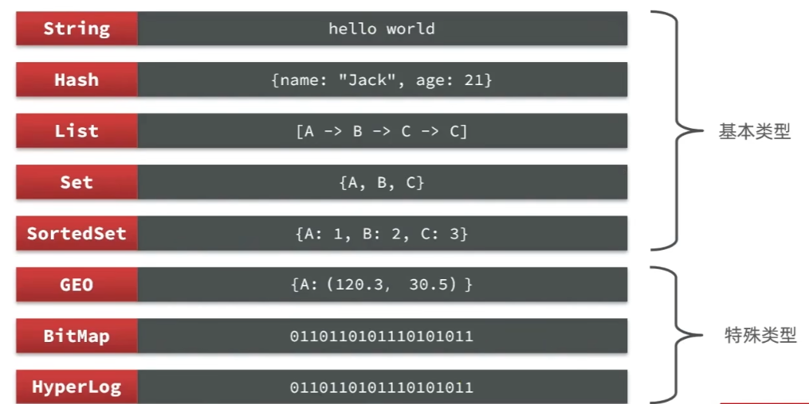

# Java多线程

## 1.多线程基本概念

### 1.1.什么是多线程

**进程**：进程是程序的基本执行实体。（每一个执行的软件都算是一个进程）

**线程**：线程是操作系统能够进行运算调度的最小单位，它包含在进程之中，是**进程中的实际运作单位。**

> ***简单理解：应用软件中互相独立，可以同时运行的功能。***

**多线程的应用场景**：

* 软件中的耗时操作。（拷贝、迁移大文件；加载大量的资源文件）
* 所有的聊天软件。
* 所有的后台服务器。

**总结**：有了多线程，就可以让程序同时做多件事情，提高效率。

### 1.2.并发和并行

**并发**：在同一时刻，有多个指令在单个CPU上**交替**执行。

**并行**：在同一时刻，有多个指令在多个CPU上**同时**执行。（多个CPU指2核4线程、4核8线程、8核16线程等可同时执行多个线程的CPU）

## 2.多线程的实现方式

### 2.1.继承Thread类的方式

**启动步骤**

> 1. 自己定义一个类继承Thread
> 2. 重写run方法
> 3. 创建子类的对象，并启动线程

**代码实现**

```java
class MyThread extends Thread{
    @Override
    public void run() {
        for (int i = 0; i < 5; i++) {
            System.out.println(getName()+"---------------HelloWord");//getName()获取当前线程的名字
        }
    }
}
public class ThreadDemo {
    public static void main(String[] args) {
        MyThread thread1 = new MyThread();
        MyThread thread2 = new MyThread();
        thread1.setName("线程1");//设置线程名
        thread2.setName("线程2");
        thread1.start();//调用启动线程的方法
        thread2.start();
    }
}
```

输出：各个线程的打印操作交替执行

### 2.2.实现Runnable接口的方式

**启动步骤**

> 1. 自己定义一个类实现Runnable接口。
> 2. 重写里面的run方法。
> 3. 创建自己的类的对象。
> 4. 创建一个Thread类的对象，并开启线程。

**代码实现**

```java
class MyThread implements Runnable{
    @Override
    public void run() {
        //获取到当前线程的对象
        Thread t = Thread.currentThread();
        for (int i = 0; i < 10; i++) {
            //Runnable中没有getName方法 不可直接调用
            System.out.println(t.getName()+"HelloWorld");
        }
    }
}
public class ThreadDemo {
    public static void main(String[] args) {
        //创建实现Runnable接口的对象:表示多线程要执行的任务
        MyThread thread = new MyThread();
        //创建线程对象
        Thread t1 = new Thread(thread);
        Thread t2 = new Thread(thread);
        t1.setName("线程1");
        t2.setName("线程2");
        //开启线程
        t1.start();
        t2.start();
    }
}
```

### 2.3.利用Callable接口和Future接口的方式

以上两种实现方式中`run`方法没有返回值，如需要获得线程运行的结果，使用目前的两种实现方式。

**启动步骤**

> 1. 创建一个类实现Callable接口
> 2. 重写call（有返回值，表示多线程运行的结果）
> 3. （在测试类中）创建实现Callable接口的对象（表示多线程要执行的任务）
> 4. 创建Future（实现类FutureTask）的对象（作用：管理多线程运行的结果）
> 5. 创建Thread类的对象，并启动（表示线程）

**代码实现**

```java
//泛型是线程运行后返回值的类型
class MyCallable implements Callable<Integer> {
    @Override
    public Integer call() throws Exception {
        int sum = 0;
        for (int i = 0; i < 20; i++) {
            sum += i;
        }
        return sum;
    }
}
public class ThreadDemo {
    public static void main(String[] args) throws ExecutionException, InterruptedException {
        //创建Callable实现类对象，表示多线程要执行的任务
        MyCallable mc = new MyCallable();
        //创建FutureTask的对象，作用是管理多线程运行的结果
        FutureTask<Integer> futureTask = new FutureTask<Integer>(mc);
        //创建线程的对象
        Thread t1 = new Thread(futureTask);
        //启动线程
        t1.start();
        //获取多线程运行的结果
        Integer result = futureTask.get();
        System.out.println(result);
    }
}
```

### 2.4.三种实现方式对比


## 3.多线程中的常用成员方法


```java
String getName();
void setName(String name);
/*
	细节：
		1.如果没有给线程设置名字，线程也有默认的名字，格式：Thread-X(X表示序号，从0开始)
		2.如果需要为线程设置名字，可以使用set方法，也可以使用构造方法设置。
*/
```

```java
static Thread currentThread();//获取当前线程的对象
/*
	细节：
		当JVM虚拟机启动之后，会自动启动多条线程
		其中有一条线程叫main线程，作用是调用main方法，并执行里面的代码
		之前写的所有代码，其实都是运行在main线程中
*/
static void sleep(long time);//让线程休眠指定的时间，单位为毫秒
/*
	细节：
		1.哪条线程执行到这个方法，哪条线程就会在这里停留对应的时间
		2.时间到了之后，线程会自动醒来，继续执行下面的其他代码
*/
```

线程调度方式分为**抢占式调度**和**非抢占式调度**，Java采用的是抢占式调度（随机性），随机性主要体现在设置线程的优先级，使用以下两个相关方法：

```java
setPriority(int newPriority);//设置线程优先级，优先级越高，抢占概率越大
final int getPriority();//获取线程优先级
```

```java
final void setDaemon(boolean on);//设置为守护线程
/*
	细节：
		当其他的非守护线程执行完毕后，守护线程会陆续结束(即使任务未执行完也会结束)。
*/
```

## 4.线程的生命周期


##  5.线程安全的问题

**需求**：某电影院目前正在上映国产大片，共有100张票，而它有3个窗口，请设计一个程序模拟该电影院买票。

**代码实现**

```java
class MyThread extends Thread{
    static int ticket = 0;
    @Override
    public void run() {
        while(true){
            if(ticket<100){
                try {
                    Thread.sleep(10);
                } catch (InterruptedException e) {
                    e.printStackTrace();
                }
                ticket++;
                System.out.println(getName()+" 正在卖第 "+ticket+" 张票");
            }else {
                break;
            }
        }
    }
}
public class ThreadDemo {
    public static void main(String[] args) throws ExecutionException, InterruptedException {
        //创建线程对象
        MyThread t1 = new MyThread();
        MyThread t2 = new MyThread();
        MyThread t3 = new MyThread();
        t1.setName("窗口1");
        t2.setName("窗口2");
        t3.setName("窗口3");
        //开启线程
        t1.start();
        t2.start();
        t3.start();
    }
}
```

**运行结果**（部分结果）


**分析**

* 相同的票出现了多次

  > 当线程1执行到`ticket++;`，假设此时的ticket值为2，失去执行权，并被线程2抢到并依次执行`ticket++;` 此时ticket值为3，并打印输出为3，然后失去执行权并由线程1重获执行权继续执行打印操作，输出也为3。

* 出现了超出范围的票

  > 假设ticket当前值为20（最后一张票），线程1通过票数判断（`if(ticket<20)`）后在sleep语句中失去执行权，线程2获得执行权后也进入票数判断（`if(ticket<20)`）中，两个窗口各自卖出一张票，此时卖出的票超出剩余的票数。

### 5.1.同步代码块

**为了解决以上线程安全问题，引入同步代码块**，当某线程进入该代码块后，其他线程就算拥有CPU执行权，也不能再进入，直到没有线程在同步代码块当中。即**当有线程进入代码块之后，锁将自动关闭，当有线程出代码块之后，锁将自动打开**

```java
public class MyThread extends Thread{
    static int ticket = 0;
    @Override
    public void run() {
        while(true){
            //锁对象，一定要是唯一的
            synchronized (MyThread.class){
                if(ticket<20){
                    try {
                        Thread.sleep(10);
                    } catch (InterruptedException e) {
                        e.printStackTrace();
                    }
                    ticket++;
                    System.out.println(getName()+" 正在卖第 "+ticket+" 张票");
                }else {
                    break;
                }
            }
        }
    }
}
```

### 5.2.同步方法

将方法里面的代码全部锁起来，就是把synchronized关键字加到方法上。

**格式**

```java
修饰符 synchronized 返回值类型 方法名(方法参数){...}
```

**特点**

* 同步方法是锁住方法里面所有的代码
* 锁对象不能自己指定
  * 当前方法是**非静态**的：`this`，指当前方法的调用者
  * 当前方法是**静态**的：`XXX.class`，当前类的字节码文件对象

### 5.3.Lock锁

我们使用同步代码块（或同步方法）时，并不能直接看到在哪里加上了锁，在哪里释放了锁，为了更清晰的表达如何加锁和释放锁，JDK5以后提供了一个新的锁对象Lock。Lock实现提供比使用synchronized可以获得更广泛的锁定操作。

```java
//手动上锁、手动释放锁
void lock();//上锁
void unlock();//释放锁
```

Lock是接口，不能直接实例化，实例化需要使用ReentrantLock。

**使用格式**

```java
ReentrantLock lock = new ReentrantLock();
lock.lock();
try {
    // 临界区代码
} finally {//无论如何都会执行，确保每一个线程都能被锁释放
    lock.unlock(); // 确保锁释放
}
```

**代码实现**

```java
public class MyThread extends Thread{
    static int ticket = 0;
    //锁对象，一定要是唯一的
    static Lock lock = new ReentrantLock();
    @Override
    public void run() {
        while(true){
            lock.lock();
            try {
                if(ticket==100){
                    break;
                }else {
                    sleep(10);
                    ticket++;
                    System.out.println(getName()+" 正在卖第 "+ticket+" 张票!!!");
                }
            } catch (InterruptedException e) {
                throw new RuntimeException(e);
            }finally {
                lock.unlock();
            }
        }
    }
}
```

### 5.4.死锁

**什么是死锁：**死锁（Deadlock）是指多个线程在互相等待对方释放资源，导致所有线程都无法继续执行的状态。

**死锁的四个必要条件**

> 1. **互斥条件**：某个资源在同一时间只能由一个线程持有。
> 2. **持有并等待**：一个线程持有了某些资源，同时在等待其他线程释放它所需的资源。
> 3. **不可剥夺**：线程已经获得的资源在使用完之前，不能被其他线程强制剥夺。
> 4. **循环等待**：存在一个线程集合，其中每个线程都在等待下一个线程所持有的资源，形成环状依赖。

当这四个条件同时成立时，就可能发生死锁。

**代码实现**

```java
public class MyThread extends Thread{
    static Object objA = new Object();
    static Object objB = new Object();
    @Override
    public void run() {
        while(true){
            if("线程A".equals(getName())){
                synchronized (objA){
                    System.out.println("线程A拿到了A锁，准备拿B锁");
                    synchronized (objB){
                        System.out.println("线程A拿到了B锁，顺利执行完一轮");
                    }
                }
            }else if("线程B".equals(getName())){
                synchronized (objB){
                    System.out.println("线程B拿到了B锁，准备拿A锁");
                    synchronized (objA){
                        System.out.println("线程B拿到了A锁，顺利执行完一轮");
                    }
                }
            }
        }
    }
}
```

**解决死锁**：避免两个锁进行嵌套

## 6.等待唤醒机制

### 6.1.生产者和消费者方式

生产者消费者模式是一个十分经典的多线程协作的模式。

**等待唤醒机制**


**常见方法**

```java
void wait();//当前线程等待，直到被其他线程唤醒
void notify();//随机唤醒单个线程
void notifyAll();//唤醒所有线程
```

**代码实现**

**需求**：完成生产者和消费者（等待唤醒机制）的代码，**实现线程轮流交替执行的效果**。（仅一个消费者和一个生产者情况下）

**桌子（中间控制）**

```java
public class Desk extends Thread{
    /*
    * 作用：控制生产者和消费者的执行
    * */
    public static int foodFlag = 0;//表示桌上是否有面条
    public static int count = 10;//吃货能吃的总数
    public static final Object lock = new Object();//锁对象
}
```

**生产者**

```java
public class Cook extends Thread{
    @Override
    public void run() {
        while(true){
            synchronized (Desk.lock){
                if(Desk.count==0){//吃货已经吃不下
                    break;
                }else{
                    //判断桌子上是否有面条
                    //如果有 则等待
                    if(Desk.foodFlag==1){
                        try {
                            Desk.lock.wait();
                        } catch (InterruptedException e) {
                            e.printStackTrace();
                        }
                    }else {
                        //如果没有 则制作面条
                        //修改桌子状态
                        System.out.println("厨师正在制作面条!!!");
                        Desk.foodFlag = 1;
                        //叫醒等待的消费者开吃
                        Desk.lock.notifyAll();
                    }
                }
            }
        }
    }
}
```

**消费者**

```java
public class Foodie extends Thread{
    @Override
    public void run() {
        while(true){
            synchronized (Desk.lock){
                if(Desk.count == 0){//判断自己是否还能消费
                    break;
                }else {
                    //先判断桌子上是否有面条，没有则等待；有 则count--，并且重置桌子状态
                    if(Desk.foodFlag == 0){
                        try {
                            /*
                            * 让当前线程跟锁进行绑定，此时 使用唤醒线程时，则可以唤醒指定的线程
                            * */
                            Desk.lock.wait();//
                        } catch (InterruptedException e) {
                            e.printStackTrace();
                        }
                    }else{
                        Desk.count--;
                        System.out.println("吃货正在吃面条，还能再吃"+Desk.count+"碗！！！");
                        //修改桌子状态
                        Desk.foodFlag = 0;
                        //吃完之后唤醒厨师继续做
                        Desk.lock.notifyAll();
                    }
                }
            }
        }
    }
}
```

**主方法调用**

```java
public class ThreadDemo {
    public static void main(String[] args) {
        //创建线程对象
        Cook c = new Cook();
        Foodie f = new Foodie();
        //给线程设置名字
        c.setName("厨师");
        f.setName("吃货");

        c.start();
        f.start();
    }
}
```

### 6.2.阻塞队列方式


**阻塞队列的继承结构**

```java
//涉及以下4个 接口
Iterable;
Collection;
Queue;
BlockingQueue;
//使用以下 实现类
ArrayBlockingQueue;//底层是数组，有界
LinckedBlockingQueue;//底层是链表，无界；但不是真正的无界，最大为int的最大值。
```

**生产者**

```java
public class Cook extends Thread{
    ArrayBlockingQueue<String> queue;

    public Cook(ArrayBlockingQueue<String> queue){
        this.queue = queue;
    }
    @Override
    public void run() {
        while(true){
            //不断的把面条放到阻塞队列当中
            try {
                queue.put("面条");//put()方法内部已有锁
                System.out.println("厨师放了一碗面条");
            } catch (InterruptedException e) {
                e.printStackTrace();
            }
        }
    }
}
```

**消费者**

```java
public class Foodie extends Thread{
    ArrayBlockingQueue<String> queue;

    public Foodie(ArrayBlockingQueue<String> queue){
        this.queue = queue;
    }

    @Override
    public void run() {
        while(true){
            //不断的从阻塞队列中获取面条
            try {
                String food = queue.take();//take()方法内部已有锁
                System.out.println(food);
            } catch (InterruptedException e) {
                e.printStackTrace();
            }
        }
    }
}
```

**主函数**

```java
public class ThreadDemo {
    public static void main(String[] args) {
        /**
         * 需求：利用阻塞队列完成生产者和消费者（等待唤醒机制）的代码实现
         * 细节：
         *      生产者和消费者必须使用同一个阻塞队列
         */
        //1.创建阻塞队列的对象 并指定队列长度为1
        ArrayBlockingQueue<String> queue = new ArrayBlockingQueue<>(1);
        //2.创建线程的对象，并把阻塞队列传递过去
        Cook cook = new Cook(queue);
        Foodie foodie = new Foodie(queue);
        //3.开启线程
        cook.start();
        foodie.start();
    }
}
```

## 7.多线程的6种状态


**注意**：Java多线程中没有**运行时状态**，一旦线程抢夺到CPU执行权后，线程就会交给操作系统，Java虚拟机就不再管理。

**线程状态**

```java
/*
新建状态(NEW)--------------->创建线程对象
就绪状态(RUNNABLE)---------->start方法
阻塞状态(BLOCKED)----------->无法获取锁对象
等待状态(WAITING)----------->wait方法
计时状态(TIMED_WAITING)----->sleep方法
结束状态(TERMINATED)-------->全部代码运行完毕
*/
```

## 8.线程池

### 8.1.主要核心原理

1. 创建一个池子，池子是空的。
2. 提交任务时，池子会创建新的线程对象，任务执行完毕，线程归还给池子，下次再提交任务时，不需要创建新的线程，直接复用已有的线程即可。
3. 但是如果提交任务时，池子中没有空闲线程，也无法创建新的线程，任务就会排队等待。

### 8.2.线程池代码实现

1. 创建线程池
2. 提交任务
3. 所有的任务全部执行完毕，关闭线程池

`Executors`:线程池的工具类通过调用方法返回不同类型的线程池对象

```java
public static ExecutorService newCachedThreadPool();//创建一个没有上限的线程池，实际上限是int类型的最大值
public static ExecutorService newFixedThreadPool(int nThreads);//创建有上限的线程池
```

**代码实现**

```java
public class MyRunnable implements Runnable{
    @Override
    public void run() {
        for (int i = 0; i < 20; i++) {
            System.out.println(Thread.currentThread().getName());
        }
    }
}
```

```java
public class ThreadDemo {
    public static void main(String[] args) {
        //1.创建线程池对象
        ExecutorService pool = Executors.newCachedThreadPool();
        ExecutorService pool2 = Executors.newFixedThreadPool(3);
        //2.提交任务
        pool.submit(new MyRunnable());
        pool.submit(new MyRunnable());
        pool.submit(new MyRunnable());
        //3.销毁线程池
        pool.shutdown();
    }
}
```

### 8.2.自定义线程池

**以饭店的运作为例**


**细节**：当设置 核心线程数为 3，临时线程数为 3，队伍长度为 3

> * 当提交的任务数为6个，则1,2,3任务分配核心线程，4,5,6任务排队等待。
> * 当提交的任务数为8个，则1,2,3任务分配核心线程，4,5,6排队等待，7,8分配临时线程。
> * 当提交的任务数为10个，则1,2,3任务分配核心线程，4,5,6排队等待，7,8,9分配临时线程，此时需要丢弃（拒绝）一个任务。

**任务拒绝策略**


**代码实现**

```java
public class ThreadDemo {
    public static void main(String[] args) {
        /**
         * ThreadPoolExecutor threadPoolExecutor = new ThreadPoolExecutor();
         *
         *  参数一：核心线程数量  不能小于0
         *  参数二：最大线程数量  不能小于等于0，最大数量>=核心线程数量
         *  参数三：空闲线程最大存活时间  不能小于0
         *  参数四：时间单位    用TimeUnit指定
         *  参数五：任务队列    不能为null ArrayBlockingQueue()/LinkedBlockingQueue()
         *  参数六：创建线程工厂  不能为null
         *  参数七：任务的拒绝策略 不能为null
         */
        ThreadPoolExecutor threadPoolExecutor = new ThreadPoolExecutor(
                3,
                6,
                60,
                TimeUnit.SECONDS,
                new ArrayBlockingQueue<>(3),
                Executors.defaultThreadFactory(),
                new ThreadPoolExecutor.AbortPolicy()
        );
    }
}
```

**不断的提交任务，会有以下三个临界点：**

> * 当核心线程满时，再提交任务就会排队。
> * 当核心线程满，队伍满时，会创建临时线程。
> * 当核心线程满，队伍满，临时线程满时，会触发任务拒绝策略。

# Nginx

推荐笔记：[nginx学习，看这一篇就够了](https://blog.csdn.net/qq_40036754/article/details/102463099)

## 1.Nginx安装和配置

**通过压缩包解压编译安装**

* 安装编译依赖

  ```bash
  sudo apt update
  sudo apt install build-essential libpcre3 libpcre3-dev zlib1g zlib1g-dev libssl-dev -y
  ```

* 下载Nginx源码

  * 官网下载

  * 通过wget下载

    ```bash
    wget https://nginx.org/download/nginx-1.24.0.tar.gz
    ```

* 下载后解压

  ```bash
  # 选择在/usr/local/nginx/sbin目录下
  sudo tar -zxvf nginx-1.24.0.tar.gz
  ```

* 编译和安装

  ```bash
  # 编译
  sudo make
  
  # 安装
  sudo make install
  ```

___

**启动和停止服务**

进入安装好的目录：`/usr/local/nginx/sbin`

```bash
# 启动
./nginx
# 快速停止
./nginx -s stop
# 优雅关闭，在退出前完成已经接受的连接请求
./nginx -s quit
# 重新加载配置
./nging -s reload
```

___

**安装成系统服务**

创建服务脚本

```bash
vim /usr/lib/systemd/system/nginx.server
```

服务脚本内容

```properties
[Unit]
Description=nginx - web server
After=network.target remote-fs.target nss-lookup.ta
[Service]
Type=forking
PIDFile=/usr/local/nginx/logs/nginx.pid
ExecStartPre=/usr/local/nginx/sbin/nginx -t -c /usr/local/nginx/conf/nginx.conf
ExecStart=/usr/local/nginx/sbin/nginx -c /usr/local/nginx/conf/nginx.conf
ExecReload=/usr/local/nginx/sbin/nginx -s reload
ExecStop=/usr/local/nginx/sbin/nginx -s stop
ExecQuit=/usr/local/nginx/sbin/nginx -s quit
PrivateTmp=true

[Install]
WantedBy=multi-user.target
```

配置完成后重新加载systemd

```bash
# 重新加载 systemd
sudo systemctl daemon-reload

# 启动 Nginx
sudo systemctl start nginx

# 设置开机自启
sudo systemctl enable nginx

# 检查状态
sudo systemctl status nginx
```

```yaml
 
```

### 1.1.Nginx配置文件

**配置文件的位置**：`/usr/local/nginx/conf/nginx.conf`

配置文件中有很多`#`， 开头的表示注释内容，我们去掉所有以 `#` 开头的段落，精简之后的 内容如下：

```nginx
worker_processes  1;

events {
    worker_connections  1024;
}

http {
    include       mime.types;
    default_type  application/octet-stream;
    sendfile        on;
    keepalive_timeout  65;

    server {
        listen       80;
        server_name  localhost;

        location / {
            root   html;
            index  index.html index.htm;
        }
        error_page   500 502 503 504  /50x.html;
        location = /50x.html {
            root   html;
        }
    }
}
```

___

`Nginx`配置文件有三部分组成：

**第一部分：全局块**

从配置文件开始到 events 块之间的内容，**主要会设置一些影响`nginx`服务器整体运行的配置指令**，主要包括配 置运行 `Nginx` 服务器的用户（组）、允许生成的 `worker process` 数，进程 `PID` 存放路径、日志存放路径和类型以 及配置文件的引入等。
比如上面第一行配置的：

```nginx
worker_processes  1;
```

这是 `Nginx` 服务器并发处理服务的关键配置，**`worker_processes` 值越大，可以支持的并发处理量也越多**，但是 会受到硬件、软件等设备的制约。

**第二部分：event块**

```nginx
events {
    worker_connections  1024;
}
```

events 块涉及的指令**主要影响 Nginx 服务器与用户的网络连接，常用的设置包括是否开启对多 work process 下的网络连接进行序列化，是否 允许同时接收多个网络连接，选取哪种事件驱动模型来处理连接请求，每个 word process 可以同时支持的最大连接数等。**
上述例子就表示每个 work process 支持的最大连接数为 1024.
这部分的配置对 Nginx 的性能影响较大，在实际中应该灵活配置
**第三部分：http块**

```nginx
http {
    include       mime.types;
    default_type  application/octet-stream;
    sendfile        on;
    keepalive_timeout  65;

    server {
        listen       80;
        server_name  localhost;

        location / {
            root   html;
            index  index.html index.htm;
        }
        error_page   500 502 503 504  /50x.html;
        location = /50x.html {
            root   html;
        }
    }
}
```

这算是 `Nginx` 服务器配置中最频繁的部分，代理、缓存和日志定义等绝大多数功能和第三方模块的配置都在这里。

需要注意的是：`http` 块也可以包括 `http`全局块、`server` 块。

* **`http`全局块**：

  `http`全局块配置的指令包括文件引入、`MIME-TYPE` 定义、日志自定义、连接超时时间、单链接请求数上限等。

* **`server`块**：

  这块和虚拟主机有密切关系，虚拟主机从用户角度看，和一台独立的硬件主机是完全一样的，该技术的产生是为了 节省互联网服务器硬件成本。
  **每个 `http` 块可以包括多个 `server` 块，而每个 `server` 块就相当于一个虚拟主机。**
  **而每个 `server` 块也分为全局 `server` 块，以及可以同时包含多个 `locaton` 块。**

  * **全局server块**

    最常见的配置是本虚拟机主机的监听配置和本虚拟主机的名称或`IP`配置

  * **location块**

    一个 server 块可以配置多个 location 块。
    这块的主要作用是基于 `Nginx` 服务器接收到的请求字符串（例如 server_name/uri-string），对虚拟主机名称 （也可以是IP 别名）之外的字符串（例如 前面的 /uri-string）进行匹配，对特定的请求进行处理。 地址定向、数据缓 存和应答控制等功能，还有许多第三方模块的配置也在这里进行。

  

# RabbitMQ

##  1.业务调用问题

### 1.1.同步调用

以支付服务为例：


___

**同步调用的优势是什么？**

* 时效性强，等待到结果后才返回

**同步调用的问题是什么？**

* 拓展性差
* 性能下降
* 级联失败问题（一个服务宕机，串联的所有服务都会跟着宕机）

### 1.2.异步调用

支付服务不在同步调用业务关联度低的服务，而是发送消息通知到Broker（消息代理）。


____

**异步调用的优势是什么？**

* 耦合度低，拓展性强
* 异步调用，无需等待，性能好
* 故障隔离，下游服务故障不会影响上游业务
* 缓存消息，流量削峰填谷（可以根据自己的处理速度来取消息，不会受到流量的影响）

**异步调用的问题是什么？**

* 不能立即得到调用结果，失效性差
* 不确定下游业务执行是否成功
* 业务安全依赖于Broker的可靠性

### 1.3.什么情况下使用同步调用

经过上面的分析，有同学可能会有这样的疑问：既然同步调用有这么多问题，为什么我们还要用同步调用呢，什么情况下使用同步调用呢？

**一般来说，使用同步调用的场景都有一个特点：下一步操作依赖于上一步操作的结果**

以上面的支付业务为例，交易服务、通知服务、积分服务都依赖于支付服务的结果

当支付服务成功扣减用户余额并成功更新支付状态之后，交易服务、通知服务、积分服务就可以开始执行相应的操作了

*然而，通知服务不依赖于交易服务，积分服务也不依赖于通知服务*

在成功扣减用户余额并成功更新支付状态之后，支付业务就已经完成了

所以说，**支付服务完成了之后，只需要通知交易服务、通知服务、积分服务执行相应的操作，而不需要等待交易服务、通知服务、积分服务都完成之后再返回结果。**

## 2.MQ技术对比


### 3.通过Docker安装RabbitMQ

**RabbitMQ**是基于 Erlang 语言开发的开源消息通信中间件（官网：[RabbitMQ](https://www.rabbitmq.com/)）

我们基于 `docker` 安装 RabbitMQ

#### 3.1.下载RabbitMQ镜像

```shell
docker pull rabbitmq
```

检查RabbitMQ镜像是否下载成功

```shell
docker images
```

#### 3.2.启动RabbitMQ

执行创建RabbitMQ容器之前先创建`hmall`网络

```shell
docker network create hmall
```

根据提前下载好的RabbitMQ镜像，创建对应的容器

```shell
docker run \
 -e RABBITMQ_DEFAULT_USER=scarzyy \
 -e RABBITMQ_DEFAULT_PASS=449554 \
 -v rabbitmq-plugins:/plugins \
 --name rabbitmq \
 --hostname rabbitmq \
 -p 15672:15672 \
 -p 5672:5672 \
 --network hmall\
 -d \
 rabbitmq:latest
```

* `docker run`: 基本的Docker命令，用于启动一个新的容器实例

* `-e RABBITMQ_DEFAULT_USER=scarzyy`: 设置RabbitMQ服务的默认用户名为scarzyy

* `-e RABBITMQ_DEFAULT_PASS=449554`: 设置RabbitMQ服务的默认密码为449554

* `-v rabbitmq-plugins:/plugins`: 将一个名为`rabbitmq-plugins`的卷映射到容器的`/plugins`目录，用于存放RabbitMQ的插件。这里的`rabbitmq-plugins`是一个卷的名称，而不是宿主机的路径

* `--name rabbitmq`: 指定容器的名称为`rabbitmq`

* `--hostname rabbitmq`: 设置容器的主机名为`rabbitmq`

* `-p 15672:15672`: 将宿主机的端口15672映射到容器的端口15672，这是RabbitMQ管理界面的默认端口

* `-p 5672:5672`: 将宿主机的端口5672映射到容器的端口5672，这是RabbitMQ用于AMQP协议通信的默认端口
* `--network`：添加该容器到自定义网络中，可以实现容器间通过容器名进行访问

* `-d`: 在后台运行容器（守护进程）

* `rabbitmq:latest`: 使用最新的RabbitMQ官方镜像来创建容器

___

可以看到在安装命令中有两个映射的端口：

* `15672`：RabbitMQ提供的管理控制台的端口
* `5672`：RabbitMQ的消息发送处理接口

___

> **注**：4.0版本后RabbitMQ默认不开启可视化界面，需要进行以下设置

```shell
# 1.进入RabbitMQ容器中
docker exec -it rabbitmq bash
# 2.启用 RabbitMQ 管理插件
rabbitmq-plugins enable rabbitmq_management
# 3.退出容器
exit
# 4.重启容器
docker restart <容器名称或ID>
```

访问：`192.168.59.120:15672`进入web可视化管理界面

## 3.RabbitMQ整体框架和核心概念

**RabbitMQ的核心概念**

* `Publisher`：消息发送者
* `Consumer`：消息的消费者
* `Queue`：消息队列，存储消息
* `Exchange`：交换机，负责路由消息
* `VirtualHost`：虚拟主机，用于数据隔离，每个虚拟主机有自己的交换机和消息队列

**消费者**与**队列**（Queue）进行绑定，**消息发送者**不是直接将消息发送到**队列**中，而是先发到**交换机**，**交换机**负责将消息路由给绑定的**队列**，可以路由给一个队列也可以路由给所有队列


## 4.RabbitMQ快速入门

> ***注意事项：交换机只能路由和转发消息，不能存储消息***

___

需求：在RabbitMQ的控制台完成下列操作

* 新建队列`hello.queue1`和`hello.queue2`
* 向默认的`amp.fanout`交换机发送一条消息
* 查看消息是否到达`hello.queue1`和`hello.queue2`
* 总结规律

___

### 4.1.新建队列

创建两个队列，分别为`hello.queue1`和`hello.queue2`


### 4.2.绑定队列与交换机

将上面创建的两个队列都绑定在`amq.fanout`交换机中


### 4.3.发送消息

我们在`amq.fanout`交换机中发送一条消息，消息的内容为`hello world`。


___

在队列中查看接收交换机发送的信息。

`Queues and Streams` ---> `hello.queue1` ---> `Get Message(s)` 。


### 4.4.可能遇到的情况

如果你发现

1. 交换机的 overview 页面没有折线图
2. Queues 页面也没有与消息相关的信息
3. 点击`channels`后出现`Stats in management UI are disabled on this node`信息

需要先修改Docker中`RabbitMQ`容器的配置

___

```shell
# 1.进入容器内部
docker exec -it rabbitmq bash
# 2.修改rabbitmq容器配置
cd /etc/rabbitmq/conf.d/
echo management_agent.disable_metrics_collector = false > management_agent.disable_metrics_collector.conf
# 3.退出容器，并重启
exit
docker restart rabbitmq
```

## 5.数据隔离

需求：在RabbitMQ的控制台完成下列操作

* 新建一个用户`hmall`
* 为`hmall`用户创建一个`virtual host`
* 测试不同`virtual host`之间的数据隔离现象

___

### 5.1.新建用户

新建一个名为`hmall`的用户，密码为`449554`，且角色指定为`admin`（超级管理员）


用新用户（超级管理员标签）的账号登录管理台，虽然能看到所有 `Virtual Host` 的信息，但是无法对任意一个 `Virtual Host` 进行操作。

### 5.2.为新用户创建Virtual Host

用新用户的账号登录管理台，创建一个名为 `/hmall` 的 `Virtual Host`


> ***常规开发中，一个项目可以创建一个用户并同时创建虚拟主机Virtual Host***

## 6.Java客户端

将来我们开发业务功能的时候，肯定不会在控制台收发消息，而是应该基于编程的方式。由于`RabbitMQ`采用了`AMQP`协议，因此它具备跨语言的特性。任何语言只要遵循`AMQP`协议收发消息，都可以与`RabbitMQ`交互。并且`RabbitMQ`官方也提供了各种不同语言的客户端

但是，`RabbitMQ`官方提供的Java客户端编码相对复杂，一般生产环境下我们更多会结合`Spring`来使用。而Spring的官方刚好基于`RabbitMQ`提供了这样一套消息收发的模板工具：`SpringAMQP`。并且还基于`SpringBoot`对其实现了自动装配，使用起来非常方便。


SpringAMQP提供了三个功能：

- 自动声明队列、交换机及其绑定关系
- 基于注解的监听器模式，异步接收消息
- 封装了`RabbitTemplate`工具，用于发送消息

____

> ***项目地址：`F:\SpringBoot_project\mq-demo`***
>
> 项目中包含consumer和publisher两个子模块。

### 6.1.快速入门

需求：

* 利用控制台创建队列`simple.queue`
* 在`publisher`服务中，利用`SpringAMQP`直接向`simple.queue`发送消息
* 在`consumer`服务中，利用`SpringAMQP`编写消费者，监听`simple.queue`队列

___

#### 6.1.1.引入SpringAMQP依赖

在父工程中引入spring-amqp依赖，这样publisher和consumer服务都可以使用

```xml
<!--AMQP依赖，包含RabbitMQ-->
<dependency>
    <groupId>org.springframework.boot</groupId>
    <artifactId>spring-boot-starter-amqp</artifactId>
</dependency>
```

#### 6.1.2.配置RabbitMQ服务端

在每个微服务（即consumer模块和publisher模块）中引入MQ服务端信息，这样微服务才能连接到RabbitMQ

```yaml
spring:
  rabbitmq:
    host: 192.168.59.120 # 虚拟机IP
    port: 5672 # 端口
    virtual-host: /hmall # rabbitmq的虚拟主机
    username: hmall # 用户名
    password: 449554 # 密码
```

#### 6.1.3.发送消息

`SpringAMQP`提供了`RabbitTemplate`工具类，方便我们发送消息

```java
@Autowired
private RabbitTemplate rabbitTemplate;

@Test
public void testSimpleQueue() {
    // 队列名称
    String queueName = "simple.queue";
    // 消息
    String message = "hello, spring amqp!";
    // 发送消息
    rabbitTemplate.convertAndSend(queueName, message);
}
```

#### 6.1.4.接收消息

`SpringAMQP`提供声明式的消息监听，我们只需要通过**注解**`@RabbitListener`在方法上声明要监听的队列名称，将来`SpringAMQP`就会把消息传递给当前方法

```java
package com.itheima.consumer.listener;

import org.springframework.amqp.rabbit.annotation.RabbitListener;
import org.springframework.stereotype.Component;

@Component
public class SpringRabbitListener {
     // 利用RabbitListener来声明要监听的队列信息
    // 将来一旦监听的队列中有了消息，就会推送给当前服务，调用当前方法，处理消息。
    // 可以看到方法体中接收的就是消息体的内容
    @RabbitListener(queues = "simple.queue")
    //方法中参数msg的数据类型取决于发送者声明的数据类型
    public void listenSimpleQueueMessage(String msg) throws InterruptedException {
        System.out.println("spring 消费者接收到消息：【" + msg + "】");
    }
}
```

### 6.2.Work Queues模型

Work queues，任务模型。简单来说就是**让多个消费者绑定到一个队列，共同消费队列中的消息。**

>  ***虽然有多个消费者绑定同一个队列，但是队列中的某一条消息只会被一个消费者消费***


___

**案例**：模拟Work Queues，实现一个队列绑定多个消费者

基本思路

1. 在`RabbitMQ`的控制台创建一个队列，名为`work.queue`
2. 在`publisher`服务中定义测试方法，在1秒内产生50条消息，发送到`work.queue`
3. 在`consumer`服务中定义两个消息监听者，都监听`work.queue`队列
4. 消费者1每秒处理50条消息，消费者2每秒处理5条消息

____

在 `publisher`服务的 `SpringAmqpTest`测试类中添加以下方法，该方法可以在 1 秒内产生 50 条消息

```java
@SpringBootTest
public class SpringAmqpTest {

    @Autowired
    private RabbitTemplate rabbitTemplate;

    @Test
    public void testWorkQueue() throws InterruptedException {
        String queueName = "work.queue";
        for (int i = 1; i <= 50; i++) {
            // 消息
            String message = "hello, worker,message_"+i;
            // 发送消息
            rabbitTemplate.convertAndSend(queueName, message);
        }
    }
}
```

在 `consumer` 服务的 `MqListener` 类中添加以下方法，监听 `work.queue` 队列

```java
@Component
public class MqListener {
    
    @RabbitListener(queues = "work.queue")
    public void listenWorkQueue1(String msg){
        System.out.println("消费者1 接收到 work.queue 的消息......【" + msg + "】");
    }

    @RabbitListener(queues = "work.queue")
    public void listenWorkQueue2(String msg){
        System.err.println("消费者2 接收到 work.queue 的消息......【" + msg + "】");
    }
}

```

消费者接受消息时出现轮询的现象


> ***当消费者处理能力不一致时，处理能力快的消费者也只能处理同样数量的消息***

#### 6.2.1.消费者消息推送机制

默认情况下，`RabbitMQ`会将消息依次轮询投递给绑定在队列上的每一个消费者*（每个消费者获得的消息数量一样）*。但这并没有考虑到消费者是否已经处理完消息，可能出现消息堆积。

因此，我们需要修改`application.yml`，设置`preFetch`值为1，确保同一时刻最多投递给消费者1条消息。相当于告诉消费者要一条一条地从队列中取出消息，***只有处理完一条消息才能取出下一条***

```yaml
spring:
  rabbitmq:
    listener:
      simple:
        prefetch: 1 # 每次只能获取1条消息，处理完成才能获取下一条消息
```

#### 6.2.2.总结

**Work模型的使用**

* 多个消费者绑定到一个队列，可以加快消息处理速度
* 同一条消息只会被一个消费者处理
* 通过设置`prefetch`来控制消费者预取的消息数量，处理完一条再处理下一条，实现能者多劳。

> ***如何处理消息堆积问题：使用Work模型，在一个队列中多绑定几个消费者可以加快消息处理速度***

### 6.3.交换机

真正生产环境都会经过exchange来发送消息，而不是直接发送到队列，交换机的**类型**有四种：

* `Fanout`：广播，将消息交给所有绑定到交换机的队列。我们最早在控制台使用的正是Fanout交换机
* `Direct`：定向/订阅，基于`RoutingKey`（路由key）发送给订阅了消息的队列
* `Topic`：话题/通配符订阅，与`Direct`类似，只不过`RoutingKey`可以使用通配符
* `Headers`：头匹配，基于MQ的消息头匹配，用的较少。

> ***若不使用交换机，则队列中的一条消息只能由一个服务处理后消失***

#### 6.3.1.Fanout交换机

`Fanout` 交换机会将接收到的消息**广播**到每一个跟其绑定的 `queue` ，所以也叫广播模式。


> ***多个队列的原因是有多个微服务, 多个消费者的原因是加速业务处理***

___

**案例**：利用`SpringAMQP`演示`FanoutExchange`的使用

实现思路：

1. 在 `RabbitMQ` 控制台中，声明队列 `fanout.queue1` 和 `fanout.queue2`
2. 在 `RabbitMQ` 控制台中，声明交换机 `hmall.fanout`，将两个队列与其绑定
3. 在 `consumer` 服务中，编写两个消费者方法，分别监听 `fanout.queue1` 和 `fanout.queue2` 队列
4. 在 `publisher` 服务中编写测试方法，向 `hmall.fanout` 交换机发送消息

___

>  *1、2步骤参考RabbitMQ快速入门章节*

`consumer`服务中编写两个消费方法分别监听

```java
@Component
public class MqListener {
    @RabbitListener(queues = "fanout.queue1")
    public void listenFanoutQueue1(String msg){
        System.out.println("消费者1 接收到 fanout.queue1 的消息......【" + msg + "】");
    }

    @RabbitListener(queues = "fanout.queue2")
    public void listenFanoutQueue2(String msg){
        System.out.println("消费者2 接收到 fanout.queue2 的消息......【" + msg + "】");
    }
}
```

`publisher`服务中编写测试方法，向`hmall.fanout`交换机发送消息

```java
@SpringBootTest
public class SpringAmqpTest {

    @Autowired
    private RabbitTemplate rabbitTemplate;

    @Test
    void testSendFanout(){
        // 交换机名称
        String exchangeName = "hmall.fanout";
        // 消息
        String msg = "Hello Everyone!";
        rabbitTemplate.convertAndSend(exchangeName,null,msg);
    }
}
```

___

* 可以有多个队列
* 每个队列都要绑定到`Exchange`（交换机）
* 生产者发送的消息，只能发送到交换机
* 交换机把消息发送给绑定过的所有队列
* 订阅队列的消费者都能拿到消息

#### 6.3.2.Direct交换机

`Direct Exchange`会将接收到的消息根据规则路由到指定的Queue，因此称为定向路由。

* 每一`Queue`都会与`Exchange`设置一个`BindingKey`
* 发布者发送消息时，指定消息的`RoutingKey`
* `Exchange`将消息路由到`BindingKey`与消息`RoutingKey`一致的队列


> ***当Direct交换机绑定的队列的`bindingKey`相同时，功能与Fanout交换机相同***

___

**案例**：利用`SpringAMQP`演示`DirectExchange`的使用

实现思路：

1. 在 `RabbitMQ` 控制台中，声明队列 `direct.queue1` 和 `direct.queue2`
2. 在 `RabbitMQ` 控制台中，声明交换机 `hmall.direct` ，将上面创建的两个队列与其绑定
3. 在 `consumer` 服务中，编写两个消费者方法，分别监听 `direct.queue1` 和 `direct.queue2`
4. 在 `publisher` 服务中编写测试方法，利用不同的 `RoutingKey` 向 `hmall.direct` 交换机发送消息

___

为 `direct.queue1`队列 和 `direct.queue2` 队列分别指定 `bindingKey`


___

在 `consumer` 服务的 `RabbitMQListener` 类中添加以下方法，分别监听 `direct.queue1` 和 `direct.queue2` 队列

```java
@Component
public class MqListener {
    @RabbitListener(queues = "direct.queue1")
    public void listenDirectQueue1(String msg){
        System.out.println("消费者1 接收到 direct.queue1 的消息......【" + msg + "】");
    }

    @RabbitListener(queues = "direct.queue2")
    public void listenDirectQueue2(String msg){
        System.out.println("消费者2 接收到 direct.queue2 的消息......【" + msg + "】");
    }
}
```

在`publisher`服务中发送消息到`hmall.direct`交换机

```java
@Test
void testSendDirect() {
    String exchangeName = "hmall.direct";
    
    String blueMessage = "蓝色通知，警报解除，哥斯拉放的是气球";
    rabbitTemplate.convertAndSend(exchangeName, "blue", blueMessage);//发送到direct.queue1中

    String redMessage = "红色警报，由于日本排放核污水，惊现哥斯拉!";
    rabbitTemplate.convertAndSend(exchangeName, "red", redMessage);//发送到direct.queue1和direct.queue2中

    String yellowMessage = "黄色通知，哥斯拉来了，快跑！";
    rabbitTemplate.convertAndSend(exchangeName, "yellow", yellowMessage);//发送到direct.queue2中
}
```

> ***注意，当新建队列不设定`routingKey`直接与Direct交换机进行绑定时，生产者发送消息只有指定`routingKey==""`时新建队列才能收到消息。***

#### 6.3.3.Topic交换机

`TopicExchange`与`DirectExchange`类似，区别在于`routingKey`可以是多个单词的列表，并且以`.`分割

> ***如果使用topic交换机，那么在队列与交换机绑定的时候`RoutingKey`可以使用通配符***
>
> * `#`：代指0个或多个单词
> * `*`：代指1个单词


> 1. ***opic 交换机能实现的功能 Direct 交换机也能实现，不过用 Topic 交换机实现起来更加方便***
> 2. ***如果某条消息的 topic 符合多个 queue 的 `bindingKey` ，该条消息会发送给符合条件的所有 queue ，实现类似于 Fanout 交换机的效果***

___

**案例**：利用SpringAMQP演示TopicExchange的使用

实现思路：

1. 在 `RabbitMQ` 控制台中，声明队列 `topic.queue1` 和 `topic.queue2`
2. 在 `RabbitMQ` 控制台中，声明交换机 `hmall.topic` ，将两个队列与其绑定
3. 在 `consumer` 服务中编写两个消费者方法，分别监听 `topic.queue1` 和 `topic.queue2`
4. 在 `publisher` 服务中编写测试方法，利用不同的 `routingKey` 向 `hmall.topic` 发送消息

___

为 `topic.queue1` 和 `topic.queue2` 队列分别指定 `bindingKey`


___

在 `consumer` 服务的 `RabbitMQListener` 类中添加以下方法，分别监听 `topic.queue1` 和 `topic.queue2` 队列

```java
@Component
public class MqListener {
    @RabbitListener(queues = "topic.queue1")
    public void listenTopicQueue1(String msg){
        System.out.println("消费者1 接收到 topic.queue1 的消息......【" + msg + "】");
    }

    @RabbitListener(queues = "topic.queue2")
    public void listenTopicQueue2(String msg){
        System.out.println("消费者2 接收到 topic.queue2 的消息......【" + msg + "】");
    }
}
```

在 `publisher` 服务的 `SpringAmqp` 测试类中添加以下方法，向 `hmall.direct`交换机发送消息

```java
@Test
void testSendTopic(){
    String exchangeName = "hmall.topic";
    String weatherMessage = "今天天气挺不错，我的心情的挺好的";
    rabbitTemplate.convertAndSend(exchangeName, "china.weather", weatherMessage);//topic.queue1收到

    String newsMessage = "蓝色通知，警报解除，哥斯拉放的是气球";
    rabbitTemplate.convertAndSend(exchangeName, "china.news", newsMessage);//topic.queue1和topic.queue2队列都能收到
}
```

### 6.4.声明队列和交换机

在之前我们都是基于`RabbitMQ`控制台来创建队列、交换机。但是在实际开发时，队列和交换机是程序员定义的，将来项目上线，又要交给运维去创建。那么程序员就需要把程序中运行的所有队列和交换机都写下来，交给运维。在这个过程中是很容易出现错误的。

因此，**推荐的做法是由程序启动时检查队列和交换机是否存在，如果不存在自动创建。**

以下介绍两种在 `SpringBoot` 项目中声明队列和交换机的方式

___

#### 6.4.1.编程式声明

`SpingAMQP`提供了几个类，用来声明队列、交换机及其绑定关系

* `Queue`：用于声明队列，可以用工厂类 `QueueBuilder` 构建
* `Exchange`：用于声明交换机，可以用工厂类 `ExchangeBuilder` 构建
* `Binding`：用于声明队列和交换机的绑定关系，可以用工厂类 `BindingBuilder` 构建


例如，声明一个Fanout类型的交换机，并且创建队列与其绑定

```java
@Configuration
public class FanoutConfiguration {
        /**
         * 声明交换机
         * @return Fanout类型交换机
         */
        @Bean
        public FanoutExchange fanoutExchange2(){
            //创建方式一：
            // ExchangeBuilder.fanoutExchange("hmall.fanout2").build();
            //创建方式二：
            return new FanoutExchange("hmall.fanout2");
        }

        /**
         * 声明第1个队列
         */
        @Bean
        public Queue fanoutQueue3(){
            //创建方式一：
            //QueueBuilder.durable("fanout.queue3").build();
            //创建方式二：
            return new Queue("fanout.queue3");
        }

        /**
         * 绑定队列和交换机
         * 这里的形参名需要和上面的方法名一样，是为了利用 Spring 的自动 Bean 名称匹配机制，实现依赖注入
         */
        @Bean
        public Binding bindingQueue1(Queue fanoutQueue3, FanoutExchange fanoutExchange2){
            //方式一：直接调用Bean方法名，效果一样
            //return BindingBuilder.bind(fanoutQueue3()).to(fanoutExchange2());
            //方式二：
            return BindingBuilder.bind(fanoutQueue3).to(fanoutExchange2);
        }

        /**
         * 声明第2个队列
         */
        @Bean
        public Queue fanoutQueue4(){
            return new Queue("fanout.queue4");
        }

        /**
         * 绑定队列和交换机
         */
        @Bean
        public Binding bindingQueue2(Queue fanoutQueue4, FanoutExchange fanoutExchange) {
            return BindingBuilder.bind(fanoutQueue4).to(fanoutExchange);
        }
}
```

> ***队列和交换机的声明一般在消费者服务上***

___

**与需要指定routingKey的交换机绑定(如:direct交换机、topic交换机)示例如下**

```java
// with()中传入参数routingKey
@Bean
public Binding bindingQueue1WithBlue(Queue directQueue1, DirectExchange directExchange){
    return BindingBuilder.bind(directQueue1).to(directExchange).with("blue");
}
```

**编程式声明有一个缺点，当队列和交换机之间绑定的 `routingKey` 有很多个时，编码将会变得十分麻烦**，即同一个队列的n个`routingKey`绑定到1个交换机上就需要编写n个上述绑定方法。

#### 6.4.2.注解式声明(推荐)

`SpringAMQP`还提供了基于`@RabbitListener`注解来声明队列和交换机的方式

```java
@RabbitListener(bindings = @QueueBinding(
        value = @Queue(name = "direct.queue1"),
        exchange = @Exchange(name = "hmall.direct",type = ExchangeTypes.DIRECT),
        key = {"red","blue"}
))
public void listenDirectQueue3(String msg){
    System.out.println("消费者1接收到Direct消息:【"+msg+"】");
}
```

___

例如，我们同样声明Direct模式的交换机和队列

```java
@Component
public class MqListener {
    @RabbitListener(bindings = @QueueBinding(
            value = @Queue(name = "direct.queue1",durable = "true"),
            exchange = @Exchange(name = "hmall.direct",type = ExchangeTypes.DIRECT),
            key = {"red","blue"}
    ))
    public void listenDirectQueue1(String msg){
        System.out.println("消费者1 接收到 direct.queue1 的消息......【" + msg + "】");
    }

    @RabbitListener(bindings = @QueueBinding(
            value = @Queue(name = "direct.queue2"),
            exchange = @Exchange(name = "hmall.direct",type = ExchangeTypes.DIRECT),
            key = {"red","yellow"}
    ))
    public void listenDirectQueue2(String msg){
        System.out.println("消费者2 接收到 direct.queue2 的消息......【" + msg + "】");
    }
}
```

___

**注意**:

> 如果交换机或队列不存在 `Spring AMQP`会自动创建它们： 
>
> * 如果交换机（Exchange）不存在，`Spring AMQP`会根据注解中的配置（如名称和类型）自动创建交换机。 
>
> * 如果队列（Queue）不存在，`Spring AMQP`会根据注解中的配置（如名称）自动创建队列。 
>
> * 如果绑定关系（Binding）不存在，`Spring AMQP`会根据注解中的配置（如路由键）自动建立绑定关系。 
>
> 如果交换机或队列已经存在不会更改已存在的交换机或队列： 
>
> * 如果交换机或队列已经存在，并且它们的配置（如名称、类型等）与注解中的配置一致，`Spring AMQP`不会对它们进行任何更改。 
> * 如果交换机或队列的配置与注解中的配置不一致（例如，交换机类型不同或队列的持久性设置不同），`RabbitMQ`会抛出错误，导致声明失败。

### 6.5.消息转换器

需求：测试利用`SpringAMQP`发送对象类型的消息

1. 声明一个队列，名为object.queue
2. 编写单元测试，向队列中直接发送一条消息，消息类型为Map
3. 在控制台查看消息，总结发现的问题

___

在 publisher 服务的 SpringAmqpTests 测试类中新增 testSendObject 方法

```java
@Test
void testSendObject() {
    Map<String, Object> msg = new HashMap<>(2);
    hashMap.put("name", "Jack");
    hashMap.put("age", 21);
    rabbitTemplate.convertAndSend("object.queue", msg);
}
```

成功发送消息后，在`RabbitMQ`控制台中可以看到


可以发现，**消息的内容类型**为 `application/x-java-serialized-object`，并且消息的**内容也变成一堆乱码**

我们本来是想发送一个简单的仅含有姓名和年龄两个字段的简短信息，但是消息却变成了一堆乱码，不仅可读性大大下降，而且占用的空间也大大地增加了，这显然不是我们想要的效果

#### 6.5.1.默认的消息转换器

`Spring` 处理对象类型的消息是由 `org.springframework.amap.support.converter.MessageConverter` 接口来处理的，该接口默认实现是 `SimpleMessageConverter`

`SimpleMessageConverter` 类是基于 JDK 提供的 `ObjectOutputStream` 来类完成序列化的，这种**序列化方式存在以下问题**:

* 使用 JDK 序列化有安全风险（如果序列化后的消息被恶意篡改，在反序列化的过程中可能会执行一些高危的代码）
* 经过 JDK 序列化的消息占用空间很大
* 经过 JDK 序列化的消息可读性很差

#### 6.5.2.自定义消息转换器

一般建议采用 JSON 序列化代替默认的 JDK 序列化

要使用 JSON 序列化，需要先引入 jackson 依赖（在项目的父工程中引入）

> ***注意，如果项目中引入了`spring-boot-starter-web`依赖，则无需再次引入`Jackson`依赖。***

```xml
<dependency>
    <groupId>com.fasterxml.jackson.dataformat</groupId>
    <artifactId>jackson-dataformat-xml</artifactId>
</dependency>
```

接着，分别在`consumer`服务和`publisher`服务的启动类中配置`MessageConvert`

```java
@Bean
public MessageConverter jacksonMessageConvert(){
    return new Jackson2JsonMessageConverter();
}
```

从新发送消息后，在`consumer`服务中接收消息（**用什么类型发，就用什么类型接收**）

```java
@Component
public class MqListener {
    @RabbitListener(queues = "object.queue")
    public void listenObjectQueue(Map<String,Object> msg){
        System.out.println("消费者 接收到 object.queue 的消息......【" + msg + "】");
    }
}
```

启动 consumer 服务的启动类之后，在控制台中可以看到被转换成 `JSON` 格式的消息

在控制台中会看到报错信息，因为之前有一条用 JDK 序列化的消息，现在改用了 `jackson` 序列化，序列化和反序列化用的序列化器不一样，肯定会报错

报错后，消息就没了，**出现了消息丢失的现象**

## 7.RabbitMQ高级篇

### 7.1.消息丢失的情况

消息丢失的情况主要有以下三种：

1. 生产者向消费者代理传递消息的过程中，消息丢失
2. 消息代理（`RabbitMQ`）把消息弄丢了
3. 消费者把消息弄丢了

> ***以上情况的出现都将可能会导致数据库中数据不一致的情况***


那怎么保证消息的可靠性呢，我们可以从消息丢失的情况入手——从生产者、消息代理（ `RabbitMQ` ）、消费者三个方面来保证消息的可靠性

### 7.2.生产者的可靠性

#### 7.2.1.生产者重连

有时候由于网络波动，可能会出现客户端连接MQ失败的情况。通过添加以下配置我们可以开启连接失败后的重连机制

```yaml
spring:
  rabbitmq:
    connection-timeout: 1s # 连接超时时间
    template:
      retry:
        enabled: true # 开启连接超时重试机制
        initial-interval: 1000ms # 连接失败后的初始等待时间
        multiplier: 1 # 连接失败后的等待时长倍数，下次等待时长 = (initial-interval) * multiplier
        max-attempts: 3 # 最大重试次数
```

___

> **注意事项**
>
> * 当网络不稳定的时候，利用重试机制可以有效提高消息发送的成功率，但 `SpringAMOP` 提供的重试机制是阻塞式的重试，也就是说多次重试等待的过程中，线程会被阻塞，影响业务性能。
> * 如果对于业务性能有要求，建议禁用重试机制。如果一定要使用，请合理配置等待时长（比如 200 ms）和重试次数，也
>   可以考虑使用异步线程来执行发送消息的代码。

#### 7.2.2.生产者确认

**一般情况下，只要生产者与`MQ`之间的网络连接通畅，基本不会出现发送消息丢失的情况，因此大多数情况下我们无需考虑这种问题。**

`RabbitMQ` 提供了 `Publisher Confirm` 和 `Publisher Return` 两种确认机制。开启确认机制后，如果 `MQ` 成功收到消息后，会返回确认消息给生产者，返回的结果有以下几种情况：

* 消息投递到了`MQ`，但是路由失败。此时会通过`Publisher Return`返回路由异常原因，然后返回`ACK`，告知投递成功。
* 临时消息（no durable）投递到了`MQ`，并且入队成功，返回`ACK`，告知投递成功。
* 持久消息（durable）投递到了`MQ`，并且入队完成持久化（*写入到磁盘中*），返回`ACK`，告知投递成功。
* 其它情况都会返回`NACK`，告知投递失败。

___

> ***return和confirm机制是可以同时开启的：***
>
> * `confirm`机制：确认消息是否到达 `Exchange`。
> * `return`机制：确认消息是否从`Exchange`路由到`Queue`。
>
> 若同时开启，路由失败（队列不存在或者交换机配置错误）时`return`机制返回异常信息以及消息，confirm机制则返回`ack`（不是`nack`）。两个机制不会互相影响。`ack`和`nack`都是由`confirm`机制返回的。


#### 7.3.3.生产者确认代码实现

在publisher这个微服务的application.yml中添加配置

```yaml
spring:
	rabbitmq:
        publisher-returns: true # 开启publisher return机制
        publisher-confirm-type: correlated # 开启publisher confirm机制，并设置confirm类型
```

配置说明：

* 这里`publisher-confirm-type`有三种模式可以选择：
  * `none`：关闭confirm机制
  * `simple`：同步阻塞等待MQ的回执消息
  * `correlated`：MQ异步回调方式返回回执消息

> `publisher-returns`返回路由失败的消息，且一般是人为造成的错误，因此一般不会开启`return`机制

开启`publisher return`机制时需要编写配置类`RabbitMQConfig`，且**每个`RabbitTemplate`只能配置一个`ReturnCallback`，因此我们可以在配置类中统一设置**

```java
@Slf4j
@Configuration
public class CommonConfig implements ApplicationContextAware {

    @Override
    public void setApplicationContext(ApplicationContext applicationContext) throws BeansException {
        //获取RabbitTemplate
        RabbitTemplate rabbitTemplate = applicationContext.getBean(RabbitTemplate.class);
        // 配置回调
        rabbitTemplate.setReturnsCallback((returnedMessage) -> {
            System.out.println("收到消息的return callback, " +
                    "exchange = " + returnedMessage.getExchange() + ", " +
                    "routingKey = " + returnedMessage.getRoutingKey() + ", " +
                    "replyCode = " + returnedMessage.getReplyCode() + ", " +
                    "replyText = " + returnedMessage.getReplyText() + ", " +
                    "message = " + returnedMessage.getMessage());
        });
    }
}
```

---

由于每个消息发送时的处理逻辑不一定相同，因此`ConfirmCallback`需要在每次发消息时定义。具体来说，是在调用`RabbitTemplate`中的`convertAndSend`方法时，多传递一个参数`CorrelationData`。

这里的`CorrelationData`中包含两个核心的东西：

* `id`：消息的唯一标示，`MQ`对不同的消息的回执以此做判断，避免混淆。
* `SettableListenableFuture`：回执结果的`Future`对象。

将来`MQ`的回执就会通过这个`Future`来返回，我们可以提前给`CorrelationData`中的`Future`添加回调函数来处理消息回执。

```java
@Test
void testPublisherConfirm() {
    // 1.创建CorrelationData，无参构造器默认使用UUID绑定发送的消息
    CorrelationData cd = new CorrelationData();
    // 2.给Future添加ConfirmCallback
    cd.getFuture().addCallback(new ListenableFutureCallback<CorrelationData.Confirm>() {
        @Override
        public void onFailure(Throwable ex) {//Spring内部处理失败，与MQ无关，一般不会发生
            // 2.1.Future发生异常时的处理逻辑，基本不会触发
            log.error("send message fail", ex);
        }
        @Override
        public void onSuccess(CorrelationData.Confirm result) {//MQ的回调成功
            // 2.2.Future接收到回执的处理逻辑，参数中的result就是回执内容
            if(result.isAck()){ // result.isAck()，boolean类型，true代表ack回执，false 代表 nack回执
                log.debug("发送消息成功，收到 ack!");
            }else{ // result.getReason()，String类型，返回nack时的异常描述
                log.error("发送消息失败，收到 nack, reason : {}", result.getReason());
            }
        }
    });
    // 3.发送消息(Exchange,routingKey,Message,CorrelationData)
	rabbitTemplate.convertAndSend("hmall.direct","red","Hello Confirm",cd);
}
```

___

> **注意**
>
> 开启生产者确认比较消耗`MQ`性能，一般不建议开启。而且大家思考一下触发确认的几种情况：
>
> - 路由失败：一般是因为`RoutingKey`错误导致，往往是编程导致
> - 交换机名称错误：同样是编程错误导致
> - `MQ`内部故障：这种需要处理，但概率往往较低。**因此只有对消息可靠性要求非常高的业务才需要开启**，而且仅仅需要开启`ConfirmCallback`处理`nack`就可以了。

### 7.3.MQ的可靠性

消息到达`MQ`以后，如果MQ不能及时保存，也会导致消息丢失，所以MQ的可靠性也非常重要。

#### 7.3.1.数据持久化

在默认情况下，`RabbitMQ`会将接收到的信息保存在内存中以降低消息收发的延迟。这样会导致两个问题：

* 一旦`MQ`宕机，内存中的消息会丢失
* 内存空间有限，当消费者故障或者处理过慢时，会导致消息积压，引发`MQ`阻塞

怎么理解 `MQ` 阻塞呢，当队列的空间被消息占满了之后，RabbitMQ 会先把老旧的信息存到磁盘，为新消息腾出空间，在这个过程中，整个 MQ 是被阻塞的，也就是说，***在 MQ 完成这一系列工作之前，无法处理已有的消息和接收新的消息***。


___

`RabbitMQ`实现数据持久化包括3个方面

* 交换机持久化：在控制台`Exchange`页面，添加交换机时可以配置交换机的`Durability`参数，设置`Durable`就是持久化模式，`Transient`就是临时模式。（*Spring中默认配置是持久化的*）
* 队列持久化：与交换机持久化同理。（*Spring中默认配置是持久化的*）
* 消息持久化：在控制台发送消息的时候，可以添加很多参数，而消息的持久化是要配置一个`properties`：`Delivery mode = 2`（*Spring中默认配置是持久化的*）

____

>  **注意**
>
> 队列持久化，就是单纯能保留队列的壳子，想保存信息，**必须消息持久化**；
>
> 如果交换机未设置为持久化，在 `RabbitMQ` 重启后，**该交换机及其绑定关系将丢失**，所有依赖该交换机的消息传递逻辑将无法正常工作。

___

**说明**：在开启持久化机制以后，如果同时还开启了生产者确认，那么`MQ`会在消息持久化以后才发送`ACK`回执，进一步确保消息的可靠性。

不过出于性能考虑，为了减少`IO`次数，发送到`MQ`的消息并不是逐条持久化到数据库的，而是每隔一段时间批量持久化。一般间隔在100毫秒左右，这就会导致`ACK`有一定的延迟，因此建议生产者确认全部采用异步方式。

#### 7.3.2.Lazy Queue

`RabbitMQ`将信息保存在内存中以降低消息收发的延迟，某些特殊情况下会出现消息积压，一旦出现消息堆积问题，`RabbitMQ`的内存占用就会越来越高，直到触发内存预警上限。此时`RabbitMQ`会将内存消息刷到磁盘上，这个行为称为`PageOut`。`PageOut`会耗费一段时间，并且会阻塞队列进程。因此**在这个过程中`RabbitMQ`不会再处理新的消息，生产者的所有请求都会被阻塞。**

为解决这个问题，从 `RabbitMQ` 的 3.6.0 版本开始，增加了`Lazy Queue`的概念，也就是**惰性队列**，惰性队列的特征如下：

* 接收到消息后直接存入磁盘而非内存（内存中只保留最近的消息，默认2048条 )
* 消费者要处理消息时才会从磁盘中读取并加载到内存（也就是**懒加载**）
  * 动态监测消费者处理消息的速度，如果处理的比较慢，那么每次只需要从磁盘加载就可以。如果处理的的快，超过了磁盘加载的速度，那么就提前缓存部分消息到内存中。(最多2048条)
* 支持数百万条的消息存储

**在 3.12 版本后，所有队列都是 `Lazy Queue` 模式，无法更改**。

___

在 `RabbitMQ` 控制台中：

要创建一个惰性队列，只需要在声明队列时，在属性`Arguments`属性中指定`x-queue-mode`属性为`lazy`即可

___

在代码实现中：

编程式创建

```java
@Bean
public Queue lazeQueue() {
    return QueueBuilder.durable("lazy.queue1")
            .lazy()
            .build();
}
```

注解式创建

```java
@RabbitListener(queuesToDeclare = @Queue(
        name = "lazy.queue2",
        durable = "true",
        arguments = @Argument(
                name = "x-queue-mode",
                value = "lazy"
        )
))//只声明了消费者监听的队列，该队列绑定了默认的交换机
public void listenLazeQueue(String message) {
    System.out.println("消费者收到了 laze.queue2的消息: " + message);
}
```

___

### 7.4.消费者的可靠性

当`RabbitMQ`向消费者投递消息以后，需要知道消费者的处理状态如何。因为消息投递给消费者并不代表就一定被正确消费了，可能出现的故障有很多，比如：

- 消息投递的过程中出现了网络故障
- 消费者接收到消息后突然宕机
- 消费者接收到消息后，因处理不当导致异常
- ...

一旦发生上述情况，消息也会丢失。因此，`RabbitMQ`必须知道消费者的处理状态，一旦消息处理失败才能重新投递消息。

#### 7.4.1.消费者确认机制

为了确认消费者是否成功处理消息，`RabbitMQ`提供了**消费者确认机制**（**Consumer Acknowledgement**）。即：当消费者处理消息结束后，应该向`RabbitMQ`发送一个回执，告知`RabbitMQ`自己消息处理状态。回执有三种可选值：

- `ack`：成功处理消息，`RabbitMQ`从队列中删除该消息
- `nack`：消息处理失败，`RabbitMQ`需要再次投递消息
- `reject`：消息处理失败并拒绝该消息，`RabbitMQ`从队列中删除该消息


___

> ***一般`reject`方式用的较少，除非是消息格式有问题（如消息转换异常`MessageConversionException()`），那就是开发问题了。因此大多数情况下我们需要将消息处理的代码通过`try catch`机制捕获，消息处理成功时返回`ack`，处理失败时返回`nack`。***

___

由于消息回执的处理代码比较统一，因此`SpringAMQP`帮我们实现了消息确认。并允许我们通过配置文件设置`ACK`处理方式，有三种模式：

- **`none`**：不处理。即消息投递给消费者后立刻`ack`，消息会立刻从`MQ`删除。非常不安全，不建议使用
- **`manual`**：手动模式。需要自己在业务代码中调用`api`，发送`ack`或`reject`，存在业务入侵，但更灵活
- **`auto`**：自动模式。`SpringAMQP`利用`AOP`对我们的消息处理逻辑做了环绕增强，当业务正常执行时则自动返回`ack`.  当业务出现异常时，根据异常判断返回不同结果：
  - 如果是**业务异常**，会自动返回`nack`，并重复发送消息；
  - 如果是**消息处理或校验异常**，自动返回`reject`；

通过添加以下配置可以修改`SpringAMQP`的`ACK`处理方式：

```yaml
spring:
  rabbitmq:
    listener:
      simple:
        acknowledge-mode: auto # 自动模式，默认方式
```

#### 7.4.2.消费者失败处理

当消费者出现异常后，消息会不断`requeue`（重新入队）到队列，再重新发送给消费者，然后再次异常，再次`requeue`，无线循环，导致`MQ`的消息处于飙升，带来不必要的压力。

我们可以利用`Spring`的`retry`机制，在消费者出现异常时**利用本地重试**（*Spring会在消费者内部进行多次重试*），而不是无限制的`requeue`到`MQ`队列。

修改`consumer`服务的`application.yml`文件

```yaml
spring:
  rabbitmq:
    listener: # 发送者重试配置为template
      simple:
        retry:
          enabled: true # 开启消费者失败重试
          initial-interval: 1000ms # 初识的失败等待时长为1秒
          multiplier: 1 # 失败的等待时长倍数，下次等待时长 = multiplier * last-interval
          max-attempts: 3 # 最大重试次数
          stateless: true # true无状态；false有状态。如果业务中包含事务，这里改为false
```

重启`consumer`服务，重复之前的测试。可以发现：

- 消费者在失败后消息没有重新回到`MQ`无限重新投递，而是在本地重试了3次
- 本地重试3次以后，抛出了`AmqpRejectAndDontRequeueException`异常。查看`RabbitMQ`控制台，发现消息被删除了，说明最后`SpringAMQP`返回的是`reject`

___

**结论：**

- 开启本地重试时，消息处理过程中抛出异常，不会`requeue`到队列也不会直接`reject`，而是**在消费者本地重试**
- 重试达到最大次数后，`Spring`会返回`reject`，**消息会被丢弃**
- 接替原本`auto`模式下的运行规则（*业务异常返回`nack`并重复`requeue`，消息转换异常`reject`等.....*）

#### 7.4.3.失败消息处理策略

在之前的测试中，消费者本地重试次数达到最大后，消息会被丢弃。这在某些对于消息可靠性要求较高的业务场景下显然不太合适。

**因此`Spring`允许我们自定义重试次数耗尽后的消息处理策略**，这个策略是由`MessageRecovery`接口来定义的，它有3个不同实现：

-  `RejectAndDontRequeueRecoverer`：重试耗尽后，直接`reject`，丢弃消息。**默认就是这种方式** 
-  `ImmediateRequeueMessageRecoverer`：重试耗尽后，返回`nack`，消息重新入队 
-  `RepublishMessageRecoverer`：重试耗尽后，将失败消息投递到指定的交换机


比较优雅的一种处理方案是`RepublishMessageRecoverer`，失败后将消息投递到一个指定的，专门存放异常消息的队列，后续由人工集中处理。

___

接下来演示将失败处理策略改为`RepublishMessageRecovery`

1. 首先，定义接收失败消息的交换机`error.direct`、队列`error.queue`及绑定关系
2. 然后定义`RepublishMessageRecovery`

完整代码

```java
@Configuration
//设置该配置的生效条件：消费者开启本地重试
@ConditionalOnProperty(prefix = "spring.rabbitmq.listener.simple.retry", name = "enabled", havingValue = "true")
public class ErrorConfiguration {
	//定义交换机和队列并进行绑定
    @Bean
    public DirectExchange errorExchange(){
        return new DirectExchange("error.direct");
    }

    @Bean
    public Queue errorQueue(){
        return new Queue("error.queue");
    }

    @Bean
    public Binding errorBinding(DirectExchange errorExchange, Queue errorQueue){
        return BindingBuilder.bind(errorQueue).to(errorExchange).with("error");
    }

    //定义一个RepublishMessageRecoverer，关联队列和交换机
    @Bean
    public MessageRecoverer republishMessageRecoverer(RabbitTemplate rabbitTemplate){
        return new RepublishMessageRecoverer(rabbitTemplate, "error.direct", "error");
    }
}
```

> ***对`@ConditionalOnProperty()`注解的详细解释***
>
> - **`@ConditionalOnProperty`**: 注解本身，表示“根据配置属性条件生效”。
> - **`prefix = "spring.rabbitmq.listener.simple.retry"`**: 指定配置属性的前缀。
> - **`name = "enabled"`**: 指定具体的属性名。和前缀组合起来就是完整的属性路径：`spring.rabbitmq.listener.simple.retry.enabled`。
> - **`havingValue = "true"`**: 要求上面那个属性的值必须等于 `"true"`（字符串形式的true）。

___

**总结**：这段配置是一个**全局异常消息处理方案**。它**将所有业务的最终失败消息集中管理**，并**附带了的诊断信息**，极大地提升了消息系统故障排查的效率和可靠性。

___

**消费者如何保证消息一定被消费？**

* 开启消费者确认机制为`auto`，由`Spring`确认消息处理成功后返回`ack`，异常时返回`nack`
* 开启消费者本地失败重试机制，并设置`MessageRecoverer`，多次重试失败后将消息投递到异常交换机，由人工处理

#### 7.4.4.业务幂等性

**幂等**是一个数学概念，用函数表达式来描述是这样的：`f(x) = f(f(x))`，例如求绝对值函数。

在程序开发中，则是指同一个业务，执行一次或多次对业务状态的影响是一致的。例如：

- 根据id删除数据
- 查询数据
- 新增数据（*执行一次或多次新增主键相同的数据，产生的结果是一样的*）

但数据的更新往往**不是幂等**的，如果重复执行可能造成不一样的后果。比如：

- 取消订单，恢复库存的业务。如果多次恢复就会出现库存重复增加的情况
- 退款业务。重复退款对商家而言会有经济损失。

___

举例：

1. 假如用户刚刚支付完成，并且投递消息到交易服务，交易服务更改订单为**已支付**状态。
2. 由于某种原因，例如网络故障导致`MQ`没有得到确认，隔了一段时间后**重新投递**给交易服务。
3. 但是，在新投递的消息被消费之前，用户选择了退款，将订单状态改为了**已退款**状态。
4. 退款完成后，新投递的消息才被消费，那么订单状态会被再次改为**已支付**。业务异常。

___

因此，我们必须想办法保证消息处理的幂等性。这里给出两种方案：

- 唯一消息ID
- 业务状态判断

##### 7.4.4.1.唯一消息ID

方案一，是给每个消息都设置一个**唯一id**，利用id区分是否是重复消息：

1. 每一条消息都生成一个唯一的id，与消息一起投递给消费者；
2. 消费者接收到消息后处理自己业务，业务处理成功后将消息ID保存到数据库；
3. 如果下次又收到相同的消息，去数据库查询判断是否存在，存在则为重复消费放弃处理。

可以在指定`MessageConvert`的具体类型时（*6.5消息转换器章节中*），同时为`MessageConvert`设置自动创建一个`messageId`，在消费者和生产者启动类中：

```java
@Bean
public MessageConverter jacksonMessageConvert(){
    // 1.定义消息转换器
    Jackson2JsonMessageConverter messageConverter = new Jackson2JsonMessageConverter();
    // 2.配置自动创建消息id，用于识别不同消息，也可以在业务中基于ID判断是否是重复消费
    messageConverter.setCreateMessageIds(true);
    return messageConverter;
}
```

于是，控制台消息队列中的消息出现以下属性


使用编程代码获取消息id和消息内容

```java
@RabbitListener(queues = "simple.queue")
public void listenErrorQueue(Message message){
    log.info("接收到的消息id:{}",message.getMessageProperties().getMessageId());
    log.info("接收到的消息内容:{}",new String(message.getBody()));//不使用String()转换将输出一串数字
}
```

**但是该方案对业务具有一定侵入性，并且需要频繁访问数据库，降低性能；且需要改造原有的数据库。**

##### 7.4.4.2.业务判断

方案二，是结合业务逻辑，基于业务本身做判断。以我们的业务为例：我们要在支付后修改订单状态为已支付，应该在修改订单状态前先查询订单状态，判断状态是否是未支付。**只有未付款状态订单才需要修改，其它状态**（*已付款未发货、已发货未确认、确认收货交易成功、交易取消订单关闭......*）**不做处理。**


以支付修改订单的业务为例

```java
/*
	订单状态：1.未付款 2.已付款，未发货 3.已发货，未确认 4.确认收货，交易成功 5.交易取消 6.交易结束，已评价
*/
@Override
public void markOrderPaySuccess(Long orderId) {
    // 1.查询订单
    Order old = getById(orderId);
    // 2.判断订单状态
    if (old == null || old.getStatus() != 1) {
        // 订单不存在或者订单状态不是1，放弃处理
        return;
    }
    // 3.尝试更新订单
    Order order = new Order();
    order.setId(orderId);
    order.setStatus(2);
    order.setPayTime(LocalDateTime.now());
    updateById(order);
}
```

上述代码逻辑上符合了幂等判断的需求，但是由于判断和更新是两步动作，因此在极小概率下**可能存在线程安全问题。**将上述操作进行合并处理

```java
@Override
public void markOrderPaySuccess(Long orderId) {
    // UPDATE `order` SET status = ? , pay_time = ? WHERE id = ? AND status = 1
    lambdaUpdate()
            .set(Order::getStatus, 2)
            .set(Order::getPayTime, LocalDateTime.now())
            .eq(Order::getId, orderId)
            .eq(Order::getStatus, 1)
            .update();
}
```

等同于`SQL`语句：

```sql
UPDATE `order` SET status = ? , pay_time = ? WHERE id = ? AND status = 1
```

我们在where条件中除了判断`id`以外，还加上了`status`必须为1的条件。如果条件不符（说明订单已支付），则`SQL`匹配不到数据，根本不会执行。（**乐观锁**）

#### 7.4.5.兜底方案

万一真的`MQ`通知失败该怎么办呢？

既然`MQ`通知不一定发送到交易服务，那么交易服务就必须自己**主动去查询**支付状态。这样即便支付服务的`MQ`通知失败，我们依然能通过主动查询来保证订单状态的一致。


图中黄色线圈起来的部分就是`MQ`通知失败后的兜底处理方案，由交易服务自己主动去查询支付状态。

**我们应该在什么时候主动查询支付状态呢？**

> 这个时间是无法确定的，因此，通常我们采取的措施就是利用**定时任务**定期查询，例如每隔20秒就查询一次，并判断支付状态。如果发现订单已经支付，则立刻更新订单状态为已支付即可。

___

**综上，支付服务与交易服务之间的订单状态一致性是如何保证的？**

- 首先，支付服务会正在用户支付成功以后利用`MQ`消息通知交易服务，完成订单状态同步。
- 其次，为了保证`MQ`消息的可靠性，我们采用了生产者确认机制、消费者确认、消费者失败重试等策略，确保消息投递的可靠性。同时也开启了`MQ`的持久化，避免因`MQ`服务宕机导致消息丢失。
- 最后，我们还在交易服务设置了定时任务，定期查询订单支付状态。这样即便`MQ`通知失败，还可以利用定时任务作为兜底方案，确保订单支付状态的最终一致性。

### 7.5.延迟消息

**场景**：在电商的支付业务中，如电影院购票、高铁购票等，通常会在用户下单时立刻扣减商品库存来进行锁定资源，但这种往往存在一个问题，用户下单后一直不付款，就会一直占用资源，导致其他客户无法正常交易，因此，电商中通常的做法就是：**对于超过一定时间未支付的订单，应该立刻取消订单并释放占用的库存**。



像这种在一段时间以后才执行的任务，我们称之为**延迟任务**，而要实现延迟任务，最简单的方案就是利用MQ的延迟消息了。

___

**延迟消息**：生产者发送消息时指定一个时间，消费者不会立刻收到消息，而是在指定时间之后才收到消息。

**延迟任务**：设置在一定时间之后才执行的任务。

`RabbitMQ`中实现延迟消息方案有两种：

* 死信交换机+TTL
* 延迟消息插件

#### 7.5.1.死信交换机

当一个队列中的消息满足下列情况之一时，可以成为**死信（dead letter）**：

- 消费者使用`basic.reject`或 `basic.nack`声明消费失败，并且消息的`requeue`参数设置为`false`
- 消息是一个过期消息（达到了队列或消息本身设置的过期时间），超时无人消费
- 要投递的队列消息堆积满了，最早的消息可能成为死信。（解释：*当队列填满，最早的消息为了给新消息腾位置可能会被发布到指定的死信交换机上*）

> ***死信队列（`DLQ`）和死信交换机（`DLE`）中的”死信“其实指的就是无法被正常处理或传递的消息***

___

如果一个队列中的消息已经成为死信，并且这个**队列**通过`dead-letter-exchange`属性指定了一个交换机，那么**队列中的死信就会投递到这个交换机中**。这个交换机称为**死信交换机**（Dead Letter Exchange）。而此时假如有队列与死信交换机绑定，则最终死信就会被投递到这个队列中。

在**生产者**中设置一条消息的过期时间`TTL=30s`并发送到`simple.queue`队列中，由于没有消费者进行消费，则消息一直卡在队列中直到有效期（30s）结束，自动投递到死信交换机（`dlx.direct`），再路由到死信队列（`dlx.queue`）中，最终投递到**消费者**。最终实现一个延迟消息（30s）的功能：


其中，生产者在发送消息时需要指定`routingKey`与死信交换机`dlx.direct`的`routingKey`一致，即使`simple.direct`交换机替换成不需要`routingKey`的`fanout`类型交换机。因为当消息变为死信并投递到死信交换机时，会沿用之前的`routingKey`，这样`dlx.direct`才能正确路由消息。换句话说，**`simple.queue`的`routingKey`需要和`dlx.queue`队列绑定的`routingKey`相同**。

___

创建没有消费者的交换机和队列，并进行绑定，指定`routingKey="hi"`

```java
@Configuration
public class NormalConfiguration {
    @Bean
    public DirectExchange normalExchange(){
        return new DirectExchange("simple.direct");
    }

    @Bean
    public Queue normalQueue(){
        return QueueBuilder
                .durable("simple.queue")
                .deadLetterExchange("dlx.direct")
                .build();
    }

    @Bean
    public Binding normalExchangeBinding(DirectExchange normalExchange, Queue normalQueue){
        return BindingBuilder.bind(normalQueue).to(normalExchange).with("hi");
    }
}

```

创建死信交换机

```java
@RabbitListener(bindings = @QueueBinding(
        value = @Queue(name = "simple.queue", durable = "true"),
        exchange = @Exchange(name = "dlx.direct",durable = "true",type = ExchangeTypes.DIRECT),
        key = {"hi"}
))
public void listenDlxQueue(String message){ 
    log.info("消费者见听到dlx.queue的消息{}",message);
}
```

发送延迟消息，指定延迟时间为10s

```java
@Test
void testSendTTLMessage2(){
    rabbitTemplate.convertAndSend("simple.direct", "hi", "hello,dead letter!", new MessagePostProcessor() {
        @Override
        public Message postProcessMessage(Message message) throws AmqpException {
            message.getMessageProperties().setExpiration("10000");
            return message;
        }
    });
    log.info("消息发送成功!!!!");
}
```

> **注意**：这里的`routingKey`必须一致。死信在转移到死信队列时，他的`routingKey`也会保存下来。**但是如果配置了`x-dead-letter-routing-key`这 个参数的话，`routingKey`就会被替换为配置的这个值。**另外，死信在转移到死信队列的过程中，是没有经过消息发送者确认的，所以并不能保证消息的安全性。也就是`simple.queue ---> dlx.direct`的这段路径是 `RabbitMQ` 内部行为，不支持 `confirm`，不触发 `producer` 回调，不自动 `retry`.

##### 7.5.1.1.总结

**注意**：

`RabbitMQ`的消息过期是基于追溯方式来实现的，也就是说当一个消息的`TTL`到期以后不一定会被移除或投递到死信交换机，而是在消息恰好处于队首时才会被处理。

当队列中消息堆积很多的时候，过期消息可能不会被按时处理，因此你设置的`TTL`时间不一定准确。

#### 7.5.2.延迟消息插件

`RabbitMQ`的官方推出了一个插件，原生支持延迟消息功能，该插件的原理是设计了一种支持延迟消息功能的交换机，当消息投递到**交换机后可以暂存一定时间**（*取决于设置延迟时间的参数*），到期后再投递到队列。

[插件下载地址](https://github.com/rabbitmq/rabbitmq-delayed-message-exchange/releases)

___

##### 7.5.2.1.插件安装

**`DelayExchange`插件的安装**

因为我们是基于Docker安装，所以需要先查看`RabbitMQ`的插件目录对应的数据卷。

```shell
docker volume inspect rabbitmq-plugins # rabbitmq-plugins是创建容器时为插件数据卷创建的别名
```

结果显示，插件目录被挂载到宿主机路径`/var/lib/docker/volumes/rabbitmq-plugins/_data`，我们将插件上传到该目录中即可

```shell
[
    {
        "CreatedAt": "2025-08-14T19:49:40+08:00",
        "Driver": "local",
        "Labels": null,
        "Mountpoint": "/var/lib/docker/volumes/rabbitmq-plugins/_data",
        "Name": "rabbitmq-plugins",
        "Options": null,
        "Scope": "local"
    }
]
```

接下来执行命令，安装插件

```shell
docker exec -it rabbitmq rabbitmq-plugins enable rabbitmq_delayed_message_exchange
# 在名为rabbitmq容器中rabbitmq-plugins数据卷下，启用rabbitmq_delayed_message_exchange插件，使其支持延迟消息功能。
```

执行结果

```shell
Enabling plugins on node rabbit@rabbitmq:
rabbitmq_delayed_message_exchange
The following plugins have been configured:
  rabbitmq_delayed_message_exchange
  rabbitmq_management
  rabbitmq_management_agent
  rabbitmq_prometheus
  rabbitmq_web_dispatch
Applying plugin configuration to rabbit@rabbitmq...
The following plugins have been enabled:
  rabbitmq_delayed_message_exchange

started 1 plugins.
```

##### 7.5.2.2.插件的使用

使用注解方式

```java
@RabbitListener(bindings = @QueueBinding(
        value = @Queue(name = "delay.queue",durable = "true"),
        exchange = @Exchange(name = "delay.direct",delayed = "true"),
        key = {"delay"}
))
public void listenDelayMessage(String msg){
    log.info("接收到延迟消息：{}",msg);
}
```

使用编程式

```java
@Configuration
public class DelayExchangeConfig {

    @Bean
    public DirectExchange delayExchange(){
        return ExchangeBuilder
                .directExchange("delay.direct") // 指定交换机类型和名称
                .delayed() // 设置delay的属性为true
                .durable(true) // 持久化
                .build();
    }

    @Bean
    public Queue delayedQueue(){
        return new Queue("delay.queue");
    }
    
    @Bean
    public Binding delayQueueBinding(){
        return BindingBuilder.bind(delayedQueue()).to(delayExchange()).with("delay");
    }
}
```

___

发送消息

```java
@Test
void testSendDelayMessage(){
    // 1.创建消息
    String message = "hello, delayed message";
    // 2.发送消息，利用消息后置处理器添加消息头
    rabbitTemplate.convertAndSend("delay.direct", "delay", message, new MessagePostProcessor() {
        @Override
        public Message postProcessMessage(Message message) throws AmqpException {
            // 添加延迟消息属性
            message.getMessageProperties().setDelay(5000);
            return message;
        }
    });
    log.info("消息发送成功!");
}
```

##### 7.5.2.3.总结

**注意**，延迟消息插件内部会维护一个本地数据库表，同时使用`Elang Timers`功能实现计时。如果消息的延迟时间设置较长，可能会导致堆积的延迟消息非常多，会带来较大的CPU开销，同时延迟消息的时间会存在误差。

因此，**不建议设置延迟时间过长的延迟消息**。

#### 7.5.3.取消超时订单

设置30分钟后检测订单支付状态实现起来非常简单，但是存在两个问题：

* 如果并发较高，30分钟可能堆积消息过多，对`MQ`压力很大。
* 大多数订单在下单后1分钟内就会支付，但消息需要在`MQ`中等待30分钟，浪费资源。

> **将每个订单的延迟消息时间进行分段发送，第一次10s，第二次10s ... （总共30min）中途检测到已支付状态信息则停止发送延迟消息。**此外，延迟消息到达后，检测交易服务中的数据库为未支付状态并不能直接认为是未支付，可能是支付服务的消息对列还未通知到交易服务，此时可以在每段延迟消息到达时主动向支付服务发起支付状态查询。


业务代码思路

 

> ***”查询支付状态“中，先查询本地（交易服务），结果是未支付，再查询远端（支付服务）。***

# Redis

Redis安装版本6.2.6，在Linux CentOS7中，默认安装路径在`/usr/local/bin/`下  


该目录已经默认配置到环境变量，因此可以在任意目录下运行这些命令。其中：

> `redis-cli`：是redis提供的命令行客户端
>
> `redis-server`：是redis的服务器端启动脚本
>
> `redis-sentinel`：是redis的哨兵启动脚本

## 1.启动

redis的启动方式有很多种，如：

> * 默认启动
> * 指定配置启动
> * 开机自启

### 1.2.默认启动

安装完成后，在任意目录输入redis-server命令即可启动Redis

```shell
redis-server
```

这种启动属于**前台启动**，会阻塞整个会话窗口，窗口关闭则Redis停止运行，**不推荐使用**。

### 1.3.指定配置启动

如果要让Redis以后台的方式启动，则必须修改Redis配置文件，在解压的Redis安装包下`/usr/local/src/redis-6.2.6`，名字叫`redis.conf`。先对配置文件进行备份：

```properties
cp redis.conf redis.conf.bck
```

然后修改`redis.conf`文件中的一些配置：

```properties
# 监听的地址，默认是127.0.0.1，会导致只能在本地访问，修改为0.0.0.0则可以在任意IP访问，生产环境不要设置为0.0.0.0
bind 0.0.0.0
# 守护进程，修改为yes后即可后台运行
daemonize yes
# 密码，设置后访问Redis必须输入密码
requirepass 449554
```

Redis的其它常见配置：

```properties
# 监听的端口
port 6379
# 工作目录，默认是当前目录。也就是运行redis-server时的命令，日志、持久等文件会保存这个目录
dir .
# 数据库数量，设置为1，代表只使用1个库，默认有16个库，编号0-15
databases 1
# 设置redis能够使用的最大内存
maxmemory 512mb
# 日志文件，默认为空，不记录日志，可以指定日志文件名
logfile "redis.log"
```

**启动Redis**：

```properties
# 进入Redis安装目录 并启动Redis
cd /usr/local/src/redis-6.2.6
redis-server redis.conf
# 查看是否成功启动Redis
ps -ef | grep redis
# 关闭Redis
kill -9 线程号
```

**停止服务**：

```properties
# 利用redis-cli来执行shutdown命令，即可停止Redis服务
# 因为之前配置密码，因此需要通过 -u 来指定密码
redis-cli -u 449554 shutdown
```

### 1.4.开机自启

可以通过配置来实现开机自启。

首先，新建一个系统服务文件：

```shell
vim /etc/systemd/system/redis.service
```

内容：略

使用该命令加载系统服务文件：

```shell
systemctl daemon-reload
```

现在，可以使用下面这组命令来操作redis的：

```properties
# 启动
systemctl start redis
# 停止
systemctl stop redis
# 重启
systemctl restart redis
# 查看状态
systemctl status redis
# 让redis实现开机自启
systemctl enable redis
```

## 2.Redis客户端(访问redis)

安装完Redis可以实现数据的CRUD，这里需要用到Redis客户端，包括：

* 命令行客户端
* 图形化桌面客户端
* 编程客户端

### 2.1.命令行客户端

Redis安装完成自带命令行客户端：`redis-cli`，使用方式：

```properties
redis-cli [options] [commonds]
```

其中，常见的option有：

> * `-h 127.0.0.1`：指定要连接的redis节点的IP地址，默认为127.0.0.1
> * `-p 6379`：指定要连接的redis节点的端口，默认是6379
> * `-a 449554`：指定redis的访问密码

其中`commonds`就是`redis`的操作命令

不指定`commonds`时，会进入**`redis-cli`的交互控制台**

### 2.2.图形化桌面客户端

使用window下的软件`RESP`连接redis服务器进行数据库操作

## 3.Redis命令

### 3.1.Redis数据结构

Redis是一个key-value的数据库，**key一般是String类型**，value的类型多种多样：

> 

### 3.2.Redis通用命令

通过`help [command]` 可以查看一个命令的具体用法：`help keys`

**通用指令是指部分数据类型都可以使用的指令，常见的有：**

> * KEYS：查看符合模板的所有key，模糊查询效率低，不建议在生产环境设备（主节点）上使用
> * DEL：删除一个指定的key（可批量删除，用`空格`隔开要删除的key）
> * EXISTS：判断key是否存在
> * EXPIRE：给一个key设置有效期（key已经存在的情况下），有效期到期时该key会被自动删除。语法：`EXPIRE key seconds`单位是秒
> * TTL：查看一个key的剩余有效期（-1表示永久有效，-2表示已到期）

## 4.Redis数据类型

### 4.1.String类型

String类型也就是字符串类型，是Redis中最简单的存储类型。其value是字符串，根据字符串的格式不同，又可以分为3类：

> * String：普通字符串
> * int：整数类型，可以做自增、自减操作
> * float：浮点类型，可以做自增、自减操作

不管是哪种格式，底层都是字节数组形式存储，只不过是编码方式不同。字符串类型的最大空间不能超过512m

**String的常见命令有：**

> * SET：添加或者修改已经存在的一个String类型的键值对
> * GET：根据key获取String类型的value
> * MSET：批量添加多个String类型的键值对
> * MGET：根据多个key获取多个String类型的value
> * INCR：让一个整型的key（对应的value）自增1
> * INCRBY：让一个整型的key（对应的value）自增并指定步长，例如：incrby num 2让num值自增2
> * INCRBYFLOAT：让一个浮点类型的数字自增并指定步长
> * SETNX：添加一个String类型的键值对，前提是这个key不存在，否则不执行
> * SETEX：添加一个String类型的键值对，并且指定有效期，语法：`SETEX key seconds value`，单位秒

### 4.2.Key的层级格式

**思考**：Redis没有类似MySQL中的Table的概念，我们该如何区分不同类型的key？（如：需要存储用户、商品信息到Redis，有一个用户id是1，有一个商品id恰好也是1）

Redis的key允许有多个单词形成层级结构，多个单词之间用`:`隔开，格式可以类似如下：

```properties
项目名:业务名:类型:id
```

这个格式并非固定，也可以根据项目的需求来删除或者添加词条。

例如：有一个项目名称为heima，有user和product两种不同类型的数据，我们可以这样定义key：

* user相关的key：`heima:user:1`
* product相关的key：`heima:product:1`

如果value是一个Java对象，例如User对象，则可以将对象序列化为JSON字符串后存储：


**插入JSON字符串代码实现**

```properties
set heima:user:1 '{"id":1, "name":"Jack", "age":21}'
set heima:product:1 '{"id":1, "name":"小米11", "price":4999}'
```

**可视化结果展示**


### 4.3.Hash类型

**Hash类型**，也叫散列，其value是一个无序字典，**类似于Java中的`HashMap`结构**。Redis本身是`key:value`类型，但是Hash类型的value内部是又是一个Hash表`key:value`结构

**String结构**是将对象序列化为**`JSON`字符串**后存储（参考key层级格式的`JSON`字符串），当需要修改对象某个字段时很不方便。

**Hash结构**可以将对象中的每个字段独立存储，可以针对单个字段做`CRUD`：


**Hash的常见命令有**：

> * `HSET key field value`：添加或者修改Hash类型key的field的值
> * `HGET key field`：获取一个Hash类型key的field的值
> * `HMSET`：批量添加多个Hash类型key的field的值
> * `HMGET`：批量获取多个Hash类型key的field的值
> * `HGETALL`：获取一个Hash类型的key中的所有的filed和value
> * `HKEYS`：获取一个Hash类型的key中的所有的field
> * `HVALS`：获取一个Hash类型的key中的所有的value
> * `HINCRBY`:让一个Hash类型key的字段值自增并指定步长
> * `HSETNX`：添加一个Hash类型的key的field值，前提是这个field不存在，否则不执行

### 4.4.List类型

Redis中的List类型与Java中的**`LinkedList`类似**，**可以看做是一个双向链表结构**。既可以支持正向检索，也可以支持反向检索。

特征与`LinkedList`类似：

* 有序
* 元素可以重复
* 插入和删除快
* 查询速度一般

常用来存储一个有序数据，例如：朋友圈点赞，评论列表等

**List常见命令有**：

> * `LPUSH key element ...`：向列表左侧插入一个或多个元素
> * `LPOP key`：移除并返回列表左侧的第一个元素，没有则返回nil
> * `RPUSH key element ... `：向列表右侧插入一个或多个元素
> * `RPOP key`：移除并返回列表右侧的第一个元素
> * `LRANGE key star end`：返回一段角标范围内的所有元素
> * `BLPOP和BRPOP`：与`LPOP`和`RPOP`类似，只不过在没有元素时等待指定时间，而不是直接返回nil

### 4.5.Set类型

Redis的Set结构与Java中的**`HashSet`类似**，**可以看做是一个value为null的`HashMap`**。因为也是一个hash表，因此具备与`HashSet`类似的**特征**：

* 无序
* 元素不可重复
* 查找快
* 支持交集、并集、差集等功能

**Set的常见命令有**：

> * `SADD key member ... `：向set中添加一个或多个元素
> * `SREM key member ... `: 移除set中的指定元素
> * `SCARD key`： 返回set中元素的个数
> * `SISMEMBER key member`：判断一个元素是否存在于set中
> * `SMEMBERS`：获取set中的所有元素
> * `SINTER key1 key2 ... `：求key1与key2的交集
> * `SDIFF key1 key2 ... `：求key1与key2的差集（key1中有，key2中没有的元素）
> * `SUNION key1 key2 ... `：求key1与key2的并集

### 4.6.SortedSet类型

Redis的SortedSet是一个**可排序的set集合**，在功能上与Java中的**TreeSet有些类似**，但底层数据结构却差别很大。SortedSet中的每一个元素都带有一个score属性，**即向SortedSet中存储元素时要带上一个score值**，可以基于score属性对元素排序，底层的实现是一个跳表（SkipList）加 hash表。

SortedSet具备下列**特性**：

* 可排序
* 元素不重复
* 查询速度快

因为SortedSet的可排序特性，经常被用来实现排行榜这样的功能。

**SortedSet的常见命令有：**

> * `ZADD key score member`：添加一个或多个元素到sorted set ，如果已经存在则更新其score值
> * `ZREM key member`：删除sorted set中的一个指定元素
> * `ZSCORE key member `: 获取sorted set中的指定元素的score值
> * `ZRANK key member`：获取sorted set 中的指定元素的排名
> * `ZCARD key`：获取sorted set中的元素个数
> * `ZCOUNT key min max`：统计score值在给定范围内的所有元素的个数
> * `ZINCRBY key increment member`：让sorted set中的指定元素自增，步长为指定的increment值
> * `ZRANGE key min max`：按照score排序后，获取指定排名范围内的元素
> * `ZRANGEBYSCORE key min max`：按照score排序后，获取指定score范围内的元素
> * `ZDIFF、ZINTER、ZUNION`：求差集、交集、并集

**注意**：所有的排名默认都是升序，如果要降序则在命令的Z后面添加REV即可

## 5.Redis的Java客户端

* `Jedis`：以Redis命令作为方法名称，学习成本低，简单实用。但是Jedis实例是线程不安全的，多线程环境下需要基于连接池来使用
* `Lettuce`：Lettuce是基于Netty实现的，支持同步、异步和响应式编程方式，并且是线程安全的。支持Redis的哨兵模式、集群模式和管道模式。
* `Redisson`：Redisson是一个基于Redis实现的分布式、可伸缩的Java数据结构集合。包含了诸如Map、Queue、Lock、Semaphore、AtomicLong等强大功能。

### 5.1.Jedis

#### 5.1.1.Jedis快速入门

[Jedis官网](https://github.com/redis/jedis)

**1. 创建Maven项目**

**2. 引入依赖**

```xml
<!--Jedis依赖-->
<dependency>
  <groupId>redis.clients</groupId>
  <artifactId>jedis</artifactId>
  <version>5.2.0</version>
</dependency>
<!--单元测试依赖-->
<dependency>
  <groupId>org.junit.jupiter</groupId>
  <artifactId>junit-jupiter</artifactId>
  <version>5.7.0</version>
  <scope>test</scope>
</dependency>
```

**3. 建立连接**

**4. 测试**

```java
private Jedis jedis;
public class JedisTest{
    // 3. 建立连接
    @BeforeEach // 单元测试中的语法 提前new出对象
    void setUp() {
        // 1.建立连接
        // jedis = new Jedis("192.168.59.120", 6379);
        jedis = JedisConnectionFactory.getJedis();
        // 2.设置密码
        jedis.auth("449554");
        // 3.选择库
        jedis.select(0);
    }

    // 4. 测试
    @Test
    void testString() {
        // 存入数据
        String result = jedis.set("name", "虎哥");
        System.out.println("result = " + result);
        // 获取数据
        String name = jedis.get("name");
        System.out.println("name = " + name);
    }
    @Test
    void testHash() {
        // 插入hash数据
        jedis.hset("user:1", "name", "Jack");
        jedis.hset("user:1", "age", "21");

        // 获取
        Map<String, String> map = jedis.hgetAll("user:1");
        System.out.println(map);
    }

    // 5. 释放资源
    @AfterEach
    void tearDown() {
        if (jedis != null) {
            jedis.close();
        }
    }
}
```

#### 5.1.2.Jedis连接池

Jedis本身是线程不安全的，并且频繁的创建和销毁连接会有性能损失，因此推荐使用Jedis连接池代替Jedis的直连方式。

**创建Jedis连接池工具类**

```java
public class JedisConnectionFactory {
    private static final JedisPool jedisPool;

    static{
        // 配置连接池
        JedisPoolConfig poolConfig = new JedisPoolConfig();
        poolConfig.setMaxTotal(8);//最大连接数：连接池最多能创建的连接数
        poolConfig.setMaxIdle(8);//最大空闲连接
        poolConfig.setMinIdle(0);//最小空闲连接
        poolConfig.setMaxWaitMillis(1000);//连接池没有空闲连接时等待的时长，默认为-1表示一直等待
        // 创建连接池对象
        jedisPool = new JedisPool(poolConfig,
                "192.168.59.120",
                6379,
                1000,
                "449554");
    }

    // 每次调用该方法就可以获取一个jedis对象
    public static Jedis getJedis(){
        return jedisPool.getResource();
    }
}
```

**调用连接池并进行测试**

```java
public class JedisTest {
    private Jedis jedis;

    @BeforeEach
    public void setUp(){
//        jedis = new Jedis("192.168.59.120",6379);
//        jedis.auth("449554");
        // 使用Jedis连接池获取Jedis对象
        jedis = JedisConnectionFactory.getJedis();
        jedis.select(0);
    }
    @Test
    void testHash(){
        jedis.hset("user:1","name","jack");
        jedis.hset("user:1","age","21");
        Map<String, String> all = jedis.hgetAll("user:1");
        System.out.println(all);
    }
    @AfterEach
    public void tearDown(){
        if(jedis != null){
            jedis.close();// 此时调用close方法不再是关闭连接 而是归还连接到连接池
        }
    }
}
```

### 5.2.SpringDataRedis

SpringData是Spring中数据操作的模块，**包含对各种数据库的集成**，其中对Redis的集成模块就叫做SpringDataRedis，[官网地址](https://spring.io/projects/spring-data-redis)

* 提供了对不同Redis客户端的整合（Lettuce和Jedis）
* 提供了RedisTemplate统一API来操作Redis
* 支持Redis的发布订阅模型
* 支持Redis哨兵和Redis集群
* 支持基于Lettuce的响应式编程
* 支持基于JDK、JSON、字符串、Spring对象的数据序列化及反序列化
* 支持基于Redis的JDKCollection实现

#### 5.2.1.SpringDataRedis快速入门

`SpringDataRedis`中提供了**`RedisTemplate`工具类**，其中封装了各种对Redis的操作。并且将不同数据类型的操作API封装到了不同的类型中：


使用springboot3.2.11项目进行实践

**引入依赖**

```xml
<!--Redis依赖-->
<dependency>
    <groupId>org.springframework.boot</groupId>
    <artifactId>spring-boot-starter-data-redis</artifactId>
</dependency>
<!--连接池依赖-->
<dependency>
    <groupId>org.apache.commons</groupId>
    <artifactId>commons-pool2</artifactId>
</dependency>
```

**在yml文件中配置Redis信息**

```yaml
spring:
    redis:
      host: 192.168.59.120
      port: 6379
      password: 449554
      lettuce:
        pool:
          max-active: 8 # 最大连接
          max-idle: 8 # 最大空闲连接
          min-idle: 0 # 最小空闲连接
          max-wait: 1000ms  # 等待时长
```

**注入RedisTemplate并测试**

```java
@SpringBootTest
class SpringDataRedisDemoApplicationTests {
    @Autowired
    private RedisTemplate redisTemplate;
    @Test
    void TestString() {
//        写入一条String数据
        redisTemplate.opsForValue().set("name","周某");
//        获取String数据
        Object name = redisTemplate.opsForValue().get("name");
        System.out.println("name:"+name);
    }
}
```

#### 5.2.2.RedisSerializer序列化

RedisTemplate可以接受任意Object作为值写入Redis，只不过**写入之前会把Object序列化为字节形式，默认是采用JDK序列化。**得到的结果是：（缺点：可读性差，内存占用较大）


**方法**：配置RedisTemplate对象，自定义RedisTemplate的序列化方式，并返回

```java
@Configuration
public class RedisConfig {
    @Bean
    public RedisTemplate<String,Object> redisTemplate(RedisConnectionFactory connectionFactory){
        // 创建RedisTemplate对象
        RedisTemplate<String, Object> template = new RedisTemplate<>();
        // 设置连接工厂
        template.setConnectionFactory(connectionFactory);
        // 创建JSON序列化工具
        GenericJackson2JsonRedisSerializer jsonRedisSerializer = new GenericJackson2JsonRedisSerializer();
        // 设置key的序列化
        template.setKeySerializer(RedisSerializer.string());
        template.setHashKeySerializer(RedisSerializer.string());
        // 设置value的序列化
        template.setValueSerializer(jsonRedisSerializer);
        template.setHashValueSerializer(jsonRedisSerializer);
        // 返回
        return template;
    }
}
```

这里采用了JSON序列化来代替默认的JDK序列化方式。最终结果如图：


整体可读性有了很大提升，**并且能将Java对象自动的序列化为JSON字符串，并且查询时能自动把JSON反序列化为Java对象**。不过，其中记录了序列化时对应的class名称，目的是为了查询时实现自动反序列化。**这会带来额外的内存开销**。

#### 5.2.3.StringRedisTemplate

为了节省内存空间，我们可以**不使用`JSON`序列化器来处理value**，而是**统一使用String序列化器，但只能存储String类型的key和value。当需要存储Java对象时，手动完成对象的序列化和反序列化。**


**因为存入和读取时的序列化及反序列化都是我们自己实现的，SpringDataRedis就不会将class信息写入Redis了。**

这种用法比较普遍，因此SpringDataRedis就提供了RedisTemplate的子类：**StringRedisTemplate**，**它的key和value的序列化方式默认就是String方式。**

省去了我们自定义RedisTemplate的序列化方式的步骤，而是直接使用**StringRedisTemplate**：（存取对象时才需要用到手动序列化、反序列化）！！！

```java
@SpringBootTest
class SpringDataRedisDemoApplicationTests {
    @Autowired
    private StringRedisTemplate stringRedisTemplate;
    
    private static final ObjectMapper mapper = new ObjectMapper();
    
    @Test
    void testString() throws JsonProcessingException {
        //创建对象
        User user = new User("周毅", 21);
        //手动序列化
        String json = mapper.writeValueAsString(user);
        //写入数据
        stringRedisTemplate.opsForValue().set("user:200",json);
        //获取数据
        String jsonUser = stringRedisTemplate.opsForValue().get("user:200");
        //手动序列化
        User user1 = mapper.readValue(jsonUser, User.class);
        System.out.println("user1 = " + user1);
    }
}
```

**存储结果展示**


#### 5.2.4.HashKey在Java中的调用

```java
@SpringBootTest
class SpringDataRedisDemoApplicationTests {
    @Autowired
    private StringRedisTemplate stringRedisTemplate;

    @Test
    void testHash(){
        //存储Hash类型
        stringRedisTemplate.opsForHash().put("user:400","name","虎哥");
        stringRedisTemplate.opsForHash().put("user:400","age","21");
        //获取Hash类型数据
        Map<Object, Object> entries = stringRedisTemplate.opsForHash().entries("user:400");
        System.out.println("entries = "+entries);//entries = {name=虎哥, age=21}
    }
}
```

## 6.Redis项目实战

项目地址在本机：`F:\SpringBoot_project\hm-dianping`

[Windows下操作Nginx](https://blog.csdn.net/weixin_47872719/article/details/120419261)

### 6.1.短信登录(基于session)

#### 6.1.1.实现逻辑

**基于session实现登录**


#### 6.1.2.相关功能代码

**发送手机验证码**

```java
public Result sendCode(String phone, HttpSession session) {
    // 1.校验手机号
    if(RegexUtils.isPhoneInvalid(phone)){
        // 2.如果不符合，返回错误信息
        return Result.fail("手机号格式错误!");
    }
    // 3.如果符合，生成验证码
    String code = RandomUtil.randomNumbers(6);
    // 4.保存验证码到session
    session.setAttribute("code",code);
    // 5.发送验证码(使用日志输出的形式进行模拟)
    log.debug("发送短信验证码成功，验证码：{}",code);
    return Result.ok();
}
```

**实现登录功能**

```java
public Result login(LoginFormDTO loginForm,HttpSession session) {
    // 1.校验手机号
    if(RegexUtils.isPhoneInvalid(loginForm.getPhone())){
        // 如果不符合，返回前端信息提醒
        return Result.fail("手机号格式错误!");
    }
    // 2.校验验证码
    Object cacheCode = session.getAttribute("code");
    String code = loginForm.getCode();
    if(cacheCode==null || !cacheCode.toString().equals(code)){
        // 3.不一致，报错
        return Result.fail("验证码错误");
    }
    // 4.一致，根据手机号查询用户
    User user = query().eq("phone", loginForm.getPhone()).one();
    // 5.判断用户是否存在
    if(user==null){
        // 6.不存在，创建用户并保存
        user = createUserWithPhone(loginForm.getPhone());
    }
    // 7.保存用户信息到session
    session.setAttribute("user", BeanUtil.copyProperties(user, UserDTO.class));
    return Result.ok();
}
```

**注意**：该方法有缺陷，即当用户提交接收验证码的手机号与填写验证码时的手机号不一致时，系统也会自动帮其注册。需要前端设置禁止修改或者后端在发送验证码步骤时候提前保存手机号并在创建到数据库时进行手机号验证。

#### 6.1.3.集群的session共享问题

**session共享问题**：多台Tomcat并不共享session存储空间，当请求切换到不同Tomcat服务时导致数据丢失问题。


session的替代方案应该满足：

* 数据共享
* 内存存储
* key、value结构

**使用Redis代替session**

### 6.2.短信登录(基于Redis)

**基于Redis实现共享session登录**

#### 6.2.1.实现逻辑

实现逻辑与基于session的方式基本相似，其差别：

* 发送短信验证码时，将**手机号作为key**，**验证码**使用String类型的**value保存**
* 用户提交注册/登录表单时，根据手机查询Redis中的键值对
* 用户存在/保存用户数据到数据库成功后，**以随机token作为key存储用户数据，并将token返回给客户端**
* 客户端**每次请求都将携带token从Redis中获取用户信息**


#### 6.2.2.相关功能代码

**发送验证码**

```java
public Result sendCode(String phone, HttpSession session) {
    // 1.校验手机号
    if(RegexUtils.isPhoneInvalid(phone)){
        // 2.如果不符合，返回错误信息
        return Result.fail("手机号格式错误!");
    }
    // 3.如果符合，生成验证码
    String code = RandomUtil.randomNumbers(6);
    // 4.保存验证码到redis,并设置2分钟的存活周期
    stringRedisTemplate.opsForValue().set("login:code:" +phone,code,LOGIN_CODE_TTL, TimeUnit.MINUTES);
    // 5.发送验证码
    log.debug("发送短信验证码成功，验证码：{}",code);
    return Result.ok();
}
```

**登录校验**

```java
public Result login(LoginFormDTO loginForm,HttpSession session) {
    String phone = loginForm.getPhone();
    // 1.校验手机号
    if(RegexUtils.isPhoneInvalid(loginForm.getPhone())){
        // 如果不符合，返回错误信息
        return Result.fail("手机号格式错误!");
    }
    // 2.从Redis获取验证码并校验
    String cacheCode = stringRedisTemplate.opsForValue().get(LOGIN_CODE_KEY+phone);
    String code = loginForm.getCode();
    if(cacheCode==null || !cacheCode.equals(code)){
        // 3.不一致，报错
        return Result.fail("验证码错误");
    }
    // 4.一致，根据手机号向数据库查询用户信息
    User user = query().eq("phone", loginForm.getPhone()).one();
    // 5.判断用户是否存在
    if(user==null){
        // 6.不存在，创建用户并保存到数据库
        user = createUserWithPhone(loginForm.getPhone());
    }
    // 7.保存用户信息到session
    // 7.1 随机生成token，作为登录令牌
    String token = UUID.randomUUID().toString(true);
    // 7.2 将user--->userDTO--->Hashmap存储								(难点)
    UserDTO userDTO = BeanUtil.copyProperties(user, UserDTO.class);
    Map<String, Object> userMap = BeanUtil.beanToMap(userDTO,new HashMap<>(),
            CopyOptions.create()    //自定义转化方式
                    .setIgnoreNullValue(true)	//忽略值为空
                    .setFieldValueEditor((fieldName,fieldValue)->fieldValue.toString())//将userDTO对象里面属性的数据类型全部转为String
     );
    // 7.3 存储 此处不选择put原因:会与服务器做多次交互
    String tokenKey = "login:token:"+token;
    stringRedisTemplate.opsForHash().putAll(tokenKey,userMap);
    // 7.4 设置token有效期
    stringRedisTemplate.expire(tokenKey,36,TimeUnit.MINUTES);
    // 8. 返回token
    return Result.ok(token);
}
```

**拦截器设置token有效期更新时间**

```java
//拦截器之前执行的函数
public boolean preHandle(HttpServletRequest request, HttpServletResponse response, Object handler) throws Exception {
    // 1.获取请求头中的token
    String token = request.getHeader("authorization");
    if(StrUtil.isBlank(token)){
        response.setStatus(401);
        return false;
    }
    // 2.基于token获取Redis中的用户
    String key = RedisConstants.LOGIN_USER_KEY + token;
    Map<Object, Object> userMap = stringRedisTemplate.opsForHash().entries(key);
    // 3.判断用户是否存在(登录信息是否过期、防止伪造token)
    if(userMap.isEmpty()){
        response.setStatus(401);
        return false;
    }
    // 5.将查询到的Hash数据转为UserDTO对象
    UserDTO userDTO = BeanUtil.fillBeanWithMap(userMap, new UserDTO(), false);
    // 6.保存用户信息到ThreadLocal
    UserHolder.saveUser(userDTO);
    // 7.刷新token有效期
    stringRedisTemplate.expire(key, RedisConstants.LOGIN_USER_TTL, TimeUnit.MINUTES);
    // 8.放行
    return true;
}
```

#### 6.2.3.登录拦截器的优化

目前设计**缺陷**：当用户已登录并设置其token周期，用户访问不通过拦截器的路径，如：首页等页面，则用户的token得不到及时的刷新，导致用户在登录半小时后自动退出登录。

**优化**：在原有拦截器之前再设计一个拦截器，专门用于刷新token的作用


第一个拦截器，**主要用于token刷新**

```java
public class RefreshTokenInterceptor implements HandlerInterceptor {
    private StringRedisTemplate stringRedisTemplate;
    public RefreshTokenInterceptor(StringRedisTemplate stringRedisTemplate){
        this.stringRedisTemplate = stringRedisTemplate;
    }
    @Override
    public boolean preHandle(HttpServletRequest request, HttpServletResponse response, Object handler) throws Exception {
        // 1.获取请求头中的token
        String token = request.getHeader("authorization");
        if(StrUtil.isBlank(token)){
            return true;
        }
        // 2.基于token获取Redis中的用户
        String key = RedisConstants.LOGIN_USER_KEY + token;
        Map<Object, Object> userMap = stringRedisTemplate.opsForHash().entries(key);
        // 3.判断用户是否存在(登录信息是否过期、防止伪造token)
        if(userMap.isEmpty()){
            return true;
        }
        // 5.将查询到的Hash数据转为UserDTO对象
        UserDTO userDTO = BeanUtil.fillBeanWithMap(userMap, new UserDTO(), false);
        // 6.保存用户信息到ThreadLocal
        UserHolder.saveUser(userDTO);
        // 7.刷新token有效期
        stringRedisTemplate.expire(key, RedisConstants.LOGIN_USER_TTL, TimeUnit.MINUTES);
        // 8.放行
        return true;
    }

    /**
     * 该方法在整个请求完成之后，也就是DispatcherServlet渲染了视图执行
     * 这个方法的主要作用是用于清理资源
     * @throws Exception
     */
    @Override
    public void afterCompletion(HttpServletRequest request, HttpServletResponse response, Object handler, Exception ex) throws Exception {
        //移除用户
        UserHolder.removeUser();
    }
}
```

第二个拦截器，**主要用于权限拦截**

```java
public class LoginInterceptor implements HandlerInterceptor {
    @Override
    public boolean preHandle(HttpServletRequest request, HttpServletResponse response, Object handler) throws Exception {
        // 判断是否需要拦截(ThreadLocal中是否有用户)
        if(UserHolder.getUser()==null){
            response.setStatus(401);
            return false;
        }
        return true;
    }
}
```

**两个拦截器注册**

```java
public class MvcConfig implements WebMvcConfigurer {
    @Resource
    private StringRedisTemplate stringRedisTemplate;
    @Override
    public void addInterceptors(InterceptorRegistry registry) {
        //登录拦截器
        registry.addInterceptor(new LoginInterceptor())
                .excludePathPatterns(
                        "/shop/**",
                        "/voucher/**",
                        "/shop-type/**",
                        "/upload/**",
                        "/blog/hot",
                        "/user/code",
                        "/user/login"
                ).order(1);
        //登录刷新拦截器:使用order函数设置拦截器执行顺序，越大执行越靠后
        registry.addInterceptor(new RefreshTokenInterceptor(stringRedisTemplate)).addPathPatterns("/**").order(0);
    }
}
```

### 6.3.商品查询缓存

**缓存**就是数据交换的缓冲区（cache），是存贮数据的临时地方，**一般读写性能较高**。

**缓存作用**

> * 降低后端负载
> * 提高读写效率，降低响应时间

**缓存的成本**

> * 数据一致性成本
> * 代码维护成本
> * 运维成本

#### 6.3.1.实现业务流程


#### 6.3.2.代码实现

```java
@Service
public class ShopServiceImpl extends ServiceImpl<ShopMapper, Shop> implements IShopService {
    @Resource
    private StringRedisTemplate stringRedisTemplate;
    @Override
    public Result queryById(Long id) {
        String key = RedisConstants.CACHE_SHOP_KEY +id;
        //1.从Redis查询商铺缓存
        String shopJson = stringRedisTemplate.opsForValue().get("cache:shop:" + id);
        //2.判断是否存在
        if (StrUtil.isNotBlank(shopJson)) {
            //3.存在，直接返回
            Shop shop = JSONUtil.toBean(shopJson, Shop.class);//反序列化为Shop对象
            return Result.ok(shop);
        }
        //4.不存在，根据id查询数据库
        Shop shop = getById(id);
        //5.不存在，返回错误
        if (shop==null) {
            return Result.fail("店铺不存在!!!");
        }
        //6.存在，写入Redis，并且返回查询结果
        stringRedisTemplate.opsForValue().set(key,JSONUtil.toJsonStr(shop));
        return Result.ok(shop);
    }
}
```

#### 6.3.3.缓存更新策略


**业务场景**

* 低一致性需求：使用内存淘汰机制。例如店铺类型的查询缓存（数据发生改变的概率较低）。
* 高一致性需求：主动更新，并以超时剔除作为兜底方案。例如店铺详情查询的缓存。

------

**主动更新策略**

* **Cache Aside Pattern**：由缓存调用者，在更新数据库的同时更新缓存。**（主要使用策略）**
* **Read/Write Through Pattern**：缓存和数据库整合成一个服务，由服务来维护一致性。调用者调用该服务，无需关心缓存一致性问题。
* **Write Behind Caching Pattern**写回操作：调用者只操作缓存（缓存中是新数据，数据库中是旧数据），由其他线程异步的将缓存数据持久化到数据库，保证最终一致。

------

**操作缓存和数据库时有三个问题需要考虑？**

> 1. 删除缓存还是更新缓存？**删除缓存**
>    * 更新缓存：每次更新数据库都要更新缓存，无效写操作较多
>    * 删除缓存：更新数据库时让缓存失效，查询时再更新缓存
> 2. 如何保证缓存与数据库的操作的同时成功或失败（原子性）？
>    * 单体系统：将缓存与数据库操作放在一个事务
>    * 分布式系统：利用TCC等分布式事务方案
> 3. 先操作缓存还是先操作数据库？**先操作数据库，再删除缓存**

**补充：读操作**

* 缓存命中则直接返回
* 缓存未命中则查询数据库，并写入缓存，**设定超时时间**

#### 6.3.4.给缓存添加超时剔除和主动更新策略

**修改`ShopController`中的业务逻辑，满足下面的需求：**

* 根据id查询店铺时，如果缓存未命中，则查询数据库，将数据库结果写入缓存，并设置超时时间
* 根据id修改店铺时，先修改数据库，再删除缓存

**代码实现**

*功能一*

```java
public Result queryById(Long id) {
        String key = RedisConstants.CACHE_SHOP_KEY +id;
        //1.从Redis查询商铺缓存
        String shopJson = stringRedisTemplate.opsForValue().get("cache:shop:" + id);
        //2.判断是否存在Redis中
        if (StrUtil.isNotBlank(shopJson)) {
            //3.存在，直接返回
            Shop shop = JSONUtil.toBean(shopJson, Shop.class);//反序列化为Shop对象
            return Result.ok(shop);
        }
        //4.不存在，根据id查询数据库
        Shop shop = getById(id);
        //5.数据库不存在，返回错误
        if (shop==null) {
            return Result.fail("店铺不存在!!!");
        }
        //6.存在，写入Redis并设置超时时间
       stringRedisTemplate.opsForValue().set(key,JSONUtil.toJsonStr(shop),RedisConstants.CACHE_SHOP_TTL, TimeUnit.MINUTES);
    	//返回查询结果
        return Result.ok(shop);
}
```

*功能二*

```java
public Result update(Shop shop) {
        Long id = shop.getId();
        if(id == null){
            return Result.fail("店铺id不能为空");
        }
        //1.更新数据库
        updateById(shop);
        //2.删除缓存
        stringRedisTemplate.delete(RedisConstants.CACHE_SHOP_KEY + id);
        return Result.ok();
}
```

#### 6.3.5.缓存穿透

**缓存穿透**是指客户端请求的数据在缓存中和数据库中都不存在，这样缓存永远不会生效，这些请求都会打到数据库。

------

**常见的解决方案有两种**：

> * **缓存空对象**：将数据库中不存在的请求数据，保存到Redis为null
>   * 优点：实现简单，维护方便
>   * 缺点：
>     * 额外的内存消耗*（保存到Redis时，可以设置TTL来解决）*
>     * 可能造成短期不一致*（设置合适的TTL或者数据插入数据库时主动对Redis进行更新）*
> * **布隆过滤**：在Redis的请求前添加一个过滤器，客户端请求先请求布隆过滤器，数据存在则正常执行请求，数据不存在，则过滤器拒绝请求。
>   * 优点：内存占用较少，没有多余key
>   * 缺点：
>     * 实现复杂
>     * 存在误判可能

**两种解决方案的示例图**（左边为缓存空对象，右边为布隆过滤）


------

**缓存穿透案例**：使用*缓存空对象*的解决方案

**实现逻辑**


**代码实现**

```java
public Result queryById(Long id) {
        String key = RedisConstants.CACHE_SHOP_KEY + id;
        //1.从Redis查询商铺缓存
        String shopJson = stringRedisTemplate.opsForValue().get("cache:shop:" + id);
        //2.判断是否存在
        if (StrUtil.isNotBlank(shopJson)) {
            //3.存在，直接返回
            Shop shop = JSONUtil.toBean(shopJson, Shop.class);//反序列化为Shop对象
            return Result.ok(shop);
        }
        //判断命中的是否是空值
        if(shopJson != null){
            //不是空值，则只能是空字符串，返回错误信息
            return Result.fail("店铺不存在!!!");
        }
        //4.不存在，根据id查询数据库
        Shop shop = getById(id);
        //5.不存在，返回错误
        if (shop==null) {
            //将空值写入Redis
           stringRedisTemplate.opsForValue().set(key,"",RedisConstants.CACHE_NULL_TTL,TimeUnit.MINUTES);
            //返回错误信息
            return Result.fail("店铺不存在!!!");
        }
        //6.存在，写入Redis，并且返回查询结果
       stringRedisTemplate.opsForValue().set(key,JSONUtil.toJsonStr(shop),RedisConstants.CACHE_SHOP_TTL, TimeUnit.MINUTES);
        return Result.ok(shop);
}
```

------

**缓存穿透的解决方案有哪些？**

* 缓存null值
* 布隆过滤
* 增强id的复杂度，避免被猜测id规律
* 做好数据的基础格式校验
* 加强用户权限校验
* 做好热点参数的限流

#### 6.3.6.缓存雪崩

**缓存雪崩**是指在同一时段大量的缓存key同时失效（TTL到期）或者Redis服务宕机，导致大量请求到达数据库，带来巨大压力。

**缓存雪崩示例图**：左边大量缓存同时过期，右边Redis服务器宕机


------

**解决方案**

> * 给不同的key的TTL添加随机值
> * 利用Redis集群提高服务的可用性
> * 给缓存业务添加降级限流策略（如：拒绝服务）
> * 给业务添加多级缓存（如：在反向代理服务器Nginx中作缓存，未命中再找Redis等在多个层面建立缓存）

#### 6.3.7.缓存击穿

**缓存击穿问题**也叫热点key问题，就是一个被**高并发访问**并且**缓存重建业务较复杂**的key突然失效了，无数的请求访问会在瞬间给数据库带来巨大的冲击。


**常见的解决方案**

> * 互斥锁
>
>   
>
>   只会有一个线程（拿到互斥锁的）来完成缓存数据的重建，其他线程只能进行等待、重试，造成性能较差。
>
>   * 优点：没有额外的内存消耗；保证一致性；实现简单
>   * 缺点：线程需要等待，性能受影响；可能有死锁风险
>
> * 逻辑过期：逻辑过期是指在Redis存储时永不过期，往往是在做活动时设置，活动结束时再将其移除。
>
>   
>
>   查询到旧数据也返回，并开启新线程对旧数据进行更新。
>
>   * 优点：线程无需等待，性能较好
>   * 缺点：不保证一致性；有额外内存消耗；实现复杂

**案例1：基于互斥锁方式解决缓存击穿问题**

**需求**：修改根据id查询商铺的业务，基于互斥锁方式来解决缓存击穿问题。


案例中使用`SETNX`作为锁，`SETNX` 是 Redis 提供的一种**原子操作**，全称是 “SET if Not eXists”，用于在指定的键不存在时设置键值，并返回操作结果。它是实现**分布式锁**和**幂等性控制**的核心工具之一。

**SETNX的特性**

> * 原子性：`SETNX` 是 Redis 的原子操作，多个客户端并发访问时，只会有一个操作成功。
> * 幂等性：如果键已存在，则后续的 `SETNX` 调用不会影响当前值。
> * 轻量级锁：`SETNX` 常用于实现分布式锁，通过确保某个键唯一存在来锁定资源。

**代码实现**

```java
public Shop queryWithMutex(Long id){
    String key = RedisConstants.CACHE_SHOP_KEY + id;
    //1.从Redis查询商铺缓存
    String shopJson = stringRedisTemplate.opsForValue().get("cache:shop:" + id);
    //2.判断是否存在
    if (StrUtil.isNotBlank(shopJson)) {
        //3.存在，直接返回
        return JSONUtil.toBean(shopJson, Shop.class);//反序列化为Shop对象
    }
    //判断命中的是否是空值
    if(shopJson != null){
        //不是空值，则只能是空字符串，返回错误信息
        return null;
    }
    //4.实现缓存重建
    //4.1.获取互斥锁
    String lockKey = "lock:shop:"+id;
    Shop shop = null;
    try {
        boolean isLock = tryLock(lockKey);
        //4.2.判断是否获取成功
        if(!isLock){
            //4.3.失败，则休眠并重试
            Thread.sleep(50);
            //使用递归的方式来循环查询缓存的数据是否重建完成
            return queryWithMutex(id);
        }
        //4.4.成功，再次检测Redis缓存是否存在，如果存在则无需重建
        //4.4.1.从Redis查询商铺缓存
        shopJson = stringRedisTemplate.opsForValue().get("cache:shop:" + id);
        //4.4.2.判断是否存在
        if (StrUtil.isNotBlank(shopJson)) {
            //4.4.3.存在，直接返回，无需重建
            return JSONUtil.toBean(shopJson, Shop.class);//反序列化为Shop对象
        }
        //判断命中的是否是空值
        if(shopJson != null){
            //不是空值，则只能是空字符串，返回错误信息
            return null;
        }
        //根据id查询数据库
        shop = getById(id);
        //5.不存在，返回错误
        if (shop==null) {
            //将空值写入Redis
            stringRedisTemplate.opsForValue().set(key,"",RedisConstants.CACHE_NULL_TTL,TimeUnit.MINUTES);
            //返回错误信息
            return null;
        }
        //6.存在，写入Redis，并且返回查询结果
        stringRedisTemplate.opsForValue().set(key,JSONUtil.toJsonStr(shop),RedisConstants.CACHE_SHOP_TTL, TimeUnit.MINUTES);
    }catch (InterruptedException e){
        throw new RuntimeException(e);
    }finally {
        //7.释放互斥锁
        unLock(lockKey);
    }
    //8.返回查询到的数据
    return shop;
}
```

____

**案例2：基于逻辑过期方式解决缓存击穿问题**

**需求：修改根据id查询商铺的业务，基于逻辑过期方式来解决缓存击穿问题**。适用于某个热点活动时，提前将数据写入缓存中，所以活动数据一般可以在缓存中查到，因为数据都是热点key，已经预热在Redis中，查询不到则返回为空。

注意：为什么不用考虑缓存穿透的情况，因为所有的数据都放入到Redis中预热了，一旦缓存查询出是null的，说明数据库没这个数据。


___

**代码实现**

```java
    //创建线程池，用于缓存重建
    private static final ExecutorService CACHE_REBUILD_EXECUTOR = Executors.newFixedThreadPool(10);

    private Shop queryWithLogicalExpire(Long id){
        String key = CACHE_SHOP_KEY + id;
        //1.从Redis查询商铺缓存
        String shopJson = stringRedisTemplate.opsForValue().get(key);
        //2.判断是否存在
        if(StrUtil.isBlank(shopJson)){
            //3.不存在，返回空
            return null;
        }
        //4.命中，需要先把json反序列化为对象
        RedisData redisData = JSONUtil.toBean(shopJson, RedisData.class);
        Shop shop = JSONUtil.toBean((JSONObject) redisData.getData(), Shop.class);
        LocalDateTime expireTime = redisData.getExpireTime();
        //5.判断是否过期
        if(expireTime.isAfter(LocalDateTime.now())){
            //5.1.未过期，直接返回店铺信息
            return shop;
        }
        //5.2.已过期，需要缓存重建
        //6.缓存重建
        //6.1.获取互斥锁
        String lockKey = LOCK_SHOP_KEY + id;
        boolean isLock = tryLock(lockKey);
        //6.2.判断是否获取锁成功
        if(isLock){
            //6.3.成功，开启独立线程，实现缓存重建
            //此处获取锁成功后需要再次检测缓存是否过期，如果没有则无需重建
            shopJson = stringRedisTemplate.opsForValue().get(key);
            redisData = JSONUtil.toBean(shopJson, RedisData.class);
            expireTime = redisData.getExpireTime();
            if(expireTime.isAfter(LocalDateTime.now())){
                //未过期，则表示已经进行重建，直接返回店铺信息
                shop = JSONUtil.toBean((JSONObject) redisData.getData(), Shop.class);
                return shop;
            }
            CACHE_REBUILD_EXECUTOR.submit(()->{
                try {
                    //重建缓存
                    this.saveShop2Redis(id,30L);
                } catch (Exception e) {
                    throw new RuntimeException(e);
                } finally {
                    //释放锁
                    unLock(lockKey);
                }
            });
        }
        //6.4.返回过期的商铺信息
        return shop;
    }
    /**
     * 缓存重建函数
     * id:商铺的id
     * expireSeconds:表示逻辑过期时间
     */
    public void saveShop2Redis(Long id,Long expireSeconds){
        //1.查询店铺数据
        Shop shop = getById(id);
        //2.封装逻辑过期时间
        RedisData redisData = new RedisData();
        redisData.setData(shop);
        redisData.setExpireTime(LocalDateTime.now().plusSeconds(expireSeconds));
        //3.写入Redis
        stringRedisTemplate.opsForValue().set(CACHE_SHOP_KEY+id,JSONUtil.toJsonStr(redisData));
    }
```

#### 6.3.8.缓存工具封装

### 6.4.优惠券秒杀

#### 6.4.1.全局ID生成器

全局ID生成器，是一种在分布式系统下用来生成全局（当前业务内）唯一ID的工具，一般满足下列特性：

* 唯一性
* 高可用：稳定性强，出现宕机的情况少
* 高性能：保证生成的速度足够快
* 递增性：不要求按序递增，但需要体现整体的逐渐变大的特性，有利于数据库创建索引，提高数据插入速度
* 安全性：规律性不能太明显等

**为了增加ID的安全性，我们可以不直接使用Redis自增的数值，而是拼接一些其他信息**，ID的组成部分：

> * 符号位：1bit，永远为0
> * 时间戳：31bit，以秒为单位，可以使用69年
> * 序列号：32bit，秒内的计数器，支持每秒产生2^32个不同ID


___

**代码实现**

```java
@Component
public class RedisIdWorker {
    //开始的时间戳
    private static final long BEGIN_TIMESTAMP = 1740182400L;
    //序列号的位数
    private static final int COUNT_BITS = 32;
    private StringRedisTemplate stringRedisTemplate;

    public RedisIdWorker(StringRedisTemplate stringRedisTemplate){
        this.stringRedisTemplate = stringRedisTemplate;
    }
    /**
     * @param keyPrefix:业务的前缀，区分不同的业务
     * @return
     */
    public long nextId(String keyPrefix){
        //1.生成时间戳
        LocalDateTime now = LocalDateTime.now();
        long nowSecond = now.toEpochSecond(ZoneOffset.UTC);
        long timestamp = nowSecond - BEGIN_TIMESTAMP;
        //2.生成序列号 说明：Redis单个key自增值有上限，使用日期来实现不同的key增长
        //2.1.获取当前日期，精确到天
        String date = now.format(DateTimeFormatter.ofPattern("yyyy:MM:dd"));
        //2.2.自增长 increment()方法用于对Redis中某个键的值进行自增操作，返回自增后的值
        Long count = stringRedisTemplate.opsForValue().increment("icr:" + keyPrefix + ":" + date);
        //3.拼接并返回 左移序列号的位数，再进行或运算，拼接序列号
        return timestamp << COUNT_BITS | count;
    }

    /**
     * 生成开始的时间戳
     * @param args
     */
    public static void main(String[] args) {
        LocalDateTime time = LocalDateTime.of(2025, 2, 22, 0, 0, 0);
        long second = time.toEpochSecond(ZoneOffset.UTC);
        System.out.println("second:"+second);//1740182400L
    }
}
```

**全局唯一ID自增策略**：

> * UUID
> * Redis自增
> * snowflake算法（雪花算法）

#### 6.4.2.实现秒杀下单

**下单时需要判断两点**：

> * 秒杀是否开始或结束，如果尚未开始或已经结束则无法下单
> * 库存是否充足，不足则无法下单


___

**代码实现**

```java
@Service
//使用MybatisPlus访问数据库
public class VoucherOrderServiceImpl extends ServiceImpl<VoucherOrderMapper, VoucherOrder> implements IVoucherOrderService {
    @Resource
    private ISeckillVoucherService seckillVoucherService;
    @Resource
    private RedisIdWorker redisIdWorker;//全局唯一ID生成器
    
    @Override
    @Transactional  //同时操作两个表，需要添加事务
    public Result seckillVoucher(Long voucherId) {
        //1.查询优惠券
        SeckillVoucher voucher = seckillVoucherService.getById(voucherId);
        //2.判断秒杀是否开始
        if(voucher.getBeginTime().isAfter(LocalDateTime.now())){
            //尚未开始
            return Result.fail("秒杀尚未开始!");
        }
        //3.判断秒杀是否结束
        if(voucher.getEndTime().isBefore(LocalDateTime.now())){
            //已经结束
            return Result.fail("秒杀已经结束!");
        }
        //4.判断库存是否充足
        if(voucher.getStock()<1){
            //库存不足
            return Result.fail("库存不足!");
        }
        //5.扣减库存
        boolean success = seckillVoucherService.update().setSql("stock = stock - 1").eq("voucher_id", voucherId).update();
        if(!success){
            //扣减失败
            return Result.fail("库存不足!");
        }
        //6.创建订单
        VoucherOrder voucherOrder = new VoucherOrder();
        //6.1.订单id 使用全局ID生成器生成
        long orderId = redisIdWorker.nextId("order");
        voucherOrder.setId(orderId);
        //6.2.用户id
        Long userId = UserHolder.getUser().getId();
        voucherOrder.setUserId(userId);
        //6.3.代金券id
        voucherOrder.setVoucherId(voucherId);
        save(voucherOrder);
        //7.返回订单id
        return Result.ok(orderId);
    }
}
```

#### 6.4.3.库存超卖问题

按照以上代码执行，**优惠券会出现库存为-9的情况**，出现库存超卖问题。原因分析：


**在线程1的查询库存操作之后，库存扣减之前有多个线程执行了查询库存操作，就会产生库存超卖问题**

____

超卖问题是典型的多线程安全问题，针对这一问题的**常见解决方案是加锁**：

* **悲观锁**：认为线程安全问题一定会发生，因此在操作数据之前先获取锁，确保线程串行执行。
  * 例如：Synchronized、Lock都属于悲观锁。
  * 优点：简单粗暴
  * 缺点：性能一般
* **乐观锁**：认为线程安全问题不一定会发生，因此不加锁，只是在更新数据时去判断有没有其它线程对数据做了修改。
  * 如果没有修改则认为是安全的，自己才更新数据。
  * 如果已经被其它线程修改说明发生了安全问题，此时可以重试或异常。
  * 优点：性能好
  * 缺点：存在成功率低的问题

___

**乐观锁**的关键是判断之前查阅得到的数据是否有被修改过，常见的方式有两种：

* **版本号法**：在数据库表单中**添加一个version字段**专门用于记录数据版本。

  

  

* **CAS法**（Compare And Set  比较和设置）：**用数据本身**是否有变化来判断线程是否安全。

  

  * **缺点**：可能会出现请求量大于库存，但库存还有剩余的现象，即成功率太低。

  * **改进**：修改数据本身变化的限制条件，即`stock=1`改成`stock>0`，代码实现：

    ```java
    @Service
    public class VoucherOrderServiceImpl extends ServiceImpl<VoucherOrderMapper, VoucherOrder> implements IVoucherOrderService {
        @Resource
        private ISeckillVoucherService seckillVoucherService;
        @Resource
        private RedisIdWorker redisIdWorker;
        @Override
        @Transactional
        public Result seckillVoucher(Long voucherId) {
            //1.查询优惠券
            SeckillVoucher voucher = seckillVoucherService.getById(voucherId);
            //2.判断秒杀是否开始
            if(voucher.getBeginTime().isAfter(LocalDateTime.now())){
                //尚未开始
                return Result.fail("秒杀尚未开始!");
            }
            //3.判断秒杀是否结束
            if(voucher.getEndTime().isBefore(LocalDateTime.now())){
                //已经结束
                return Result.fail("秒杀已经结束!");
            }
            //4.判断库存是否充足
            if(voucher.getStock()<1){
                return Result.fail("库存不足!");
            }
            //5.扣减库存
            boolean success = seckillVoucherService.update()
                    .setSql("stock = stock - 1") //set stock = stock - 1
                    .eq("voucher_id", voucherId)
                    .gt("stock",0) //where id = ? and stock > 0
                    .update();
            if(!success){
                //扣减失败
                return Result.fail("库存不足!");
            }
            //6.创建订单
            VoucherOrder voucherOrder = new VoucherOrder();
            //6.1.订单id 使用全局ID生成器生成
            long orderId = redisIdWorker.nextId("order");
            voucherOrder.setId(orderId);
            //6.2.用户id
            Long userId = UserHolder.getUser().getId();
            voucherOrder.setUserId(userId);
            //6.3.代金券id
            voucherOrder.setVoucherId(voucherId);
            save(voucherOrder);
            //7.返回订单id
            return Result.ok(orderId);
        }
    }
    ```

#### 6.4.4.一人一单

**需求**：修改秒杀业务，要求同一个优惠券，一个用户只能下一单。


___

**代码实现**

```java
@Service
public class VoucherOrderServiceImpl extends ServiceImpl<VoucherOrderMapper, VoucherOrder> implements IVoucherOrderService {
    @Resource
    private ISeckillVoucherService seckillVoucherService;
    @Resource
    private RedisIdWorker redisIdWorker;
    @Override
    public Result seckillVoucher(Long voucherId) {
        //1.查询优惠券
        SeckillVoucher voucher = seckillVoucherService.getById(voucherId);
        //2.判断秒杀是否开始
        if(voucher.getBeginTime().isAfter(LocalDateTime.now())){
            //尚未开始
            return Result.fail("秒杀尚未开始!");
        }
        //3.判断秒杀是否结束
        if(voucher.getEndTime().isBefore(LocalDateTime.now())){
            //已经结束
            return Result.fail("秒杀已经结束!");
        }
        //4.判断库存是否充足
        if(voucher.getStock()<1){
            return Result.fail("库存不足!");
        }
        Long userId = UserHolder.getUser().getId();
        //此处使用用户id作为锁结构，只对同一用户加锁
        //intern()方法，如果创建的字符串对象在常量池中有，那么就不会在堆中创建新的String对象，保证锁的唯一性
        synchronized (userId.toString().intern()) {
            //直接调用函数即this.createVoucherOrder(voucherId)不是代理对象调用，导致事务失效，需要获取代理对象（事务），使用proxy来调用函数
            IVoucherOrderService proxy = (IVoucherOrderService) AopContext.currentProxy();
            return proxy.createVoucherOrder(voucherId);
        }
    }
    @Transactional
    public Result createVoucherOrder(Long voucherId){
        //5.一人一单
        Long userId = UserHolder.getUser().getId();
        //5.1.查询订单
        int count = query().eq("user_id", userId).eq("voucher_id", voucherId).count();
        //5.2.判断是否存在
        if(count > 0){
            //用户已经购买过
            return Result.fail("单个用户限购一次!");
        }
        //6.扣减库存
        boolean success = seckillVoucherService.update()
                .setSql("stock = stock - 1") //set stock = stock - 1
                .eq("voucher_id", voucherId)
                .gt("stock",0) //where id = ? and stock > 0
                .update();
        if(!success){
            //扣减失败
            return Result.fail("库存不足!");
        }
        //7.创建订单
        VoucherOrder voucherOrder = new VoucherOrder();
        //7.1.订单id 使用全局ID生成器生成
        long orderId = redisIdWorker.nextId("order");
        voucherOrder.setId(orderId);
        //7.2.用户id

        voucherOrder.setUserId(userId);
        //7.3.代金券id
        voucherOrder.setVoucherId(voucherId);
        save(voucherOrder);
        //8.返回订单id
        return Result.ok(orderId);
    }
}
```

___

**获取某个类（接口）代理对象**

> * 引入依赖
>
>   ```xml
>   <dependency>
>       <groupId>org.aspectj</groupId>
>       <artifactId>aspectjweaver</artifactId>
>   </dependency>
>   ```
>
> * 在启动类中暴露代理对象
>
>   ```java
>   @EnableAspectJAutoProxy(exposeProxy = true)//暴露代理对象，默认值为False
>   @MapperScan("com.hmdp.mapper")
>   @SpringBootApplication
>   public class HmDianPingApplication {
>       public static void main(String[] args) {
>           SpringApplication.run(HmDianPingApplication.class, args);
>       }
>   }
>   ```
>
> * 获取类（接口）代理对象
>
>   ```java
>   //强转为IVoucherOrderService接口类型
>   IVoucherOrderService proxy = (IVoucherOrderService) AopContext.currentProxy();
>   ```

___

**一人一单的并发安全问题**：通过加锁可以解决在单机情况下的一人一单安全问题，但是在**集群模式下**就不行了。集群模式下有多个`JVM`，每个`JVM`有单独的**锁监视器**（下图`JVM1`和`JVM2`）。在并发情况下（两个不同的进程），每个`JVM`内部都会有一个线程获取锁并进行访存操作，导致会出现一个用户同时发起两个请求（如下图的线程1和线程3都获取到锁），这两个请求正好进入两台不同的服务器，也就是两个不同的`JVM`，就会成功的下两个订单。


**解决办法**：让多个JVM使用同一把锁/锁监视器。

### 6.5.分布式锁


**分布式锁**：满足分布式系统或集群模式下**多进程可见并且互斥的锁**。

> * **多进程可见**：多个`JVM`都能看得到，一般基于`JVM`外部即可实现，如Redis和MySQL。
> * **互斥**
> * **高可用**
> * **高并发或高性能**
> * **安全性**

___

分布式锁的核心是实现多进程之间互斥，而满足这一点的方式有很多，常见的有三种：


#### 6.5.1.基于Redis的分布式锁

实现分布式锁时需要实现的两个基本方法：

* 获取锁

  * 互斥：确保只有一个线程获取锁

    ```java
    //添加锁，利用setnx的互斥特性
    SETNX lock thread1
    //添加锁过期时间，避免服务器宕机引起的死锁
    EXPIRE lock 10
    ```

  * 避免上述获取锁过程中，执行第一个语句后被其它线程占用执行权，需要将以上两个命令进行原子操作

    ```java
    //添加锁，NX是互斥，EX是设置过期时间
    SET lock thread1 NX EX 10  
    ```
    
  * 非阻塞模式：尝试一次，成功返回true，失败返回false，不会线程等待。

  * 其中，key为业务标识，value为线程标识，避免锁的误删现象。

* 释放锁

  * 手动释放
  
    ```java
    //释放锁时，删除即可
    DEL key
    ```
  
  * 超时释放：获取锁时添加一个超时时间

___

**流程图**：


___

**代码实现**

```java
public class SimpleRedisLock{
    private String name;//业务名称
    private StringRedisTemplate stringRedisTemplate;

    public SimpleRedisLock(String name, StringRedisTemplate stringRedisTemplate) {
        this.name = name;
        this.stringRedisTemplate = stringRedisTemplate;
    }

    private static final String KEY_PREFIX = "lock";
    @Override
    public boolean tryLock(long timeoutSec) {
        //获取线程标识
        long threadId = Thread.currentThread().getId();
        //获取锁
        Boolean success = stringRedisTemplate.opsForValue()
                .setIfAbsent(KEY_PREFIX + name, threadId + "", timeoutSec, TimeUnit.SECONDS);
        return Boolean.TRUE.equals(success);//防止自动拆箱有空指针的风险
    }

    @Override
    public void unlock() {
        //释放锁
        stringRedisTemplate.delete(KEY_PREFIX + name);
    }
}
```

#### 6.5.2.分布式锁误删问题


线程1执行的业务受到阻塞，锁的DDL到期，自动删除锁，此时线程2成功获取锁，线程1的业务执行完成，释放锁，此时误释放线程2的锁，线程3进入并获得锁，此时存在同个业务线程并行执行的情况，容易产生线程安全。

**解决办法**：在释放锁时获取锁标识，并判断是否一致，如果不一致将不进行任何操作。


___

**改进Redis的分布式锁**

需求：修改之前的分布式锁实现，满足：

1. 在获取锁时存入线程标识（可以用UUID表示）
2. 在释放锁时先获取锁中的线程标识，判断是否与当前线程标识一致。
   * 如果一致则释放锁
   * 如果不一致则不释放锁

___

**代码实现**

```java
public class SimpleRedisLock implements ILock{
    private String name;//业务名称
    private StringRedisTemplate stringRedisTemplate;

    public SimpleRedisLock(String name, StringRedisTemplate stringRedisTemplate) {
        this.name = name;
        this.stringRedisTemplate = stringRedisTemplate;
    }

    private static final String KEY_PREFIX = "lock";//业务名前缀
    private static final String ID_PREFIX = UUID.randomUUID().toString(true)+"-";//线程标识前缀
    
    @Override
    public boolean tryLock(long timeoutSec) {
        //获取线程标识
        String threadId = ID_PREFIX + Thread.currentThread().getId();
        //获取锁
        Boolean success = stringRedisTemplate.opsForValue()
                .setIfAbsent(KEY_PREFIX + name, threadId, timeoutSec, TimeUnit.SECONDS);
        return Boolean.TRUE.equals(success);//防止自动拆箱有空指针的风险
    }

    @Override
    public void unlock() {
        //获取线程标识
        String threadId = ID_PREFIX + Thread.currentThread().getId();
        //获取锁中的标识
        String id = stringRedisTemplate.opsForValue().get(KEY_PREFIX + name);
        //判断标识是否一致
        if(threadId.equals(id)){
            //释放锁
            stringRedisTemplate.delete(KEY_PREFIX + name);
        }
    }
}
```

#### 6.5.3.分布式锁的原子性问题(Lua)


**解释**：当线程1执行完业务，并准备释放锁时，通过锁标识的判断后，被阻塞，且锁的DDL过期，其他线程（线程2）获取到该锁，线程1恢复后将会删除线程2获得的锁，进而也会造成分布式锁误删的问题。

**解决方法**：在**判断锁标识**和**锁释放**两个进行原子性操作。

___

**Redis的Lua脚本**：Redis提供了Lua脚本功能，在一个脚本中编写多条Redis命令，确保多条命令执行时的原子性。Lua是一种编程语言，它的基本语法可以参照：https://www.runoob.com/lua/lua-tutorial.html

Redis提供的调用函数，语法如下：

```lua
# 执行Redis命令
redis.call('命令名称','key','其它参数',...)
```

例如，需要执行set name jack，则脚本：

```lua
# 执行set name jack
redis.call('set','name','jack')
```

例如，要先执行set name jack，再执行get name，则脚本：

```lua
# 先执行set name jack
redis.call('set','name','jack')
# 再执行get name
local name = redis.call('get','name')
# 返回
return name
```

___

写好脚本以后，需要用Redis命令来调用脚本，调用脚本的常见命令如下：


例如，需要执行`redis.call('set','name','jack')`这个脚本：


如果脚本中的`key`、`value`不想写死，可以作为参数传递。`key`类型参数会放入`KEYS`数组，其它参数会放入`ARGV`数组，在脚本中可以从`KEYS`和`ARGV`数组获取这些参数：


**Lua脚本实现释放锁业务流程**，以后缀名为`lua`的文件存在于`resources`项目目录中

```lua
--这里的KETS[1]就是锁的key，这里的ARGV[1]就是当前线程标识
--获取锁中的标识，判断是否与当前线程标识一致
if (redis.call('GET',KEYS[1])==ARGV[1]) then
    -- 一致，则删除锁
    return redis.call('DEL',KEYS[1])
end
-- 不一致，则直接返回
return 0
```

___

**再次改进Redis的分布式锁**

**需求**：基于Lua脚本实现分布式锁的释放锁逻辑

**代码实现**

`RedisTemplate`调用Lua脚本API

```java
/*
	参数1：Lua脚本
	参数2：KEYS集合
	参数3：可变参数即数组，ARGV
*/
public <T> T execute(RedisScript<T> script, List<K> keys, Object... args) {
    return this.scriptExecutor.execute(script, keys, args);
}
```

*lua脚本*

```lua
--这里的KETS[1]就是锁的key，这里的ARGV[1]就是当前线程标识
--获取锁中的标识，判断是否与当前线程标识一致
if (redis.call('GET',KEYS[1])==ARGV[1]) then
    -- 一致，则删除锁
    return redis.call('DEL',KEYS[1])
end
-- 不一致，则直接返回
return 0
```

*Java代码*

```java
public class SimpleRedisLock implements ILock{
    private String name;//业务名称
    private StringRedisTemplate stringRedisTemplate;

    public SimpleRedisLock(String name, StringRedisTemplate stringRedisTemplate) {
        this.name = name;
        this.stringRedisTemplate = stringRedisTemplate;
    }

    private static final String KEY_PREFIX = "lock";
    private static final String ID_PREFIX = UUID.randomUUID().toString(true)+"-";
    private static final DefaultRedisScript<Long> UNLOCK_SCRIPT;//泛型为返回值类型
    //使用静态代码块赋值，避免重复加载，影响性能
    static{
        UNLOCK_SCRIPT = new DefaultRedisScript<>();
        //传入的参数为lua脚本文件的路径
        UNLOCK_SCRIPT.setLocation(new ClassPathResource("unlock.lua"));
        UNLOCK_SCRIPT.setResultType(Long.class);
    }
    @Override
    public boolean tryLock(long timeoutSec) {
        //获取线程标识
        String threadId = ID_PREFIX + Thread.currentThread().getId();
        //获取锁
        Boolean success = stringRedisTemplate.opsForValue()
                .setIfAbsent(KEY_PREFIX + name, threadId, timeoutSec, TimeUnit.SECONDS);
        return Boolean.TRUE.equals(success);//防止自动拆箱有空指针的风险
    }
	//释放锁
    @Override
    public void unlock() {
        stringRedisTemplate.execute(
                UNLOCK_SCRIPT,
                Collections.singletonList(KEY_PREFIX + name),
                ID_PREFIX + Thread.currentThread().getId()
        );
    }
}
```

#### 6.5.4.Redisson快速入门

**基于setnx实现的分布式锁存在下面的问题：**

> * **不可重入**：同一个线程无法多次获取同一把锁
>   * 如：方法A调用方法B，方法A中需要锁x才能执行，方法B的执行也需要同一把锁，因此如果锁不可重入，则无法再获取同一把锁执行方法B，因此会出现死锁的情况。
> * **不可重试**：获取锁只尝试一次就返回false，没有重试机制
>   * 在大部分业务中不能只尝试一次，没有重试的机制，可以添加锁的等待机制等。
> * **超时释放**：锁超时释放虽然可以避免死锁，但如果是业务执行耗时较长，也会导致锁释放，存在安全隐患
> * **主从一致性**：如果Redis提供了主从集群，主从同步存在延迟，当主宕机时，如果从还没来得及同步主中的锁数据，则会出现锁失效的情况。

___

**Redisson**是一个在Redis的基础上实现的Java驻内存数据网格。它不仅提供了一系列的分布式的Java常用对象，还提供了许多分布式服务，其中就**包含各种分布式锁的实现**。

官网：https://redisson.org

___

**Redisson入门**

1. 引入依赖

   ```xml
   <dependency>
      <groupId>org.redisson</groupId>
      <artifactId>redisson</artifactId>
      <version>3.13.6</version>
   </dependency>
   ```

2. 配置Redisson客户端

   ```java
   import org.redisson.Redisson;
   import org.redisson.api.RedissonClient;
   import org.redisson.config.Config;
   
   @Configuration
   public class RedisConfig{
       @Bean
       public RedissonClient redissonClient(){
           //配置类
           Config config = new Config();
           //添加redis地址，这里添加了单点的地址，也可以使用config.useClusterServers()添加集群地址
           config.useSingleServer().setAddress("redis://192.168.59.120:6379").setPassword("449554");
           //创建RedissonClient对象
           return Redisson.create(config);
       }
   }
   ```

3. 使用Redisson的分布式锁

   ```java
   @Resource
   private RedissonClient redissonClient;
   
   @Test
   void testRedisson() throw InterruptedException{
       //获取锁（可重入），指定锁的名称
       RLock lock = redissonClient.getLock("锁的名称");
       //尝试获取锁，参数分别是：获取锁的最大等待时间（期间会重试），锁自动释放时间，时间单位
       boolean isLock = lock.tryLock(1, 10, TimeUnit.SECONDS);
       //判断是否获取锁，并释放锁
       if(isLock){
           try{
               System.out.println("执行业务");
           }finally{
               //释放锁
               lock.unlock();
           }
       }
   }
   ```

#### 6.5.5.Redisson可重入锁原理

设置Redis存储锁的结构为Hash类型：其中，field为线程标识，value为锁计数


**关键步骤**：若方法A调用方法B需要同一把锁，则检测是否是同一线程获取到锁，若是则将锁计数加1，业务执行完释放锁时锁计数减1，当锁计数为0时则执行删除锁操作。流程图：


显然，Java语言不能实现以上操作的原子性，需要借助lua脚本。

**获取锁的lua脚本**

```lua
local key = KEYS[1]; -- 锁的key
local threadId = ARGV[1]; -- 线程唯一标识
local releasTime = ARGV[2]; -- 锁的自动释放时间
-- 判断是否存在
if(redis.call('exists', key) == 0) then
    -- 不存在，获取锁
    redis.call('hset', key, threadId, '1');
    -- 设置有效期
    redis.call('expire', key, releaseTime);
    return 1; -- 返回结果
end;
-- 锁已经存在，判断threadId是否是自己
if(redis.call('hexists', key, threadId) == 1) then
    -- 是自己的锁，重入次数+1
    redis.call('hincrby', key, threadId, '1');
    -- 设置有效期
    redis.call('expire', key, releaseTime);
    return 1; -- 返回结果
end;
return 0; -- 代码走到这里，说明获取锁的不是自己，获取锁失败
```

**释放锁的lua脚本**

```lua
local key = KEYS[1]; -- 锁的key
local threadId = ARGV[1]; -- 线程唯一标识
local releasTime = ARGV[2]; -- 锁的自动释放时间
-- 判断当前锁是否还是被自己持有
if(redis.call('HEXISTS', key, threadId) == 0) then
    return nil; -- 如果已经不是自己，则直接返回，nil类型Java中的null
end;
-- 是自己的锁，则重入次数-1
local count = redis.call('HINCRBY', key, threadId, -1);
-- 判断重入次数是否已经为0
if(count > 0) then 
    -- 大于0说明不能释放锁，重置有效期然后返回
    redis.call('EXPIRE', key, releaseTime);
    return nil;
else -- 等于0说明可以释放锁，直接删除
    redis.call('DEL', key);
    return nil;
end;
```

#### 6.5.6.Redisson的锁重试和WatchDog机制


**提示**：`ttl`为`null`，则表示获取锁成功。

___

**总结**，Redisson分布式锁原理：

* **可重入**：利用Hash结构记录线程id和重入次数。
* **可重试**：利用信号量和`PubSub`功能实现等待、唤醒、获取锁失败的重试机制。
* **超时续约**（锁的超时释放问题）：利用watchDog，每隔一段时间（`releaseTime` / 3），重置超时时间。

#### 6.5.7.Redisson分布式锁主从一致性问题

**问题分析**：如果Redis提供了主从集群，主从同步存在延迟，当主宕机时，如果从还没来得及同步主中的锁数据，则会出现锁失效的情况。问题分析图如下：


**Redisson解决方式**：取消主从节点，将所有节点都设置为独立的节点，且独立节点间没有任何关系，Java应用要获取锁**需要获取到所有独立节点的锁才算成功**。


___

#### 6.5.8.分布式锁总结

* **不可重入Redis分布式锁**：
  * 原理：利用setnx的互斥性；利用ex避免死锁；释放锁时判断线程标识
  * 缺陷：不可重入、无法重试、锁超时失效
* **可重入的Redis分布式锁**
  * 原理：利用Hash结构，记录线程标识和重入次数；利用watchDog延续锁时间；利用信号量控制锁重试等待
  * 缺陷：Redis宕机引起锁失效问题
* **Redisson的multiLock**：
  * 原理：多个独立的Redis节点，必须在所有节点都获取重入锁，才算获取锁成功
  * 缺陷：运维成本高、实现复杂

### 6.6.优惠券秒杀优化

将Tomcat服务器中的操作进行分离，将**判断部分抽离到Redis中进行**，将判断和数据库操作进行异步线程处理。Redis判断通过后，将优惠券id、用户id、订单id等信息保存到阻塞队列中，**单独开启数据库操作线程，逐个处理队列中的数据**。


使用key-value记录优惠券库存信息，使用set集合记录客户id，实现一人一单的操作


___

**案例**：改进秒杀业务，提高并发性能

需求：

* 新增秒杀优惠券的同时，将优惠券信息保存到Redis中。
* 基于lua脚本，判断秒杀库存、一人一单，决定用户是否抢购成功。
* 如果抢购成功，将优惠券id和用户id封装后存入阻塞队列。
* 开启线程任务，不断从阻塞队列中获取信息，实现异步下单功能。

**代码实现**

```java
@Service
public class VoucherOrderServiceImpl extends ServiceImpl<VoucherOrderMapper, VoucherOrder> implements IVoucherOrderService {
    @Resource
    private ISeckillVoucherService seckillVoucherService;
    @Resource
    private RedisIdWorker redisIdWorker;
    @Resource
    private StringRedisTemplate stringRedisTemplate;
    @Resource
    private RedissonClient redissonClient;
//---------------------------------------调用lua脚本-----------------------------------------------
    private static final DefaultRedisScript<Long> SECKILL_SCRIPT;//泛型为返回值类型
    //lua脚本初始化
    static{
        SECKILL_SCRIPT = new DefaultRedisScript<>();
        //传入的参数为lua脚本文件的路径
        SECKILL_SCRIPT.setLocation(new ClassPathResource("seckill.lua"));
        SECKILL_SCRIPT.setResultType(Long.class);
    }
//---------------------------------------创建阻塞队列来实现-----------------------------------------------
    /**
     * BlockingQueue:
     * 当一个线程尝试从队列中获取元素时，如果队列没有元素，则线程会被阻塞，直到队列中有元素才会被唤醒并且获取元素
     * */
    private BlockingQueue<VoucherOrder> orderTasks = new ArrayBlockingQueue<>(1024*1024);
    /**
     * 创建一个单线程的线程池，所有提交的任务会顺序执行  ---------->  用来异步处理下单操作
     * 线程空闲时不会被销毁，可重复使用（区别于手动 new Thread()）。
     * */
    private static final ExecutorService SECKILL_ORDER_EXECUTOR = Executors.newSingleThreadExecutor();

    @PostConstruct  //注解含义表示当前类初始化完成，注解的方法就开始执行  --------->  初始化提交下单任务
    private void init(){
        SECKILL_ORDER_EXECUTOR.submit(new VoucherOrderHandler());
    }
    
    //使用内部类:编写线程任务，并交给线程池执行，此处代替new Thread();进行执行
    private class VoucherOrderHandler implements Runnable{

        @Override
        public void run() {
            while(true){

                try {
                    //1.获取队列中的订单信息
                    /**
                     * take():获取和删除队列头
                     *      没有元素则等待，有元素则执行下一步
                     */
                    VoucherOrder voucherOrder = orderTasks.take();
                    //2.创建订单
                    handleVoucherOrder(voucherOrder);
                } catch (Exception e) {
                    log.error("处理订单异常", e);
                }

            }
        }
        private void handleVoucherOrder(VoucherOrder voucherOrder){
            // 1.获取用户：当前线程非主线程内，只能通过传参获取用户信息
            Long userId = voucherOrder.getUserId();
            // 2.创建锁对象
            RLock lock = redissonClient.getLock("lock:order:" + userId);
            // 3.获取锁
            boolean isLock = lock.tryLock();
            // 4.判断是否获取锁成功
            if(!isLock){
                //获取锁失败
                log.error("不允许重复下单");
                return;
            }
            try{
                proxy.createVoucherOrder(voucherOrder);
            }finally {
                //释放锁
                lock.unlock();
            }
        }
    }
    private IVoucherOrderService proxy;
//--------------------------------------------主方法----------------------------------------------------
    @Override
    public Result seckillVoucher(Long voucherId) {
        // 获取用户
        Long userId = UserHolder.getUser().getId();
        // 1.执行lua脚本:判断用户有无购买资格、库存是否充足
        Long result = stringRedisTemplate.execute(
                SECKILL_SCRIPT,
                Collections.emptyList(),
                voucherId.toString(), userId.toString()
        );
        // 2.判断结果是否为0
        int r = result.intValue();
        // 2.1.不为0，代表没有购买资格
        if(r != 0){
            return Result.fail(r == 1 ? "库存不足":"单个用户只限一单");
        }
        // 2.2.为0，有购买资格，把下单信息保存到阻塞队列
        VoucherOrder voucherOrder = new VoucherOrder();
        //2.3.订单id 使用全局ID生成器生成
        long orderId = redisIdWorker.nextId("order");
        voucherOrder.setId(orderId);
        //2.4.用户id
        voucherOrder.setUserId(userId);
        //2.5.代金券id
        voucherOrder.setVoucherId(voucherId);
        //2.6.放入阻塞队列，交给其它线程处理
        orderTasks.add(voucherOrder);
        //3.获取代理对象
        proxy = (IVoucherOrderService) AopContext.currentProxy();
        //4.返回订单id
        return Result.ok(orderId);
    }
//-----------------------------------------------------------------------------------------------------
    @Transactional
    public void createVoucherOrder(VoucherOrder voucherOrder){
        //5.一人一单
        Long userId = voucherOrder.getUserId();
        //5.1.查询订单
        int count = query().eq("user_id", userId).eq("voucher_id", voucherOrder.getVoucherId()).count();
        //5.2.判断是否存在
        if(count > 0){
            //用户已经购买过
            log.error("用户已经购买过一次");
            return;
        }
        //6.扣减库存
        boolean success = seckillVoucherService.update()
                .setSql("stock = stock - 1") //set stock = stock - 1
                .eq("voucher_id", voucherOrder.getVoucherId())
                .gt("stock",0) //where id = ? and stock > 0
                .update();
        if(!success){
            //扣减失败
            log.error("库存不足!");
            return;
        }
        //异步下单成功:保存到数据库中
        save(voucherOrder);
    }
}
```

**秒杀业务的优化思路是什么？**

* 先利用Redis完成库存余量、一人一单判断，完成抢单业务。
* 再将下单业务放入阻塞队列，利用独立线程异步下单。

**基于阻塞队列的异步秒杀存在哪些问题？**

* **内存限制问题**：使用的是JDK中的阻塞队列，本质使用的是JVM的内存，存在内存限制（1024*1024），高并发场景下可能会造成内存溢出。
* **数据安全问题**：阻塞队列基于内存保存订单信息，当服务器发生重启或宕机，则所有数据都会丢失。

#### 6.6.1.Redis消息队列

**消息队列**（Message Queue），字面意思就是存放消息的队列。最简单的消息队列模型包括3个角色：

* 消息队列：存储和管理消息，也被称为消息代理（Message Broker）
* 生产者：发送消息到消息队列。*判断秒杀时间和库存、校验一人一单、发送优惠券id和用户id到消息队列*
* 消费者：从消息队列获取消息并处理消息。*接收消息完成下单*


**Redis提供了三种不同的方式来实现消息队列**：

* list结构：基于List结构模拟消息队列
* PubSub：基本的点对点消息模型
* Stream：比较完善的消息队列模型

___

#### 6.6.2.基于List模拟消息队列

Redis的list数据结构是一个**双向链表**，很容易模拟出队列效果。

队列是入口和出口不在一边，我们可以利用：LPUSH结合RPOP、或者RPUSH结合LPOP来实现。

不过要注意的是，当队列中没有消息时，RPOP或LPOP操作会返回null，并不像JVM的阻塞队列那样会阻塞并等待消息。

因此这里**使用BRPOP或者BLPOP**来实现阻塞效果。


**基于List的消息队列有哪些优缺点？**

优点：

* 利用Redis存储，不受限于JVM内存上限
* 基于Redis持久化机制，数据安全性有保证
* 可以满足消息有序性

缺点：

* 无法避免消息丢失（当消息刚取出还未来得急处理，发生宕机的情况）
* 只支持单消费者 （消息被单个消费者取出时，消息会从队列中移除，其它消费者就不能再获取）

____

#### 6.6.3.基于PubSub消息队列

**PubSub（发布订阅）**是Redis2.0版本引入的**消息传递模型**。消费者可以订阅一个或多个channel，生产者向对应channel发送消息后，所有订阅者都能收到相关消息。

* `SUBSCRIBE channel [通道名]`：订阅一个或多个频道
* `PUBLISH channel msg`：向一个频道发送消息
* `PSUBSCRIBE pattern [通配符]`：订阅与pattern格式匹配的所有频道
  * `?`：表示单个字符
  * `*`：表示多个字符
  * `[ae]`：表示指定字符


___

**基于PubSub的消息队列有哪些优缺点？**

优点：

* 采用发布订阅模型，支持多生产、多消费

缺点：

* 不支持数据持久化（不是一种数据类型，与基于List消息队列不同）
* 无法避免消息丢失
* 消息堆积有上限，超出时数据丢失

___

#### 6.6.4.基于Stream的消息队列

Stream是Redis5.0引入的一种**新数据类型**，可以实现一个功能非常完善的消息队列。

* **发送消息的命令**：XADD

  

  最简用法，例如：

  

* **读取消息的方式之一**：XREAD

  

  XREAD阻塞方式，读取最新的消息（队列最后一条消息）：

  ```shell
  XREAD COUNT 1 BLOCK 1000 STREAMS users $
  ```

  在业务开发中，我们可以循环的调用XREAD阻塞方式来查询最新消息，从而实现持续监听队列的效果，伪代码：

  ```java
  while(true){
      //尝试读取队列中的消息，最多阻塞2秒
      Object msg = redis.execute("XREAD COUNT 1 BLOCK 2000 STREAMS users $");
      if(msg == null){
          continue;
      }
      //处理消息
      handleMessage(msg);
  }
  ```

  **注意**：
  
  * 该读取命令是**读取 命令发出之后的最新消息**，执行读取命令之前发布的消息将不会被包含在结果中。
  
  * 当我们指定起始ID为`$`时，代表读取最新的消息，如果我们处理一条消息的过程中，又有超过1条以上的消息到达队列，则下次获取时也只能获取到最新的一条，会出现**漏读消息**的问题。

___

 **STREAM类型消息队列的XREAD命令特点**：

* **消息可回溯**：消息读取完后不消失，永久的保存在队列中
* **一个消息可以被多个消费者读取**
* **可以阻塞读取**
* **有消息漏读的风险**

___

**a>>基于Stream队列-消费者组**

**消费者组**（Consumer Group）：将多个消费者划分到一个组中，监听同一队列。具备下列特点：

* **消息分流**：队列中的消费会分流给组内的不同消费者，**而不是重复消费**（读取），从而加快消息处理的速度。*当需要一个消息同时供多个消费者时，可以设置多个消费者组。*
* **消息标示**：消费者组会维护一个标示，**记录最后一个被处理的消息**（类似书签），哪怕消费者宕机重启，还会从标示之后读取消息。确保每一个消息都会被消费。
* **消息确认**：消费者获取消息后，消息处于pending状态，并存入一个**pending-list**。当处理完成后需要通过XACK来确认消息，标记消息为已处理，才会从**pending-list**移除。

___

**创建消费者组：**

```shell
XGROUP CREATE key groupName ID [MKSTREAM]
```

* **key**：队列名称
* **groupName**：消费者组名称
* **ID**：起始ID标示，表示组创建时从队列中哪个消息开始，`$`代表队列最后一个消息，`0`则代表队列中第一个消息
* **MKSTREAM**：队列不存在时自动创建队列

**其他常见命令**：

```shell
# 删除指定的消费者组
XGROUP DESTROY key groupName
# 给指定的消费者组添加消费者
XGROUP CREATECONSUMER key groupName consumername
# 删除消费者组中的指定消费者
XGROUP DELCONSUMER key groupname consumername
```

**从消费者组读取消息**

```shell
# 读取消息
XREADGROUP GROUP group consumer [COUNT count] [BLOCK milliseconds] [NOACK] STREAMS key [key ...] ID [ID ...]
# 示例
XREADGROUP GROUP g1 c1 COUNT 1 BLOCK 2000 STREAMS s1 >
# 确认消息
XACK key group ID [ID ...]
```

* **group**：消费组名称
* **consumer**：消费者名称，如果消费者不存在，会自动创建一个消费者
* **count**：本次查询的最大数量
* **BLOCK milliseconds**：当没有消息时最长等待时间
* **NOACK**：无需手动ACK，获取到消息后自动确认
* **STREAMS key**：指定队列名称
* **ID**：获取消息的起始ID
  * ">"：从下一个未消费的消息开始
  * 其它：根据指定id从**pending-list**中获取已消费但未确认的消息，例如0，是从pending-list中的第一个消息开始。

___

**消费者监听消息的基本思路**：（Java伪代码实现）

```java
while(true){
    // 尝试监听队列，使用阻塞模式，最长等待2000毫秒
    Object msg = redis.call("XREADGROUP GROUP g1 c1 COUNT 1 BLOCK 2000 STREAMS s1 >");
    if(msg == null){// null说明没有消息，继续下一次
        continue;
    }
    try{
        // 处理消息，完成后一定要ACK
        handleMessage(msg);
    }catch(Exception e){
        while(true){
            Object msg = redis.call("XREADGROUP GROUP g1 c1 COUNT 1 BLOCK 2000 STREAMS s1 0");
            if(msg == null){// null说明没有异常消息待处理，所有消息都已确认，结束循环
                break;
            }
            try{
                // 说明有异常消息(或处理消息时发生中断重新处理)，再次处理
                handleMessage(msg);
            }catch(Exception e){
                // 再次出现异常，记录日志，继续循环
                continue;
            }
        }
    }
}
```

___

**STREAM类型消息队列的XREADGROUP命令特点**：

* **消息可回溯** *（某一消费者消费完后，不同组的消费者也可以获取队列消息）*
* **可以多消费者争抢消息，加快消费速度**
* **可以阻塞读取**
* **没有消息漏读的风险**
* **有消息确认机制，保证消息至少被消费一次**

#### 6.6.5.Redis消息队列比较


## 7.分布式缓存

**单点Redis的问题**

- 数据丢失问题：Redis是内存存储，服务重启可能会丢失数据。（通过**实现Redis数据持久化**解决）
- 并发能力问题：单节点的Redis的性能虽然不错，但无法满足如618这样的高并发场景（通过**搭建主从集群，实现读写分离**解决）
- 故障恢复问题：如果Redis宕机，则服务不可用，需要一种自动的故障恢复手段（**利用Redis哨兵，实现健康检测和自动恢复**）
- 存储能力问题：Redis是基于内存存储，单节点能存储的数据量难以满足海量数据需求（**搭建分片集群，利用插槽机制实现动态扩容**）。

### 7.1.Redis持久化

Redis有两种持久化方案：

* `RDB`（Redis Database Backup file，Redis数据备份文件）持久化
* `AOF`（Append Only File，追加文件）持久化

#### 7.1.1.RDB持久化

也被叫做Redis数据快照，简单来说就是**把内存中的所有数据都记录到磁盘中**。Redis的`RDB`持久化通过定期保存数据快照至一个rdb文件中，并在启动时自动加载`RDB`文件，以恢复之前保存的数据。快照文件称为`RDB`文件，默认是保存在当前运行目录。

___

##### 7.1.1.1.执行时机

* **执行save命令时**

  ```shell
  [root@localhost ~]#redis-cli
  127.0.0.1：6379> save # 由Redis主进程来执行RDB，会阻塞所有命令ok
  127.0.0.1：6379>
  ```

  save命令会导致**主进程**执行`RDB`，这个过程中其它所有命令都会被**阻塞**。只有在数据迁移时可能用到。

* **执行bgsave命令时**

  ```shell
  127.0.0.1：6379> bgsave # 开启子进程执行RDB，避免主进程受到影响
  Background saving started
  ```

  这个命令执行后会**开启独立进程完成`RDB`**，主进程可以持续处理用户请求，不受影响。

* **停机时（关闭Redis服务）**，默认情况下

  Redis停机时会执行一次save命令，实现`RDB`持久化。

* **触发RDB条件时**

  Redis内部有触发`RDB`的机制，可以在`redis.conf`文件中找到，格式如下

  ```shell
  save "" # 禁用RDB
  save 900 1 # 900秒内，如果至少有1个key被修改，则执行bgsave
  save 300 10 # 同上
  save 60 10000 # 同上
  ```
  
  `RDB`的其它配置也可以在`redis.conf`文件中设置
  
  ```shell
  # 是否压缩 建议不开启 压缩也会消耗CPU
  rdbcompression yes
  
  # RDB文件名称
  dbfilename dump.rdb
  
  # 文件保存的路径目录
  dir ./
  ```

> ***RDB默认是开启的（服务器停机时触发），我们可以额外配置触发条件***

___

##### 7.1.1.2.bgsave命令

Linux系统中，所有的进程都没有办法直接操作物理内存，而是由操作系统给每个进程分配一个虚拟内存，主进程只能操作虚拟内存；操作系统会维护虚拟内存与物理内存的映射关系表，称作**页表**。主进程通过读写页表实现对物理内存的读写

`bgsave`开始时会fork主进程得到子进程，子进程**共享**主进程的内存数据。完成fork后读取内存数据并写入`RDB`文件替换旧`RDB`文件。

> fork的作用是复制一个与当前进程（父进程）完全相同的子进程。新进程（子进程）的所有数据（变量、环境变量、程序计数器等）的数值都和原进程（父进程）一致，但子进程是一个全新的进程。
>
> ***在fork过程中父进程是**阻塞**的，完成后才可继续处理请求***


但是子进程在写RDB文件的过程中，主进程接会收用户的请求来修改内存中的数据，此时如果主进程在修改数据，而子进程又同时在读，就会发生冲突可能会出现一些脏数据。为了避免以上情况的发生，fork采用的是copy-on-write技术：

* 当主进程执行读操作时，访问共享内存（read-only）；
* 当主进程写操作时，则会拷贝一份数据，执行写操作，后续主进程再进行读操作时，就会访问拷贝的数据（数据B副本）。

___

##### 7.1.1.3.总结

**RDB方式bgsave的基本流程？**

* fork主进程得到一个子进程，共享内存空间
* 子进程读取内存数据并写入新的`RDB`文件
* 用新`RDB`文件替换旧的`RDB`文件

**RDB会在什么时候执行，save 60 1000代表什么含义？**

* 默认是服务停止时
* 代表60秒内至少执行1000次修改则触发`RDB`

**RDB的缺点？**

- `RDB`执行间隔时间长，两次`RDB`之间写入数据有丢失的风险（服务器发生宕机）。
- fork子进程、压缩、写出`RDB`文件都比较耗时。

#### 7.1.2.AOF持久化

AOF全称为`Append Only File`（追加文件）。Redis处理的**每一个写命令**都会记录在AOF文件，可以看做是命令日志文件。当Redis服务器发生宕机时，执行一次AOF文件即可恢复。


```shell
shu@shu-HP-Z4-G4-Workstation:cat appendonly.aof 
*2 # 表示1个数组，后面有2个元素
$6 # 后面跟着一个字符串，长度为6字节
SELECT
$1
0
*3
$3
set
$4
name
$3
zyy
```

> ***SELECT 0表示切换到数据库0（Redis默认有16个数据库，编号从0到15）***

___

##### 7.1.2.1.AOF相关配置

**AOF默认是关闭的**，需要修改redis.conf配置文件来开启AOF

```shell
# 是否开启AOF功能，默认是no
appendonly yes

# AOF文件的名称
appendfilename "appendonly.aof"
```

AOF的命令记录的频率也可以通过redis.conf文件来配置

```shell
# 表示每执行一次写命令，立即记录到AOF文件
appendfsync always

# 写命令执行完先放入AOF缓冲区，然后表示每隔1秒将缓冲区数据写到AOF文件，是 默认方案
appendfsync everysec

# 写命令执行完先放入AOF缓冲区，由操作系统决定何时将缓冲区内容写回磁盘
appendfsync no
```

三种命令记录的频率比较


___

##### 7.1.2.2.AOF文件重写

因为是记录命令，AOF文件会比RDB文件大得多。而且AOF会记录对同一key的多次写操作，但只是最后一次写操作才有意义。通过**`bgrewriteaof`**命令，可以让AOF文件**执行重写功能**，**用最少的命令达到相同效果**。


如图，AOF原本有三个命令，但是`set num 123 `和` set num 666`都是对`num`的操作，第二次会覆盖第一次的值，因此第一个命令记录下来没有意义。所以重写命令后，AOF文件内容就是：`mset name jack num 666`

> ***`bgrewriteaof`命令也是异步的，会开启新的进程完成***

Redis也会在触发阈值时自动去重写AOF文件。阈值也可以在redis.conf中配置

```shell
# AOF文件比上次文件 增长超过多少百分比则触发重写
auto-aof-rewrite-percentage 100

# AOF文件体积最小多大以上才触发重写
auto-aof-rewrite-min-size 64mb
```

#### 7.1.3.RDB和AOF对比

RDB和AOF各有自己的优缺点，如果对数据安全性要求较高，**在实际开发中往往会结合两者来使用。**


### 7.2.Redis主从

单节点Redis的并发能力是有上限的，要进一步提高Redis的并发能力，就需要**搭建主从集群，实现读写分离**。


#### 7.2.1.使用Docker创建主从

为了使从节点配置文件中`slaveof redis-master 6379`项直接使用主节点名称，**即容器之间可以直接通过容器名进行通信**，单独创建网络容器来连接主从结构

```shell
# 创建名为redis-network的自定义网络
docker network create redis-network

# 查看网络详情
docker network inspect redis-network
```

将现有的主从节点连接到网络

```shell
# 将您现有的redis-6.2.6容器连接到自定义网络
docker network connect redis-network redis-master

# 验证容器网络连接
docker inspect redis-master | grep -A 10 Networks
```

> ***三个容器之间还没有任何关系，要配置主从可以在配置文件中使用`replicaof`或者`slaveof`（Redis5.0以前）命令***

___

**创建主节点容器**

创建主节点的容器映射文件（数据文件、配置文件）

```shell
sudo mkdir -p /application/redis/{data,conf} # 在redis目录下创建data和conf两个目录
sudo chmod -R 775 /application/redis
```

编写配置文件`redis.conf`

```shell
# 开启密码验证
requirepass 449554
 
# 允许redis外地连接，需要注释掉绑定的IP
bind 0.0.0.0

#关键：允许从节点用此密码连接主节点
masterauth 449554
 
# 关闭保护模式
protected-mode no
 
# 设置redis在容器前台运行。否则，会与docker run中的 -d 参数冲突，会导致容器启动失败
daemonize no
```

> ***在已有redis容器中修改配置文件，作为主节点；主节点的创建步骤在Docker2.2.4小节中***

___

**创建两个从节点容器**

同以上步骤创建容器映射文件，分别名为

```shell
/application/redis-slave1-6380/{data,conf}
/application/redis-slave2-6381/{data,conf}
```

设置文件夹中的内容有可写权限

```bash
chmod -R 0777 /application/redis-slave1-6380
chmod -R 0777 /application/redis-slave2-6381
```

两个从节点配置文件`redis.conf`

```bash
# 允许所有连接
bind 0.0.0.0
# 容器内部端口仍是6379
port 6379
# 核心配置：指定主节点的主机名和端口 此处推荐写主节点的IP而不是主机名
slaveof redis-master 6379
# 连接主节点所需的密码
masterauth 449554
# 从节点自己的密码（可选，但建议设置）
requirepass 449554
# 必须为 no，在 Docker 中以前台方式运行
daemonize no
# 关闭保护模式，允许远程连接
protected-mode no
# 从节点只读（默认就是yes，显式写明更清晰）
# replica-read-only yes
```

> *配置文件中`slaveof redis-6.2.6 6379`最好直接写主节点`IP`，并设置主节点和从节点为静态`IP`，避免哨兵触发故障恢复时编辑配置文件出错。*

创建并运行2个从节点

```shell
# 创建并运行从节点1
docker run -d \
  --name redis-slave1 \
  --network redis-network \
  --ip 172.19.0.3 \ # 指定该容器在redis-network网络中的静态IP
  -p 6380:6379 \ # 将容器中6379端口映射到主机6380端口上
  -e TZ=Asia/Shanghai \ # 设置时区
  -v /application/redis-slave1-6380/data:/data \
  -v /application/redis-slave1-6380/conf:/usr/local/etc/redis \ # 挂载整个配置文件夹
  redis:6.2.6 \
  redis-server /usr/local/etc/redis/redis.conf

# 创建并运行从节点2
docker run -d \
  --name redis-slave2 \
  --network redis-network \
  --ip 172.19.0.4 \
  -p 6381:6379 \
  -e TZ=Asia/Shanghai \
  -v /application/redis-slave2-6381/data:/data \
  -v /application/redis-slave2-6381/conf:/usr/local/etc/redis \
  redis:6.2.6 \
  redis-server /usr/local/etc/redis/redis.conf
```

> ***注意：为了让后期的Sentinel集群有权修改`redis`主从节点配置（故障转移），必须挂载整个配置文件夹，而不是文件本身`-v /application/redis-slave2-6381/conf:/usr/local/etc/redis`（并且文件夹内容应该是可写权限）***

#### 7.2.2.数据同步原理

##### 7.2.2.1.全量同步

主从第一次同步是**全量同步**：

从节点发起数据同步请求，主节点判断是否是第一次同步，如果是，则返回主节点（master）的数据版本信息，随后执行`bgsave`命令生成`RDB`文件，在此期间如果有新的Redis操作向主节点发起，则主节点会将所有命令保存到`repl_baklog`，在从节点加载完`RDB`文件后，主节点再发送`repl_baklog`中的命令，后续阶段主节点一旦有更新，就会发送该命令来同步从节点


___

**master如何判断slave是不是第一次来同步数据？**

这里会用到以下两个重要的概念

* `Replication Id`：简称`replid`，是数据集的标记，**id一致则说明是同一数据集**。每一个master都有唯一的`replid`，slave则会继承master节点的`replid`
* `offset`：偏移量，随着记录在`repl_backlog`中的**数据增多而逐渐增大**。slave完成同步时也会记录当前同步的offset。如果slave的offset小于master的offset，说明slave数据落后于master，需要更新。

因此slave做数据同步，必须向master声明自己的`replication id`和`offset`，master才可以判断到底需要同步哪些数据。

> **master如何判断slave节点是不是第一次来做数据同步？**
>
> * 根据`replication id`是否一致，如果不一致则slave是第一次来做同步。

因此，slave在请求数据同步时需要同时携带`replid`和`offset`，如果是第一次请求数据同步，则master还要在版本信息阶段返回从节点`replid`和`offset`


___

**简述全量同步的流程**

- slave节点**请求增量同步**
- master节点判断`replid`，发现不一致，**拒绝增量同步**
- master将完整内存数据生成`RDB`，发送`RDB`到slave
- slave**清空本地数据**，加载master的`RDB`
- master将`RDB`期间的命令记录在`repl_backlog`，并持续将log中的命令发送给slave
- slave执行接收到的命令，保持与master之间的同步

##### 7.2.2.2.增量同步

主从第一次同步时全量同步，但如果slave重启后（正常重启或宕机重启）同步，则执行**增量同步**。


主节点会维护一个 `repl_backlog` **环形缓冲区**，并不断更新其中的命令日志和偏移量信息。从节点在断连并重新连接主节点时，会发送自己的当前偏移量给主节点。主节点会根据从节点提供的偏移量，在 `repl_backlog` 中查找对应的日志位置，将之后的新命令发送给从节点，实现数据同步。


如果slave出现网络阻塞，导致master的offset远远超过了slave的offset，此时master继续写入新数据，其offset就会覆盖旧的数据，直到将slave现在的offset也覆盖。棕色框中的红色部分，就是尚未同步，但是却已经被覆盖的数据。此时如果slave恢复，需要同步，却发现自己的offset都没有了，无法完成增量同步了，只能做**全量同步**。


> ***总之，`repl_baklog`大小有上限，写满后会覆盖最早的数据。如果slave断开连接时间过久，导致尚未备份的数据被覆盖，则无法基于log做增量同步，只会再次全量同步***

#### 7.2.3.主从同步优化

主从同步可以保证主从数据的一致性，非常重要。可以从以下几个方面来优化Redis主从集群：

* 在master中配置`repl-diskless-sync yes`启用无磁盘复制，避免全量同步时的磁盘IO。

  > 当设置`repl-diskless-sync yes`时，主节点会直接将内存中的数据通过网络发送给从节点，省去了生成RDB文件和写入磁盘的步骤，从而提高了复制的效率‌。

* Redis单节点上的内存占用不要太大，减少`RDB`导致的过多磁盘IO

  > 减少Redis单节点上的内存上限，从而减少`RDB`生成的量（大小），进而减少网络传输的量和磁盘IO的量。

* 适当提高`repl_baklog`的大小，发现slave宕机时尽快实现故障恢复，尽可能避免全量同步。

* 限制一个master上的slave节点数量，如果实在是太多slave，则可以采用主-从-从链式结构，减少master压力。

  

#### 7.2.4.总结

**简述全量同步和增量同步区别？**

* 全量同步：master将完整内存数据生成`RDB`，发送`RDB`到slave。后续命令则记录在`repl_baklog`，逐个发送给slave。
* 增量同步：slave提交自己的offset到master，master获取`repl_baklog`中从offset之后的命令给slave。

**什么时候执行全量同步？**

* slave节点第一次连接master节点时
* slave节点断开时间太久，`repl_baklog`中的offset已经被覆盖时

**什么时候执行增量同步？**

* slave节点断开又恢复，并且在`repl_baklog`中能找到offset时

### 7.3.Redis哨兵

> 思考：slave节点宕机恢复后可以找master节点同步数据，那master节点宕机怎么办？

#### 7.3.1.哨兵的作用和原理

##### 7.3.1.1.哨兵的作用

Redis提供了哨兵（Sentinel）机制来实现主从集群的自动故障恢复。哨兵的结构和作用如下：

* **监控**：Sentinel会不断检查你的master和slave是否按预期工作。
* **自动故障恢复**：如果master故障，Sentinel会将一个slave提升为master。当故障实例恢复后也以新的master为主。（当slave宕机也会去恢复slave节点）
* **通知**：Sentinel充当Redis客户端的服务发现来源，当集群发生故障转移时，会将最新消息推送给Redis的客户端。


##### 7.3.1.2.集群监控原理

Sentinel基于心跳机制监测服务状态，每隔1秒向集群的每个实例发送ping命令：

* **主观下线**：如果某sentinel节点发现某实例未在规定时间响应，则认为该实例主观下线
* **客观下线**：若超过指定数量（quorum）的sentinel都认为该实例主观下线，则该实例客观下线。quorum值最好超过Sentinel实例数量的一半。

___

**选举新的master**

一旦发现master故障，sentinel需要在slave中选择一个作为新的master，选择依据是这样的：

* 首先会判断slave节点与master节点断开时间长短，如果超过指定值（`down-after-milliseconds * 10`）则会排除该slave节点。（**数据太旧了**）
* 然后判断slave节点的`slave-priority`值，越小优先级越高，如果是0则永不参与选举。
* 如果`slave-priority`一样，则判断slave节点的offset值，越大说明数据越新，优先级越高。（**主要**）
* 最后判断slave节点的运行id大小，越小优先级越高。

___

**如何实现故障转移**

故障转移开始时，Sentinel集群先选择一个sentinel节点作为故障转移领导者（一般选择先发现主观下线的节点）。然后选举新的master，当选中了其中一个slave为新的master后（例如`slave1`，图中左边的`master:7002`为原来的`slave1`），故障的转移步骤如下：

* sentinel给备选的`slave1`节点发送`slaveof noone`（*永不为奴*）命令，让该节点成为master

* sentinel给所有其它slave发送`slaveof 192.168.150.101 7002`命令，让这些slave成为新master的从节点，开始从新的master上同步数据

  > 这里的`192.168.150.101`是选中slave节点的`IP`，`7002`是该节点Redis的端口

* 最后，sentinel会强制修改故障节点的配置文件，将其标记为slave（添加`slaveof 192.168.150.101 7002`到配置文件中），当故障节点恢复后会自动成为新的master的slave节点


##### 7.3.1.3.总结

**Sentinel的三个作用是什么？**

* **监控**：Sentinel会不断检查你的master和slave是否按预期工作。
* **故障转移**：如果master故障，Sentinel会将一个slave提升为master。当故障实例恢复后也以新的master为主。（当slave宕机也会去恢复slave节点）
* **通知**：Sentinel充当Redis客户端的服务发现来源，当集群发生故障转移时，会将最新消息推送给Redis的客户端。

**Sentinel如何判断一个Redis实例是否健康？**

* 每隔1秒发送一次ping命令，如果超过一定时间没有响应则认为是主观下线
* 如果大多数sentinel都认为实例主观下线，则判定该服务客观下线

**故障转移步骤有哪些？**

* 首先选定一个slave作为新的master，执行`slaveof no one`
* 然后让所有节点都执行`slaveof 新master`
* 修改故障节点配置，添加`slaveof 新master`

#### 7.3.2.搭建哨兵集群

创建三个用于Sentinel启动的文件夹

```bash
sudo mkdir /application/redis-sentinel/sentinel-1
sudo mkdir /application/redis-sentinel/sentinel-2
sudo mkdir /application/redis-sentinel/sentinel-3
```

编写Sentinel启动的配置文件，内容如下：（三个Sentinel的配置文件一样）

```bash
bind 0.0.0.0
# 哨兵服务在容器中的端口号
port 26379
# sentinel工作目录，表示在该容器目录下写状态文件
dir /tmp
# 监控IP为172.19.0.2的主节点，至少需要2两个哨兵同意才能判定主节点客观下线并执行故障转移
sentinel monitor mymaster 172.19.0.2 6379 2
# 提供主节点的密码
sentinel auth-pass mymaster 449554
# 哨兵认为主节点不可用的毫秒数
sentinel down-after-milliseconds mymaster 5000
# 执行故障转移后，同时向新的主节点发起数据同步的从节点数量为1
sentinel parallel-syncs mymaster 1
# slave故障恢复超时时间
sentinel failover-timeout mymaster 10000
# 不以守护进程方式运行
daemonize no
# 日志文件路径
logfile ""
# 在Docker网络内关闭保护模式，允许其他容器连接
protected-mode no
```

> * 这里`mymaster`表示主节点名称，自定义，任意写
> * `daemonize no`表示哨兵不以后台方式运行，但是在创建并启动容器命令中带有`-d`参数，表示容器在后台运行，且`Docker`守护进程会接管这个容器进程。总之，**`-d` 让容器后台化，而 `daemonize no` 保证了容器内有一个前台进程来维持容器的生命周期。**

**重点**：授予该文件夹下所有内容的完整权限

```bash
sudo chmod -R 0777 /application/redis-sentinel/sentinel-1
sudo chmod -R 0777 /application/redis-sentinel/sentinel-2
sudo chmod -R 0777 /application/redis-sentinel/sentinel-3
```

启动第一哨兵，并取名为`redis-sentinel-1`，宿主机端口号映射为`26379`。（后面两个哨兵名称和端口号分别为`redis-sentinel-2`、`redis-sentinel-3`；`26380`、`26381`）

```bash
docker run -d \
  --name redis-sentinel-1 \
  --network redis-network \
  -p 26379:26379 \
  -v /application/redis-sentinel/sentinel-1:/usr/local/etc/redis \
  -e TZ=Asia/Shanghai \
  redis:6.2.6 \
  redis-server /usr/local/etc/redis/sentinel.conf --sentinel
```

> * `redis-server [配置文件路径] --sentinel`命令专门用来启动**Redis哨兵**进程。
> * **注意**：为了让Sentinel有权修改配置，必须挂载整个配置文件夹，而不是文件本身（并且文件夹内容应该是可写的）。
> * Sentinel在运行过程中会修改配置文件，因此需要保证宿主机挂载的文件夹是可写的，否则容器将会报错。

终端持续展示某哨兵容器中的日志

```bash
docker logs -f redis-sentinel-1
```

验证Sentinel是否能访问master（Redis主节点）

```bash
docker exec -it redis-sentinel-1 redis-cli -p 26379 SENTINEL masters
docker exec -it redis-sentinel-1 redis-cli -p 26379 SENTINEL slaves mymaster
```

> * `SENTINEL masters`：查看所有被监控的主节点信息
> * `SENTINEL slaves mymaster`：查看主节点的从节点信息

测试：尝试让当前的主节点（`redis-slave1`）宕机，查看`sentinel-1`日志

```bash
# 1.故障检测
1:X 19 Sep 2025 16:19:40.811 # +sdown master mymaster 172.19.0.3 6379
1:X 19 Sep 2025 16:19:40.863 # +odown master mymaster 172.19.0.3 6379 #quorum 3/2
# ------ +sdown表示主管宕机 +odown表示客观宕机 ------

# 2.领导者选举
1:X 19 Sep 2025 16:19:40.863 # +new-epoch 11
1:X 19 Sep 2025 16:19:40.863 # +try-failover master mymaster 172.19.0.3 6379
1:X 19 Sep 2025 16:19:40.869 # +vote-for-leader a0985a86fd6a7ab2b5811fb96645082f675a726d 11
1:X 19 Sep 2025 16:19:40.875 # c812ab63a7ffcdb341ca1915e83806da94f37033 voted for a0985a86fd6a7ab2b5811fb96645082f675a726d 11
1:X 19 Sep 2025 16:19:40.875 # 0d4ec277cab9dcacbb9ffe71bb4c8a01a23c908b voted for a0985a86fd6a7ab2b5811fb96645082f675a726d 11
# ------ 选举当前sentinel节点为故障转移领导者 ------

# 3.选择新的主节点
1:X 19 Sep 2025 16:19:40.960 # +elected-leader master mymaster 172.19.0.3 6379
1:X 19 Sep 2025 16:19:40.960 # +failover-state-select-slave master mymaster 172.19.0.3 6379
1:X 19 Sep 2025 16:19:41.037 # +selected-slave slave 172.19.0.4:6379 172.19.0.4 6379 @ mymaster 172.19.0.3 6379
# ------ 选择了172.19.0.4节点作为新的master节点 ------

# 4.提升从节点为主节点
1:X 19 Sep 2025 16:19:41.037 * +failover-state-send-slaveof-noone slave 172.19.0.4:6379 172.19.0.4 6379 @ mymaster 172.19.0.3 6379
1:X 19 Sep 2025 16:19:41.108 * +failover-state-wait-promotion slave 172.19.0.4:6379 172.19.0.4 6379 @ mymaster 172.19.0.3 6379
1:X 19 Sep 2025 16:19:41.909 # +promoted-slave slave 172.19.0.4:6379 172.19.0.4 6379 @ mymaster 172.19.0.3 6379

# 5.重新配置其他从节点
1:X 19 Sep 2025 16:19:41.909 # +failover-state-reconf-slaves master mymaster 172.19.0.3 6379
1:X 19 Sep 2025 16:19:41.979 * +slave-reconf-sent slave 172.19.0.2:6379 172.19.0.2 6379 @ mymaster 172.19.0.3 6379
1:X 19 Sep 2025 16:19:42.923 * +slave-reconf-inprog slave 172.19.0.2:6379 172.19.0.2 6379 @ mymaster 172.19.0.3 6379
1:X 19 Sep 2025 16:19:42.923 * +slave-reconf-done slave 172.19.0.2:6379 172.19.0.2 6379 @ mymaster 172.19.0.3 6379
# ------ 成功将另一个从节点（172.19.0.2）重新配置指向新主节点 ------

# 6.故障转移完成
1:X 19 Sep 2025 16:19:42.989 # -odown master mymaster 172.19.0.3 6379
1:X 19 Sep 2025 16:19:42.989 # +failover-end master mymaster 172.19.0.3 6379
1:X 19 Sep 2025 16:19:42.989 # +switch-master mymaster 172.19.0.3 6379 172.19.0.4 6379

# 7.最终状态配置
1:X 19 Sep 2025 16:19:42.990 * +slave slave 172.19.0.2:6379 172.19.0.2 6379 @ mymaster 172.19.0.4 6379
1:X 19 Sep 2025 16:19:42.990 * +slave slave 172.19.0.3:6379 172.19.0.3 6379 @ mymaster 172.19.0.4 6379
1:X 19 Sep 2025 16:19:48.061 # +sdown slave 172.19.0.3:6379 172.19.0.3 6379 @ mymaster 172.19.0.4 6379
# ------所有从节点都配置完成，旧主节点(172.19.0.3)被标记为宕机------
```

试验完主从集群和哨兵集群进行关闭

```bash
docker stop redis-master redis-slave1 redis-slave2 \
            redis-sentinel-1 redis-sentinel-2 redis-sentinel-3

docker start redis-master redis-slave1 redis-slave2 \
            redis-sentinel-1 redis-sentinel-2 redis-sentinel-3
```

*附：本次搭建主从集群、哨兵集群实验中的对应节点`IP`*

```bash
redis-master:172.19.0.2 # redis-master不一定是主节点

redis-slave1:172.19.0.3

redis-slave2:172.19.0.4

sentinel-1:172.19.0.5

sentinel-2:172.19.0.6

sentinel-3:172.19.0.7
```

参考博客：[使用docker部署redis哨兵(sentinel)时遇到的问题](https://blog.csdn.net/weixin_63028438/article/details/136077092)

#### 7.3.3.RedisTemplate的哨兵模式

**1.引入依赖**：在`pom`文件引入`redis`的`starter`依赖

```xml
<dependency>
    <groupId>org.springframework.boot</groupId>
    <artifactId>spring-boot-starter-data-redis</artifactId>
</dependency>
```

**2.配置Redis地址**

```yaml
spring:
  redis:
    sentinel:
      master: mymaster # 指定master名称（创建sentinel集群时指定的名称）
      nodes: # 指定redis-sentinel集群信息
        - 100.74.164.16:26379
        - 100.74.164.16:26380
        - 100.74.164.16:26381
      password: 449554 # 如果Sentinel没有设置密码，可以忽略这一行
    password: 449554 # 如果Redis有密码
```

> * 在集群模式下，**主从结点的角色和地址会发生变更**，不能写死，**只需指定哨兵的地址即可**；
> * 应用客户端不需要直接连接主从节点，而是通过Sentinel获取当前可用的主节点（或从节点地址）。
> * 这里指定的**Redis密码是指主节点的密码**，并且**强烈建议主从节点统一密码，大多数Sentinel可能会因为密码不同导致故障转移失败。**

**3.配置主从读写分离**：在启动类中编写一下配置，让读操作发送到从节点，让写操作发送到主节点

```java
@Bean
public LettuceClientConfigurationBuilderCustomizer clientConfigurationBuilderCustomizer(){
    return new LettuceClientConfigurationBuilderCustomizer() {
        @Override
        public void customize(LettuceClientConfiguration.LettuceClientConfigurationBuilder clientConfigurationBuilder) {
            clientConfigurationBuilder.readFrom(ReadFrom.REPLICA_PREFERRED);
        }
    };
}
//如果一个接口内部只有一个方法，则可以替换成lambda表达式
@Bean
public LettuceClientConfigurationBuilderCustomizer clientConfigurationBuilderCustomizer(){
    return clientConfigurationBuilder -> clientConfigurationBuilder.readFrom(ReadFrom.REPLICA_PREFERRED);
}
```

> 这里的`ReadFrom`是配置Redis的读取策略，是一个**枚举**，包括下面选择：
>
> * `MASTER`：从主节点读取
> * `MASTER_PREFERRED`：优先从master节点读取，master不可用才读取replica
> * `REPLICA`：从slave（replica）节点读取
> * `REPLICA_PREFERRED`：优先从slave（replica）节点读取，所有的slave都不可用才读取master

##### 7.3.3.1.报错：客户端连接失败

**问题描述**：按照以上信息对远程服务器（`100.74.164.16`）中的Sentinel docker容器进行配置时，出现可以正常连接Sentinel集群，但是不能正常访问Redis的主从集群。

**分析原因**：观察报错日志发现，Lettuce（Redis客户端）可以正常访问`100.74.164.16:26379`（我的某个 Sentinel 节点），但Sentinel返回的Redis master/slave的地址是`172.19.0.x:6379`，这是Docker容器的地址，外部设备无法直接进行访问，因此导致Lettuce连接失败。

**解决方法**：

在Sentinel节点的配置文件中添加

```bash
# 把主节点的外部可访问的IP和端口告知Sentinel
sentinel monitor mymaster 100.74.164.16 6379 2

# -----------如果yaml配置文件中的Sentinel集群的IP:Port就是宿主机的IP:Port，则可以不用编写以下配置项-----------
# 宿主机的IP
sentinel announce-ip 100.74.164.16
# 宿主机映射的端口号
sentinel announce-port 26379
```

> * Redis Sentinel 集群里每个节点会把自己和监控的主/从信息广播给其他 Sentinel、客户端和 Redis 实例。
> * 默认情况下，Sentinel 用的是自己监听的`IP`和端口。但在 Docker、K8s、NAT 或多网卡环境下，Sentinel 实际监听的地址往往是容器内网`IP`，这对外部客户端是不可达的。
> * 这一对配置项的**主要作用**是**告诉Sentinel在向外部广播自己的身份时，使用哪个`IP`和端口**

在Redis**从节点**的配置文件中添加

```bash
# 宿主机的IP：强制节点
replica-announce-ip 100.74.164.16
# 宿主机映射的端口号
replica-announce-port 6379
```

> * Redis 从节点在跟主节点握手、以及把自己注册给 Sentinel 时，会向外报告自己的 IP 和端口。
> * 默认情况下，它会用自己实际绑定的`IP`（比如容器内 `172.17.0.5`）和端口。
> * 在 Docker、NAT 或多网卡环境下，这个默认`IP`/端口对外部不可达，Sentinel 或主节点无法正确连回这个从节点。
> * 这对配置项的作用是**用来覆盖Redis从节点在向Sentinel报告自身地址时的默认值**。*（与上面配置项起同样的作用）*

**注意**：主节点配置文件中使用配置项`replica-announce-ip`、`replica-announce-port`对Sentinel返回Master地址（外部可访问的`IP`地址）没任何作用，还是需要在`sentinel.conf`配置项`sentinel monitor mymaster 100.74.164.16 6379 2`中显式告诉外部可访问的`IP`地址和端口号。

### 7.4.Redis分片集群

Redis主从集群应对了高并发**读**的问题，但是为了提高主从之间同步时的性能，单节点内存设置不会太高，如果内存设置太高，则在做数据持久`RDB`或者全量同步时会有大量IO，性能有所下降；此时，若**有海量的数据需要存储应该怎么办？若Redis的写的并发也很高应该怎么办？**因此，需要用到Redis的分片集群。

#### 7.4.1.搭建分片集群

##### 7.4.1.1.分片集群的结构

主从和哨兵可以解决高可用、高并发读的问题。但是依然有两个问题没有解决：

* 海量数据存储问题
* 高并发写问题

___

使用分片集群可以解决上述问题，分片集群特征：

* 集群中有多个master，每个master保存不同数据（**扩大Redis内存上限**）
* 每个master都可以有多个slave节点（**保证高并发读**）
* master之间通过ping监测彼此健康状态（**master之间互相起到哨兵效果，有主客观下线，进行主从切换操作**）
* 客户端请求可以访问集群任意节点，最终都会被转发到正确节点


___

##### 7.4.1.2.使用Docker搭建集群

延续使用镜像版本`redis-6.2.6`，创建3个一主一从，一共6个节点的**Redis Cluster结构**（分片集群）

```bash
# 在容器内监听的端口号
port 7001
# 允许其它容器连接
bind 0.0.0.0
# 开启集群功能
cluster-enabled yes
# 集群的配置文件名称，不需要我们创建，由Redis自己维护
cluster-config-file nodes.conf
# 节点心跳失效的超时时间
cluster-node-timeout 5000
# 数据库数量
databases 1
# 数据持久化文件
dir "/data"
# 注册的实例IP
cluster-announce-ip 100.74.164.16
# 宿主机端口
cluster-announce-port 7001
# 集群总线端口（宿主机）
cluster-announce-bus-port 17001
protected-mode no
daemonize no
```

```bash
for port in 7001 7002 7003 7004 7005 7006
do
  docker run -d \
    --name redis-$port \
    --net redis-cluster-net \
    -e TZ=Asia/Shanghai \
    -p $port:$port \
    -p 1$port:1$port \
    -v /application/redis-cluster/$port:/usr/local/etc/redis \
    -v /application/redis-cluster/$port/data:/data \
    redis:6.2.6 \
    redis-server /usr/local/etc/redis/redis.conf
done
```

> **说明**
>
> * `-p $port:$port` 映射 Redis 端口
> * `-p 1$port:1$port` 映射集群总线端口（比如 17001 对应 7001，**总线端口=Redis端口+10000**）
> * `--net redis-cluster-net` 保证容器在同一网络

进入到任意一个容器中（如：7001）

```bash
docker exec -it redis-7001 bash
```

**创建集群**：5.0以后得Redis版本，集群管理已经集成到了`redis-cli`中，格式如下：（*这里的地址就是节点对外公布的地址，为了保证后期Java客户端可以远程访问该集群，`IP`地址和端口号直接使用宿主机上的*）

```bash
# 执行以下命令，创建集群
redis-cli --cluster create \
100.74.164.16:7001 \
100.74.164.16:7002 \
100.74.164.16:7003 \
100.74.164.16:7004 \
100.74.164.16:7005 \
100.74.164.16:7006 \
--cluster-replicas 1
```

> **说明**
>
> * `redis-cli --cluster`或者`./redis-trib.rb`：代表集群操作命令
> * `create`：代表是创建集群
> * `--cluster-replicas 1`或者`--replicas 1`：指定集群中每个master的副本个数为1，此时`节点总数÷(replicas+1)`得到的就是master的数量。因此节点列表中的**前n个就是master**，**其它节点都是slave节点**，随机分配到不同master。
> * **注**：`./redis-trib.rb`和`--replicas 1`是`Redis5.0`之前的操作命令

**执行结果**

```bash
>>> Nodes configuration updated
>>> Assign a different config epoch to each node
>>> Sending CLUSTER MEET messages to join the cluster
Waiting for the cluster to join

>>> Performing Cluster Check (using node 100.74.164.16:7001)
M: 5ff07b283c7aa81b43ad2c720982882cd74552a6 100.74.164.16:7001
   slots:[0-5460] (5461 slots) master
   1 additional replica(s)
M: 22be10e20a15a67fdf98cfcd24693dda1d2e3ac4 172.20.0.1:7002
   slots:[5461-10922] (5462 slots) master
   1 additional replica(s)
S: 353220b92ea48aa236f4a9c2ef12462b118eb5e3 172.20.0.1:7005
   slots: (0 slots) slave
   replicates 22be10e20a15a67fdf98cfcd24693dda1d2e3ac4
S: 0f90c8b38b4642b08529ff7b8f40832afa621b1d 172.20.0.1:7006
   slots: (0 slots) slave
   replicates 260299e64e25df9db3e8d8257f587bdd1ec8465d
S: 5b50f76a1a4e3968a1a723f2276b610094b137cd 172.20.0.1:7004
   slots: (0 slots) slave
   replicates 5ff07b283c7aa81b43ad2c720982882cd74552a6
M: 260299e64e25df9db3e8d8257f587bdd1ec8465d 172.20.0.1:7003
   slots:[10923-16383] (5461 slots) master
   1 additional replica(s)
[OK] All nodes agree about slots configuration.
>>> Check for open slots...
>>> Check slots coverage...
[OK] All 16384 slots covered.
```

**验证**：通过命令可以查看集群状态（*在容器中运行*）

```bash
redis-cli -c -p 7001 cluster nodes # 集群模式下，一定要加上参数 -c
# 若不带上参数-c 则是仅连接某个节点，即查到某信息不在该节点上，会重定向报错
```

**一键关闭所有分片集群Docker容器**

```bash
for port in 7001 7002 7003 7004 7005 7006
do
 docker stop redis-$port
done
```

#### 7.4.2.散列插槽

##### 7.4.2.1.散列插槽原理

Redis会把每一个master节点映射到0~16383共16384个插槽（hash slot）上，查看集群信息时就能看到：


**数据key不是与节点绑定，而是与插槽绑定**。Redis会**根据key的有效部分计算插槽值**，**有效部分分两种情况**：

* key中包含`"{}"`，且`"{}"`中至少包含1个字符，`"{}"`中的部分就是有效部分。
* key中不包含`"{}"`，整个key都是有效部分

*例如*：key是`num`，那么就根据`num`计算，如果是`{itcast}num`，则根据`itcast`计算。计算方式**是利用`CRC16`算法得到一个hash值，然后对`16384`取余，得到结果就是slot值。**

```bash
# 公式
slot = CRC16(key) % 16384
# 这就建立以下映射关系
key -> slot -> node
```

**原因**：Redis的主节点**可能出现宕机**或者是**集群扩容增加节点**或者是**集群收缩删除节点**，当出现节点宕机或删除时，如果数据与节点进行绑定，**增加/减少节点会导致几乎所有key的映射变化**，全局迁移数据，成本极高；如果数据与插槽进行绑定，**节点变化时，只需要迁移对应插槽**，不需要全量重新分布key，插槽是固定的（16384个），节点是动态的。

##### 7.4.2.2.实际操作

**进入`7001`节点容器中**：`docker exec -it redis-7001 bash`

**进入容器的Redis客户端**，分片集群模式下连接到某个节点时，在命令中一定要加上`-c`参数

```bash
redis-cli -c -p 7001
```

**分别输入以下命令测试**

```bash
set num 123
set a 1
get num
```


> 执行结果如上图，在`7001`节点执行`set a 1`命令，计算出来的卡槽值为[15495]，在`7003`节点上，故重定向到`7003`节点，再执行该命令。在`7003`结点读取`num`对应的值，会先切换到`7003`节点再返回`num`的值。

##### 7.4.2.3.总结

**Redis如何判断某个key应该在哪个实例？**

* 将16384个插槽分配到不同的实例
* 根据key的有效部分计算哈希值，对16384取余
* 余数作为插槽，寻找插槽所在实例即可

**如何将同一类数据固定的保存在同一个Redis实例？**

* 这一类数据使用相同的有效部分，例如key都以`{typeId}`为前缀

#### 7.4.3.集群伸缩

 集群伸缩指的是集群**节点的增加和删除**

##### 7.4.3.1.从集群中添加节点并分配插槽

**案例**：向集群中添加一个新的master节点，并向其中存储`num=10`

* 启动一个新的Redis实例，端口为7007
* 添加7007到之前的集群，并作为一个master节点
* 给7007节点分配插槽，使得`num`这个key可以存储到7004实例

**添加节点命令**

```bash
# 不带参数表示添加节点作为集群的master
redis-cli --cluster add-node new_host:new_port existing_host:existing_port \
                             --cluster-slave \
                             --cluster-master-id <arg>
```

> **说明**
>
> * `--cluster-slave`：指定添加的节点为从节
> * `--cluster-master-id <arg>`：指定该从节点绑定的master
> * `existing_host:existing_port`：表示集群中已存在的某个节点的`IP:Port`

**数据（插槽）迁移命令**

```bash
redis-cli --cluster reshard host:port \
                    --cluster-from <arg> \
                    --cluster-to <arg> \
                    --cluster-slots <arg> \
                    --cluster-yes \
                    --cluster-timeout <arg> \ # 设置迁移操作的超时时间（毫秒）
                    --cluster-pipeline <arg> \ # 设置批量迁移的key数量（管道大小）
                    --cluster-replace # 强制替换现有配置，即使有错误也继续
```

> **说明**
>
> * `host:port`： 指定集群中任意一个节点的地址和端口，客户端通过这个节点发现整个集群的拓扑结构
> * `--cluster-from <arg>`：指定数据来源节点（插槽迁出的节点），格式是**节点ID**
> * `--cluster-to <arg>`：指定数据目标节点（插槽迁入的节点），格式是**节点ID**
> * `--cluster-slots <arg>`：指定要迁移的插槽数量（可以是范围的格式）
> * `--cluster-yes`：自动确认操作，跳过确认提示

___

复制之前的配置文件，并修改端口号为7007，根据搭建分片集群的步骤，创建一个端口为7007的节点

```bash
docker run -d \
  --name redis-7007 \
  --net redis-cluster-net \
  -e TZ=Asia/Shanghai \
  -p 7007:7007 \
  -p 17007:17007 \
  -v /application/redis-cluster/7007:/usr/local/etc/redis \
  -v /application/redis-cluster/7007/data:/data \
  redis:6.2.6 \
  redis-server /usr/local/etc/redis/redis.conf
```

进入到7007节点容器中

```bash
docker exec -it redis-7007 bash
# 执行添加节点命令
redis-cli --cluster add-node 100.74.164.16:7007 100.74.164.16:7002
```

查看集群节点信息，发现新增节点没有插槽


**移动插槽**：`num`的插槽是[2765]，而该插槽值在7001节点上，于是需要移动7001上的3000个插槽[0-2999]到新节点7007中


##### 7.4.3.2.从集群中移除节点

**移除节点之前，需要先将该节点的插槽移动到其它节点上，不能直接执行移除节点命令**

```bash
# 将节点7007上的3000插槽迁移到7001节点上
redis-cli --cluster reshard 100.74.164.16:7007 \
                    --cluster-from 9d3701570b91163ce7afc29d95b572a81134c2c3 \
                    --cluster-to 5ff07b283c7aa81b43ad2c720982882cd74552a6 \
                    --cluster-slots 3000 \
                    --cluster-yes
```

**最后执行移除命令**

```bash
# 最后一个参数表示7007节点的ID
redis-cli --cluster del-node 100.74.164.16:7007 9d3701570b91163ce7afc29d95b572a81134c2c3
```

#### 7.4.4.故障转移

**故障转移前查看集群节点信息**：节点7003为主节点，7006为从节点

```java
172.20.0.1:7006@17006 slave 260299e64e25df9db3e8d8257f587bdd1ec8465d 0 1758875918527 3 connected
172.20.0.1:7002@17002 master - 0 1758875920535 2 connected 5461-10922
74552a6 172.20.0.2:7001@17001 myself,master - 0 1758875920000 10 connected 0-5460
172.20.0.1:7005@17005 slave 22be10e20a15a67fdf98cfcd24693dda1d2e3ac4 0 1758875919000 2 connected
172.20.0.1:7003@17003 master - 0 1758875919028 3 connected 10923-16383
172.20.0.1:7004@17004 slave 5ff07b283c7aa81b43ad2c720982882cd74552a6 0 1758875920033 10 connected
```

**手动关闭主节点7003**：让主节点7003发生宕机

```bash
docker stop redis-7003
```

```bash
# 从节点7006成为master
172.20.0.1:7006@17006 master - 0 1758876433000 11 connected 10923-16383
172.20.0.1:7002@17002 master - 0 1758876434544 2 connected 5461-10922
172.20.0.2:7001@17001 myself,master - 0 1758876433000 10 connected 0-5460
172.20.0.1:7005@17005 slave 22be10e20a15a67fdf98cfcd24693dda1d2e3ac4 0 1758876433540 2 connected
# 主节点7003出现故障信息
172.20.0.1:7003@17003 master,fail - 1758876289026 1758876288000 3 disconnected
172.20.0.1:7004@17004 slave 5ff07b283c7aa81b43ad2c720982882cd74552a6 0 1758876434000 10 connected
```

**手动开启7003节点后**：7006成为主节点，7003成为从节点

```bash
# 7006依然保持master身份
172.20.0.1:7006@17006 master - 0 1758878415646 11 connected 10923-16383
172.20.0.1:7002@17002 master - 0 1758878414542 2 connected 5461-10922
172.20.0.2:7001@17001 myself,master - 0 1758878413000 10 connected 0-5460
172.20.0.1:7005@17005 slave 22be10e20a15a67fdf98cfcd24693dda1d2e3ac4 0 1758878414000 2 connected
# 7003重启后接入集群 成为slave身份
172.20.0.1:7003@17003 slave 0f90c8b38b4642b08529ff7b8f40832afa621b1d 0 1758878414643 11 connected
172.20.0.1:7004@17004 slave 5ff07b283c7aa81b43ad2c720982882cd74552a6 0 1758878414000 10 connected
```

> 至此，可以看到，我们并不需要哨兵，Redis集群自动的具备主从的故障切换。

___

**当集群中有一个master宕机会发生什么？**

1. 首先是该实例与其它实例失去连接

2. 然后是疑似宕机（*主观下线*）

   ```bash
   172.20.0.1:7003@17003 master,fail - 1758876289026 1758876288000 3 disconnected
   ```

3. 最后是确定下线（*客观下线*），自动提升一个slave为新的master

##### 7.4.4.1.手动故障转移

**场景**：Cluster集群中，某个master节点（如：7001）机器需要更新或维护，我们可以启动一个新的节点，让新的节点成为7001节点的slave，然后手动让新的slave节点去替换7001，实现故障转移，这样就实现了机器的升级。

在新的slave节点上执行`cluster failover`命令**可以手动让集群中对应的master宕机**，切换到执行`cluster failover`命令的这个slave节点，实现无感知的数据迁移。其流程如下：


> 手动的`Failover`支持三种不同模式（*参数*）：
>
> * 缺省：默认的流程，如上图1-6步
> * force：省略了对offset的一致性校验，如上图省略2-3步
> * takeover：直接执行第5步，忽略数据一致性、忽略master状态和其它master的意见

**在7003容器中执行命令`redis-cli -p 7003 cluster failover`，重新取得master身份，且7006节点变成slave。**

#### 7.4.5.RedisTemplate访问分片集群

`RedisTemplate`底层同样基于Lettuce实现了分片集群的支持，而使用的步骤与哨兵模式基本一致：

* 引入Redis的starter依赖
* 配置分片集群地址
* 配置读写分离

与哨兵模式相比，其中只有分片集群的配置方式略有差异：

```yaml
spring:
  redis:
    cluster:
      nodes:
        - 100.74.164.16:7001
        - 100.74.164.16:7002
        - 100.74.164.16:7003
        - 100.74.164.16:7004
        - 100.74.164.16:7005
        - 100.74.164.16:7006
```

## 8.多级缓存

### 8.1.传统缓存问题

传统的缓存策略一般是请求到达Tomcat后，先查询Redis，如果未命中则查询数据库，存在下面问题：

* 请求要经过Tomcat处理，Tomcat的性能成为整个系统的瓶颈（*Tomcat本身的并发能力不如Redis*）
* Redis缓存失效时，会对数据库产生冲击


### 8.2.多级缓存方案

多级缓存就是充分利用请求处理的每个环节，分别添加缓存，减轻Tomcat压力，提升服务性能：

* 浏览器访问静态资源时，优先读取浏览器本地缓存
* 访问非静态资源（`ajax`查询数据）时，访问服务端
* 请求到达`Nginx`后，优先读取`Nginx`本地缓存
* 如果`Nginx`本地缓存未命中，则去直接查询Redis（不经过Tomcat）
* 如果Redis查询未命中，则查询Tomcat
* 请求进入Tomcat后，优先查询JVM进程缓存
* 如果JVM进程缓存未命中，则查询数据库


此时，所有的请求压力集中到`Nginx`当中，`Nginx`也不再是反向代理服务器，而是真正的`web`服务，**在里面需要编写本地缓存查询、Redis查询、Tomcat查询的业务逻辑**。后面上图的`Nginx`需要部署成一个集群，才能应对高并发，再有专门的`Nginx`服务器来做反向代理，当请求到达以后，反向代理到多个编写业务的`Nginx`服务器中。同时，Tomcat服务将来也会部署为集群模式。 

```bash
docker run -d  \
  --name mysql \
  -p 3306:3306 \
  -e TZ=Asia/Shanghai \
  -e MYSQL_ROOT_PASSWORD=root \
  -v /application/mysql/data:/var/lib/mysql \
  -v /application/mysql/conf:/etc/mysql/conf.d \
  mysql:5.8.25
```

### 8.3.JVM进程缓存

#### 8.3.1.初识Caffeine

缓存在日常开发中启动至关重要的作用，由于是存储在内存中，数据的读取速度是非常快的，能大量减少对数据库的访问，减少数据库的压力。我们把缓存分为两类：

* **分布式缓存**，例如`Redis`
  * 优点：存储容量大、可靠性更好、可以在集群间共享
  * 缺点：访问缓存有网络开销
  * 场景：缓存数据量较大、可靠性要求较高、需要在集群间共享
* **进程本地缓存**，例如`HashMap`、`GuavaCache`
  * 优点：读取本地内存，没有网络开销，速度更快
  * 缺点：存储容量有限、可靠性较低、无法共享
  * 场景：性能要求较高，缓存数据量较小

___

`Caffeine`是一个基于`Java8`开发的，提供了近乎最佳命中率的高性能的本地缓存库。**目前Spring内部的缓存使用的就是`Caffeine`。**Github地址：https://github.com/ben-manes/caffeine（其中，仓库的`Wiki`有文档说明）

___

`Caffeine`的基本使用

```java
@Test
void testBasicOps() {
    // 创建缓存对象
    Cache<String, String> cache = Caffeine.newBuilder().build();

    // 存数据
    cache.put("gf", "迪丽热巴");

    // 取数据，不存在则返回null
    String gf = cache.getIfPresent("gf");
    System.out.println("gf = " + gf);

    // 取数据，如果未命中，则查询数据库，查询成功后会自动放入缓存
    String defaultGF = cache.get("defaultGF", key -> { //这里的key就是 defaultGF
        // 根据key去数据库查询数据
        return "柳岩";
    });
    System.out.println("defaultGF = " + defaultGF);
}
```

___

实际开发中，缓存不能一味地进行存操作，需要有过期或者驱逐策略。

`Caffeine`提供了三种缓存驱逐策略：

* **基于容量**：设置缓存的数量上限，当到缓存空间不足时，采用**`LRU`清除策略**（清除很久没有被访问过的数据）

  ```java
  // 创建缓存对象，并设置缓存大小上限为1
  Cache<String, String> cache = Caffeine.newBuilder()
          .maximumSize(1)
          .build();
  ```

* **基于时间**：设置缓存的有效时间

  ```java
  // 创建缓存对象，并设置缓存有效期为10秒，从最后一次写入开始计时
  Cache<String, String> cache = Caffeine.newBuilder()
          .expireAfterWrite(Duration.ofSeconds(10))
          .build();
  ```

* **基于引用**：设置缓存为软引用或弱引用，利用`GC`来回收缓存数据。性能较差，不建议使用。

> 在默认情况下，**当一个缓存元素过期的时候，`Caffeine`不会自动立即将其清理和驱逐**。而是在一次读或写操作后，或者在空闲时间完成对失效数据的驱逐。

#### 8.3.2.实现JVM进程缓存

**实现商品查询的本地进程缓存**

利用`Caffeine`实现下列需求：

* 给根据id查询商品的业务添加缓存，缓存未命中时查询数据库
* 给根据id查询商品库存的业务添加缓存，缓存未命中时查询数据库
* 缓存初始大小为100
* 缓存上限为10000

在这之前，需要将`Caffeine`提前初始化好并放入到Spring容器中。编写配置类

```java
@Configuration
public class CaffeineConfig {

    @Bean
    public Cache<Long, Item> itemCache(){
        return Caffeine.newBuilder()
                .initialCapacity(100) //初始化大小
                .maximumSize(10_000) //设置上限
                .build();
    }

    @Bean
    public Cache<Long, ItemStock> stockCache(){
        return Caffeine.newBuilder()
                .initialCapacity(100) //初始化大小
                .maximumSize(10_000) //设置上限
                .build();
    }
}
```

自动注入`Caffeine`实例，并加入缓存业务

```java
@RestController
@RequestMapping("item")
public class ItemController {
	//用于访问数据库的接口
    @Autowired
    private IItemService itemService;
    @Autowired
    private IItemStockService stockService;

    @Autowired
    private Cache<Long, Item> itemCache;
    @Autowired
    private Cache<Long, ItemStock> stockCache;
    
	@GetMapping("/{id}")
    public Item findById(@PathVariable("id") Long id) {
        return itemCache.get(id, key -> itemService.query() //这里的key和id值相同
                .ne("status", 3) //WHERE status != 3
                .eq("id", key) //AND id = {key}
                .one() //查询单条记录
        );
    }

    @GetMapping("/stock/{id}")
    public ItemStock findStockById(@PathVariable("id") Long id) {
        return stockCache.get(id, key -> stockService.getById(key));
    }
}
```

#### 8.3.3.Lua语法入门

在`Tomcat`服务器中使用**Java**代码编写业务逻辑，在`Nginx`集群中我们使用**Lua**脚本编写业务逻辑

___

Lua是轻量小巧的脚本语言，用标准C语言编写，其设计的目的是为了嵌入应用程序中，从而为应用程序提供灵活的扩展和定制功能。官网：https://www.lua.org/

___

**数据类型**


> 可以利用type函数测试给定变量或者值的类型（控制台输入`lua`，进入`lua`的命令行模式）
>
> ```lua
> zyy@HP-Z4-G4-Workstation:~/ZYY/lua-5.4.8/project$ lua
> Lua 5.4.8  Copyright (C) 1994-2025 Lua.org, PUC-Rio
> > print(type("hello world"))
> string
> > print(type(10.4*3))
> number
> ```

___

**变量**

lua声明变量的时候，并不需要指定数据类型，而是用`local`来声明变量为**局部变量**

```lua
-- 声明字符串，可以用单引号或双引号，
local str = 'hello'
-- 字符串拼接可以使用 ..
local str2 = 'hello' .. 'world'
-- 声明数字
local num = 21
-- 声明布尔类型
local flag = true
```

Lua中的table类型既可以作为数组，又可以作为Java中的map来使用。**数组就是特殊的table，key是数组角标而已**：

```lua
-- 声明数组 ，key为角标的 table
local arr = {'java', 'python', 'lua'}
-- 声明table，类似java的map
local map =  {name='Jack', age=21}
```

**Lua中的数组角标是从1开始**，访问的时候与Java中类似：

```lua
-- 访问数组，lua数组的角标从1开始
print(arr[1])
```

Lua中的table可以用key来访问：

```lua
-- 访问table
print(map['name'])
print(map.name)
```

> `print()`语句自动换行

___

**循环**

**while循环**

```lua
while(condition)
do
   statements
end
```

> **statements(循环体语句)** 可以是一条或多条语句，**condition(条件)** 可以是任意表达式，在 **condition(条件)** 为 true 时执行循环体语句。

**for循环**

Lua 编程语言中 for语句有两大类：：

- 数值for循环
- 泛型for循环

**数值for循环**

```lua
for var=exp1,exp2,exp3 do  
    <执行体>  
end
```

> `var` 从 `exp1` 变化到 `exp2`，每次变化以 `exp3` 为步长递增 `var`，并执行一次 **"执行体"**。`exp3` 是可选的，如果不指定，**默认为1**。

```lua
for i=10,1,-1 do
    print(i)
end
-- 输出 10 9 8 7 6 5 4 3 2 1
```

for的三个表达式在循环开始前一次性求值，以后不再进行求值。比如**下面f(x)只会在循环开始前执行一次**，其结果用在后面的循环中。

```lua
function f(x)  
    print("function")  
    return x*2   
end  
for i=1,f(5) do 
    print(i)  
end
-- 输出 function 1 2 3 4 5 6 7 8 9 10
```

**泛型for循环**

泛型 for 循环通过一个迭代器函数来遍历所有值，**类似 `Java` 中的 `foreach` 语句**。

数组、table都可以利用for循环来遍历

* 遍历数组

  ```lua
  -- 声明数组 key为索引的 table
  local arr = {'java', 'python', 'lua'}
  -- 遍历数组
  for index,value in ipairs(arr) do
      print(index, value) 
  end
  ```

* 遍历普通table

  ```lua
  -- 声明map，也就是table
  local map = {name='Jack', age=21}
  -- 遍历table
  for key,value in pairs(map) do
     print(key, value) 
  end
  ```

> **注**：在lua中`pairs`与`ipairs`两个迭代器的用法相近，但仍有区别：
>
> * `pairs`可以遍历表中所有的key，并且除了迭代器本身以及遍历表本身还可以返回nil；
> * 但是`ipairs`遍历连续的数字索引数组，如果**遇到nil则退出**。`ipairs`在迭代过程中是会直接跳过所有手动设定key值的变量（key不连续值）；

___

**函数**

定义函数的语法

```lua
[local] function 函数名(arg1, arg2..., arg)
    --函数体
    return 返回值
end
```

___

**条件控制**

基本`if`语句

```lua
if(布尔表达式) then
   --[ 布尔表达式为 true 时执行该语句块 ]
end
```

`if-else`语句

```lua
if(布尔表达式) then
   --[ 布尔表达式为 true 时执行该语句块 ]
else
   --[ 布尔表达式为 false 时执行该语句块 ]
end
```

`if-elseif-else`语句

```lua
if(布尔表达式) then
   --[ 布尔表达式为 true 时执行该语句块 ]
elseif
   --[ 布尔表达式为 true 时执行该语句块 ]
else
   --[ 布尔表达式为 false 时执行该语句块 ]
end
```

与Java不同，布尔表达式中的逻辑运算是基于英文单词

| 操作符 |                     描述                     |        实例        |
| :----: | :------------------------------------------: | :----------------: |
|  and   | 逻辑与操作符。若A为false，则返回A，否则返回B |  (A and B)为false  |
|   or   | 逻辑或操作符。若A为true，则返回A，否则返回B  |   (A or B)为true   |
|  not   |       逻辑非操作符。与逻辑运算结果相反       | not(A and B)为true |

##### 8.3.3.1.Lua语法中的.和:访问

**通过`.`和`:`来访问属性/方法时有重要区别**

`.`运算符：

* 用于直接访问表（table）数据类型的字段
* 不会自动传递`self`参数

`:`运算符：

* 用于调用方法时的语法糖
* 自动将调用者作为`self`参数传递

重要区别总结：

|    特性    |       `.` 运算符       |       `:` 运算符        |
| :--------: | :--------------------: | :---------------------: |
|  参数传递  |    不自动传递 self     | 自动传递调用者作为 self |
|    语法    | `obj.method(obj, arg)` |    `obj:method(arg)`    |
| 定义方法时 | 需要显式声明 self 参数 |   自动包含 self 参数    |
|  使用场景  | 访问属性、调用静态方法 |      调用对象方法       |

**用法总结**

* 当**不涉及Lua对象方法**的访问时（*如，只是访问一个普通的模块函数*），一律可以使用`.`调用方法或属性。
* 在Lua类中使用`:`定义方法时，则说明需要使用到该类中的属性，访问时使用`:`进行访问。
* 在Lua类中使用`.`定义方法时，则说明不使用类中的属性，访问时使用`.`访问。
* 在Lua类中用`:`定义的方法使用`.`调用时，需要手动传递`self`参数，这个参数等同于`Java`中的`this`关键词，表示对象本身。

### 8.4.多级缓存

#### 8.4.1.初识OpenResty

`lua`的目的是为了在`Nginx`上编程，编写业务逻辑，同时需要用到组件`OpenResty`来访问数据库等操作。

`OpenResty`是一个基于`Nginx`的高性能Web平台，用于方便地搭建能够处理超高并发、扩展性极高的动态Web应用、Web服务和动态网关。具备下列特点：

* 具备`Nginx`的完整功能
* 基于`Lua`语言进行扩展，集成了大量精良的Lua库、第三方块
* 允许使用`Lua`自定义业务逻辑、自定义库

官方网站：https://openresty.org/cn/

___

**使用Docker配置`OpenResty`环境**

拉取OpenResty镜像

```bash
docker pull openresty/openresty:jammy
```

在宿主机上创建配置目录进行挂载

```bash
mkdir -p /home/shu/ZYY/openresty/conf
mkdir -p /home/shu/ZYY/openresty/html
```

编写自定义配置文件`nginx.conf`

创建并启动`OpenResty`容器

```bash
docker run -d \
  --name openresty \
  -p 8080:80 \
  -e TZ=Asia/Shanghai \
  -v /home/shu/ZYY/openresty/conf/nginx.conf:/usr/local/openresty/nginx/conf/nginx.conf \
  -v /home/shu/ZYY/openresty/html:/usr/local/openresty/nginx/html \
  openresty/openresty:jammy
```

___

在window浏览器中发送网页请求`http://localhost:80/item.html?id=1001`会进入`item.html`页面，并自动发送数据GET请求`http://localhost/api/item/1001`到window的`nginx`服务器中（此处的`nginx`起反向代理的作用），触发下列映射，到Linux远程服务器的`nginx`集群中（Linux中的`OpenResty`）


**需求**：在`OpenResty`中（在远程Linux服务器`100.74.164.16`上）接收这个请求，并返回一段商品的假数据

*步骤一*：修改Linux中的`nginx.conf`文件（OpenResty）

1. 在`nginx.conf`的`http`下面，添加对OpenResty的Lua模块的加载

   *OpenResty的很多功能都依赖于其目录下的Lua库，需要在`nginx.conf`中指定依赖库的目录，并导入依赖：*

   ```nginx
   # lua 模块
   lua_package_path "/usr/local/openresty/lualib/?.lua;;";
   # c 模块     
   lua_package_cpath "/usr/local/openresty/lualib/?.so;;";
   ```

2. 在`nginx.conf`的`server`下面，添加对`/api/item`这个路径的监听

   ```nginx
   location  /api/item {
       # 响应类型，这里返回json
       default_type application/json;
       # 响应数据由lua/item.lua文件来决定
       content_by_lua_file lua/item.lua;
   }
   ```

   *在`lua/item.lua`文件中，可以通过lua脚本调用相关的库进行业务的编写*

*步骤二*：编写`item.lua`文件（在`nginx`集群中编写业务逻辑）

1. **在`nginx`目录下创建文件夹lua**，并在lua文件夹下创建文件：`item.lua`

   ```bash
   mkdir lua
   cd lua
   touch item.lua
   ```

2. 内容如下

   ```lua
   -- 返回假数据，这里的ngx.say()函数，就是写数据到Response中
   ngx.say('{"id":10001,"name":"SALSA AIR","title":"RIMOWA 100寸托运箱拉杆箱 ZYY系列果绿色 820.70.36.4","price":20000,"image":"https://m.360buyimg.com/mobilecms/s720x720_jfs/t6934/364/1195375010/84676/e9f2c55f/597ece38N0ddcbc77.jpg!q70.jpg.webp","category":"拉杆箱","brand":"RIMOWA","spec":"","status":1,"createTime":"2019-04-30T16:00:00.000+00:00","updateTime":"2019-04-30T16:00:00.000+00:00","stock":2999,"sold":31290}')
   ```

   *`ngx.say`函数相当于Java中的`response.println()`函数，将数据结果写到浏览器当中*

3. 重新加载配置（重启`openresty`容器）

#### 8.4.2.OpenResty获取请求参数

**`OpenResty`提供了各种API用来获取不同类型的请求参数：**


> **路径占位符**中的正则表达式`(\d+)`：
>
> * `\d`：表示数字
> * `+`：表示一个或多个
> * `()`：用于捕获这个值

___

在查询商品信息的请求中，通过路径占位符的方式，传递了商品id到后台：

**Request URL**:`http://localhost/api/item/10001`，其中商品id是以路径参数传递的，因此可以利用正则表达式匹配的方式来获取ID。

**需求**：在`OpenResty`中接收这个请求，并获取路径中的id信息，拼接到结果的`json`字符串中返回

在`nginx.conf`配置文件中修改监听`/api/item/`路径的代码

```nginx
location ~ /api/item/(\d+) {
    # 默认的响应类型
    default_type application/json;
    # 响应结果由lua/item.lua文件来决定
    content_by_lua_file lua/item.lua;
}
```

在`item.lua`文件中获取捕获到的参数，并将其拼接到`json`数据中返回

```lua
-- 获取路径参数
local id = ngx.var[1]
-- 这里使用lua的字符拼接方式： ..空格id空格..
ngx.say('{"id":' .. id .. ',"name":"SALSA AIR","title":"RIMOWA 100寸托运箱拉杆箱 ZYY系列果绿色 820.70.36.4","price":20000,"image":"https://m.360buyimg.com/mobilecms/s720x720_jfs/t6934/364/1195375010/84676/e9f2c55f/597ece38N0ddcbc77.jpg!q70.jpg.webp","category":"拉杆箱","brand":"RIMOWA","spec":"","status":1,"createTime":"2019-04-30T16:00:00.000+00:00","updateTime":"2019-04-30T16:00:00.000+00:00","stock":2999,"sold":31290}')
```

#### 8.4.3.OpenResty查询Tomcat

`nginx`本地缓存未命中时查询`Redis`缓存，`Redis`缓存未命中需要查询`Tomcat`，最后将查询到的数据写入`nginx`本地缓存中。


___

**需求**：获取请求路径中的商品id信息，根据id向Tomcat查询商品信息

修改`item.lua`文件，满足下面的需求：

* 获取请求参数中的id
* 根据id向Tomcat服务器发送请求，查询商品信息
* 根据id向Tomcat服务器发送请求，查询库存信息
* 组装商品信息、库存信息，序列化为`JSON`格式并返回

##### 8.4.3.1.Nginx内部发送Http请求

nginx提供了内部API用以发送http请求：

```lua
local resp = ngx.location.capture("/path",{
    method = ngx.HTTP_GET, -- 请求方式
    args = {a=1,b=2}, -- get方式传参
    body = "c=3&d=4" -- post方式传参
})
```

返回的响应内容包括：

* `resp.status`：响应状态码
* `resp.header`：响应头，是一个table
* `resp.body`：响应体，就是响应数据

> **注意**
>
> * 这里的`path`是路径，**并不包含`IP`和端口**。这个请求会被`nginx`内部的`server`监听并处理。
> * get传参和post传参不能同时使用，根据选择的请求方式进行传参。

但是我们希望这个请求发送到Tomcat服务器，所以还需要编写一个server来对这个路径做反向代理

```nginx
location /item {
    # 这里是windows电脑的ip和Java服务端口
    proxy_pass https://100.103.153.73:8081;
}
# 以后凡是在lua脚本中调用 /item 开头的路径都会到达windows上的Tomcat
```

以后凡是在lua脚本中调用`/item`开头的路径都会到达windows上的Tomcat

##### 8.4.3.2.封装Http查询的函数

我们可以把`http`查询的请求封装为一个函数，放到`OpenResty`函数库中，方便后期使用：

1. 在`/usr/local/openresty/lualib`目录下创建`common.lua`文件

   ```bash
   vim /usr/local/openresty/lualib/common.lua
   ```

2. 在`common.lua`中封装`http`查询的函数

   ```lua
   -- 封装函数，发送http请求，并解析响应
   local function read_http(path, params)
       local resp = ngx.location.capture(path,{ 
               method = ngx.HTTP_GET, -- 处理get请求
               args = params,
           })
       if not resp then
           -- 记录错误信息，返回404
           ngx.log(ngx.ERR, "http not found, path: ", path, ", args: ", args)
           ngx.exit(404)
       end
       return resp.body
   end
   -- 将方法导出:以table数据格式
   local _M = {
       read_http = read_http
   }
   return _M
   -- _M为约定俗成的命名，可以替换成其他有意义的名称或者直接返回整个table数据
   ```

   ***将方法导出的目的是为了其它`Lua`文件可以使用这个函数***，起到了模块化编程的作用。

> * 这个工具将`read_http`函数封装到**_M**这个**table类型**的变量中，并且返回，这类似于导出。使用的时候，可以利用`require('common')`来导入该函数库，这里的common是函数库的文件名。
> * lua的工具函数库都存放在`/usr/local/openresty/lualib`路径下。

##### 8.4.3.3.实现商品查询

修改`/usr/local/openresty/lua/item.lua`文件，利用刚刚封装的函数库实现对`tomcat`的查询。其中，通过封装的工具`read_http`查询出的数据为`JSON`格式，要对商品信息和库存信息进行拼接同时返回需要反序列化成`lua`的`table`格式。`OpenResty`提供了一个`cjson`的模块来处理`JSON`的**序列化**和**反序列化**。

>`cjson`模块的使用方法：
>
>* 引入cjson模块
>
>  ```lua
>  local cjson = require('cjson')
>  ```
>
>* 序列化（`encode`）
>
>  ```lua
>  local obj = {
>      name = 'jack',
>      age = 21
>  }
>  local json = cjson.encode(obj)
>  ```
>
>* 反序列化（`decode`）
>
>  ```lua
>  local json = '{"name":"jack","age":21}'
>  local obj = cjson.decode(json)
>  print(obj.name)
>  ```

完整的`item.lua`代码

```lua
-- 导入刚刚封装的common.lua函数库
local common = require('common')
--导入cjson库
local cjson = require('cjson')

-- 获取库文件中的read_http函数
local read_http = common.read_http

-- 获取路径参数
local id = ngx.var[1]

-- 查询商品信息
local itemJSON = read_http("/item/" .. id, nil)
-- 查询库存信息
local stockJSON = read_http("/item/stock/" .. id, nil)

-- JSON转化为lua的table
local item = cjson.decode(itemJSON)
local stock = cjson.decode(stockJSON)

-- 组合数据（item中有stock里面的key，只是值为空）
item.stock = stock.stock
item.sold = stock.sold

-- 把table序列化为JSON 
-- 返回结果
ngx.say(cjson.encode(item))
```

#### 8.4.4.Tomcat集群负载均衡（基于请求路径）

`OpenResty`对`Tomcat`集群负载均衡的默认策略是**轮询模式**。当查询`/item/10001`时假设访问的是`8081`端口/节点的`Tomcat`服务，查询完成会在该服务器内部建立`JVM`缓存，而当第二次查询时，由于是轮询所以会去访问其他端口/节点的服务，而其他服务器内部没有该商品的`JVM`缓存，需要查询数据库，**导致之前的`JVM`缓存失效，并且在多个服务器建立冗余的缓存。**

如果能让同一个商品，每次查询时都访问同一个Tomcat服务器，那么JVM缓存就一定能生效。

也就是说，我们需要根据请求路径（商品id）做负载均衡，而不是轮询。

___

**解决办法**

`Nginx`提供了**基于请求路径做负载均衡的算法**

**`Nginx`根据请求路径做`hash`运算，把得到的数值对`Tomcat`服务的数量取余，余数是几，就访问第几个服务，实现负载均衡。**只要id不变，每次`Hash`运算结果也不会变，那就可以保证同一个商品，一直访问同一个`Tomcat`服务，确保`JVM`缓存生效。

修改Linux上`OpenResty`的`Nginx`配置文件`/usr/local/openresty/nginx/conf/nginx.conf`

定义`Tomcat`集群，并设置基于路径做负载均衡

```nginx
# tomcat集群配置
upstream tomcat-cluster {
    hash $request_uri; # 设置负载均衡策略
    server tomcat服务器1的IP:端口号;
    server tomcat服务器2的IP:端口号;
}
```

然后，修改对`Tomcat`服务的反向代理，目标指向`Tomcat`集群

```nginx
server {
    # ...
    
    # 反向代理配置，将/item路径的请求代理到Tomcat集群
    location /item {
    	proxy_pass http://tomcat-cluster;
    }
    
    # ...
}
```

由此，实现了**基于请求路径的负载均衡**。

#### 8.4.5.添加Redis缓存的需求

请求到达`OpenResty`后不应该直接查询`Tomcat`，而是优先查询Redis，Redis缓存未命中，再去查询`Tomcat`。


___

添加Redis缓存会面临以下两个问题：

* **冷启动**：服务刚刚启动时，Redis中并没有缓存，如果所有商品数据都在第一次查询时添加缓存，可能会给数据库带来较大压力。
* **缓存预热**：在实际开发中，我们可以利用大数据统计用户访问的热点数据，在项目启动时将这些热点数据提前查询并保存到Redis中。

本次项目中的数据较少，因此不需要大数据统计，直接将所有数据都放入到Redis缓存中。

##### 8.4.5.1.缓存预热

1. 利用docker安装Redis

2. 在项目中引入Redis依赖

   ```xml
   <dependency>
       <groupId>org.springframework.boot</groupId>
       <artifactId>spring-boot-starter-data-redis</artifactId>
   </dependency>
   ```

3. 配置Redis地址，这里使用的是分片集群

   ```yaml
   spring:
     redis:
       cluster:
         nodes:
           - 100.74.164.16:7001
   		# ......
           - 100.74.164.16:7006
   ```

4. 编写初始化类

   缓存预热需要在项目启动时完成，并且必须是拿到`RedisTemplate`之后（*才能将查到的数据存储到Redis中*）

   这里使用`InitializingBean`接口来实现，该接口定义了一个方法`afterPropertiesSet()`，**该方法在Bean的所有属性被Spring容器设置之后自动被调用**。这允许开发者在Bean的初始化阶段执行一些必要的操作，如检查配置的正确性、初始化资源、建立数据库连接等。

   ```java
   @Component
   public class RedisHandler implements InitializingBean {
       @Autowired
       private StringRedisTemplate stringRedisTemplate;
       @Autowired
       private IItemService iItemService;
       @Autowired
       private IItemStockService iItemStockService;
       
       private final ObjectMapper objectMapper = new ObjectMapper();
       
       @Override
       public void afterPropertiesSet() throws Exception {
           //初始化缓存
           //1、查询数据库
           List<Item> itemList = iItemService.list();
           List<ItemStock> stockList = iItemStockService.list();
   
           //2、存入redis
           for (Item item : itemList) {
               //将item对象序列化为JSON字符串
               String itemJson = objectMapper.writeValueAsString(item);
               stringRedisTemplate.opsForValue().set("item:id"+item.getId(),itemJson);
           }
           for (ItemStock itemStock : stockList) {
               //将itemStock对象序列化为JSON字符串
               String stockJson = objectMapper.writeValueAsString(itemStock);
               stringRedisTemplate.opsForValue()
                   .set("item:stock:id"+itemStock.getId(),stockJson);
           }
       }
   }
   ```

   > `ObjectMapper`是Jackson库中的一个核心类，它提供了Java对象和JSON数据之间转换的功能。
   >
   > * **序列化**：`writeValueAsString("xxx")`
   > * **反序列化**：`readValue("xxx")`

##### 8.4.5.2.OpenResty的Redis模块

项目启动后，自动将Redis缓存进行预热，此时只需`OpenResty`直接请求访问`Redis`即可。`OpenResty`提供了操作`Redis`的模块，我们只要引入该模块就能直接使用

* 引入Redis模块，并初始化Redis对象

  ```lua
  -- 引入redis模块
  local redis = require("resty.redis")
  -- 初始化Redis对象
  local red = redis:new() -- 通过 : 调用方法
  -- 设置Redis超时时间
  red:set_timeouts(1000, 1000, 1000)
  ```

* 封装函数，**用来释放Redis连接**，其实是放入连接池。Redis的连接是TCP连接，建立TCP连接需要三次握手，而释放TCP连接需要四次握手，耗时较长，应该将该TCP连接放入连接池进行复用

  ```lua
  -- 关闭Redis连接的工具方法，其实是放入连接池
  local function close_redis(red)
      if not red then
          return
      end
      --释放连接(连接池实现)  
      local pool_max_idle_time = 10000 -- 连接的空闲时间(ms)，超过该时间未使用则断开连接
      local poo_size = 100 -- 连接池大小
      local ok, err = red:set_keepalive(pool_idle_time, pool_size)
      if not ok then
          ngx.log(ngx.ERR, "放入Redis连接池失败:", err) -- 将连接放回连接池中
      end
  end
  ```

* 封装函数，**从Redis读数据并返回**

  ```lua
  -- 查询Redis的方法 ip和port是Redis地址，key是查询的key
  local function read_redis(ip, port, key)
      -- 获取一个连接
      local ok, err = red:connect(ip, port)
      if not ok then
          ngx.log(ngx.ERR, "连接Redis失败:", err)
          return nil
      end
      
      -- 连接成功后，若有密码需要验证
      -- ok, err = red:auth("password")
      
      -- 查询Redis
      local resp, err = red:get(key)
      -- 查询失败处理
      if not resp then
          ngx.log(ngx.ERR, "查询Redis失败: ", err, ", key = ", key)
      end
      -- 得到的数据为空处理
      if resp == ngx.null then
          resp = nil
          ngx.log(ngx.ERR, "查询Redis数据为空, key = ", key)
      end
      close_redis(red)
      return resp
  end
  ```

#### 8.4.6.Nginx本地缓存


`OpenResty`为`Nginx`提供了`shard dict`（*共享字典*）的功能，可以在`Nginx`的多个`worker`之间共享数据，实现缓存功能。（*仅在一个`Nginx`节点上的内部共享，不能在`Nginx`集群上共享*）

> 在`Nginx`中，往往存在1个master进程和多个worker进程；master进程用来管理进程，不处理客户端请求；worker进程可以用来处理请求。

* **开启共享字典**，在`nginx.conf`的`http`下添加配置

  ```nginx
  # 共享字典，也就是本地缓存，名称叫做：item_cache，大小150M
  lua_shared_dict item_cache 150m;
  ```

* **操作字典**

  ```lua
  -- 获取本地缓存对象
  local item_cache = ngx.shared.item_cache
  -- 存储，指定key、value、过期时间，单位s，默认为0代表永不过期
  item_cache:set('key', 'value', 1000)
  -- 读取
  local val = item_cache:get('key')
  ```


#### 8.4.7.缓存同步

大多数情况下，浏览器查询到的都是缓存数据，如果缓存数据与数据库数据存在较大差异，可能会产生比较严重的后果。

所以**必须保证数据库数据、缓存数据的一致性，这就是缓存与数据库的同步**。

##### 8.4.7.1.数据同步策略

缓存数据同步的常见方式有三种：

* **设置有效期**：给缓存设置有效期，到期后自动删除。再次查询时更新
  * 优势：简单、方便
  * 缺点：时效性差，缓存过期之前可能不一致（*数据库发生更新，但由于缓存未过期，数据不会主动更新*）
  * 场景：更新评率较低，时效性要求低的业务
* **同步双写**：在修改数据库的同时，直接修改缓存
  * 优势：时效性强，缓存与数据库强一致
  * 缺点：有代码侵入，耦合度高（*如：缓存修改失败可能会导致数据库修改回退等*）
  * 场景：对一致性、时效性要求较高的缓存数据
* **异步通知**：修改数据库时发送事件通知，相关服务监听到通知后修改缓存数据（*如使用`MQ`进行通知*）
  * 优势：耦合度低，可以同时通知多个缓存服务
  * 缺点：时效性一般，可能存在中间不一致状态
  * 场景：时效性要求一般，有多个服务需要同步

___

**基于MQ的异步通知**


**基于Canal的异步通知**

`Canal`可以监听数据库中的变化，0侵入，没有任何耦合，时效性更强。


##### 8.4.7.2.初始Canal

**Canal**是阿里巴巴旗下的一款开源项目，基于Java开发。**基于数据库增量日志解析，提供增量数据订阅&消费**。GitHub网址：https://github.com/alibaba/canal

Canal是基于MySQL的主从同步来实现的，**MySQL主从同步的原理**如下

* MySQL master 将数据变更（*增删改*）写入二进制日志（binary log），其中记录的数据叫做二进制日志事件 binary log events
* MySQL slave 将master的 binary log events 拷贝到它的中继日志（relay log）
* MySQL slave 重放 relay log 中事件，将数据变更反映它自己的数据


**Canal工作原理**

* canal 模拟 MySQL slave 的交互协议，伪装自己为 MySQL slave ，向 MySQL master 发送 dump 协议
* MySQL master 收到 dump 请求，开始推送 binary log 给 slave (即 canal )
* canal 解析 binary log 对象(原始为 byte 流)

即：**Canal就是把自己伪装成MySQL的一个slave节点，从而监听master的binary log变化。再把得到的变化信息通知给Canal的客户端，进而完成对其它数据库的同步。**


___

**使用Canal之前，需要在MySQL中开启主从同步功能**

修改文件

```bash
vim /application/mysql/conf/my.cnf
```

添加内容

```bash
log-bin=/var/lib/mysql/mysql-bin
binlog-do-db=heima
```

* `log-bin=/var/lib/mysql/mysql-bin`：设置binary log文件的存放地址和文件名，叫做mysql-bin
* `binlog-do-db=heima`：指定对哪个database记录binary log events，这里记录`heima`这个库

接下来添加一个仅用于数据同步的账户，出于安全考虑，这里仅提供对heima这个库的操作权限

```mysql
create user canal@'%' IDENTIFIED by 'canal'; # identified by用来设置用户登录密码
GRANT SELECT, REPLICATION SLAVE, REPLICATION CLIENT, SUPER ON *.* TO 'canal'@'%';
FLUSH PRIVILEGES;
```

重启mysql容器

```bash
docker restart mysql
```

测试设置是否成功：在mysql控制台输入命令

```mysql
show master status;
```

##### 8.4.7.3.安装Canal

**创建网络**：需要创建一个docker网络，将MySQL、Canal、MQ放到同一个docker网络中

```bash
docker network create 
```

**让MySQL加入到这个网络中**

```bash
docker network connect heima mysql
```

**拉取Canal镜像**

```bash
docker pull canal/canal-server:v1.1.5
```

创建并启动Canal容器

```bash
docker run -d \
  --name canal \
  -p 11111:11111 \
  -p 11110:11110 \
  -p 11112:11112 \
  --network heima \
  -e canal.destinations=heima \
  -e canal.instance.master.address=mysql:3306 \
  -e canal.instance.dbUsername=canal \
  -e canal.instance.dbPassword=canal \
  -e canal.instance.connectionCharset=UTF-8 \
  -e canal.instance.tsdb.enable=true \
  -e canal.instance.gtidon=false \
  -e canal.instance.filter.regex=heima\\..* \
  -v /application/canal/conf:/home/admin/canal-server/conf \
  -v /application/canal/logs:/home/admin/canal-server/logs \
  canal/canal-server:v1.1.5
```

* `-p 11111:11111`：这是Canal的默认监听端口（*canal server端口*）
* `-p 11110:11110`：Canal Admin端口
* `-p 11112:11112`：Canal Metrics端口
* `-e canal.instance.master.address=mysql:3306`：数据库地址和端口（*这里和MySQL在同一网络中，可以使用容器名代替ip地址*）
* `-e canal.instance.dbUsername=canal`：数据库用户名（*上面已专门创建一个用户*）
* `-e canal.instance.dbPassword=canal`：数据库密码
* `-e canal.instance.filter.regex=`：要监听的表名称

> mysql 数据解析关注的表，Perl正则表达式. 
>
> 多个正则之间以逗号(,)分隔，转义符需要双斜杠(\\)  
>
> 常见例子： 
>
> 1. 所有表：`.*`   or  `.*\\..*`
> 2. canal schema下所有表： `canal\\..*` 
> 3. canal下的以canal打头的表：`canal\\.canal.*`
> 4. canal schema下的一张表：`canal.test1`
> 5. 多个规则组合使用然后以逗号隔开：`canal\\..*,mysql.test1,mysql.test2` 

8.4.7.4.监听Canal

Canal提供了各种语言的客户端，当Canal监听到binlog变化时，会通知Canal的客户端。利用Canal提供的Java客户端，监听Canal通知消息。当收到变化的消息时，完成对缓存的更新。


对于`springboot`项目，GitHub上的第三方开源的[canal-starter](https://github.com/NormanGyllenhaal/canal-client)与`SpringBoot`完美整合，自动装配，比官方客户端要简单好用很多。

1. 引入依赖

   ```xml
   <dependency>
       <groupId>top.javatool</groupId>
       <artifactId>canal-spring-boot-starter</artifactId>
       <version>1.2.1-RELEASE</version>
   </dependency>
   ```

2. 编写配置

   ```yaml
   canal:
     destination: heima # canal实例名称，要跟canal-server运行时设置的destination一致
     server: 100.74.164.16:11111 # canal地址
   ```

3. 编写监听器，监听Canal消息

   ```java
   @CanalTable("tb_item") // 指定要监听的表
   @Component
   public class ItemHandler implements EntryHandler<Item>{ // 指定表关联的实体类
       //监听到数据库的 增、删、改 的消息时，执行以下方法
       
       @Override
       public void insert(Item item){
           //新增数据到Redis
           //新增数据到JVM
       }
       @Override
       public void update(Item before, Item after){
           //更新Redis数据
           //更新本地JVM缓存
       }
       @Override
       public void delete(Item item){
           //删除Redis数据
           //清理本地JVM缓存
       }
   }
   ```

   Canal推送给`canal-client`的是**被修改的这一行数据**（row），而我们引入的`canal-client`则会**帮我们把行数据封装到Item实体类中**。这个过程中需要知道**数据与实体的映射关系**，需要用到`JPA`的几个注解，用来说明实体类和表中字段的映射关系。

   

   * ***当实体类中的属性名与表中的字段名一致时，可以不用加任何注解。***

### 8.5.多级缓存总结


> 其中，`hash $request_uri`表示基于请求路径作负载均衡，使同一访问路径到达相同集群节点，确保本地缓存生效。

## 9.Redis最佳实践

### 9.1.Redis键值设计

#### 9.1.1.Key的最佳实践

Redis的Key虽然可以自定义，但最好遵循下面的几个最佳实践约定：

* 遵循基本格式：**[业务名称]:[数据名]:[id]**
* Key长度不超过44字节
* 不包含特殊字符

例如：我们的登录业务，保存用户信息，其Key是这样的


**优点**

* 可读性强
* 避免Key冲突
* 方便管理（*使用`:`隔开，在Redis客户端中会进行层级管理*）
* 更节省内存：key是String类型，底层编码包含`int`、`embstr`和`raw`*（使用不连续的内存空间）*三种。`embstr`在小于44字节使用，采用连续内存空间，内存占用更小。

> 通过`OBJECT ENCODING <key>`命令可以查看一个Key对应的value的编码

#### 9.1.2.拒绝BigKey

**什么是`BigKey`？**就是指一个Key对应的Value所占用的内存空间**非常大**。

`BigKey`通常以**Key对应的Value大小和Value中成员的数量**来综合判定，例如：*（以下都是指Value*）

- Key本身的数据量过大：一个String类型的Key，它的值为5 MB。
- Key中的成员数过多：一个`ZSET`类型的Key，它的成员数量为10,000个。
- Key中成员的数据量过大：一个Hash类型的Key，它的成员数量虽然只有1,000个但这些成员的Value（值）总大小为100 MB。

**推荐值**

* 单个key的value小于10KB
* 对于集合类型的Key，主要以元素数量来衡量，建议元素数量小于1000

#### 9.1.3.BigKey的危害

* **网络阻塞**
  * 对`BigKey`执行读请求时，少量的`QPS`*（服务器在单位时间内处理的查询请求数量）*就可能导致带宽使用率被占满，导致Redis实例，乃至所在物理机变慢。
* **数据倾斜**
  * Redis集群模式下，BigKey所在的Redis节点内存使用率会远超其他节点，无法实现数据的均匀分布。
* **Redis阻塞**
  * 对元素较多的hash、list、zset等做运算会耗时较久，使主线程被阻塞。删除一个Bigkey（例如一个包含百万元素的Hash）会导致Redis**长时间阻塞**，期间，Redis无法处理其他请求。
* **CPU压力**
  * 对BigKey的数据序列化和反序列化会导致CPU的使用率飙升，影响Redis实例和本机其他应用。

##### 9.1.3.1.如何发现BigKey

* **`redis-cli-bigkeys`**
  * 利用`redis-cli`提供的`--bigkeys`参数，可以遍历分析所有key，并返回Key的整体统计信息与每个数据的Top 1的big key
* **scan扫描**
  * 自己编程，利用scan扫描Redis中的所有Key*（一次只返回一部分，需要执行多次*），利用`strlen`、`hlen`等命令判断Key的长度（不建议使用MEMORY USAGE，会大量消耗CPU）
  * *不建议直接使用`keys *`扫描所有Key，会阻塞主线程，影响后续的读写操作。*
* **第三方工具**
  * 利用第三方工具，如`Redis-Rdb-Tools`分析`RDB`快照文件，全面分析内存使用情况。
* **网络监控**
  * 自定义工具，监控进出Redis的网络数据，超出预警值时主动告警。

##### 9.1.3.2.如何删除BigKey

在找到BigKey后，应该将BigKey的数据进行拆分，重新存储，之后再删除该Key。

`BigKey`内存占用较多，即便是删除这样的Key也需要耗费很长时间，**导致Redis主线程阻塞**，引发一系列问题。

* **Redis3.0**以下版本
  * 如果是集合类型，则遍历`BigKey`的元素，先逐个删除子元素*（如使用`HDEL`删除Key中字段）*，最后删除`BigKey`
* **Redis4.0**以后
  * Redis在4.0后提供了异步删除的命令：`unlink`。与`DEL`命令不同，`unlink`命令不会立即释放与键相关联的内存，而是将键的删除操作放入后台线程中异步执行，从而避免在删除大量键时对Redis的主线程造成阻塞。

#### 9.1.4.恰当的数据类型

**例1**：比如存储一个User对象，有三种存储方式

方式一：json字符串


* 优点：实现简单粗暴
* 缺点：数据耦合，不够灵活

方式二：字段打散


* 优点：可以灵活访问对象任意字段
* 缺点：占用空间大，没办法做到统一控制

方式三：hash


* 优点：底层使用`ziplist`，空间占用小，可以灵活访问对象的任意字段
* 缺点：代码相对复杂

___

**例2**：假如有hash类型的Key，其中有100万对field和value，field是自增id，这个key存在什么问题？如何优化？


存在的问题：

* hash的entry（字段）数量超过500时，会使用哈希表而不是zipList，内存占用较多。
* 可以通过`hash-max-ziplist-entries`配置entry上限。但是如果entry过多（超过1000等）会导致`BigKey`问题。

方案二：拆分为string类型

将hash中的每个field作为Key，value作为Value存储到Redis中。

存在的问题：

* string结构底层没有太多内存优化，内存占用较多
* 想要批量获取这些数据比较麻烦

方案三：拆分为小的hash，将`id/100`作为key，将`id%100`作为field，这样每100个元素作为一个Hash


#### 9.1.5.总结

**Key的最佳实践**：

* 固定格式：[业务名]:[数据名]:[id]
* 足够简短：不超过44字节
* 不包含特殊字符

**Value的最佳实践**：

* 合理的拆分数据，拒绝BigKey
* 选择合适数据结构
* Hash结构的entry数量不要超过1000*（默认不超过500）*
* 设置合理的超时时间

### 9.2.批处理优化

**单个命令的执行流程**

一次命令的响应时间=1次往返的网络传输耗时+1次Redis执行命令耗时


***由于执行命令时间与网络传输时间相差很多数量级，因此在整个响应过程中，执行命令时间几乎可以忽略不计。因此命令响应时间主要由网络传输时间决定。***

**N个命令的执行流程**

N次命令的响应时间=N次往返的网络传输耗时+N次Redis执行命令耗时


***N条命令一次一次执行会消耗更多的时间***

___

**因此，我们需要N条命令批量执行**：N条命令的响应时间=1次往返的网络传输耗时+N次Redis执行命令耗时

Redis提供了很多`Mxxx`这样的命令，可以实现批量插入数据，例如：

* `mset`：处理String类型
* `hmset`：处理Hash类型，批处理时，Key不能变，只能是field变化。

利用`mset`批量插入10万条数据：

```java
@Test
void testMxx(){
    String[] arr = new String[2000]; // 每次插入1000对键值对，避免单次传输太多命令占用带宽过多
    int j;
    // jedis使用mset参数要求键和值在数组相邻
    for(int i = 1;i <= 100000; i++){
        j = (i % 1000) << 1; // j的二进制最后一位永远是0，即j是偶数，且0<=j<=1999
        arr[j] = "test:key_" + i; // 偶数位
        arr[j+1] = "value_" + i; // 奇数位
        if(j == 0){
            jedis.mset(arr);
        }
    }
}
```

> **注意**：不要在一次批处理中传输太多命令，否则单次命令占用带宽过多，会导致网络阻塞。

#### 9.2.1.Pipeline（单机模式下）

`MSET`虽然可以批处理，但是却只能操作部分数据类型，因此如果有对复杂数据类型的批处理需求，建议使用`Pipeline`功能。使用`Pipeline`可以添加对任意数据类型操作的命令，十分灵活。

`Pipeline`允许客户端将多个命令一次性发送到Redis服务器，而不是逐个发送命令并等待响应。这种方式显著减少了网络延迟和通信开销，从而提高了命令的执行效率。

___

**大致工作流程如下：**

1. 客户端创建一个Pipeline对象，并向其中添加需要执行的命令。
2. 客户端将所有命令一次性发送到Redis服务器。
3. 由于**Redis是单线程执行命令**，Redis服务器接收到命令后，会对命令进行**排队**，依次执行这些命令，并将每个命令的结果存储起来。
4. 客户端等待所有命令执行完成后，从服务器获取结果并按照命令发送的顺序进行处理。

例如，使用Jedis的Pipeline功能，批量处理100000条数据。

```java
@Test
void testPipeline() {
    // 创建管道
    Pipeline pipeline = jedis.pipelined();
    long b = System.currentTimeMillis();
    for (int i = 1; i <= 100000; i++) {
        // 放入命令到管道
        pipeline.set("test:key_" + i, "value_" + i);
        // pipeline.hset(...) 添加操作Hash数据类型的命令
        if (i % 1000 == 0) {
            // 每放入1000条命令，批量执行
            pipeline.sync();
        }
    }
    long e = System.currentTimeMillis();
    System.out.println("time: " + (e - b));
}
```

> **注意**：
>
> * `Pipeline`中的命令**不具备原子性**，如果其中一个命令失败，不影响其它命令的执行。
> * 使用`Pipeline`时，应该避免一次性发送过多命令，以免造成服务器阻塞，影响其他客户的请求。

___

在Spring Data Redis中也封装了对Pipeline的使用方法。`executePipelined` 是 Spring Data Redis 提供的一个方法，用于执行 Redis 的 Pipeline 操作。

在 Spring Data Redis 中，`executePipelined` 方法被定义在 `RedisTemplate` 类中。该方法接受一个`RedisCallback<List<Object>>` 类型的参数，这个参数是一个回调接口，用于定义要在 Redis 上执行的命令。在回调接口的 `doInRedis` 方法中，可以使用 `RedisConnection` 来执行任意数量的 Redis 命令。这些命令会被打包成一个 Pipeline 请求发送到 Redis 服务器。

`executePipelined` 方法的返回值是一个 `List<Object>`，包含了所有命令的执行结果。这些结果的顺序与你在 `doInRedis` 方法中执行命令的顺序是一致的。

具体的调用参考：[Redis Template Pipeline 管道使用](https://blog.csdn.net/qq_39363204/article/details/125665896)

##### 9.2.1.1.总结

**批处理的方案**

* 原生的M操作*（如，`mset`，`mhset`等）*
* Pipeline批处理

**注意事项**

* 批处理时不建议一次携带太多命令。
* Pipeline的多个命令之间不具备原子性。

#### 9.2.2.集群下的批处理

如`MSET`或`Pipeline`这样的批处理需要在一次请求中携带多条命令，而此时如果Redis是一个集群*（分片集群）*，那**批处理命令的多个Key必须落在一个插槽中**，否则就会导致执行失败。

> **分析其原因**
>
> * 一个`Pipeline`请求在传输层面只能被发送到一个节点。如果Keys不在同一插槽，就意味着它们可能分布在不同的节点上，**单个节点无法执行其他节点上的命令**。
> * `Pipeline`的主要目的是减少网络延迟和开销。如果`pipeline`中的命令需要跨多个节点执行，那么每个节点都需要处理并响应这些命令，这会增加网络延迟和处理的复杂度。

___

**四种解决方案**

|   实现思路   |           串行命令            |                       串行slot（插槽）                       |                           并行slot                           |                       hash_tag                       |
| :----------: | :---------------------------: | :----------------------------------------------------------: | :----------------------------------------------------------: | :--------------------------------------------------: |
| **实现思路** | for循环遍历，依次执行每个命令 | 在客户端计算每个key的slot，将slot一致分为一组，每组都利用Pipeline批处理。<br>**串行**执行各组命令 | 在客户端计算每个key的slot，将slot一致分为一组，每组都利用Pipeline批处理。<br>开启多个线程**并行**执行各组命令 | 将所有key设置相同的hash_tag，则所有key的slot一定相同 |
|   **耗时**   |   N次网络耗时 + N次命令耗时   |      m次网络耗时 + N次命令耗时       m = key的slot个数       |                  1次网络耗时 + N次命令耗时                   |              1次网络耗时 + N次命令耗时               |
|   **优点**   |           实现简单            |                           耗时较短                           |                          耗时非常短                          |                 耗时非常短、实现简单                 |
|   **缺点**   |          耗时非常久           |                          实现稍复杂                          |                           实现复杂                           |                   容易出现数据倾斜                   |

**综合考虑下，使用并行slot处理较为合理**

___

Spring Data Redis在集群环境下的`mset`、`hmset`等命令已经**实现了并行slot**，解决了集群模式下的批处理问题。

相关测试代码

```java
@Test
 void testMSetInCluster() {
     Map<String, String> map = new HashMap<>(3);
     map.put("name", "Rose");
     map.put("age", "21");
     map.put("sex", "Female");
     stringRedisTemplate.opsForValue().multiSet(map);


     List<String> strings = stringRedisTemplate.opsForValue().multiGet(Arrays.asList("name", "age", "sex"));
     strings.forEach(System.out::println);

 }
```

在`RedisAdvancedClusterAsyncCommandsImpl`类中

首先根据`slotHash`算出来一个`partitioned`的`map`，`map`中的key就是slot，而他的value就是对应的对应相同slot的key对应的数据

通过`RedisFuturemset = super.mset(op);`进行异步的消息发送

### 9.3.服务端优化

#### 9.3.1.持久化配置

Redis持久化虽然可以保证数据安全，但也会带来很多额外的开销，因此持久化**应该遵循下列建议**：

* 用来做缓存的Redis实例尽量不要开启持久化功能。

* 建议关闭`RDB`持久化功能，使用`AOF`持久化*（`AOF`数据时效性和安全性更好）*

  ```properties
  # 在redis.conf文件中
  
  # 关闭RDB持久化
  # save 900 1
  # save 300 10
  # save 60 10000
  
  # 开启AOF持久化
  appendonly yes
  
  # 设置AOF同步频率
  appendfsync everysec
  ```

* 利用脚本定期在slave节点做`RDB`，实现**数据备份**。频繁的`RDB` `fork`操作耗时较久，涉及大量磁盘IO，对性能影响较大。

* 设置合理的`rewrite`阈值，避免频繁对`AOF`文件做`bgrewrite`。*（`bgrewrite`对CPU和磁盘占用较高）*

  ```properties
  # redis会记录上一次bgrewrite时的文件大小，当AOF文件大小超过上次文件大小指定的百分比后，会触发bgrewrite机制
  auto-aof-rewrite-percentage 100
  # 自动触发bgrewrite命令时AOF文件的最小容量
  auto-aof-rewrite-min-size 64mb
  ```

* 配置`no-appendfsync-on-rewrite = yes`，禁止在rewrite期间做`AOF`，避免因`AOF`引起的阻塞。

  *在执行`bgrewrite`时对CPU和磁盘的占用较高，且这个过程持续时间较长，而`AOF`默认的同步刷盘频率是每秒执行一次。在开启`AOF`机制后，主线程执行完一条命令后，要判断当前的刷盘时间是否小于2秒，若超过两秒会阻塞等待刷盘操作完成。在执行`bgrewrite`期间肯定会影响到`AOF`的刷盘效率，可能进一步导致主线程阻塞。在设置了`no-appendfsync-on-rewrite = yes`后，Redis若发现当前在做`bgrewrite`，就不会做`AOF`同步，主线程执行完命令直接返回。但由于在此期间没有做`AOF`持久化，可能出现数据丢失的问题。*

  *是否开启 在`bgrewrite`期间禁止做`AOF`同步，要视业务需求而定，若追求数据的安全，则设置为no，若追求的是性能，则开启。*

  

**部署有关建议**：

* Redis实例的物理机要预留足够内存，应对`fork`和`rewrite`
* 单个Redis实例内存上限不要太大，例如4 G或8 G。可以加快fork的速度、减少主从同步、数据迁移压力。
* 不要与CPU密集型应用部署在一起。
* 不要与高硬盘负载应用一起部署。例如：数据库、消息队列。

#### 9.3.2.慢查询

在Redis执行时耗时超过某个阈值的**命令**，称为**慢查询**。

**慢查询的危害**：由于Redis是单线程的，所以当客户端发出指令后，他们都会进入到redis底层的queue来执行，如果此时有一些慢查询的数据，就会导致大量请求阻塞，从而引起报错。


___

**慢查询的阈值可以通过配置指定**：

* `slowlog-log-slower-than`：慢查询阈值，**单位是微秒**。默认时10000，建议1000。

  慢查询会被放入慢查询日志中。

日志的长度有上限，**可以通过配置指定**：

* `slowlog-max-len`：慢查询日志（本质是一个队列）的长度。默认是128，建议1000。

动态**操作相关命令** *（Redis重启后该配置失效）*

```bash
# 获取这两个配置的值
config get slowlog-log-slower-than
config get slowlog-max-len
# 修改这两个值
config set slowlog-log-slower-than
config set slowlog-max-len
```

> ***也可以直接修改配置文件`redis.conf`永久生效***

**查看慢查询日志列表**：

* `slowlog len`：查询慢查询日志长度
* `slowlog get [n]`：读取n条慢查询日志
* `slowlog reset`：清空慢查询列表


#### 9.3.3.命令及安全配置

Redis会绑定在`0.0.0.0:6379`，这样将会将Redis服务暴露到公网上，而**Redis如果没有做身份认证**，会出现严重的安全漏洞。如果在没有开启认证的情况下，可以导致任意用户在可以访问目标服务器的情况下未授权访问Redis以及读取Redis的数据。**攻击者在未授权访问Redis的情况下可以利用Redis的相关方法，可以成功在Redis服务器上写入公钥，进而可以使用对应私钥直接登录目标服务器**而不用输入服务器登录密码。

> `0.0.0.0`这个`IP`核心思想表示**所有**或**任意**，**当服务器程序绑定到 `0.0.0.0` 时**，它是在告诉操作系统：“**不要只监听某一个特定的网卡，请在我这台服务器【所有】的 `IP` 地址上进行监听。**”

其核心操作就是连接到Redis服务器，使用`config set`命令修改Redis持久化文件的名称和保存目录，再执行持久化操作，将秘钥内容写入服务器，完成免密登录。

**漏洞出现的核心的原因**有以下几点：

- Redis未设置密码
- 利用了Redis的`config set`命令动态修改Redis配置
- 使用了Root账号权限启动Redis

**为了避免这样的漏洞，给出以下建议**：

* Redis一定要设置密码

* 禁止线上使用下面命令：`keys`、`flushall`、`flushdb`、`config set`等命令。可以利用`rename-command`禁用。

  

* bind：限制网卡，禁止外网网卡访问

* 开启防火墙

* 不要使用root账户启动Redis

* 尽量不要使用默认的端口*（如：6379）*

#### 9.3.4.内存配置

当Redis内存不足时，可能导致Key频繁被删除、响应时间变长、`QPS`不稳定等问题。当内存使用率达到90%以上时就需要我们警惕，**并快速定位到内存占用的原因**。

Redis的内存占用主要划分为以下几个部分：

| 内存占用 |                             说明                             |
| :------: | :----------------------------------------------------------: |
| 数据内存 | 是Redis最主要的部分，存储Redis的键值信息。主要问题是`BigKey`问题、内存碎片问题。 |
| 进程内存 | Redis主进程本身运行肯定需要占用内存，如代码、常量池等等；这部分内存大约几兆，**在大多数生产环境中与Redis数据占用的内存相比可以忽略。** |
| 缓冲内存 | 一般包括客户端缓冲区、`AOF`缓冲区、复制缓冲区等。客户端缓冲区又包括输入缓冲区和输出缓冲区两种。这部分内存占用波动较大，不当使用`BigKey`，可能导致内存溢出。 |

Redis提供了一些命令，可以查看到Redis目前的内存分配状态：

* `info memory`：查看内存分配的情况

* `memory xxx`：查看key的主要占用情况

  * `memory state`：统计整个Redis内存占用情况

  ```bash
  1）"peak.allocated"//Redis进程自启动以来消耗内存的峰值。
  2）（integer）794923123）"total.allocated"//Redis使用其分配器分配的总字节数，即当前的总内存使用量。
  4）（integer）79307776
  5）"startup.allocated"_//Redis启动时消耗的初始内存量。
  6）（integer）45582592
  7）"replication.backlog"//复制积压缓冲区的大小。
  8）（integer）33554432
  9）"clients.slaves"//主从复制中所有从节点的读写缓冲区大小。
  10）（integer）17266
  11）"clients.normal"//除从节点外，所有其他客户端的读写缓冲区大小。
  12）（integer）119102
  13）"aof.buffer"//AOF持久化使用的缓存和AOF重写时产生的缓存。
  14）（integer）0
  15）"db.0"//业务数据库的数量。
  16）1）"overhead.hashtable.main"//当前数据库的hash链表开销内存总和，即元数据内存。
          2）（integer）144
          3）"overhead.hashtable.expires"//用于存储key的过期时间所消耗的内存。
          4）（integer）e
  17）"overhead.total"//数值=startup.allocated+replication.backlog+clients.slaves+clients.normal+aof.buffer+db.X.
  18）（integer）79273616
  19）"keys.count"//当前Redis实例的key总数
  20）（integer）221）"keys.bytes-per-key"//当前Redis实例每个key的平均大小，计算公式
  21）"keys.bytes-per-key"//当前Redis实例每个key的平均大小，计算公式：（total.allocated-startup.allocated）/keys.count.
  22）（integer）16862592
  23）"dataset.bytes"//纯业务数据占用的内存大小。
  24）（integer）34160
  25）"dataset.percentage"//纯业务数据占用的内存比例，计算公式：dataset.bytes*100/（total.allocated-startup.allocated）.
  26）"0.1012892946600914"
  27）"peak.percentage"//当前总内存与历史峰值的比例，计算公式：total.allocated*100/peak.allocated.
  28）"99.767860412597656"
  29）"fragmentation"//内存的碎片率。
  30）"0.45836541056632996"
  ```

___

**数据内存问题分析**

主要是`BigKey`和内存碎片问题。其中，`BigKey`之前已经讲过，应该选择合适的数据结构避免出现`BigKey`，对已经出现的`BigKey`的数据进行拆分后删除即可。

内存碎片的形成主要有以下几个原因：

* **内存分配机制**：Redis使用的内存分配器（默认是`jemalloc`）**会按照固定大小来分配内存，而不是完全按照程序申请的内存大小来进行分配。**这可能导致分配的内存空间大于实际需要的空间，从而产生碎片‌。例如，当前key只需要10个字节，此时分配8肯定不够，那么他就会分配16个字节，多出来的6个字节就不能被使用。内存碎片对Redis的影响主要体现在内存利用率上。虽然内存碎片不会影响Redis的性能，但会降低内存的实际可用空间，从而可能导致Redis需要和外存进行数据交换（Swap），或者根据淘汰策略清理老数据，进而影响整体系统的性能。
* **数据删除与修改**：当Redis删除或修改数据时，释放的内存空间并不一定能被立即重新利用。尤其是当这些空闲内存空间大小不一致时，就更可能导致内存碎片的出现。

为了清理内存碎片，Redis 4.0版本后提供了自动内存碎片清理机制。此外，还可以通过重启Redis服务来清理内存碎片，但这种方法需要谨慎使用，因为重启期间Redis不可用，且如果未开启持久化机制，数据可能会丢失。

**进程内存问题分析**

Redis进程自身运行所需的内存消耗，这部分内存消耗通常非常小，通常可以忽略不计

**缓冲区内存问题分析**

缓冲区内存占用波动较大，特别是在高并发或大流量场景下，需要重点分析和管理。

内存缓冲区常见的有三种：

* **复制缓冲区**：这是一个可重用的固定大小缓冲区（`repl_backlog_buf`），用于支持主从复制功能。如果太小可能导致频繁的全量复制，影响性能。它存储复制过程中的数据缓冲区，避免全量复制。配置参数为`repl-backlog-size`，默认值为1 M。单个主节点配置一个复制积压缓冲区。

* **`AOF`缓冲区**：如果启用了`AOF`（Append-Only File）持久化，则会有一个缓冲区用于存储写操作，以便在后台将其写入磁盘。`AOF`重写期间增量的写入命令也会保存在这个缓冲区中。此部分缓存占用大小取决于`AOF`重写时间及增量，无法设置容量上限*（没有上限）*

* **客户端缓冲区**：Redis客户端主要分为**从客户端**、**订阅客户端**和**普通客户端**。从客户端连接主要用于主从复制，订阅客户端用于发布订阅功能，普通客户端则是通常的应用连接。每种类型的客户端都有不同的缓冲配置限制，以避免因缓冲区积压而导致的内存问题。

  * 输入缓冲区：如存放命令等，TCP连接的输入缓冲区是不能设置的，最大允许空间为1 G

  * 输出缓冲区：如存放查询结果等，TCP连接的输出缓冲区可以通过`client-output-buffer-limit`参数配置。

    

    > **注意**：Redis客户端不属于Redis部分，是由不同的社区、公司或个人根据 Redis 通信协议独立开发的。

    输出缓冲区的默认配置

    ```properties
    # Both the hard or the soft limit can be disabled by setting them to zero.
    #普通客户端默认不受限制
    client-output-buffer-limit normal 0 0 0 	
    client-output-buffer-limit replica 256mb 64mb 60
    client-output-buffer-limit pubsub 32mb 8mb 60
    ```

  Redis提供查看客户端详情的命令：

  * `info clients`：返回客户端总览，其中包括最大输入和输出缓冲区的大小、客户端连接数量
  * `client list`：可以获取当前连接到Redis服务器的所有客户端信息，其中包括客户端的缓冲区使用情况。
    * `qbuf`：查询缓冲区的长度（字节为单位），表示客户端发送到Redis但尚未被处理的命令所占用的缓冲区大小。如果`qbuf`很大，而同时`qbuf-free`（查询缓冲区剩余空间的长度）很小，说明客户端的输入缓冲区已经占用了很多内存，且空闲空间不足。
    * `qbuf-free`：查询缓冲区剩余空间的长度（字节为单位），表示客户端输入缓冲区中剩余的可用空间大小。
    * `obl`：输出缓冲区的长度（字节为单位），表示Redis为客户端分配的输出缓冲区中，已用于存储命令执行结果的部分所占用的空间大小。
    * `oll`：输出列表包含的对象数量，当输出缓冲区没有剩余空间时，命令回复会以字符串对象的形式被入队到这个队列里。
    * `omem`：输出缓冲区和输出列表占用的内存总量。

### 9.4.集群还是主从

集群虽然具备高可用特性，能实现自动故障恢复，但是如果使用不当，也会存在一些问题。

**集群完整性问题**

在Redis的默认配置中，如果发现任意一个插槽不可用，则整个集群都会停止对外服务

在开发中，其实最重要的是可用性，所以需要把如下配置修改成no，即有slot不能使用时，Redis集群的其他节点还是可以对外提供服务。

**集群带宽问题**

集群节点之间会不断的互相Ping来确定集群中其它节点的状态。每次Ping携带的信息至少包括：

* 插槽信息
* 集群状态信息

集群中节点越多，集群状态信息数据量也越大，10个节点的相关信息可能达到1kb，此时每次集群互通需要的带宽会非常高。

解决途径：

* 避免大集群，集群节点数不要太多，最好少于1000，如果业务庞大，则建立多个集群。
* 避免在单个物理机种运行太多Redis实例
* 配置合适的`cluster-node-timeout`值*（客观下线超时时间）*

**集群的其它问题**

* 数据倾斜问题
  * 在出现`BigKey`或者批处理中使用`hash_tag`策略时，会产生数据倾斜的问题。
* 客户端性能问题
* 命令的集群兼容性问题
* lua和事务问题
  * lua和事务都是要保证原子性问题，如果你的key不在一个节点，那么是无法保证lua的执行和事务的特性的，所以在集群模式是没有办法执行lua和事务的。

> **到底是集群还是主从？**
>
> 单体Redis（主从Redis）已经能达到万级别的`QPS`，并且也具备很强的高可用特性。如果主从能满足业务需求的情况下，所以如果不是在万不得已的情况下，尽量不搭建Redis集群

## 10.Redis事务

**Redis事务**：一组命令的集合。事务中每条命令都会被序列化，执行过程中按顺序执行，不允许其他命令进行干扰。所有事务中的命令在加入时都没有被执行，直到提交时才会开始执行*（`Exec`）*一次性完成。

#### 10.1.使用Redis事务

Redis 可以通过 `MULTI`，`EXEC`，`DISCARD` 和 `WATCH` 等命令来实现事务(Transaction)功能。

**操作过程**：开启事务（`multi`）---->命令入队---->执行事务（`exec`）

```bash
127.0.0.1:6379> multi # 开启事务
OK
127.0.0.1:6379> set k1 v1 # 命令入队
QUEUED
127.0.0.1:6379> set k2 v2 # ..
QUEUED
127.0.0.1:6379> get k1
QUEUED
127.0.0.1:6379> set k3 v3
QUEUED
127.0.0.1:6379> keys *
QUEUED
127.0.0.1:6379> exec # 事务执行
1) OK
2) OK
3) "v1"
4) OK
5) 1) "k3"
   2) "k2"
   3) "k1"
```

___

取消事务（`discurd`）

```bash
127.0.0.1:6379> multi
OK
127.0.0.1:6379> set k1 v1
QUEUED
127.0.0.1:6379> set k2 v2
QUEUED
127.0.0.1:6379> DISCARD # 放弃事务
OK
127.0.0.1:6379> EXEC 
(error) ERR EXEC without MULTI # 当前未开启事务
127.0.0.1:6379> get k1 # 被放弃事务中命令并未执行
(nil)
```

通过`watch`命令监听指定的Key，当调用`exec`命令执行事务时，如果一个被`watch`命令监视的Key被其它客户端/Session修改的话，**整个事务都不会被执行**。

```bash
# 客户端 1
127.0.0.1:6379> SET PROJECT "Hello，Redis!"
OK
127.0.0.1:6379> WATCH PROJECT
OK
127.0.0.1:6379> MULTI
OK
127.0.0.1:6379> SET PROJECT "Hello，Redis!"
QUEUED
 
# 客户端 2
# 在客户端 1 执行 EXEC 命令提交事务之前修改 PROJECT 的值
127.0.0.1:6379> SET PROJECT "Hi，Redis!"
 
# 客户端 1
# 修改失败，因为 PROJECT 的值在监听期间被客户端2修改了
127.0.0.1:6379> EXEC
(nil)
127.0.0.1:6379> GET PROJECT
"Hi，Redis!"
```

#### 10.2.Redis事务特性

**Redis 事务的原子性是【执行层面】的原子性，而非【逻辑层面】或【回滚层面】的原子性。** 它保证了一个事务中的命令序列会被**连续、不被中断地执行**，但在执行过程中失败时，**不会自动回滚**。

Redis是弱原子性，所有操作被连续执行，失败的命令不影响其它命令的执行，没有Rollback回滚机制；与关系型数据库中的原子性*（要么全部执行，要么全部不执行）*有一定差异。

Redis是**有条件的**要么全部执行，要么全部不执行：

* 在`exec`之前：如果在将命令放入队列的过程中，客户端断开了连接，或者命令入队时发生错误（例如命令语法错误，如 `SET key` 漏了 value），那么整个事务都会被丢弃，**所有命令都不会执行**。这是“全部不执行”。
* 在`exec`之后：一旦开始执行，事务会一直运行到结束，即使其中某个命令执行时出错（例如对错误的数据类型进行操作，如用 `SADD` 操作一个字符串键）。**已经执行成功的命令不会被撤销。**

___

Redis 从 2.6 版本开始支持执行 Lua 脚本，它的功能和事务非常类似。我们可以利用 Lua 脚本来批量执行多条 Redis 命令，这些 Redis 命令会被提交到 Redis 服务器一次性执行完成，大幅减小了网络开销。一段 Lua 脚本可以视作一条命令执行，一段 Lua 脚本执行过程中不会有其他脚本或 Redis 命令同时执行，保证了操作不会被其他指令插入或打扰。

不过，如果 Lua 脚本运行时出错并中途结束，出错之后的命令是不会被执行的。并且，出错之前执行的命令是无法被撤销的，无法实现类似关系型数据库执行失败可以回滚的那种原子性效果。因此， 严格来说的话，通过 Lua 脚本来批量执行 Redis 命令实际也是不完全满足原子性的。

**如果想要让 Lua 脚本中的命令全部执行，必须保证语句语法和命令都是对的。**

## 11.Redis原理

**柔性数组**是 `C99` 标准中引入的特性，它允许在结构体的最后一个成员定义一个**长度不确定的数组**。

```c
struct my_struct {
    int length;
    int data[]; // 这就是柔性数组
};
```

* 柔性数组必须是**结构体的最后一个成员**。
* 数组的方括号 `[]` 内是**空的**，不指定长度。
* 这个 `data` 数组**不占用结构体本身的大小**。

优点：

* 结构体和数组成员在内存中是**连续的**
* 对于网络编程、磁盘I/O等场景，可以一次性读写整个结构，非常方便。
* **一次分配，一次释放**，避免内存碎片。

### 11.1.数据结构

#### 11.1.1.动态字符串SDS

Redis中保存的Key是字符串，value往往是字符串或者字符串的集合。可见**字符串是Redis中最常用的一种数据结构**。

不过Redis没有直接使用C语言中的字符串，因为C语言字符串存在很多问题：

```c
// C语言，声明字符串
char* s = "hello";
// 本质是字符数组：{'h','e','l','l','o','\0'}
```

* 获取字符串的长度需要通过运算
  * 由于C语言字符串没有内置的长度字段，获取字符串长度需要遍历整个字符数组，时间复杂度为O(N)。
* 非二进制安全
  * 二进制安全： 将一个字节序列纯粹当作**数据**来处理，不关心其中任何字节的特殊值（包括 '\0'）。例如：`memcpy`、`fwrite`。
  * 非二进制安全： 将字节序列当作**字符串**来处理，其长度由遇到的**第一个 '\0'** 来决定。例如：`strlen`
  * C语言字符串以空字符`'\0'`*(在计算机中表示为`0X00`十六进制）*结尾，因此不能包含空字符作为数据的一部分。这限制了字符串在保存二进制数据（如图片、音频、视频文件等）方面的能力。
* 不可修改
  * C语言定义的字符串不能对其进行修改

Redis构建了一种新的字符串结构，成为**简单动态字符串**（Simple Dynamic String），简称**`SDS`**

例如，我们执行命令

```bash
set name zyy
```

那么Redis将在底层**创建两个`SDS`**，其中一个是包含`name`的`SDS`，另一个是包含`zyy`的`SDS`。

___

Redis是C语言实现的，其中`SDS`是一个结构体，源码如下：

```c
struct __attribute__ ((__packed__)) sdshdr8{
    uint8_t len; /*buf已保存的字符串字节数，不包含结束标示*/
    uint8_t alloc; /*buf申请的总的字节数，不包含结束标示和Header本身*/
    unsigned char flags; /*不同SDS的头类型，用来控制SDS的头大小*/
    char buf[]; /*每个元素固定为1字节*/
};
```


* **`header`**：存储元信息，包括：

  * `len`：字符串已使用的字节数。

  * `alloc`：整个 `SDS` 分配的总字节数（不包括 Header 本身）

  * `flags`：**直接决定**了该 `SDS` 字符串的 Header 大小和结构


* **`buf`**：实际存储字符串内容的字节数组。**在其末尾总有一个 `\0` 字符**，以便兼容 C 字符串函数。

例如，一个包含字符串“name”的sds结构：


___

`SDS`之所以叫做动态字符串，是因为它具备动态扩容的能力，例如一个内容为"hi"的`SDS`：


假如我们要给`SDS`追加一段字符串“,Amy”，这里首先会**申请新内存空间**：

>  **扩展后字符串长度**/**新字符串长度** = 当前字符串长度 + 新增字符串长度

* 如果新字符串小于1MB，则**新内存空间**=**扩展后字符串长度**的两倍+1B*（'+1B'是存储结束标识`\0`花费的空间）*；

* 如果新字符串大于1MB，则**新内存空间**=**扩展后字符串长度**+1MB+1B。

以上动态扩容策略**称为内存预分配**。

**执行流程**

1. 计算新长度：`newlen` = `原len` + `新增len` = 2 + 4 = 6
2. 检查容量：当前`alloc` = 2，6 > 2，需要扩容
3. 应用策略：newlen = 6 < 1MB，所以重新分配一块更大的**连续内存** = Header + 2 * 6 + 1（+1 用于结尾的 `\0`）。
4. 将原数据（"hi"）拷贝到新内存。
5. 将新数据（",Amy"）追加到后面

*其中，`alloc`值不等于新申请的内存空间的值，因为`alloc`不包含`\0`。*

___

**优点**

* 获取字符串长度的时间复杂度为O(1)。
* 支持动态扩容
* 减少内存分配次数*（内存预分配策略）*
* 二进制安全*（无视`\0`的特殊含义）*

___

‌**当Redis中存储的字符串长度发生变化超出当前SDS（简单动态字符串）结构存储上限时**，则会**升级**到能够容纳新容量的、更大的 `SDS` 类型。

`SDS`还采用了内存预分配和惰性空间释放策略来优化内存使用。

- 当字符串需要扩容时，SDS会根据一定的规则（如小于1MB时按原长度两倍扩容，大于1MB时最多分配1MB空间）来分配新的内存空间‌。
- 当字符串缩短时，SDS并不会立即回收多余的内存空间，而是将其记录下来，以便将来使用。这种惰性空间释放策略减少了内存分配和释放的次数，提高了性能‌。

#### 11.1.2.IntSet

`IntSet`是Redis中Set集合的一种实现方式，基于整数数组来实现，并且具备长度可变，有序等特征。它的设计目标非常简单：**当 Redis 集合（Set）中的所有元素都是整数时，就用 `IntSet`来存储，以节省大量内存。**

`IntSet`本质是一个**有序的、不重复的**整数数组，结构如下：

```c
typedef struct intset {
    uint32_t encoding;  // 编码方式，决定每个元素的字节数，支持存放16位、32位、64位整数
    uint32_t length;    // 集合包含的元素数量
    int8_t contents[];  // 整数数组，保存集合数据
} intset;
```

* `encoding`决定了`contents`数组中每个元素用几个字节来存储，有三种可能的值

  ```c
  #define INTSET_ENC_INT16 (sizeof(int16_t)) //每个元素占 2 个字节。范围: -32,768 ～ 32,767
  #define INTSET_ENC_INT32 (sizeof(int32_t))
  #define INTSET_ENC_INT64 (sizeof(int64_t))
  ```

* `length`记录了集合中当前有多少个元素

* `contents`是一个柔性数组，它是实际存储数据的地方，虽然声明为`int8_t`，但它真正的类型由`encoding`决定。

  * 这里的`int8_t`不代表元素的大小，元素大小由`encoding`决定，这里的`int8_t`起到最小单位的作用，意味着我们可以以字节为单位来操作这块内存区

___

为了方便查找，Redis会将`IntSet`中所有的整数按照**升序**一次保存在`contents`数组中，假设元素为{5, 10, 20}，结构图：


现在，数组中每个数字都在`int16_t`的范围内，因此采用的编码方式是`INTSET_ENC_INT16`，每部分占用的字节大小为：

* `encoding`：4字节（`int32_t`）
* `length`：4字节（`int32_t`）
* `contents`：2字节*3 = 6字节

元素的起始位置可以通过计算获取：

`startPtr + (sizeof(int16) * index)` ---> 数组起始位置 + 每个元素所占大小 * 该元素角标 = 该元素的物理起始位置

___

当contents数组中的元素大小超过2字节*（`int16_t`）*，应该如何解决？

`IntSet`支持动态升级，当数组中的元素为{5, 10, 20}，采用的编码是`INTSET_ENC_INT16`，则每个整数占2字节：


我们向该其中添加一个数字：50000，这个数字超出了`INTSET_ENC_INT16`的范围，`intset`会自动**升级**编码方式到合适的大小。 以当前案例来说流程如下：

- 升级编码为`INTSET_ENC_INT32`, 每个整数占4字节，并按照新的编码方式及元素个数扩容数组
- **倒序**依次将数组中的元素拷贝到扩容后的正确位置*（这样向后移动元素时不会覆盖还未处理的元素）*
- 将待添加的元素放入数组末尾
- 最后，将`inset`的`encoding`属性改为`INTSET_ENC_INT32`，将length属性改为4


##### 11.1.2.1.总结

`Intset`可以看做是特殊的整数数组，具备一些特点：

* Redis会确保`IntSet`中的元素**唯一、有序**
* 具备类型升级机制，可以节省内存空间*（数据较小时使用`int8_t`）*
* *（当插入一个新数据时）*底层采用**二分查找**方式来查询

`IntSet`会受到数据量的影响，数据越多，查询性能会受到影响；且该类型是连续的内存空间，当数据量过多申请较大的连续空间比较困难，因此，**`IntSet`适合于数据量不多的情况下使用**。

#### 11.1.3.Dict

Redis是一个键值型（Key-Value Pair）的数据库，可以根据键实现快速的增删改查。而键与值的映射关系正是通过`Dict`来实现的。

`Dict`由三部分组成，分别是：哈希表（`DictHashTable`）、哈希节点（`DictEntry`）、字典（`Dict`）本身。

___

**哈希节点（`DictEntry`）**

包含一对`key:value`和指向下一个Entry的指针

```c
typedef struct dictEntry {
    void *key; // 键
    union {
        void *val;
        uint64_t u64;
        int64_t s64;
        double d;
    } v; // 值，v可以是union中的任意一个值，但不能同时成立
    // 下一个Entry的指针
    struct dictEntry *next;
} dictEntry;
```

**哈希表（`DictHashTable`）**

```c
typedef struct dictht {
    // entry数组
    // 数组中保存的是指向entry的指针
    dictEntry **table;
    // 哈希表大小
    unsigned long size;
    // 哈希表大小的掩码，总等于size - 1
    unsigned long sizemask;
    // entry个数
    unsigned long used;
} dictht;
```

哈希表实际上是一个数组，其中：

* `dictEntry **table`是一个`DictEntry`类型的**数组指针**，而数组内保存的是指向一个个`DictEntry`对象的指针。
* `size`：哈希表数组的大小。总是$2^n$，**默认为4**。
* `sizemask`：哈希表大小的掩码，总等于size−1
* `used`：哈希表数组中已存在的entry的个数

**字典（`Dict`）**本身

```c
typedef struct dict {
    dictType *type;         // dict类型，内置不同的hash函数
    void *privdata;         // 私有数据，在做特殊hash运算时用
    dictht ht[2];           // 一个Dict包含两个哈希表，其中一个是当前数据，另一个一般是空，rehash时使用
    long rehashidx;         // rehash的进度/索引，-1表示未进行
    int16_t pauserehash;    // rehash是否暂停，1则暂停，0则继续
} dict;
```

其中：

* `type`和`privdata`都是用来做哈希运算的

* `dictht ht[2]`: 一个`Dict`包含两个哈希表，其中`ht[0]`保存当前数据；`ht[1]`一般是空，**rehash**时使用

* `rehashidx`：rehash的进度，-1表示未进行。**`Dict`的rehash并不是一次性完成的，而是分多次、渐进式的完成。**rehash开始时设置为0，在每次执行新增、查询、修改、删除操作时，执行一次rehash，将`ht[0]` 中`rehashindex`对应下标的链表迁移到`ht[1]`，并且`rehashindex++`，直至`ht[0]`的所有数据都rehash到`ht[1]`

* `pauserehash`：rehash是否暂停，1则暂停，0则继续

  

___

当我们向`Dict`添加键值对时，Redis首先**根据key**计算出Hash值（h），然后利用`h & sizemask`*（与运算，相当于`h % size`）*来计算元素应该存储到数组中的哪个索引位置。

> 由于size总是$2^n$，则它的余数就是二进制中1之后的位数组成的数字，
>
> *（如，`size` = 8的二进制是0000 1000，1之后的位是3个0； `sizemask` = 0000 0111）*
>
> 而`sizemask` = `size` - 1，其目的是1之后的位数全部变成1，再与`h`进行与操作，得到就是`size`中1之后的位数组成的数字。从而达到取余操作，且位运算比余运算速度更快。

我们存储`k1:v1`，假设k1的哈希值h = 1，则1&3=1，因此`k1:v1`要存储到数组角标1位置。


此时，再次插入的新的键值`k2=v2`经过hash运算，也要存储到数组下标1的位置，会产生**哈希冲突**。Redis解决冲突的方式是**头插法**，在队首添加新节点。原因：每次在队尾添加新节点，则需要遍历整个链表，若该角标保存的链表较长，则浪费时间。


##### 11.1.3.1.Dict的扩容

`Dict`中的`HashTable`就是数组结合单向链表的实现，当集合中元素较多时，必然导致哈希冲突增多，链表过长，则查询效率会大大降低。

`Dict`在**每次新增键值对时**都会检查**负载因子**（`LoadFactor = used/size`），满足以下两种情况时会触发**哈希表扩容**：

* 哈希表的`LoadFactor`>=1，并且服务器没有执行`BGSAVE`或者`BGREWRITEAOF`等后台进程。
* 哈希表的`LoadFactor`>5


*参数`dict_can_resize`表示服务器没有执行`BGSAVE`或者`BGREWRITEAOF`等后台进程。*

##### 11.1.3.2.Dict的收缩

`Dict`在**每次删除元素时**，也会对负载因子做检查，当`LoadFactor`<0.1时，会做哈希表收缩：

***`Dict`的初始化、扩容和收缩都会调用`dictExpand`方法***

##### 11.1.3.3.Dict的rehash

不管是扩容还是收缩，必定会创建新的哈希表，导致哈希表的`size`和`sizemask`变化，而key的查询与`sizemask`有关。因此**必须对哈希表中的每一个key重新计算索引，插入新的哈希表，这个过程称为rehash**。但是rehash是在执行增删操作时判断是否要执行rehash，而这些操作是在Redis的主进程中进行的，若一次迁移太多的entry会导致主进程阻塞，直至完成rehash后才能处理新命令。

因此，`Dict`的rehash并不是一次性完成的。`Dict`的rehash是**分多次、渐进式**的完成的，因此称为**渐进式rehash**。流程如下：

1. 计算新hash表的`size`，值取决于当前要做的是扩容还是收缩：
   - 如果是扩容，则新size为第一个大于等于`dict.ht[0].used` + 1的 $2^n$
   - 如果是收缩，则新size为第一个大于等于`dict.ht[0].used`的 $2^n$（不得小于4）
2. 按照新的size申请内存空间，创建`dictht`（hash表），并赋值给`dict.ht[1]`。
3. 设置`dict.rehashidx = 0`，标示开始`rehash`，用来记录旧表`dict.ht[0]`数据迁移的位置
4. 每次执行新增、查询、修改、删除操作时，都检查一下`dict.rehashidx`是否大于-1，如果是则将`dict.ht[0].table[rehashidx]`的entry链表rehash到`dict.ht[1]`，并且将`rehashidx++`。直至`dict.ht[0]`的所有数据都rehash到`dict.ht[1]`
   * 即每次执行新增、查询、修改、删除操作时，都将`ht[0]`中`rehashindex`所指下标的链表迁移到`ht[1]`，每次只迁移一条链表的数据，并且`rehashindex++`，直至将`ht[0]`中的数据都迁移到`ht[1]`
5. 将`dict.ht[1]`赋值给`dict.ht[0]`，给`dict.ht[1]`初始化为空哈希表，释放原来的`dict.ht[0]`的内存。
6. 将`rehashidx`赋值为-1，代表rehash结束。
7. 在rehash过程中，新增操作，则直接写入`ht[1]`，查询、修改和删除则会在`dict.ht[0]`和`dict.ht[1]`依次查找并执行。这样可以确保`ht[0]`的数据只减不增，随着rehash最终为空。

*`dict.ht[1]`的作用是临时存放新的hash表，用于完成旧数据向新hash表迁移的任务*

##### 11.1.3.4.总结

`Dict`的结构：

* 类似Java的`HashTable`，底层是数组加链表来解决Hash冲突。
* `Dict`包含两个哈希表，`ht[0]`平常用来保存hash表地址，`ht[1]`用来rehash。

`Dict`的伸缩：

* 当`LoadFactor`>5或者`LoadFactor`>1并且没有子进程任务时，`Dic`扩容
* 当`LoadFactor`<0.1时，`Dict`收缩
* 扩容大小为第一个大于等于`used + 1`的 $2^n$
* 收缩大小为第一个大于等于`used`的 $2^n$
* `Dict`采用渐进式rehash，每次访问`Dict`时执行一次rehash
* rehash时`ht[0]`只减不增，新增操作只在`ht[1]`执行，其它操作在两个hash表都执行

#### 11.1.4.ZipList 

`Dict`是由**数组+单链表**实现的，其数据存储在不连续的存储单元中，使用指针相互关联，这种方式存在的主要问题是内存的浪费，容易产生内存碎片，并且每个指针本身还要占据一定的字节空间。

`ZipList`是一种压缩存储结构，**用于存储字符串或整数**。它通过一系列特殊编码的**连续内存块**来存储数据，以减少内存使用。由于其设计结构，`ZipList` 可以看作**特殊“双端链表”** ，它没有使用指针记录前后结点的地址，而是通过**记录结点长度**来推算出前后结点的位置，它可以在任意一端进行压入/弹出操作, 并且该操作的时间复杂度为 O(1)。

##### 11.1.4.1.ZipList的结构


* `zlbytes`：类型`uint32_t`，长度为**4字节**，记录整个压缩列表占用的内存字节数。
* `zltail`：类型`uint32_t`，长度为**4字节**，记录压缩列表表尾节点距离压缩列表的起始地址有多少字节，通过这个偏移量，可以确定表尾节点的地址。
* `zllen`：类型`uint16_t`，长度为**2字节**，记录了压缩列表包含的节点数量。最大值为`UINT16_MAX`（65534），如果超过这个值，此处会记录为65535=$2^{16}-1$，但节点的真实数量需要遍历整个压缩列表才能计算得出。
* `entry`：表示列表节点，***长度不定**，压缩列表包含的各个节点，节点的长度由节点保存的内容决定。
* `zlend`：类型`uint8_t`，长度为**1字节**，特殊值`0xFF`（十进制255），用于标记压缩列表的末端。

##### 11.1.4.2.ZipList的Entry

`ZipList`中的Entry并不像普通链表那样记录前后节点的指针，因为记录两个指针要占用16个字节*（1个指针表示一个内存地址，64位系统中的内存地址由64位=8字节表示）*，浪费内存。而是采用了下面的结构：


* `previous_entry_length`：前一节点的长度，占1个或5个字节
  * 如果前一节点的**长度<254**字节，则采用1个字节来保存这个长度。
  * 如果前一节点的**长度>254**字节，则采用5个字节来保存这个长度。
* `encoding`：编码属性，记录`content`的**数据类型**（字符串还是整数）以及**长度**，占用1个、2个或5个字节
* `contents`：负责**保存节点的数据**，可以是字符串或整数。

要获取下一节点的地址：用 当前节点的地址+Entry的长度 即可

要获取上一节点的地址：用 当前节点的地址-`previous_entry_length` 即可

> **注意**：`ZipList`中所有存储长度的数值均采用**小端存储**，即低位字节在前，高位字节在后。例如，数值`0x1234`，采用小端字节序后实际存储值为：`0x3412` *（每2位十六进制数用1个字节表示）*

##### 11.1.4.3.Entry的Encoding

`ZipListEntry`中的`encoding`编码分为字符串和整数两种：

**字符串**：如果`encoding`是以“00”、“01”或者“10”开头，则证明contents是字符串。

*划红线的位用来表示字符串的长度大小*

例如，我们要保存字符串：“ab”和“bc”。

`ZipList`中第一个Entry保存的是”ab“，其中`previous_entry_length`=0，”ab“字符串大小为2个字节，使用`encoding`第一种编码`encoding`=00000010，a和b的ASCII码分别为61和62，故存储"ab"的Entry内容如下，右侧为十六进制存储。存储“bc”的Entry内容同理可得。

因此，整个`ZipList`的内容如下

___

**整数**：如果`encoding`是以“11”开始，则证明contents是整数，且`encoding`固定只占1个字节。

整数的编码通常只有`byte`、`short`、`int`、`long`，对应的数据分别为1、2、4、8个字节，用两位编码即可区分。故除了最高位的11用来表示整数，之后的两位用来表示是哪种编码。Redis中多了一种3字节的整数，所以多用了一种编码表示该类型。

对于一些较小的数字，如1,3,8等，用一个字节表示还是有点浪费，Redis直接把这些小数字的值保存在类型编码里面*（encoding字段和contents字段合为encoding字段）*，范围是`0001 ~ 1101`（低4位的0000和1110都被使用了，为了不和编码产生冲突，只能存储这个范围内的数字）。由于二进制编码计数都是从0开始计数，而0000被占用，故**用类型编码记录contents值时，减一后结果为实际值**。即，0001表示0。

例如，一个`ZipList`中包含两个整数值：“2”和“5”。

由于2和5的数值太小，因此不需要contents，直接使用encoding字段保存数据。

两个数字的Entry结构：


整个`ZipList`结构：


`ZipList`只能是从前往后或从后往前遍历数据，若保存的节点数量非常多时，遍历就会有性能损耗，因此`ZipList`对节点Entry的个数有一定限制。

##### 11.1.4.4.ZipList的连锁更新问题

`ZipList`的每个Entry都包含`previous_entry_length`字段来记录上一个节点的大小。这个字段的长度是1个或5个字节：

- 如果前一节点的长度<254字节，则采用1个字节来保存这个长度值。
- 如果前一节点的长度>=254字节，则采用5个字节来保存这个长度值，其中第一个字节为`0xfe`，后四个字节才是真实长度数据。

现在，假设我们有N个连续的、长度为250~253字节之间的Entry，因此Entry的`previous_entry_length`属性用1个字节即可表示，如图所示


此时，在表头插入一个长度为254字节的Entry，原来表头Entry的`previous_entry_length`就要从1个字节变为5个字节，那么这个Entry的长度就变成254字节*（`previous_entry_length`增加了4个字节）*。原来第二个Entry为了记录前面Entry的长度，它的`previous_entry_length`也要从1个字节变为5个字节，它的总体长度也变成254字节，又会引起后面一个Entry的`previous_entry_length`变大......

`ZipList`这种特殊情况下产生的**连续多次空间扩展操作**称为**连锁更新**（Cascade Update）。新增、删除都可能导致连锁更新的发生。

> 由于`ZipList`的entry是连续存储，`previous_entry_length`要从1个字节变为5个字节，**需要将之后的数据整体向后迁移，若空间不足还要申请新的空间，对性能影响较大。**但这种情况**发生概率是极低**的，连锁更新通常发生在特定的条件下。

**为了缓解`ZipList`的连锁更新问题，可以采取以下几种解决方案：**

* 限制`ZipList`的长度和Entry的大小。
  * 通过配置Redis的相关参数（如`hash-max-ziplist-entries`、`hash-max-ziplist-value`、`zset-max-ziplist-entries`、`zset-max-ziplist-value`等），限制ZipList的长度和Entry的大小。当数据超过这些限制时，Redis会自动将ZipList转换为其他数据结构（如Hash、SkipList+Dict）来存储。
* 使用多个`ZipList`分片存储数据
  * 如果需要存储大量数据，可以考虑将数据分片存储到多个ZipList中。这样，每个ZipList的大小都会受到限制，从而减少了连锁更新发生的可能性。
* 升级Redis版本
  * 在Redis 7版本中引入`ZipList`的替代版本`ListPack`。`Listpack`同样采用了紧凑的内存布局，但**它摒弃了`Ziplist`中的`previous_entry_length`字段，改为让每个元素只记录自己的长度信息。这样，当修改某个元素时，就不会影响到其他元素，从而避免了连锁更新的发生。**

##### 11.1.4.5.总结

**`ZipList`特性**：

* 压缩列表可以看做是一种连续内存空间的“双向链表”
* 列表的节点之间不是通过指针连接，而是记录上一节点和本节点长度来寻址，内存占用较低。*（不用额外空间保存指针）*
* 如果列表数据过多，导致链表过长，可能影响查询性能。
* 增或删较大数据时有可能发生连锁更新问题

#### 11.1.5.QuickList

问题一：`ZipList`虽然节省内存，但**申请内存必须是连续空间**，如果内存占用较多，申请内存效率很低。怎么办？

* 为了缓解这个问题，我们可以限制`ZipList`的长度和`Entry`大小。

问题二：但是我们需要存储大量数据，超出了`ZipList`最佳的上限应该怎么办？

* 我们可以创建多个`ZipList`来分片存储数据。

问题三：数据拆分后比较分散，不方便管理和查找，这多个`ZipList`如何建立联系。

* Redis在3.2版本引入了新的数据结构**`Quicklist`**，它是一个**双端链表**，只不过链表中的每个节点都是一个`ZipList`。它结合了`ziplist`和双向链表的优点，旨在**提供高效的内存利用率和快速的插入、删除操作**。其结构如下：


___

##### 11.1.5.1.相关配置

**限制`ZipList`中的Entry数量/大小**

为了**避免`QuickList`中的每个`ZipList`中Entry过多**，Redis提供了一个配置项：`list-max-ziplist-size`来限制。

* 如果值为**正**，则代表`ZipList`的允许的**Entry个数的最大值**
* 如果值为**负**，则代表**`ZipList`的最大内存大小**，分5种情况：
  - -1：每个`ZipList`的内存占用不能超过`4kb`
  - -2：每个`ZipList`的内存占用不能超过`8kb`
  - -3：每个`ZipList`的内存占用不能超过`16kb`
  - -4：每个`ZipList`的内存占用不能超过`32kb`
  - -5：每个`ZipList`的内存占用不能超过`64kb`

默认值是-2

* ```bash
  # 获取配置项的值
  config get list-max-ziplist-size
  # 配置该配置项
  config set list-max-ziplist-size
  ```

___

**降低`ZipList`所占内存大小**

除了控制`ZipList`的大小，`QuickList`还可以对节点的`ZipList`做压缩。通过配置项`list-compress-depth`来控制。因为链表一般都是从首尾访问较多，所以首尾是不压缩的。这个参数是控制**首尾不压缩的节点个数**：

- 0：特殊值，代表不压缩
- 1：标示`QuickList`的首尾各有1个节点不压缩，中间节点压缩
- 2：标示`QuickList`的首尾各有2个节点不压缩，中间节点压缩
- 以此类推

默认值为0，默认不进行压缩

* ```bash
  # 获取配置项的值
  config get list-compress-depth
  # 配置该配置项
  config set list-compress-depth
  ```

##### 11.1.5.2.结构源码

`QuickList`的结构源码

```c
typedef struct quicklist {
    // 头节点指针
    quicklistNode *head;
    // 尾节点指针
    quicklistNode *tail;
    // 所有ziplist的entry的数量
    unsigned long count;
    // ziplists总数量
    unsigned long len;
    // ziplist的entry上限，默认值 -2
    int fill: QL_FILL_BITS;
    // 首尾不压缩的节点数量
    unsigned int compress: QL_COMP_BITS;
    // 内存重分配时的书签数量及数组，一般用不到
    unsigned int bookmark_count: QL_BM_BITS;
    quicklistBookmark bookmarks[];
} quicklist;
```

`QuickListNode`的结构源码

```c
typedef struct quicklistNode {
    // 前一个节点指针
    struct quicklistNode *prev;
    // 下一个节点指针
    struct quicklistNode *next;
    // 当前节点的ZipList指针
    unsigned char *zl;
    // 当前节点的ZipList的字节大小
    unsigned int sz;
    // 当前节点的ZipList的entry个数
    unsigned int count: 16; 
    // 编码方式: 1,ZipList;2,lzf压缩模式
    unsigned int encoding: 2;
    // 数据容器类型(预留):1,其它;2,ZipList
    unsigned int container: 2;
    // 是否被解压缩.1:则说明被解压了，将来要重新压缩
    unsigned int recompress: 1;
    unsigned int attempted_compress: 1; //测试用
    unsigned int extra: 10; /*预留字段*/
} quicklistNode;
```

##### 11.1.5.3.整体结构

**`QuickList`整体结构图**：采用首尾`ZipList`节点不压缩，其它节点压缩的配置


**`QuickList`的优势主要体现在以下几个方面**

* **内存占用低**：通过结合`ziplist`和双向链表的优点，`QuickList`进一步压缩了内存的使用量。
* **操作速度快**：`QuickList`提供了高效的遍历算法和快速的插入、删除操作。
* **灵活性高**：`QuickList`可以根据实际情况动态调整节点的大小和数量，以适应不用的应用场景。

> 当向`QuickList`中插入一个元素时，Redis会根据一定的策略选择一个合适的`quicklistNode`，并将元素插入到该节点中。
>
> * 如果插入操作导致`quicklistNode`中的元素数量超过了一定的阈值（由`list-max-ziplist-size`参数决定），Redis会将该节点拆分成两个节点。
> * 同样，如果删除操作导致`quicklistNode`中的元素数量过少，Redis会将相邻的两个节点合并成一个节点。

从**Redis 3.2**版本开始，**`list`数据结构**就使用了`QuickList`来代替之前的压缩列表（`ziplist`）和链表（`linkedlist`）。因此，当使用Redis的list命令（如`lpush`、`rpush`、`lpop`、`rpop`等）时，实际上就是在操作`QuickList`。

##### 11.1.5.4.总结

* `QuickList`是一个节点为`ZipList`的双端链表；
* 节点采用`ZipList`，解决了传统链表的内存占用问题；*（存储Entry数据时不用额外内存来存储指针）*
* 控制了`ZipList`大小，解决连续内存空间申请效率问题；
* 中间节点可以压缩，进一步节省了内存。

#### 11.1.6.SkipList

`ZipList`和`QuickList`都比较节省内存，但是在遍历元素时只能从头到尾或从尾到头的遍历，因此当需要在中间节点做随机查询，性能就会有所降低。

`SkipList`是为了解决**有序集合**的高效查找、插入和删除操作而设计的。它结合了平衡树和链表的优点，既保持了数据的有序性，又提供了快速的访问速度。主要用于实现Redis中的有序集合（Sorted Set）

**`SkipList`**（跳表）首先是链表，但与传统链表相比有几点差异：

* 元素按照**升序**排列存储
* 节点可能包含多个指针，指针跨度不同


注意：*每一列相同的数字表示的是一个节点，只是这个节点存在多个指针，指向不同的节点。*

##### 11.1.6.1.结构源码

`SkipList`本身

```c
// t_zset.c
typedef struct zskiplist {
    // 头尾节点指针
    struct zskiplistNode *header, *tail;
    // 节点数量
    unsigned long length;
    // 最大的索引层级，默认是1：查询时一般从最高索引层级往下查
    int level;
} zskiplist;
```

`SkipList`本身的定义中包含**头尾节点指针**、**链表中结点的数量**和**最大的索引层级**，默认是1。

___

`SkipList`节点

```c
// t_zset.c
typedef struct zskiplistNode {
    sds ele; // 节点存储的值
    double score; // 节点分数，排序、查找用
    struct zskiplistNode *backward; // 前一个节点指针：反向遍历
    struct zskiplistLevel {
        struct zskiplistNode *forward; // 下一个节点指针
        unsigned long span; // 索引跨度，比如上图中四级指针跨度为9
    } level[]; // 多级索引数组
} zskiplistNode;
```

`SkipList`结点的定义中包括：

- 结点的值，即存储的数据，类型是动态字符串；
- 结点的分数，**按分数对结点升序排列存储**，用于排序和查找；
- 前一个结点的指针
- 多级索引数组，每个结点中包含的指针数量不确定，首节点的最多，中间节点的较少，故用数组保存。这些指针分布在不同的层级上，用于实现多级索引。每个索引包括指向下一节点的指针和该指针的跨度。

##### 11.1.6.2.SkipList的操作


___

**查找操作**

* 从最高索引层级开始，通过前向指针逐层向下查找
* 如果当前节点的下一个节点的值小于要查找的值，则向右移动；如果大于要查找的值，则向下层索引（指针）移动
* 重复上述过程，直到找到目标节点或确定目标节点不存在。

___

**插入操作**

* 首先进行查找操作，找到新节点在**每一层**中应该插入的位置。*如：35插入30-->40中，就需要找到30这个结点*

* 随机生成新节点的层数（最大为32），根据这个层数在每一层插入新节点。

  * Redis 使用一个**随机算法**来决定新节点有多少层，这是保证跳跃表平衡的关键。

    > 随机决定新节点的层数大概流程：
    >
    > - 初始层数 = 1
    > - 每次有 25% 的概率增加一层，75% 的概率停止
    > - 这保证了：
    >   - 大约 50% 的节点只有 1 层
    >   - 大约 25% 的节点有 2 层
    >   - 大约 12.5% 的节点有 3 层
    >   - 以此类推...（保证了层级越高，跨度越大的现象）

  * 如果随机生成的层数比当前`SkipList`的最大层数还要高，需要新建索引层，并且这个索引层的第一个节点是这个新节点，前驱节点都是Header节点。

* 执行插入操作，用新节点保存前后节点的索引信息。

___

**删除操作**

* 首先进行查找操作，找到要删除的节点
* 然后在每一层删除这个节点，并调整相关节点的前向指针和跨度。

##### 11.1.6.3.总结

* 跳跃表是一个双向链表，每个节点都包含`score`和`ele`值。
* 节点按照score值排序，score值一样则按照ele字典排序
* 每个节点都可以包含多层指针，层数是1到32之间的随机数
* 不同层指针到下一个节点的跨度不同，层级越高，跨度越大。
* 增删改查效率与红黑树基本一致，实现却更简单。

#### 11.1.7.RedisObject

Redis中的任意数据类型的键和值都会被封装为一个`RedisObject`，也叫做Redis对象， 源码如下：


* `type`：数据类型（面向用户）；表示数据对象的类型，用4位表示，定义了数据**对用户可见**的数据类型，分别是`string`、`hash`、`list`、`set`和`zset`。

  ```c
  #define OBJ_STRING 0 
  #define OBJ_LIST 1 
  #define OBJ_SET 2 
  #define OBJ_ZSET 3 
  #define OBJ_HASH 4
  ```

  当执行 `TYPE key` 命令时，返回的就是这个 `type` 的值。

* `encoding`：编码方式（面向实现）；它定义了数据在**底层真正的存储方式**。**一种数据类型可以有多种底层编码**。Redis 会根据数据的具体情况自动选择最合适的编码。

* `lru`：内存淘汰信息；在`redis.conf`文件中可以配置不同的内存淘汰算法

  * 模式一：`LRU`（最近最少使用）；当配置为 `*--lru` 策略时，`lru` 字段存储的是**对象最后一次被访问的时间戳**

  * 模式二：`LFU`（最不经常使用）；当配置为 `*--lfu` 策略时，`lru` 字段被拆分为两部分，用于实现更复杂的频率统计：

    **高8位**：记录对象最后一次被访问的时间

    **低16位**：作为访问频率计数器，记录对象的相对访问频率

  **当内存不足时，Redis根据这个字段来决定优先淘汰哪些键**

* `refcount`：引用计数；用于自动内存管理。当引用计数为0时，表示对象可以被释放。Redis通过引用计数来管理内存，避免内存泄漏。

* `ptr`：指向实际存储数据的指针，具体指向什么，由 `encoding` 字段（编码方式）决定。

  如：

  * `encoding` 是 `OBJ_ENCODING_INT`，`ptr`直接存储整数值（而不是指针）。
  * `encoding` 是 `OBJ_ENCODING_RAW`，`ptr` 指向一个 `SDS` 字符串。
  * `encoding` 是 `OBJ_ENCODING_HT`，`ptr` 指向一个哈希表。

> 一个`RedisObject`的头信息所占用的空间是16字节。若有n个字符串要存储，每个字符串都选用String类型存储，每个都需要一个`RedisObject`头，会造成大量空间浪费在头信息的存储。若使用List等集合类型存储这些字符串，只需一个`RedisObject`头就可以完成。
>
> **因此，有大量数据存储时，尽量选择集合类型进行存储，避免造成内存浪费。**

##### 11.1.7.1.Redis的编码方式

Redis中会根据存储的数据类型不同，选择不同的编码方式，**为每种数据类型在底层提供的多种实现方案**，共包含11种不同类型：


Redis的设计哲学：**对外保持简单易用的数据类型接口，对内针对不同场景采用最优的实现方案**。

|   数据类型   |                         编码方式                         |
| :----------: | :------------------------------------------------------: |
| `OBJ_STRING` |                  `int`、`embstr`、`raw`                  |
|  `OBJ_LIST`  | `LinkList`、`ZipList`（3.2以前）、`QuickList`（3.2以后） |
|  `OBJ_SET`   |                 `IntSet`、`HT`（`Dict`)                  |
|  `OBJ_ZSET`  |               `ZipList`、`HT`、`SkipList`                |
|  `OBJ_HASH`  |                     `ZipList`、`HT`                      |

##### 11.1.7.2.总结

`RedisObject`的作用：

* **统一对象管理**：`RedisObject`为Redis中的各种数据类型提供了一个统一的接口，使得Redis能够以一致的方式处理不同类型的数据。
* ‌**内存优化**‌：通过引用计数和`LRU`机制，`RedisObject`实现了自动内存管理和淘汰策略，有效地节省了内存空间，提高了内存利用率。
* ‌**操作一致性**‌：`RedisObject`为不同类型的数据提供了统一的操作接口，如获取对象类型、编码方式、值等，保证了操作的一致性。

Redis底层数据结构包括`SDS`（简单动态字符串）、`IntSet`（整数集合）、`Dict`（字典）、`ZipList`（压缩列表）、`QuickList`（快速列表）、`SkipList`（跳跃表）等。这些数据结构被广泛应用于Redis的各种功能模块中，如字符串、哈希、列表、集合、有序集合等。	

`RedisObject`与这些底层数据结构的关系是：`RedisObject`是对这些底层数据结构的抽象和封装。`RedisObject`的`ptr`字段指向实际存储数据的指针，这个数据结构由`type`和`encoding`属性决定。例如，如果一个`RedisObject`的`type`属性为`OBJ_LIST`，`encoding`属性为`OBJ_ENCODING_QUICKLIST`，那么这个对象就是一个Redis列表（List），它的值保存在一个`QuickList`的数据结构内，而`ptr`指针就指向`QuickList`的对象。

#### 11.1.8.五种数据类型

##### 11.1.8.1.String

String是Redis中最常见的数据存储类型：

* 其基本编码方式是**RAW**，基于简单动态字符串（`SDS`）实现，存储上限为**512mb**

  

  `RedisObject`对象头和`SDS`对象在内存地址不是连续的，需要分配两次内存，性能较差。

* 如果`SDS`存储的字符串长度长度**≤44字节**，则会采用**`EMBSTR`**编码，此时`Object Head`与`SDS`是一段连续空间。申请内存时只需要调用一次内存分配函数，操作字符串时不用做额外的寻址操作，效率更高。

  

  > **为什么是44字节？**
  >
  > `SDS`的头信息中`len`、`alloc`、`flags`各占一字节，字符结束符`\0`占一字节，字符串内容44字节，整个`SDS`共占48字节，`RedisObject`头信息共占16字节，加起来是64字节。**Redis中，`jemalloc`是默认的内存分配器**，`Jemalloc`会为不同大小的内存请求分配固定大小的块**（这些块的大小通常是2的幂次）**，在分配内存时会尽量满足内存对齐的要求，以减少由于频繁的内存分配和释放操作导致的内存碎片。64字节刚好是`Jemalloc`的一个内存分配单位，能把这些数据存储在一个连续的内存块中而不产生内存碎片。

* 如果存储的**字符串是整数值**，并且大小在`LONG_MAX`（无符号整数最大值）范围内，则会采用**INT**编码：直接将数据保存在`RedisObject`的`ptr`指针位置（刚好8字节，64位操作系统），不在需要`SDS`了。

  

  > 一个指针占8字节，而不论Java还是C中的整数最多占8个字节，因此刚好可以用`ptr`指针的内存空间存储整数值。

##### 11.1.8.2.List

Redis的List类型可以从首、尾操作列表中的元素。哪一个数据结构能满足上述特征？

- `LinkedList`：普通链表，可以从双端访问，内存占用较高，内存碎片较多
- `ZipList`：压缩列表，可以从双端访问，内存占用低，存储上限低
- `QuickList`：`LinkedList` + `ZipList`，可以从双端访问，内存占用较低，包含多个`ZipList`，存储上限高。

**在3.2版本之前**，Redis采用`ZipList`和`LinkedList`来实现List，当**元素数量小于512并且元素大小小于64字节**时采用`ZipList`编码，超过则采用`LinkedList`编码。

**在3.2版本之后**，Redis统一采用**`QuickList`**来实现List。


##### 11.1.8.3.Set

Set是Redis中的单列集合，满足下列特点：

* 不保证有序性
* 保证元素唯一（可以判断元素是否存在）
* 求交集、并集、差集

由于Set要保证集合中元素唯一，在很多操作中都要判断一个元素是否已经存在，如插入时需判断元素是否存在，求交集时要找出两个集合都存在的元素等等。可以看出，**Set对查询元素的效率要求非常高**。

* 为了查询效率和唯一性，set采用HT编码（`Dict`）。`Dict`中的key用来存储元素，value统一为null。
* 当存储的所有数据都是整数，并且元素数量不超过`set-max-intset-entries`时*（可以在配置文件中设置，默认是512）*，Set会采用`IntSet`编码，以节省内存。

当**第一次**向set中添加元素时会创建新的set，**会根据元素的值来决定采用什么编码**，创建什么结构来存储。

* 如果**该字符是数值类型**，会采用`Intset`编码，并创建`IntSet`存储元素；
* 如果**该字符不是数值类型**，则会采用`HT`编码，创建`Dict`存储元素。


在**向set插入元素过程中**

- 若原来的编码类型是HT，则直接插入。
- 若当前的编码是`IntSet`，需要进行判断。当目前插入的元素不是数值类型或者该元素是数值类型，但成功插入后Set中的元素个数超过了设定值时，该Set的编码会**从`IntSet`切换为HT**，并使用`Dict`存储当前`IntSet`中的值。若这两个条件都满足，则继续在原来的`IntSet`中存储新元素。


##### 11.1.8.4.ZSet

`ZSet`也就是`SortedSet`，其中每一元素都需要指定一个`score`值和`member`值。


* 可以根据score值排序，值越小排名越靠前
* member必须唯一*（后添加member的score值会覆盖之前的score值）*
* 可以根据member查询分数（score值）

因此，`ZSet`底层数据结构必须满足**键值存储、键必须唯一、可排序**这几个需求。之前学习的哪种编码结构可以满足？

* `SkipList`：可以排序，并且可以同时存储`score`和`ele`值（member）。（但是不能保证键的唯一性；且不能通过member值查找score）
* `HT(Dict)`：可以键值存储，并且可以根据key*(member)*查找value*（score)*。（但是不能通过score进行排序）

`ZSet`底层同时使用了这两种编码结构，结合它们的功能满足`ZSet`的需要，`ZSet`的结构定义如下，在创建`ZsetObject`对象时，先创建了`ZSet`对象，再为`ZSet`对象创建了`Dict`和`SkipList`，并将编码方式设置为`OBJ_ENCODING_SKIPLIST`。


**实现方式一**：如下图，将两种编码方式进行结合，上半部分`Dict`编码方式可以实现通过member值查找score且保证member的唯一性，下面部分`SkipList`可以实现通过score值排序。但是数据需要存储两份，内存占用太高。


___

**实现方式二**：当元素数量不多时，`HT`和`SkipList`的优势不明显，而且更耗内存。因此`ZSet`还会采用`ZipList`结构来节省内存，不过需要同时满足两个条件：

* 元素数量小于`zset_max_ziplist_entries`，默认值128。
* 每个元素都小于`zset_max_ziplist_value`字节，默认值64。

但是`ziplist`**本身没有排序功能，而且没有键值对的概念**，因此**需要通过逻辑编码实现**：

- `ZipList`是连续内存，因此score和element是紧挨在一起的两个entry， element在前，score在后。
- score越小越接近队首，score越大越接近队尾，按照score值**升序排列**。


___

**源码分析**

创建`Zset`：在`zadd`添加元素时，先根据key找到zset，不存在则创建新的`zset`。创建时判断配置文件中`zset_max_ziplist_entries`值是否为0，设置为0就是禁用了`zipList`；或者value大小超过了`zset_max_ziplist_value`，此时采用`HT`和`SKipList`的方案，否则采用`ZipList`。

由于`Zset`存在两种编码方式，在添加元素可能发生编码转换。向`Zset`中添加元素时，首先判断编码方式，若本身是`SKIPLIST`编码，无序转换。否则，可能存在编码转换的可能。

##### 11.1.8.5.Hash

Hash结构与Redis中的`Zset`非常类似：

- 都是键值存储
- 都需求根据键获取值
- 键必须唯一

```bash
# hset [key] [field1] [value1] [field2] [value2]
127.0.0.1:6379> hset user:1 name Jack age 21
(integer) 2
# hget [key] [field]
127.0.0.1:6379> hget user:1 name
"Jack"
```

区别如下：

* `zset`的键是member，值是score*（score是64位双精度浮点数）*；hash的键和值都是任意值
* `zset`要根据score排序；hash则无需排序。

因此，Hash底层采用的编码与`ZSet`也基本一致，只需要把排序有关的`SkipList`*（用于排序的编码）*去掉即可：

* **Hash结构默认**采用`ZipList`编码，用以节省内存。`ZipList`中相邻的两个Entry分别保存field和value。

  

* **当数据量较大时**，Hash结构会转为HT编码，也就是`Dict`，触发条件有两个：

  * `ZipList`中的元素数量超过了`hash-max-ziplist-entries`（默认512）
  * `ZipList`中的任意Entry大小超过了`hash-max-ziplist-value`（默认64字节）

  

### 11.2.网络模型

#### 11.2.1.用户空间和内核空间

ubuntu和Centos 都是Linux的发行版，发行版可以看成对linux包了一层壳，任何Linux发行版，其系统内核都是Linux。

用户的应用，比如redis，mysql等其实是没有办法去执行访问系统的硬件的，所以可以通过发行版的这个壳子去访问内核，再通过内核去访问计算机硬件。

计算机硬件包括，如cpu，内存，网卡等等，内核（通过寻址空间）可以操作硬件，但是内核需要不同设备的驱动，有了这些驱动之后，内核就可以去对计算机硬件去进行 内存管理，文件系统的管理，进程的管理等等。


我们想要用户的应用来访问，计算机就必须要通过对外暴露的一些接口，才能访问到，从而间接的实现对内核的操控，但是内核本身上来说也是一个应用，所以他本身也需要一些内存，cpu等设备资源，用户应用本身也在消耗这些资源。为了避免了用户程序随意的去操作系统资源，错误地或恶意地执行危险指令，如清空内存、修改时钟等，需要把用户和**内核隔离开**。

因此，进程的寻址空间划分成两部分：**内核空间、用户空间**

应用程序也好，还是内核空间也好，**都是没有办法直接去物理内存的，而是通过分配虚拟内存映射到物理内存中**。通过虚拟内存可以将内核空间与用户空间隔离开来，避免用户程序错误地或恶意地访问内核空间。在32位Linux操作系统中，虚拟内存空间大小为 4GB，其被划分为两部分：高位的1G空间作为内核空间，低位的3G空间作为用户空间。


在linux中，他们权限分成两个等级，0和3，用户空间只能执行受限的命令（`Ring3`），而且不能直接调用系统资源，必须通过内核提供的接口来访问。内核空间可以执行特权命令（`Ring0`），调用一切系统资源，所以一般情况下，用户的操作是运行在用户空间，而内核运行的数据是在内核空间的，而有的情况下，一个应用程序需要去调用一些特权资源，去调用一些内核空间的操作，所以此时他俩需要**在用户态和内核态之间进行切换**。

当一个进程运行在用户空间时称为**用户态**，运行在内核空间时称为**内核态**。

___

Linux系统为了提高IO效率，会在用户空间和内核空间都加入缓冲区：

* 写数据时，要把用户缓冲数据拷贝到内核缓冲区，然后写入设备
* 读数据时，要从设备读取数据到内核缓冲区，然后拷贝到用户缓冲区。

针对这个操作：用户在读数据时，会去向内核态申请，想要读取内核的数据，而内核数据要去等待驱动程序从硬件上读取数据，当从磁盘上加载到数据之后，内核会将数据写入到内核的缓冲区中，然后再将数据拷贝到用户态的buffer中，然后再返回给应用程序。


该过程中主要的时间花费就是用在了**用户等待数据就绪**以及**用户态和内核态数据缓冲区之间的数据拷贝**。为了提高IO效率，Linux的五种不同的IO模型就是在**等待数据就绪**和**读取数据**这两个阶段做了不同的处理。


在《UNIX网络编程》一书中，总结归纳了5种IO模型：

- 阻塞IO（Blocking IO）
- 非阻塞IO（Nonblocking IO）
- IO多路复用（IO Multiplexing）
- 信号驱动IO（Signal Driven IO）
- 异步IO（Asynchronous IO）

#### 11.2.2.阻塞IO

顾名思义，阻塞IO就是两个阶段都必须阻塞等待：


当应用程序调用IO函数（如read或write）时，如果数据没有准备好，用户进程会被阻塞，直到数据准备好并被复制到应用程序的缓冲区中。

**可以看到，阻塞IO模型中，用户进程在两个阶段都是阻塞状态；且在阻塞期间，进程无法执行其他任务，CPU资源被浪费在等待上。**

#### 11.2.3.非阻塞IO

顾名思义，非阻塞IO的`recvfrom`操作会立即返回结果而不是阻塞用户进程。

如果数据没有准备好，函数会立即返回，并返回一个错误码（如`EWOULDBLOCK`），表示当前没有数据可读或可写。用户程序需要**不断轮询内核**，检查数据是否准备好，这会导致CPU资源的浪费。


可以看到，非阻塞IO模型中，用户进程在第一个阶段是非阻塞，第二个阶段是阻塞状态。虽然是非阻塞，但性能并没有得到提高。而且忙等机制会导致CPU空转，CPU使用率暴增。

#### 11.2.4.IO多路复用

无论是阻塞IO还是非阻塞IO，用户应用在一阶段都需要调用`recvfrom`来获取数据，差别在于**无数据时的处理方案**：

- 如果调用`recvfrom`时，恰好**没有**数据，阻塞IO会使CPU阻塞；非阻塞IO使CPU空转，都不能充分发挥CPU的作用。
- 如果调用`recvfrom`时，恰好**有**数据，则用户进程可以直接进入第二阶段，读取并处理数据。

比如服务端处理客户端Socket请求时，在单线程情况下，只能依次处理每一个socket，如果正在处理的socket恰好未就绪（数据不可读或不可写），线程就会被阻塞，所有其它客户端socket都必须等待，性能自然会很差。

就比如服务员给顾客点餐，**分两步**：

- 顾客思考要吃什么（等待数据就绪）
- 顾客想好了，开始点餐（读取数据）


___

要提高效率有几种办法？

方案一：增加更多服务员（多线程） *（线程越多反而可能会影响CPU性能）*

方案二：不排队，谁想好了吃什么（数据就绪了），服务员就给谁点餐（用户应用就去读取数据）

用户进程如何知道内核中数据是否就绪呢？

**文件描述符**（File Descriptor）：简称**FD**，**是一个从0开始递增的无符号整数，用来关联Linux中的一个文件。在Linux中，一切皆文件，例如常规文件、视频、硬件设备等，当然也包括网络套接字（Socket）**。

**IO多路复用：是利用单个线程来同时监听多个FD，并在某个FD可读、可写时得到通知，从而避免无效的等待，充分利用CPU资源。**


不过在Linux系统中监听FD的方式、通知的方式又有多种实现，常见的有：`select`、`poll`和`epoll`。它们是Linux提供的用于监听多个文件描述符状态的系统调用。这些系统调用允许程序将一组文件描述符注册到监听队列中，当其中任何一个文件描述符的状态发生变化时（如可读、可写或发生错误），系统调用会返回并通知应用程序。

**区别**

- `select`和`poll`适用于监听文件描述符数量较少的情况，而`epoll`在大量文件描述符的监听场景中性能更优。
- 在通知方式上，`select`和`poll`只会通知用户进程有FD就绪，但不确定具体是哪个FD，需要用户进程逐个遍历FD来确认；`epoll`则会在通知用户进程FD就绪的同时，把已就绪的FD写入用户空间。

##### 11.2.4.1.IO多路复用-select

select是Linux中最早的I/O多路复用实现方案，select函数相关源码如下：


* `long int`在C语言中占4字节 其中`__FD_SETSIZE` = 1024，`__NFDBITS` = 32，因此`fds_bits`有32个元素，每个元素占4个字节=32位，共1024个bit位，每个bit位代表一个`fd`，可以保存1024个`fd`。

通过select方式进行IO多路复用的流程如下：

1. 假设现在的IO都是读操作，创建`fd_set rfds`，初始时将所有比特位都置为零。

2. 假如要监听 fd = 1，2，5，将`rfds`中对应的比特位置为1

3. 调用select函数将这些fd信息拷贝到内核空间，内核负责对这些fd进行监听。执行`select(5 + 1, rfds, null, null, 3)`

4. 内核遍历`rfds`，从最低位开始，到传入的最大值为止，判断这个范围内被标记的fd是否已经就绪

5. 若当前没有就绪的`fd`，休眠等待数据就绪被唤醒或超时

   

6. 当有`fd`就绪时，内核会将结果写回到内核的`rfds`中。具体做法是，遍历内核中的`rfds`，遍历过程中找到被监听的`fd`，将其与已就绪的`fd`比较，相同则保留，其余的`fd`对应比特位置为0。之后将内核中的`rfds`拷贝回用户空间的`rfds`中，此时`rfds`中保存的就是已就绪的`fd`，并且select函数会返回已就绪`fd`的数量。

   

7. 用户进程**遍历**`fd_set`，找到就绪的`fd`，读取其中的数据

以上是执行一次`select`函数的过程，之后要读取还未就绪的`fd`或者其他数据时，按照上面的流程将要读取的`fd`添加到`rfds`中（**可能将一个`fd`循环拷贝多次**），传到内核中进行监听，数据准备就绪时再去读取。循环往复处理各种读写数据的请求。

___

**select模式存在的问题**

* 需要将整个`fd_set`从用户空间拷贝到内核空间，select结束还要再次拷贝回用户空间。
* `select`无法得知具体是哪个`fd`就绪，需要遍历整个`fd_set`
* `fd_set`监听的`fd`数量不能超过1024

##### 11.2.4.2.IO多路复用-poll

`poll`模式对select模式做了简单改进，但性能提升不明显，部分关键代码如下：


___

IO流程：

1. **用户进程调用`poll()`函数**

   用户进程通过调用`poll()`函数，将需要监听的fd及其关注的事件类型（如读就绪、写就绪等）传递给内核。

   传递给`poll()`函数的是一个`pollfd`结构体数组，每个结构体中包含了一个文件描述符和该文件描述符所关注的事件类型。

2. **内核处理`poll()`请求**

   内核接收到`poll()`调用后，会将这些文件描述符和事件类型注册到内核内部的监听列表中（**转链表存储，无上限**）。

   内核会监视这些文件描述符的状态，当其中一个或多个文件描述符的事件就绪时，内核会进行相应的处理。

3. **内核通知用户进程**

   当内核检测到某个`fd`的事件已经就绪时，它会修改该`fd`的`pollfd`结构体中的`revents`为已就绪，并将`pollfd`结构体数组从内核空间**拷贝回用户空间**，并返回就绪`fd`数量。

4. **用户进程处理就绪事件**

   用户进程通过调用`poll()`函数，阻塞等待直到有文件描述符就绪或者超时。

   当`poll()`函数返回时，用户进程通过**遍历**`pollfd`结构体数组中的`revents`成员，可以得知哪些文件描述符的事件已经就绪，进而可以读取对应`fd`的数据。

___

**与select进行对比**

* select模式中的`fd_set`大小固定为1024，而`pollfd`在内核中采用链表，理论上无上限。
* 监听`fd`越多，每次遍历消耗时间也越久，性能反而会下降。

##### 11.2.4.3.IO多路复用-epoll

`epoll`模式是对select和poll的改进，能够显著减少数据复制的开销并提高系统资源的利用率。

**工作原理如下**

* **事件驱动**：`epoll`采用事件通知机制，只有当文件描述符有事件发生时才会被通知。与`select`和`poll`的轮询机制相比，`epoll`避免了无效轮询，提高了处理效率。
* **数据结构**：`epoll`使用**红黑树**和**就绪队列**来管理文件描述符。红黑树用于快速查找和管理注册的文件描述符，就绪列表则用于存储已经准备好进行IO操作的文件描述符。
* ‌**回调机制**‌：`epoll`通过回调函数来通知用户进程 文件描述符的事件状态。当事件发生时，内核会调用相应的回调函数，将事件信息添加到就绪列表中。

___

**具体源码分析，它提供了三个函数**：

1、`epoll_create()`：在内核创建`eventpoll`结构体，返回对应的句柄`epfd`，即该`eventpoll`的唯一标识。


每调用一次`epoll_create()`函数都会在内核空间生成`eventpoll`，因此不止一个`eventpoll`对象。


2、`epoll_ctl()`：将一个`fd`添加到`epoll`的红黑树中，并设置`ep_poll_callback()`监听事件发生时的回调函数。当要监听的事件发生时，自动调用该回调函数，就把对应的`fd`加入到`rdlist`这个就绪列表中。与**select**和**poll**相比，该函数只是将一个`fd`添加到`eventpoll`的红黑树中，对这个`fd`进行监听，但**不会等待**该fd对应的数据就绪。


3、`epoll_wait()`：将`fd`添加到红黑树中后，调用`epoll_wait` **检查就绪列表**是否为空，不为空则返回就绪的FD的数量，同时将就绪列表中的`fd`拷贝到用户空间中的`events`中。（与**select**和**poll**不同，它们是将所有的`fd`列表拷贝过去，而`epoll`拷贝过去的只是就绪的`fd`）


##### 11.2.4.4.总结

**select模式存在的三个问题**：

- 能监听的FD最大不超过1024
- 每次select都需要把所有要监听的FD都拷贝到内核空间
- 每次都要遍历所有FD来判断就绪状态

**poll模式的问题**：

- poll利用链表解决了select中监听FD上限的问题，但依然要遍历所有FD，如果监听较多，性能会下降。

**`epoll`模式中如何解决这些问题**

- 基于`epoll`实例中的红黑树保存要监听的FD，理论上无上限，而且增删改查效率都非常高，性能不会随监听的FD数量增多而下降
- **每个FD只需要执行一次`epoll_ctl()`添加到红黑树**，以后每次`epol_wait()`无需传递任何参数，无需重复拷贝FD到内核空间
- 内核会将就绪的FD直接拷贝到用户空间的指定位置，用户进程无需遍历所有FD就能知道就绪的FD是谁

#### 11.2.5.信号驱动IO

后面省略章节：[参考博客地址](https://catpaws.top/284457ed/#redisobject)

#### 11.2.6.异步IO

#### 11.2.7.Redis网络模型

**Redis是单线程还是多线程？**

* 如果仅仅聊**Redis的核心业务部分**（命令处理），答案是**单线程**

* 如果是聊**整个Redis**，那么答案就是**多线程**

在Redis版本迭代过程中，在两个重要的时间节点上引入了多线程的支持：

- `Redis v4.0`：引入多线程异步处理一些耗时较长的任务，例如异步删除命令unlink*（如删除`BigKey`）*

- `Redis v6.0`：在核心网络模型中引入多线程，进一步提高对于多核CPU的利用率*（核心业务部分还是使用单线程）*

**为什么Redis要选择单线程？**

- 抛开持久化不谈，Redis是**纯内存操作**，执行速度非常快，它的性能瓶颈是网络延迟而不是执行速度，因此多线程并不会带来巨大的性能提升。
- 多线程会导致过多的上下文切换*（单核情况下）*，带来不必要的开销
- 引入多线程会面临线程安全问题，必然要引入线程锁这样的安全手段，实现复杂度增高，而且性能也会大打折扣

### 11.3.通信协议


### 11.4.内存策略

Redis之所以性能强，最主要的原因就是基于内存存储。然而单节点的Redis其内存大小不宜过大，会影响持久化或主从同步性能。

我们可以通过修改配置文件来设置Redis的最大内存。当内存使用达到上限时，就无法存储更多数据了。

```properties
# 格式
maxmemory <bytes>
# 例如
maxmemory 1gb
```

#### 11.4.1.过期策略

在Redis中，可以通过`expire`命令给Redis的key设置TTL（存活时间）

```bash
set name jack
# 设置过期时间为5秒
expire name 5
```

可以发现，当key的TTL到期以后，再次访问name返回的是nil，说明这个key已经不存在了，对应的内存也得到释放，从而起到内存回收的目的。

那么，Redis如何知道一个Key是否过期呢？

答：利用两个`Dict`分别记录`key-value`对及`key-ttl`对

是不是TTL到期就立即删除了呢？

* **惰性删除**：顾名思义并不是在TTL到期后就立刻删除，而是在**访问这个key的时候**，检查该key的存活时间，如果已经过期才执行删除。

  缺点：若有很多key过期后很长时间没有被访问，只采用惰性删除时，这些key就无法被释放。

* **周期删除**：通过一个后台定时任务，周期性的**抽取设置了过期时间的key**，检查抽取的key是否过期，然后删除过期的key。

#### 11.4.2.淘汰策略

当Redis中没有key过期，但现在Redis的内存已经满了，就需要**基于淘汰策略**删除一部分key。

> 被删除的key及其对应的数据不再存储在Redis中（且也未持久化），即数据丢失。因此，应该采取适当的数据持久化策略（如`RDB`或`AOF`）来确保数据的可靠性和可恢复性。
>
> 需要注意的是，持久化策略也不能完全保证数据的绝对安全。例如，在`RDB`持久化中，如果数据在快照保存之前被淘汰，那么这些数据将不会包含在持久化文件中。

在`redis.conf`配置文件中，有两个关联参数控制淘汰行为：

```properties
# 设置最大内存限制
maxmemory 1gb

# 设置内存淘汰策略
maxmemory-policy allkeys-lru
```

___

**内存淘汰**：当 Redis 使用的内存达到配置的最大值（`maxmemory`）时，Redis 根据预先设定的规则，选择性地删除一些键，以便为新数据腾出空间的行为。

由于任何一条数据的写入操作都会导致内存溢出，因此Redis会在每一条命令执行前检查内存是否足够，如果不够会进行内存清理。

___

Redis支持8种不同策略来选择要删除的key，这八种策略可以归为五类：

* **不淘汰任何key**
  * `noeviction`：不淘汰任何key，但是内存满时不允许写入新数据，**默认**就是这种策略。
* **只淘汰设置了TTL的key**
  * `volatitle-ttl`：对**设置了TTL**的key，比较key的剩余TTL值，**TTL越小越先被淘汰**（送你一程）
  * `volatitle-random`：对**设置了TTL**的key，**随机进行淘汰**。
  * `volatitle-lru`：对**设置了TTL**的key中，淘汰**最近最少使用**的key。
  * `volatitle-lfu`：对**设置了TTL**的key中，淘汰**最不经常使用**的key。
* **从所有key中淘汰**
  * `allkeys-random`：从**所有key**中随机淘汰。
  * `allkeys-lru`：从**所有key**中，淘汰**最近最少使用**的key。
  * `allkeys-lfu`：从**所有key**中，淘汰**最不经常使用**的key。

> * `LRU` - Least Recently Used，最近最少使用。用当前时间减去最后一次访问时间，这个值越大则淘汰优先级越高。
> * `LFU` - Least Frequently Used，最少频率使用。会统计每个key的访问频率，值越小淘汰优先级越高。

___

若采用`LRU`或者`LFU`淘汰策略，Redis如何统计**一个key最近一次的访问时间**以及**最近一次访问的频率**？

Redis的数据都会被封装到`RedisObject`结构


其中的`unsigned lru:LRU_BITS`属性就是用来统计当前`RedisObject`对象的访问信息。**根据配置文件中设置的淘汰策略，这个字段会记录不同的值**。

* 若采用`LRU`淘汰策略，该字段会以秒为单位记录最近一次访问时间，长度24bit。

* 若采用`LFU`淘汰策略，该字段会用高16位 以**分钟**为单位记录最近一次访问时间，低8位记录**逻辑访问次数**。

  > 访问次数会随时间衰减，距离上一次访问时间每隔`lfu_decay_time`分钟（默认1），计数器-1。淘汰时，选择计数器值最小的数据。

# Docker

## 1.Docker安装和配置

### 1.1.Docker介绍

Docker是一个开源的应用容器引擎，它允许开发者打包他们的应用以及应用的依赖包到一个可移植的容器中，然后发布到任何流行的Linux机器或Windows服务器上。容器是完全使用**沙箱机制**(程序受控的环境)，相互之间不会有任何接口（类似iPhone的app）而且更轻量级。

#### 1.1.1.核心概念

当我们利用docker安装应用时，docker会自动搜索并下载应用**镜像**（image)。镜像不仅包含应用本身，还包含应用运行所需要的环境，配置，系统函数库。docker会在运行镜像时创建一个隔离环境，称为**容器**。

**容器**

* **容器是镜像创建的运行实例**，它是一个轻量级的、可执行的独立软件包，包含了运行应用程序所需的一切：代码、运行时、系统工具、系统库和设置。
* 容器化技术使得软件可以在几乎任何地方以相同的方式运行，解决了“在我的机器上可以运行”的问题。

**镜像**

* **镜像是构建容器的模板**，它是一个**只读**的模板，用于创建Docker容器。
* 镜像通常是通过一个`Dockerfile`定义的，`Dockerfile`包含了**构建镜像所需的指令**。

**仓库**

* Docker仓库用于存储和分发Docker镜像。
* 公共的Docker Hub是最大的Docker镜像仓库，用户可以在那里找到、分享和运行高质量的Docker镜像。

>  ***因此，Docker安装软件的过程，就是自动搜索下载镜像，然后创建并运行容器的过程***

___

#### 1.1.2.Docker的主要特点

- **可移植性**：Docker容器可以在任何支持Docker的操作系统上运行，应用部署和迁移变得非常简单。
- **隔离性**：**容器之间是相互隔离**的，一个容器的崩溃不会影响其他容器。
- **轻量级**：容器不需要像虚拟机那样启动一个完整的操作系统，因此它们可以快速启动，并且占用更少的系统资源。
- **安全性**：容器运行在自己的隔离环境中，并且可以限制对系统资源的访问，从而提供了额外的安全层。

#### 1.1.3.Docker的工作流程

1. **编写Dockerfile**：定义应用的依赖、环境变量、配置等。
2. **构建镜像**：通过Dockerfile构建应用镜像。
3. **运行容器**：从镜像启动一个或多个容器实例。
4. **管理容器**：启动、停止、监控和删除容器。
5. **共享镜像**：将构建好的镜像推送到Docker仓库，以便在其他机器上使用。

#### 1.1.4.Docker的优势和缺点

**优势**

- **快速部署和扩展**：容器可以在秒内启动，这对于需要快速扩展服务的应用场景非常有用。
- **持续集成和持续部署（CI/CD）**：Docker可以简化从开发到生产环境的部署流程。
- **微服务架构**：Docker容器非常适合**微服务架构**，因为它允许将应用分解为多个独立的服务。

**缺点**

- **相对较新**：Docker和相关技术相对较新，因此社区支持和文档可能不如一些成熟的技术完善。
- **复杂性**：虽然单个容器很简单，但在生产环境中管理大量容器可能会变得复杂。

#### 1.1.5.Docker的安装和配置

[Docker安装-语雀](https://www.yuque.com/taijuanlebaai/fh01mx/bpn59snshbmekp2m?singleDoc)

[Docker安装（微服务）-飞书](https://b11et3un53m.feishu.cn/wiki/Rfocw7ctXij2RBkShcucLZbrn2d)

**镜像和容器**

> 当我们在利用Docker安装应用时，Docker会自动搜索下载应用**镜像**（image）。镜像不仅包含应用本身，还包含应用运行所需要的环境、配置、系统函数库。Docker会在运行镜像时创建一个隔离环境，称为**容器**（container）

**镜像仓库**：存储和管理镜像的平台，Docker官方维护了一个公共仓库：[Docker Hub](https://hub.docker.com/)


#### 1.1.6.部署MySQL

**安装MySQL**

```shell
docker run -d  \
--name mysql \
-p 3306:3306 \
-e TZ=Asia/Shanghai \
-e MYSQL_ROOT_PASSWORD=root \
mysql
```

**命令解读**

* `docker run`：创建并运行一个容器，-d是让容器在后台运行
* `--name mysql`：给容器起一个名字，必须唯一
* `-p 3306:3306`：设置端口映射，宿主端口:容器端口
  * 宿主端口是唯一的，每个容器之间的端口相互隔离，可以相同（每个容器内部都有一个`ip:port`，但是无法直接访问）
* `-e KEY=VALUE`：是设置环境变量
* `mysql`：指定运行的镜像的名字
  * 镜像名称一般分两部分组成：`repository:tag`
    * `repository`，是镜像名
    * `tag`，是镜像的版本
  * 在没有指定`tag`时，默认是`latest`，代表最新版本的镜像

## 2.Docker基础

### 2.1.常见命令

#### 2.2.1.命令介绍

Docker最常见的命令就是操作镜像、容器的命令，详见官方文档：https://docs.docker.com/reference/


* `docker ps`：查看运行中的容器信息
  
  * -a：查看所有容器（包括已创建未运行的）的信息
  
* `docker build`：根据`DOCKERFILE`文件创建自定义的镜像

* ```shell
  # 进入容器
  docker exec -it <容器名称或ID> bash
  # 退出容器
  exit
  # 重启容器
  docker restart <容器名称或ID>
  ```

___

**常用命令总结**

|      命令      |              说明              |
| :------------: | :----------------------------: |
|  docker pull   |            拉取镜像            |
|  docker push   |   推送镜像到`DockerRegistry`   |
| docker images  |          查看本地镜像          |
|   docker rmi   |          删除本地镜像          |
|   docker run   | 创建并运行容器（不能重复创建） |
|  docker stop   |          停止指定容器          |
|  docker start  |          启动指定容器          |
| docker restart |          重启指定容器          |
|   docker rm    |          删除指定容器          |
|   docker ps    |            查看容器            |
|  docker logs   |        查看容器运行日志        |
|  docker exec   |            进入容器            |
|  docker save   |     保存镜像到本地压缩文件     |
|  docker load   |     加载本地压缩文件到镜像     |
| docker inspect |        查看容器详细信息        |

**补充**

默认情况下，每次重启虚拟机我们都需要手动启动Docker和Docker中的容器。通过命令可以实现开机自启：

```shell
# Docker开机自启
systemctl enable docker
# Docker容器开机自启
docker update --restart=always [容器名/容器id]
```

#### 2.2.2.命令别名

给常用docker命令起别名，方便我们访问：

```shell
# 修改/root/.bashrc文件
vi /root/.bashrc
内容如下：
# .bashrc

# User specific aliases and functions

alias rm='rm -i'
alias cp='cp -i'
alias mv='mv -i'
alias dps='docker ps --format "table {{.ID}}\t{{.Image}}\t{{.Ports}}\t{{.Status}}\t{{.Names}}"'
alias dis='docker images'

# Source global definitions
if [ -f /etc/bashrc ]; then
        . /etc/bashrc
fi
```

然后，执行命令使别名生效：

```shell
source /root/.bashrc
```

### 2.2.数据卷

**数据卷**（volume）是一个虚拟目录，是**容器内目录**与**宿主机目录**之间**映射的桥梁**。修改容器中的静态文件资源极其不方便，于是有数据卷，作用是将容器中的文件目录映射到宿主机目录中，在宿主机目录进行资源的修改会自动同步到容器中，并且容器中资源的变化也会同步到宿主机目录中。生成的数据卷在宿主机目录：`/var/lib/docker/volumes/`下


#### 2.2.1.数据卷相关命令

|         命令          |         说明         |
| :-------------------: | :------------------: |
| docker volume create  |      创建数据卷      |
|   docker volume ls    |    查看所有数据卷    |
|   docker volume rm    |    删除指定数据卷    |
| docker volume inspect | 查看某个数据卷的详情 |
|  docker volume prune  |  删除未使用的数据卷  |

___

**三种挂载方式**

| 方式         | 语法示例                         | 宿主机路径                                                   | 管理方式   |
| :----------- | :------------------------------- | :----------------------------------------------------------- | :--------- |
| **命名卷**   | `-v volume_name:/container_path` | Docker自动分配 (`/var/lib/docker/volumes/volume_name/_data`) | Docker管理 |
| **绑定挂载** | `-v /host/path:/container_path`  | 用户明确指定                                                 | 用户管理   |
| **匿名卷**   | `-v /container_path`             | Docker自动分配随机名称                                       | Docker管理 |

* 命名挂载中，volume_name表示对容器内的路径/container_path取别名，容器内的相关路径映射到宿主机路径由Docker自动分配完成。

#### 2.2.2.利用Nginx容器部署静态资源

需求：

* 创建`Nginx`容器，修改`Nginx`容器内的`/usr/share/nginx/html`目录下的`index.html`文件内容
* 将静态资源部署到`nginx`的`html`目录

提示：

> * 在执行docker run命令时，使用`-v 数据卷名:容器内目录`可以完成数据卷挂载（数据卷名随便取，但保证其唯一性）
> * 若容器已经进行创建，则无法再进行挂载操作
> * 当创建容器时，如果挂载了数据卷且数据卷不存在，会自动创建数据卷

**代码实现**

```shell
 docker run -d --name nginx -p 80:80 -v html:/usr/share/nginx/html nginx
```

#### 2.2.3.使用Docker创建MySQL容器

需求：

* 查看MySQL容器，查看是否有数据卷挂载。（MySQL容器创建时默认生成数据卷（匿名卷）挂载，用于存储库、表等数据，不建议使用，建议自己创建目录进行挂载）
* 基于宿主机目录实现MySQL数据目录（`/var/lib/mysql`）、配置文件（`/etc/mysql/conf.d`）、初始化脚本（`/docker-entrypoint-initdb.d`）的挂载。（查阅官方镜像文档）
  * 挂载`/root/mysql/data`到容器内的数据目录
  * 挂载`/root/mysql/init`到容器内的初始化脚本目录，假设已准备SQL脚本
  * 挂载`/root/mysql/conf`到容器内的配置文件目录，假设已准备配置文件

提示：

> * 在执行docker run命令时，使用`-v 本地目录:容器内目录`可以完成本地目录挂载
> * 本地目录必须以`/`或`./`开头，如果直接以名称开头，会被识别为数据卷而非本地目录
>   * `-v mysql:/var/lib/mysql`会被识别为一个数据卷叫mysql
>   * `-v ./mysql:/var/lib/mysql`会被识别为当前目录下的mysql目录

**代码实现**

```shell
docker run -d  \
  --name mysql \
  -p 3306:3306 \
  -e TZ=Asia/Shanghai \
  -e MYSQL_ROOT_PASSWORD=root \
  -v /root/mysql/data:/var/lib/mysql \
  -v /root/mysql/init:/docker-entrypoint-initdb.d \
  -v /root/mysql/conf:/etc/mysql/conf.d \
  mysql
```

#### 2.2.4.使用Docker创建Redis容器

创建目录和配置文件（用于容器内数据和配置挂载）

```shell
sudo mkdir -p /application/redis/{data,conf} # 在redis目录下创建data和conf两个目录
sudo chmod -R 0777 /application/redis # 授予该文件夹所有内容的完整读写权限
```

在主机上创建配置文件

```shell
sudo vim /application/redis/conf/redis.conf
```

```shell
# 开启密码验证
requirepass 449554
 
# 允许redis外地连接，需要注释掉绑定的IP
bind 0.0.0.0

# 关闭保护模式
protected-mode no

# 设置redis在容器前台运行。否则，会与docker run中的 -d 参数冲突，会导致容器启动失败
daemonize no

# 开启AOF数据持久化
appendonly yes
```

> 在Docker容器中，`daemonize`的值必须设置为`no`，因为Docker的设计初衷是让一个前台进程作为容器的核心进程（PID 1）。如果进程在后台运行，Docker会认为这个主进程已经退出，从而导致容器立即停止。

创建Redis容器并启动

```shell
docker run -d \
  --name redis-master \
  --network redis-network \
  --ip 172.19.0.2 \ # 设置自定义网络静态IP
  -p 6379:6379 \
  -e TZ=Asia/Shanghai \
  -v /application/redis/data:/data \  # 挂载数据目录，存放持久化数据
  -v /application/redis/conf:/usr/local/etc/redis \  # 挂载整个配置文件夹
  redis:6.2.6 \
  redis-server /usr/local/etc/redis/redis.conf  # 指定容器启动时使用自定义配置文件
```

查看容器是否正常运行

```shell
docker ps
```

测试连接

```shell
docker exec -it redis-6.2.6 redis-cli -a 'your password'
127.0.0.1:6379> ping
# 应该返回 PONG
```

### 2.3.自定义镜像

镜像就是包含了**应用程序、程序运行的系统函数库、运行配置等文件**的文件包。构建镜像的过程其实就是把上述文件打包的过程。

------

**举例：部署一个Java应用的步骤**

1. 准备一个Linux服务器
1. 安装JRE并配置环境变量
1. 拷贝Jar包
1. 运行Jar包

**构建一个Java镜像的步骤**

1. 准备一个Linux运行环境（如：系统函数库）
2. 安装JRE并配置环境变量
3. 拷贝Jar包
4. 编写运行脚本 

___

> ***docker镜像会把每一步操作产生的文件分别打成压缩包，作为镜像的一部分，将所有的压缩包进行合并才形成镜像。***

#### 2.3.1.镜像结构

以上每一次操作形成的压缩包称为**层（Layer）**，如添加安装包、依赖、配置等，每一次操作都形成新的一层。分层的好处是可以共享一些基础的公共层，如基础镜像等。简化操作。


#### 2.3.2.Dockerfile

**Dockerfile**就是一个文本文件，其中包含一个个的**指令**，用指令来说明要执行什么操作来构建镜像。将来Docker可以根据Dockerfile帮我们构建镜像。常见指令如下：


可以基于Ubuntu基础镜像，利用Dockerfile描述镜像结构，也可以直接基于JDK为基础镜像，省略前面的步骤:

```dockerfile
# 基础镜像
FROM openjdk:11.0-jre-buster
# 拷贝jar包
COPY docker-demo.jar /app.jar
# 入口
ENTRYPOINT ["java","-jar","/app.jar"]
```

当编写好了Dockerfile，可以利用下面命令来构建镜像

```shell
docker build -t myImage:1.0 .
```

* `-t`：是给镜像起名，格式依然是`repository:tag`的格式，不指定tag时，默认为latest
* `.`：是指定Dockerfile所在目录，如果就在当前目录，则指定为`.`

### 2.4.容器网络互联

安装Docker时，会虚拟机中创建一张虚拟的网卡。默认情况下，所有容器都是以bridge方式连接到Docker的一个虚拟网桥上。容器之间通过网桥进行通信。


___

> **注意**：*如，MySQL容器的`IP`为`172.17.0.2`，且是由网桥进行随机分配，当MySQL容器进行重启，再此期间则`IP`地址`172.17.0.2`可能会被占用，导致MySQL容器的`IP`地址发生改变。**因此，这种使用`IP`地址进行连接的方式不太友好。***

___

#### 2.4.1.创建自定义容器网络

**引入自定义网络的容器才可以通过容器名互相访问**（不需要知道对方的`IP`地址），Docker的网络操作命令如下：


**创建一个新的网络容器**

```bash
# 创建一个普通的自定义网络
docker network create 网络名
# 创建一个固定IP池范围的自定义网络
docker network create \
  --subnet=172.20.0.0/16 \ # 指定网段
  mynetwork # 指定网络名
```

**将容器加入到自定义的网络中**

```bash
docker network connect 网络名 容器名 
```

**容器创建时就指定自定网络，此时，创建的容器不会再加入默认的网桥**

```bash
docker run -d --name 容器名 -p 宿主机端口:映射端口 --network 网络名 镜像名
```

创建并启动容器，给该容器**设置静态`ip`**（以创建Redis容器为例，省略了其它必要参数）

```bash
docker run -d \
  --name redis-master \
  --network redis-network \ # 加入自定义网络redis-network中
  --ip 172.19.0.2 \ # 设置该容器静态IP为172.19.0.2
  redis:6.2.6
```

> **注意**：只有在创建固定`IP`池范围的自定义网络容器中才可以使用参数`--ip`*（OpenAI陈述）*
>
> *个人尝试在未创建时指定`--subnet`参数的自定义网络中使用`--ip`也可以正常运行。*

___

**网络容器的`IP`是否固定问题？**

默认情况

- **桥接网络（默认的 `bridge` 网络）**
   容器的 `IP` 在每次重启时 **不保证固定**，因为 Docker 会在容器启动时从网段动态分配 `IP`。
   
- **自定义网络（用户自己用 `docker network create` 创建的 `bridge` 或 `overlay` 网络）**
   容器在自定义网络中分配的 `IP` **通常会保持不变**，只要：
  
  - 这个容器没有被删除（`docker stop`/`docker start` 是重启，容器 ID 不变）。
  - 这个自定义网络没有被删除。
  - 该 `IP` 没有被其他容器占用。
  
  也就是说：**只要容器 ID 没变，网络没变，Docker 会尝试保持它的 `IP` 一致。**

哪些情况会导致`IP`变化

* 你用 `docker run` 新建了一个同名的新容器（旧容器被 `rm` 掉了）。
* 删除了自定义网络后又重新创建。
* 在 `swarm`/`overlay` 网络中动态调度到不同节点。
* Docker 版本 bug 或强制重新分配 `IP`。

> *确保`IP`固定不变，可以使用上面的固定`IP`方式创建容器*

## 3.项目部署

真实项目部署时，像数据库等容器不会对外作端口映射，即无法在外部进行访问，只能通过容器名进行访问，则springboot项目中的配置文件只能通过容器名进行访问。

1. **部署项目时，项目所需要的MySQL容器、Redis容器、Nginx容器等都需要提前创建完成，并设置一个网络容器，将他们加入其中，使其能相互间进行通信**

2. 部署Java项目（后端）时，将其打包成jar文件，并将对应的Dockerfile文件一并上传到同一目录下，使用命令`docker build -t myImage:1.0 .`来生成镜像，启动镜像时，需要将Java项目镜像加入网络容器中，使其项目中使用的数据库和中间件等生效。

3. 部署前端项目到`Nginx`中，启动`Nginx`容器的命令为：

   ```shell
   docker run -d \
     -- name nginx \
     --network heima \  # 加入的网络容器名  
     -p 18080:18080 \  # 客户端映射的端口号
     -p 18081:18081 \  # 后台映射的端口号
     -v /root/nginx/html:/usr/share/nginx/html \  # 文件夹挂载 虚拟机路径:容器内的路径
     -v /root/nginx/nginx.conf:/etc/nginx/nginx.conf \  # 配置文件的挂载 虚拟机路径:容器内的路径
     nginx
   ```

### 3.1.DockerCompose

Docker Compose通过一个单独的`docker-compose.yml`模板文件（`yaml`格式）来定义一组相关联的应用容器（一个项目相关联的所有容器），帮助我们**实现多个相互关联的Docker容器的快速部署。**

上述部署一个简单的Java项目，其中包含3个容器：MySQL、Nginx、Java项目，而稍微复杂的项目，其中还会有各种各样的其它中间件，需要部署的东西远不止3个，一一进行手动部署太过麻烦，而Docker Compose就可以帮助我们实现多个相互关联的Docker容器的快速部署。它允许用户通过一个单独的 `docker-compose.yml` 模板文件（`YAML` 格式）来定义一组相关联的应用容器。

___

docker-compose文件中可以定义多个相互关联的应用容器，每一个应用容器被称为一个服务（service）。由于service就是在定义某个应用的运行时参数，因此与docker run参数非常相似。

**举例说明**，用docker run部署MySQL的命令如下

```shell
docker run -d \
  --name mysql \
  -p 3306:3306 \
  -e TZ=Asia/Shanghai \
  -e MYSQL_ROOT_PASSWORD=123 \
  -v ./mysql/data:/var/lib/mysql \
  -v ./mysql/conf:/etc/mysql/conf.d \
  -v ./mysql/init:/docker-entrypoint-initdb.d \
  --network hmall
  mysql
```

如果用`docker-compose.yml`文件来定义，就是这样

```yaml
version: "3.8"

services:
  mysql:
    image: mysql
    container_name: mysql
    ports:
      - "3306:3306"
    environment:
      TZ: Asia/Shanghai
      MYSQL_ROOT_PASSWORD: 123
    volumes:
      - "./mysql/conf:/etc/mysql/conf.d"
      - "./mysql/data:/var/lib/mysql"
    networks:
      - new
networks:
  new:
    name: hmall
```

**对比如下**


**于是，一套完整的项目部署的`docker-compose`文件如下**

```yaml
version: "3.8"

services:
  mysql:
    image: mysql
    container_name: mysql
    ports:
      - "3306:3306"
    environment:
      TZ: Asia/Shanghai
      MYSQL_ROOT_PASSWORD: 123
    volumes:
      - "./mysql/conf:/etc/mysql/conf.d"
      - "./mysql/data:/var/lib/mysql"
      - "./mysql/init:/docker-entrypoint-initdb.d"
    networks:  # 网络标识
      - hm-net
  hmall:
    build:  # 根据以下所给dockerfile文件的位置，生成镜像，并运行该镜像
      context: .
      dockerfile: Dockerfile
    container_name: hmall
    ports:
      - "8080:8080"
    networks:  # 网络标识
      - hm-net
    depends_on:  # 指先生成mysql容器，再执行该服务指令
      - mysql
  nginx:
    image: nginx
    container_name: nginx
    ports:
      - "18080:18080"
      - "18081:18081"
    volumes:
      - "./nginx/nginx.conf:/etc/nginx/nginx.conf"
      - "./nginx/html:/usr/share/nginx/html"
    depends_on:
      - hmall
    networks:  # 网络标识
      - hm-net
networks:  # 声明这个网络容器
  hm-net:
    name: hmall
```

#### 3.1.1.基础命令

编写好`docker-compose.yml`文件，就可以部署项目了。

**基本语法**

```shell
docker compose [OPTIONS] [COMMAND]
```

*其中，OPTIONS和COMMAND都是可选参数，*常见的如下


* `-f`：不指定，默认当前路径
* `-p`：不指定，默认是root
